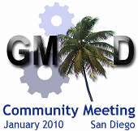

# News/January 2010 GMOD Meeting

From GMOD

Jump to: [navigation](#mw-navigation), [search](#p-search)

  

[Register for the January 2010 GMOD
Meeting](../January_2010_GMOD_Meeting "January 2010 GMOD Meeting")

  
I am pleased to announce that the [January GMOD
meeting](../January_2010_GMOD_Meeting "January 2010 GMOD Meeting") will
be taking place on January 14 and 15, 2010 in San Diego at the [Best
Western Seven
Seas](../January_2010_GMOD_Meeting#Lodging "January 2010 GMOD Meeting")
(the same location as last year). Please see the [meeting
page](../January_2010_GMOD_Meeting "January 2010 GMOD Meeting") for
registration information.

Please also take a moment to [add suggestions for the
agenda](../January_2010_GMOD_Meeting#Agenda_Proposals "January 2010 GMOD Meeting").
There is no registration fee for this meeting. However, there is limited
space, so please register early.

The proprietors of the Best Western have given us an excellent room
rate, and extended it to the previous week, so that people attending the
[GMOD meeting](../January_2010_GMOD_Meeting "January 2010 GMOD Meeting")
and the [Plant and Animal Genome meeting](../PAG_2010 "PAG 2010") before
it may stay at the Best Western the entire time.

Please direct follow up questions to the
<a href="https://lists.sourceforge.net/lists/listinfo/gmod-devel"
class="external text" rel="nofollow">gmod-devel mailing list</a>
(<a href="mailto:gmod-devel@lists.sourceforge.net" class="external text"
rel="nofollow">gmod-devel@lists.sourceforge.net</a>).

Thanks and I look forward to seeing you in San Diego!

[Scott](../User:Scott "User:Scott")

  

*Posted to the [GMOD News](../GMOD_News "GMOD News") on 2009/11/13*

Retrieved from
"<http://gmod.org/mediawiki/index.php?title=News/January_2010_GMOD_Meeting&oldid=22276>"

[Category](../Special:Categories "Special:Categories"):

- [News Items](../Category:News_Items "Category:News Items")

## Navigation menu

### Namespaces

- <a href="January_2010_GMOD_Meeting" accesskey="c"
  title="View the content page [c]">Page</a>
- <a
  href="http://gmod.org/mediawiki/index.php?title=Talk:News/January_2010_GMOD_Meeting&amp;action=edit&amp;redlink=1"
  accesskey="t"
  title="Discussion about the content page [t]">Discussion</a>

### 

### Variants

### Navigation

- [GMOD Home](../Main_Page)
- [Software](../GMOD_Components)
- [Categories /
  Tags](../Categories)
- [View all
  pages](../Special:AllPages)

### Documentation

- [Overview](../Overview)
- [FAQs](../Category:FAQ)
- [HOWTOs](../Category:HOWTO)
- [Glossary](../Glossary)

### Community

- [GMOD News](../GMOD_News)
- [Training /
  Outreach](../Training_and_Outreach)
- [Support](../Support)
- [GMOD Promotion](../GMOD_Promotion)
- [Meetings](../Meetings)
- [Calendar](../Calendar)

### Tools

- <a href="../Special:Browse/News-2FJanuary_2010_GMOD_Meeting"
  rel="smw-browse">Browse properties</a>

- Last updated at 23:08 on 9 October
  2012.
<!-- - 6,703 page views. -->
- Content is available under
  <a href="http://www.gnu.org/licenses/fdl-1.3.html" class="external"
  rel="nofollow">a GNU Free Documentation License</a> unless otherwise
  noted.

<!-- -->

- [About
  GMOD](../GMOD:About "GMOD:About")

<!-- -->

