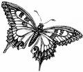

# News/Lepidoptera Bioinformatics

From GMOD

Jump to: [navigation](#mw-navigation), [search](#p-search)

A session on data analysis, mining, general bioinformatics support, and
related topics will be held on Friday, August 28th 2009, at the
<a href="http://bio.demokritos.gr/leps/leps.htm" class="external text"
rel="nofollow">International Workshop on Molecular Biology and Genetics
of Lepidoptera</a> in Crete. The aim is to find solutions to common
problems of annotation, curation and comparative analysis of the growing
body of transcript and genomic sequences for lepidopteran species.
Several databases, including
<a href="http://insectacentral.org" class="external text"
rel="nofollow">InsectaCentral</a> and
<a href="http://www.inra.fr/lepidodb" class="external text"
rel="nofollow">LepidoDB</a>, both of which use [GMOD
Components](../GMOD_Components "GMOD Components"), will be discussed in
the workshop.

The session is held during the last conference day and is one hour long;
we encourage Crete participants to talk to us during the week and point
out related problems you are facing in your own work. We will then
produce a list to be discussed during the session and focus on
soliciting ideas on how to organize collaborative and centralized
efforts to everyone's benefit. We would especially like to identify
potential funding sources, groups willing to help write consultation
papers and grant proposals and individuals willing to contribute to
realistic solutions.

We would like to encourage those of you who are not planning to attend
the Crete workshop to contact us with your thoughts and ideas on these
and related subjects.

<a href="mailto:mki101@uri.edu" class="external text"
rel="nofollow">Marian Goldsmith</a>,
<a href="mailto:a.papanicolaou@ex.ac.uk" class="external text"
rel="nofollow">Alexie Papanicolaou</a>, and
<a href="mailto:flegeai@rennes.inra.fr" class="external text"
rel="nofollow">Fabrice Legeai</a>.

  

*Posted to the [GMOD News](../GMOD_News "GMOD News") on 2009/08/18*

Retrieved from
"<http://gmod.org/mediawiki/index.php?title=News/Lepidoptera_Bioinformatics&oldid=22281>"

[Category](../Special:Categories "Special:Categories"):

- [News Items](../Category:News_Items "Category:News Items")

## Navigation menu

### Namespaces

- <a
  href="http://gmod.org/mediawiki/index.php?title=Talk:News/Lepidoptera_Bioinformatics&amp;action=edit&amp;redlink=1"
  accesskey="t"
  title="Discussion about the content page [t]">Discussion</a>

### 

### Variants

### Navigation

- [GMOD Home](../Main_Page)
- [Software](../GMOD_Components)
- [Categories /
  Tags](../Categories)
- [View all
  pages](../Special:AllPages)

### Documentation

- [Overview](../Overview)
- [FAQs](../Category:FAQ)
- [HOWTOs](../Category:HOWTO)
- [Glossary](../Glossary)

### Community

- [GMOD News](../GMOD_News)
- [Training /
  Outreach](../Training_and_Outreach)
- [Support](../Support)
- [GMOD Promotion](../GMOD_Promotion)
- [Meetings](../Meetings)
- [Calendar](../Calendar)

### Tools

- <a href="../Special%3ABrowse/News-2FLepidoptera_Bioinformatics"
  rel="smw-browse">Browse properties</a>

- Last updated at 23:09 on 9 October
  2012.
<!-- - 5,580 page views. -->
- Content is available under
  <a href="http://www.gnu.org/licenses/fdl-1.3.html" class="external"
  rel="nofollow">a GNU Free Documentation License</a> unless otherwise
  noted.

<!-- -->

- [About
  GMOD](../GMOD:About "GMOD:About")

<!-- -->

