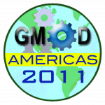

# News/March 2011 GMOD Meeting

From GMOD

Jump to: [navigation](#mw-navigation), [search](#p-search)

[Register for the March 2011 GMOD
Meeting](../March_2011_GMOD_Meeting#Registration "March 2011 GMOD Meeting")

  
[Registration](../March_2011_GMOD_Meeting "March 2011 GMOD Meeting") is
now open for the [March 2011 GMOD
Meeting](../March_2011_GMOD_Meeting "March 2011 GMOD Meeting"). This
meeting is part of [GMOD Americas
2011](../GMOD_Americas_2011 "GMOD Americas 2011"), a week long event
that includes a day of [Satellite
Meetings](../Satellite_Meetings_-_GMOD_Americas_2011 "Satellite Meetings - GMOD Americas 2011"),
a [GMOD
Course](../2011_GMOD_Spring_Training "2011 GMOD Spring Training")
(already full), and for the first time, an *Introduction to GMOD*
session the night before the meeting for GMOD newcomers. [GMOD Americas
2011](../GMOD_Americas_2011 "GMOD Americas 2011") events are being held
at the
<a href="http://nescent.org" class="external text" rel="nofollow">US
National Evolutionary Synthesis Center (NESCent)</a> in Durham, North
Carolina, United States.

As with previous [GMOD meetings](../Meetings "Meetings"), this meeting
will have a mixture of project talks, component talks, and user talks.
The agenda is driven by attendee suggestions, and you are encouraged to
[add your suggestions
now](../March_2011_GMOD_Meeting#Agenda_Proposals "March 2011 GMOD Meeting").
For examples of what happens at a GMOD meeting, see the writeup of the
[September 2010 GMOD
Meeting](../September_2010_GMOD_Meeting "September 2010 GMOD Meeting"),
or any [previous meeting](../Meetings "Meetings"). GMOD meetings are an
excellent way to meet GMOD developers and users and to learn (and
affect) what's coming in the project.

[Registration](../March_2011_GMOD_Meeting#Registration "March 2011 GMOD Meeting")
for the [March 2011 GMOD
Meeting](../March_2011_GMOD_Meeting "March 2011 GMOD Meeting") is

- **\$80 on or before February 18**
- **\$95 after February 18**

Please register early, both to save money, and ensure a spot. You are
also strongly encouraged to sign up for (or propose) a [Satellite
Meeting](../Satellite_Meetings_-_GMOD_Americas_2011 "Satellite Meetings - GMOD Americas 2011").
Details on transportation, suggested lodging, and other logistics are on
the [GMOD Americas 2011](../GMOD_Americas_2011 "GMOD Americas 2011")
page.

This meeting, and all [GMOD Americas
2011](../GMOD_Americas_2011 "GMOD Americas 2011") events, are jointly
sponsored by NESCent and the [Galaxy](../Galaxy.1 "Galaxy") Project.

[Dave Clements](../User:Clements "User:Clements")  
[Galaxy](../Galaxy.1 "Galaxy") Project

  

*Posted to the [GMOD News](../GMOD_News "GMOD News") on 2011/01/31*

Retrieved from
"<http://gmod.org/mediawiki/index.php?title=News/March_2011_GMOD_Meeting&oldid=22351>"

[Category](../Special:Categories "Special:Categories"):

- [News Items](../Category:News_Items "Category:News Items")

## Navigation menu

### Namespaces

- <a href="March_2011_GMOD_Meeting" accesskey="c"
  title="View the content page [c]">Page</a>
- <a
  href="http://gmod.org/mediawiki/index.php?title=Talk:News/March_2011_GMOD_Meeting&amp;action=edit&amp;redlink=1"
  accesskey="t"
  title="Discussion about the content page [t]">Discussion</a>

### 

### Variants

### Navigation

- [GMOD Home](../Main_Page)
- [Software](../GMOD_Components)
- [Categories /
  Tags](../Categories)
- [View all
  pages](../Special:AllPages)

### Documentation

- [Overview](../Overview)
- [FAQs](../Category:FAQ)
- [HOWTOs](../Category:HOWTO)
- [Glossary](../Glossary)

### Community

- [GMOD News](../GMOD_News)
- [Training /
  Outreach](../Training_and_Outreach)
- [Support](../Support)
- [GMOD Promotion](../GMOD_Promotion)
- [Meetings](../Meetings)
- [Calendar](../Calendar)

### Tools

- <a href="../Special:Browse/News-2FMarch_2011_GMOD_Meeting"
  rel="smw-browse">Browse properties</a>

- Last updated at 23:13 on 9 October
  2012.
<!-- - 13,548 page views. -->
- Content is available under
  <a href="http://www.gnu.org/licenses/fdl-1.3.html" class="external"
  rel="nofollow">a GNU Free Documentation License</a> unless otherwise
  noted.

<!-- -->

- [About
  GMOD](../GMOD:About "GMOD:About")

<!-- -->

