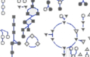

# News/Pathway Tools 2010: Virtual, Now

From GMOD

Jump to: [navigation](#mw-navigation), [search](#p-search)

We are offering individuals the ability to <a
href="http://bioinformatics.ai.sri.com/ptools10/teleconferencing.html"
class="external text" rel="nofollow">attend presentations at the Pathway
Tools Workshop remotely</a>. We will be broadcasting the presentation
slides via WebEx, and you can hear the voice of the presenter by calling
in to a conference call. Please see the <a
href="http://bioinformatics.ai.sri.com/ptools10/teleconferencing.html"
class="external text" rel="nofollow">workshop teleconference page</a>
for information on how to connect via WebEx and how to call into the
conference call. See the
<a href="http://bioinformatics.ai.sri.com/ptools10/agenda.html"
class="external text" rel="nofollow">Workshop agenda</a>, for complete
talk titles and times.

Feel free to forward this announcement to interested colleagues.

If you experience any difficulties with connecting, please contact
<a href="mailto:ptools-support@ai.sri.com" class="external text"
rel="nofollow">PTools Support &lt;ptools-support@ai.sri.com&gt;</a>

Best regards,

Tomer Altman  
Pathway Tools Workshop Coordinator

  

*Posted to the [GMOD News](../GMOD_News "GMOD News") on 2010/10/24*

Retrieved from
"<http://gmod.org/mediawiki/index.php?title=News/Pathway_Tools_2010:_Virtual,_Now&oldid=22360>"

[Category](../Special:Categories "Special:Categories"):

- [News Items](../Category:News_Items "Category:News Items")

## Navigation menu

### Namespaces

- <a href="Pathway_Tools_2010:_Virtual,_Now" accesskey="c"
  title="View the content page [c]">Page</a>
- <a
  href="http://gmod.org/mediawiki/index.php?title=Talk:News/Pathway_Tools_2010:_Virtual,_Now&amp;action=edit&amp;redlink=1"
  accesskey="t"
  title="Discussion about the content page [t]">Discussion</a>

### 

### Variants

### Navigation

- [GMOD Home](../Main_Page)
- [Software](../GMOD_Components)
- [Categories /
  Tags](../Categories)
- [View all
  pages](../Special:AllPages)

### Documentation

- [Overview](../Overview)
- [FAQs](../Category:FAQ)
- [HOWTOs](../Category:HOWTO)
- [Glossary](../Glossary)

### Community

- [GMOD News](../GMOD_News)
- [Training /
  Outreach](../Training_and_Outreach)
- [Support](../Support)
- [GMOD Promotion](../GMOD_Promotion)
- [Meetings](../Meetings)
- [Calendar](../Calendar)

### Tools

- <a href="../Special:Browse/News-2FPathway_Tools_2010:_Virtual,_Now"
  rel="smw-browse">Browse properties</a>

- Last updated at 23:14 on 9 October
  2012.
<!-- - 5,409 page views. -->
- Content is available under
  <a href="http://www.gnu.org/licenses/fdl-1.3.html" class="external"
  rel="nofollow">a GNU Free Documentation License</a> unless otherwise
  noted.

<!-- -->

- [About
  GMOD](../GMOD:About "GMOD:About")

<!-- -->

