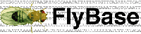

# News/Sr. DB Programmer @ FlyBase

From GMOD

Jump to: [navigation](#mw-navigation), [search](#p-search)

<a
href="https://sjobs.brassring.com/1033/asp/tg/cim_jobdetail.asp?partnerID=25240&amp;siteID=5341&amp;AReq=20510BR"
class="external text" rel="nofollow">FlyBase has a single opening for a
developer</a> to join the database team at Harvard University in
Cambridge, Mass. The position consists of roles in two model organism
database projects, <a href="http://vectorbase.org" class="external text"
rel="nofollow">VectorBase</a> and
<a href="http://flybase.org" class="external text"
rel="nofollow">FlyBase</a>, in the development and maintenance of
production applications involving
<a href="../Chado" class="mw-redirect" title="Chado">Chado</a>,
[Apollo](../Apollo.1 "Apollo"), Ensembl, and
[InterMine](../InterMine "InterMine"). For more information, see the <a
href="https://sjobs.brassring.com/1033/asp/tg/cim_jobdetail.asp?partnerID=25240&amp;siteID=5341&amp;AReq=20510BR"
class="external text" rel="nofollow">job posting</a>.

Dave Emmert

  

*Posted to the [GMOD News](../GMOD_News "GMOD News") on 2010/03/09*

Retrieved from
"<http://gmod.org/mediawiki/index.php?title=News/Sr._DB_Programmer_@_FlyBase&oldid=22370>"

[Category](../Special:Categories "Special:Categories"):

- [News Items](../Category%3ANews_Items "Category%3ANews Items")

## Navigation menu

### Namespaces

- <a
  href="http://gmod.org/mediawiki/index.php?title=Talk:News/Sr._DB_Programmer_@_FlyBase&amp;action=edit&amp;redlink=1"
  accesskey="t"
  title="Discussion about the content page [t]">Discussion</a>

### 

### Variants

### Navigation

- [GMOD Home](../Main_Page)
- [Software](../GMOD_Components)
- [Categories /
  Tags](../Categories)
- [View all
  pages](../Special:AllPages)

### Documentation

- [Overview](../Overview)
- [FAQs](../Category%3AFAQ)
- [HOWTOs](../Category%3AHOWTO)
- [Glossary](../Glossary)

### Community

- [GMOD News](../GMOD_News)
- [Training /
  Outreach](../Training_and_Outreach)
- [Support](../Support)
- [GMOD Promotion](../GMOD_Promotion)
- [Meetings](../Meetings)
- [Calendar](../Calendar)

### Tools

- <a href="../Special%3ABrowse/News-2FSr._DB_Programmer_@_FlyBase"
  rel="smw-browse">Browse properties</a>

- Last updated at 23:25 on 9 October
  2012.
<!-- - 7,172 page views. -->
- Content is available under
  <a href="http://www.gnu.org/licenses/fdl-1.3.html" class="external"
  rel="nofollow">a GNU Free Documentation License</a> unless otherwise
  noted.

<!-- -->

- [About
  GMOD](../GMOD:About "GMOD:About")

<!-- -->

