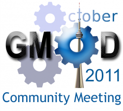
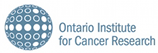

# October 2011 GMOD Meeting

From GMOD

Jump to: [navigation](#mw-navigation), [search](#p-search)

<table style="vertical-align: middle; border: 2px solid #A6A6BC;"
data-cellpadding="10">
<colgroup>
<col style="width: 50%" />
<col style="width: 50%" />
</colgroup>
<tbody>
<tr class="odd">
<td>

</td>
<td style="font-size: 180%; line-height: 120%"><strong>October 2011 <a
href="Meetings" title="Meetings">GMOD Meeting</a></strong>

12-13 October 2011 
<a href="http://oicr.on.ca/" class="external text"
rel="nofollow">Ontario Institute for Cancer Research</a> 
Toronto, Canada 

</td>
</tr>
</tbody>
</table>

  

*Feel the need to
Tweet?* Please use the
<a href="https://twitter.com/#!/search?q=%23gmod11#!/search?q=#gmod11"
class="external text" rel="nofollow">#gmod11 hashtag</a>.

  

## Contents

- [1
  Registration](#Registration)
- [2
  Agenda](#Agenda)
  - [2.1 Keynote
    speakers](#Keynote_speakers)
    - [2.1.1
      Gary D. Bader](#Gary_D._Bader)
    - [2.1.2
      Michael Brudno](#Michael_Brudno)
  - [2.2
    Agenda](#Agenda_2)
    - [2.2.1 Day 1:
      Wednesday](#Day_1:_Wednesday)
    - [2.2.2 Day 2:
      Thursday](#Day_2:_Thursday)
    - [2.2.3 Day 3:
      Friday](#Day_3:_Friday)
  - [2.3 Suggested
    agenda items](#Suggested_agenda_items)
  - [2.4 Scheduled
    Satellite Meetings](#Scheduled_Satellite_Meetings)
    - [2.4.1 Galaxy
      Workshop](#Galaxy_Workshop)
    - [2.4.2
      InterMine Development
      Meeting](#InterMine_Development_Meeting)
    - [2.4.3
      BioMart Workshop](#BioMart_Workshop)
    - [2.4.4 MAKER
      Workshop](#MAKER_Workshop)
- [3
  Logistics](#Logistics)
  - [3.1
    Hotel](#Hotel)
- [4 Next
  Meeting](#Next_Meeting)

The next [GMOD meeting](Meetings "Meetings") is being held in October
12-13, 2011 at the <a href="http://oicr.on.ca/" class="external text"
rel="nofollow">Ontario Institute for Cancer Research (OICR)</a> in
Toronto, Canada. OICR is the home of [GBrowse](GBrowse.1 "GBrowse") and
[BioMart](BioMart "BioMart").

If you're curious to see what happens at a [GMOD
meeting](Meetings "Meetings"), see the writeup of the [September 2010
GMOD
Meeting](September_2010_GMOD_Meeting "September 2010 GMOD Meeting"), or
the [March 2011 GMOD
Meeting](March_2011_GMOD_Meeting "March 2011 GMOD Meeting") page.

# Registration

Registration is now closed.

# Agenda

## Keynote speakers

### Gary D. Bader

<table>
<colgroup>
<col style="width: 100%" />
</colgroup>
<tbody>
<tr class="odd">
<td data-valign="top">

Gary works on biological network analysis and pathway information
resources as an Associate Professor at The Donnelly Centre at the
University of Toronto. He completed post-doctoral work in the group of
Chris Sander in the Computational Biology Center (cBio) at Memorial
Sloan-Kettering Cancer Center in New York. Gary developed the
Biomolecular Interaction Network Database (BIND) during his Ph.D. in the
lab of Christopher Hogue in the Department of Biochemistry at the
University of Toronto and the Samuel Lunenfeld Research Institute at
Mount Sinai Hospital in Toronto. He completed a B.Sc. in Biochemistry at
McGill University in Montreal. See <a href="http://baderlab.org"
class="external free" rel="nofollow">http://baderlab.org</a> for more
information on Gary.</td>
</tr>
</tbody>
</table>

### Michael Brudno

<table>
<colgroup>
<col style="width: 100%" />
</colgroup>
<tbody>
<tr class="odd">
<td>

Mike's main research interest is the development of computational
methods for the analysis of High throughput, a.k.a. Next-Generation
sequencing data. His group is working on algorithms for assembly,
mapping, visualization, and variation discovery with short reads. In
addition, they also work on cloud computing, whole-genome alignment, as
well as on detection and analysis of genome variation in the sea squirt
<em>C. savignyi</em>.

After receiving a BA in Computer Science and History from UC
Berkeley, Mike worked on his PhD at the Computer Science Department of
Stanford University, developing several approaches for comparison of
genomic sequences, including the LAGAN Alignment Toolkit. He then
completed a postdoc at the Computer Science Division, UC Berkeley and
was a Visiting Scientist at CSAIL (MIT) before starting as an Assistant
Professor at the University of Toronto in January 2006. He is the
recipient of the Alfred P. Sloan Research Fellowship, Ontario Early
Researcher Award, and a Canada Research Chair in Computational Biology.
See <a href="http://www.cs.toronto.edu/~brudno/" class="external free"
rel="nofollow">http://www.cs.toronto.edu/~brudno/</a> for more
information on Mike.
</td>
</tr>
</tbody>
</table>

## Agenda

The Main meeting (Days 1 and 2) will take place at HL31 in the <a
href="http://maps.google.com/maps?q=101+College+Street,+Toronto+ON+M5G+1L7&amp;hl=en&amp;sll=37.0625,-95.677068&amp;sspn=48.106236,85.341797&amp;vpsrc=6&amp;hnear=101+College+St,+Toronto,+Ontario+M5G+1L7,+Canada&amp;t=h&amp;z=16"
class="external text" rel="nofollow">MaRS Centre</a>. Here are the
directions once you are outside the building:

Directions to the HL31 are as follows:

- Enter the MaRS Centre (101 College Street, Toronto ON M5G 1L7) through
  the main doors (with the stairs & ramp)
- In the main lobby area, turn right and walk towards the west end of
  the building
- Pass the RBC bank machine and proceed through a glass door on your
  right
- Go down the stairs marked “Stair 16, Ground Floor” (or take the
  elevator)
- At the bottom of the stairs, enter the hallway through the door marked
  “Stair 16, Upper Concourse”
- The corridor to HL31 boardroom is immediately on your left

### Day 1: Wednesday

<table class="wikitable">
<colgroup>
<col style="width: 25%" />
<col style="width: 25%" />
<col style="width: 25%" />
<col style="width: 25%" />
</colgroup>
<thead>
<tr class="header">
<th>Time</th>
<th>Topic</th>
<th>Presenter(s)</th>
<th>Links</th>
</tr>
</thead>
<tbody>
<tr class="odd">
<td>9:15</td>
<td>Introductions</td>
<td><a href="User:Scott" title="User:Scott">Scott Cain</a></td>
<td></td>
</tr>
<tr class="even">
<td>9:35</td>
<td>Welcome to OICR and the State of GMOD</td>
<td><a href="User:Scott" title="User:Scott">Scott Cain</a></td>
<td><a href="../mediawiki/images/b/b6/Scott_cain_intro.ppt"
class="internal" title="Scott cain intro.ppt">slides</a></td>
</tr>
<tr class="odd">
<td>10:10</td>
<td>Keynote: Network and pathway information for systems biology</td>
<td>Gary Bader</td>
<td><a href="../mediawiki/images/a/af/Gary_bader.pptx" class="internal"
title="Gary bader.pptx">PPT</a></td>
</tr>
<tr class="even">
<td>11:00</td>
<td>Coffee break</td>
<td></td>
<td></td>
</tr>
<tr class="odd">
<td>11:30</td>
<td>GBrowse2: What's New</td>
<td><a href="User:Lstein" title="User:Lstein">Lincoln Stein</a></td>
<td><a href="../mediawiki/images/2/20/Lincoln_stein.ppt"
class="internal" title="Lincoln stein.ppt">PPT</a></td>
</tr>
<tr class="even">
<td>12:00</td>
<td>Lunch</td>
<td></td>
<td></td>
</tr>
<tr class="odd">
<td>1:30</td>
<td><a href="JBrowse.1" title="JBrowse">JBrowse</a> and <a
href="WebApollo.1" title="WebApollo">WebApollo</a></td>
<td><a href="User:MitchSkinner" title="User:MitchSkinner">Mitch
Skinner</a></td>
<td><a href="../mediawiki/images/e/e7/Mitch_skinner.pdf"
class="internal" title="Mitch skinner.pdf">PDF</a></td>
</tr>
<tr class="even">
<td>2:00</td>
<td>The Mycoplasma Genome Database: marrying microscopy and
genomics</td>
<td>Andrew Oberlin</td>
<td><a href="../mediawiki/images/6/6e/Andrew_oberlin.pdf"
class="internal" title="Andrew oberlin.pdf">PDF</a></td>
</tr>
<tr class="odd">
<td>2:30</td>
<td>Coffee break</td>
<td></td>
<td></td>
</tr>
<tr class="even">
<td>3:00</td>
<td><a href="MAKER.1" title="MAKER">MAKER</a></td>
<td><a href="User:Carsonholt" title="User:Carsonholt">Carson
Holt</a></td>
<td><a href="../mediawiki/images/1/1a/Carson_holt.pdf" class="internal"
title="Carson holt.pdf">PDF</a></td>
</tr>
<tr class="odd">
<td>3:30</td>
<td><a href="InterMine" title="InterMine">InterMine</a></td>
<td><a href="User:Alexkalderimis" title="User:Alexkalderimis">Alex
Kalderimis</a> 
and/or <a href="User:Rsmith" title="User:Rsmith">Richard Smith</a></td>
<td><a href="../mediawiki/images/f/f5/Richard_smith.pdf"
class="internal" title="Richard smith.pdf">PDF</a></td>
</tr>
<tr class="even">
<td>4:00</td>
<td>Improving MOD interoperation (A Discussion)</td>
<td><a href="User:Jogoodma" title="User:Jogoodma">Josh Goodman</a></td>
<td><a
href="http://gmod.org/mediawiki/index.php?title=Special:Upload&amp;wpDestFile=Josh_goodman.pdf"
class="new" title="Josh goodman.pdf">PDF</a>,<a
href="http://gmod.org/mediawiki/index.php?title=Special:Upload&amp;wpDestFile=Josh_goodman.ppt"
class="new" title="Josh goodman.ppt">PPT</a></td>
</tr>
<tr class="odd">
<td>4:45</td>
<td>Wrap up and dinner Mata Hari Grill 39 Baldwin St. Toronto</td>
<td></td>
<td><a href="../mediawiki/images/4/47/Matahari.pdf" class="internal"
title="Matahari.pdf">PDF</a></td>
</tr>
</tbody>
</table>

### Day 2: Thursday

| Time | Topic | Presenter(s) | Links |
|----|----|----|----|
| 9:15 | Keynote: The Savant Browser and MedSavant | Michael Brudno | <a
href="http://gmod.org/mediawiki/index.php?title=Special:Upload&amp;wpDestFile=Michael_brudno.pdf"
class="new" title="Michael brudno.pdf">PDF</a>,<a
href="http://gmod.org/mediawiki/index.php?title=Special:Upload&amp;wpDestFile=Michael_brudno.ppt"
class="new" title="Michael brudno.ppt">PPT</a> |
| 10:00 | [Galaxy](Galaxy.1 "Galaxy") | [Dan Blankenberg](User:DanB "User:DanB") | <a href="../mediawiki/images/8/8b/2011_10_Galaxy.pdf" class="internal"
title="2011 10 Galaxy.pdf">PDF</a> |
| 10:30 | [Coffee](GMOD_Promotion#Mugs.2C_T-Shirts.2C_Buttons.2C_... "GMOD Promotion") |  |  |
| 11:00 | <a href="http://code.google.com/p/sadi/wiki/SADIforGMOD"
class="external text" rel="nofollow">SADI for GMOD: An RDF/OWL Interface
to GMOD Data</a> | Ben Vandervalk | <a
href="http://prezi.com/sc0jnrbdqu3n/sadi-for-gmod-an-rdfowl-interface-for-gmod/"
class="external text" rel="nofollow">Prezi</a>, <a href="../mediawiki/images/8/8b/SADIforGMOD.pdf" class="internal"
title="SADIforGMOD.pdf">PDF</a> |
| 11:30 | [The Comprehensive Antibiotic Resistance Database](News/CARD "News/CARD") | Andrew McArthur | <a href="../mediawiki/images/0/02/Andrew_mcarthur.pdf" class="internal"
title="Andrew mcarthur.pdf">PDF</a>,<a href="../mediawiki/images/5/58/Andrew_mcarthur.ppt" class="internal"
title="Andrew mcarthur.ppt">PPT</a> |
| 12:00 | Lunch |  |  |
| 1:30 | Lightning talks (Please feel free to give a 5-10 minute talk on whatever; if you are interested enough to put together a talk, others will likely be interested in the content! :-) |  |  |

### Day 3: Friday

| Time | Workshop                     | Location                  |
|------|------------------------------|---------------------------|
| 9:00 | [BioMart](#BioMart_Workshop) | OICR, 8th floor Boardroom |
| 9:00 | [Galaxy](#Galaxy_Workshop)   | OICR room HL-31           |
| 2:30 | [MAKER](#MAKER_Workshop)     | OICR, 8th floor Boardroom |

## Suggested agenda items

Please feel free to add suggested talks or topics for the meeting.

- The Mycoplasma Genome Database: marrying microscopy and genomics
  (Andrew Oberlin & Iddo Friedberg)
- Improving MOD interoperability ([Scott Cain](User:Scott "User:Scott"),
  [Josh Goodman](User:Jogoodma "User:Jogoodma") will lead the
  discussion)
- [BioMart](BioMart "BioMart"),
  <a href="Chado" class="mw-redirect" title="Chado">Chado</a>,
  [Galaxy](Galaxy.1 "Galaxy"), [GBrowse](GBrowse.1 "GBrowse"), and
  [InterMine](InterMine "InterMine") updates - since representatives of
  all those groups will be there (suggested by [Dave
  C](User:Clements "User:Clements"))
- <a href="http://code.google.com/p/sadi/wiki/SADIforGMOD"
  class="external text" rel="nofollow">SADI for GMOD: An RDF/OWL Interface
  to GMOD Data</a> (Ben Vandervalk)
- Running GBrowse2 without root and without Apache (Todd Harris)
- [The Comprehensive Antibiotic Resistance
  Database](News/CARD "News/CARD") (Andrew McArthur)
- JBrowse update (Mitch Skinner)
- web application integration, the Ambikon integration server (Rob
  Buels)

## Scheduled Satellite Meetings

|  |  |  |  |
|----|----|----|----|
|  |  |  |  |

- [BioMart workshop](#BioMart_Workshop) (half day, morning), Friday, 14
  October
- [Galaxy workshop](#Galaxy_Workshop) (half day, morning), Friday,
  October 14 - details to be forthcoming
- [InterMine development meeting](#InterMine_Development_Meeting),
  Thursday and Friday
- [MAKER workshop](#MAKER_Workshop) (half day, afternoon), Friday,
  October 14

You can register for the BioMart, Galaxy, and MAKER Workshops on the
<a href="http://gmod.eventbrite.com/" class="external text"
rel="nofollow">meeting registration site</a>. If you are interested in
the [InterMine development meeting](#InterMine_Development_Meeting),
please let [Richard Smith](User:Rsmith "User:Rsmith") know.

### [Galaxy](Galaxy.1 "Galaxy") Workshop

This workshop will cover an introduction to [Galaxy](Galaxy.1 "Galaxy"),
including analyzing data with tools and visualizations, using Galaxy in
the cloud, and running your own instance and adding new tools. [Dan
Blankenberg](User:DanB "User:DanB") of the
<a href="http://galaxyproject.org/" class="external text"
rel="nofollow">Galaxy Project</a> will lead the workshop.

Galaxy is an open-source analysis and data integration framework that is
available as a
<a href="http://usegalaxy" class="external text" rel="nofollow">free
public service</a> and as
<a href="http://getgalaxy.org/" class="external text"
rel="nofollow">open source software</a> that can be deployed both
locally or on cloud resources. The Galaxy platform empowers transparent
and reproducible research by providing interactive access to popular
tools, including those that allow manipulation of raw sequencing reads,
mapping, peak calling, genomic interval operations, visualization at
genome browsers and more, as well as a point-and-click workflow system.

The Galaxy workshop will be held on Friday, 14 October, from 9am-2pm in
the Ontario Institute for Cancer Research, room OICR HL-31. Table
seating is limited to 18 participants, with space for an additional 10
participants, so please
<a href="http://gmod.eventbrite.com/" class="external text"
rel="nofollow">register</a> and arrive early.

| Workshop Slides |
|----|
| [An Introduction to Galaxy](File:GalaxyWorkshop0_2011_10.pdf "File:GalaxyWorkshop0 2011 10.pdf") |
| [Using Galaxy for High-throughput Sequencing (HTS) Analysis and Visualization](File:GalaxyWorkshop1_2011_10.pdf "File:GalaxyWorkshop1 2011 10.pdf") |
| [Running and Enhancing your own Galaxy](File:GalaxyWorkshop2_2011_10.pdf "File:GalaxyWorkshop2 2011 10.pdf") |
| [Second Half: Running Your Own Instance](File:GalaxyWorkshop3_2011_10.pdf "File:GalaxyWorkshop3 2011 10.pdf") |

### [InterMine](InterMine "InterMine") Development Meeting

This meeting is intended for organisations that have an
[InterMine](InterMine "InterMine"), or are thinking of setting one up,
to discuss development priorities, as well as production and
implementation issues. This meeting is part of the InterMod project,
which involves supporting InterMine data-warehouses for *D.
melanogaster*, *R. norvegus*, *M. musculus*, *S. cerevisiae*, *D. rerio*
and *C. elegans*. Groups representing other efforts to use InterMine for
biological data-warehousing are welcome to attend (as indeed some aleady
are) - please contact [Richard Smith](User:Rsmith "User:Rsmith") for
more details.

### [BioMart](BioMart "BioMart") Workshop

This workshop will include an introduction to the
[BioMart](BioMart "BioMart") system, followed by a brief demonstration
of BioMart applications in the BioMart Central Portal
(<a href="http://central.biomart.org" class="external free"
rel="nofollow">http://central.biomart.org</a>) and the International
Cancer Genome Consortium (ICGC) Data Portal
(<a href="http://dcc.icgc.org" class="external free"
rel="nofollow">http://dcc.icgc.org</a>), and a hands-on tutorial to show
how to create and configure a local data mart, how to import external
mart and link it with the local mart, how to deploy the BioMart server
to provide data access, and how to query BioMart server via web GUI and
REST API. Junjun Zhang of the
<a href="http://biomart.org/" class="external text"
rel="nofollow">BioMart Project</a> will lead the workshop.

Requirements: Parts of the tutorial will be taught using a VirtualBox
Open Virtualization Appliance (OVA) image file. You will need a laptop
with the latest version of VirtualBox, VMware Player, or VMware
Workstation installed and running. VirtualBox is freely available from
<a href="http://www.virtualbox.org/wiki/Downloads" class="external free"
rel="nofollow">http://www.virtualbox.org/wiki/Downloads</a>. VMware
player for Linux and Windows operating systems is freely available from
VMware
(<a href="http://vmware.com/products/player/" class="external free"
rel="nofollow">http://vmware.com/products/player/</a>). Mac users may
use VMware Fusion
(<a href="http://www.vmware.com/products/fusion/" class="external free"
rel="nofollow">http://www.vmware.com/products/fusion/</a> on a 30 day
free trail).

The BioMart workshop will be held on Friday, October 14, from 9-12 in
the Ontario Institute for Cancer Research, 8th floor NorthEast
Boardroom.

### [MAKER](MAKER.1 "MAKER") Workshop

The MAKER workshop will include a brief introduction to
[MAKER](MAKER.1 "MAKER") as well as demonstrations in using the pipeline
to generate gene annotations, perform downstream analysis of the gene
models, and ingrate the output into other GMOD tools. To make
demonstrations as hands on as possible, the web version of MAKER will be
used to give everyone access to the pipeline
(<a href="http://www.yandell-lab.org/software/mwas.html"
class="external free"
rel="nofollow">http://www.yandell-lab.org/software/mwas.html</a>).
Examples will include demonstrations of the command line version of
MAKER as well (but the online examples will be hands on). You can follow
along online, or you can just watch and take notes.

Requirements for online examples: WiFi capable laptop, a javascript
enabled web browser, and Java 6 or greater.

The MAKER workshop will be held on Friday, October 14, from 2:30-5:00 in
the Ontario Institute for Cancer Research, 8th floor NorthEast
Boardroom.

# Logistics

## Hotel

We don't have a block of rooms reserved due to unfavorable contracts
offered. We're suggesting staying at
<a href="http://www.deltahotels.com/en/hotels/ontario/delta-chelsea"
class="external text" rel="nofollow">Delta Chelsea hotel</a>, as it is
convenient to OICR.

# Next Meeting

[April 2012 GMOD
Meeting](April_2012_GMOD_Meeting "April 2012 GMOD Meeting")

Retrieved from
"<http://gmod.org/mediawiki/index.php?title=October_2011_GMOD_Meeting&oldid=21987>"

[Categories](Special:Categories "Special:Categories"):

- [Meetings](Category:Meetings "Category:Meetings")
- [MAKER](Category:MAKER "Category:MAKER")
- [Galaxy](Category:Galaxy "Category:Galaxy")
- [BioMart](Category:BioMart "Category:BioMart")
- [InterMine](Category:InterMine "Category:InterMine")

## Navigation menu

### Namespaces

- <a href="October_2011_GMOD_Meeting" accesskey="c"
  title="View the content page [c]">Page</a>
- <a
  href="http://gmod.org/mediawiki/index.php?title=Talk:October_2011_GMOD_Meeting&amp;action=edit&amp;redlink=1"
  accesskey="t"
  title="Discussion about the content page [t]">Discussion</a>

### 

### Variants

### Navigation

- [GMOD Home](Main_Page)
- [Software](GMOD_Components)
- [Categories /
  Tags](Categories)
- [View all pages](Special:AllPages)

### Documentation

- [Overview](Overview)
- [FAQs](Category:FAQ)
- [HOWTOs](Category:HOWTO)
- [Glossary](Glossary)

### Community

- [GMOD News](GMOD_News)
- [Training /
  Outreach](Training_and_Outreach)
- [Support](Support)
- [GMOD Promotion](GMOD_Promotion)
- [Meetings](Meetings)
- [Calendar](Calendar)

### Tools

- <a href="Special:Browse/October_2011_GMOD_Meeting"
  rel="smw-browse">Browse properties</a>

- Last updated at 18:54 on 8 October
  2012.
<!-- - 328,404 page views. -->
- Content is available under
  <a href="http://www.gnu.org/licenses/fdl-1.3.html" class="external"
  rel="nofollow">a GNU Free Documentation License</a> unless otherwise
  noted.

<!-- -->

- [About
  GMOD](GMOD:About "GMOD:About")

<!-- -->

