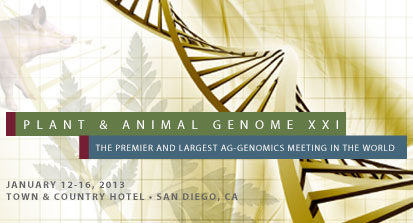

# PAG 2013

From GMOD

Jump to: [navigation](#mw-navigation), [search](#p-search)

GMOD was out in force at the
<a href="http://www.intlpag.org/2013/" class="external text"
rel="nofollow">Plant and Animal Genomes (PAG)</a> conference in January
2013. In addition to the day-long workshop on GMOD tools, there were
also posters and presentations from many GMOD users, as well as from
developers of GMOD tools.

## Contents

- [1 Core GMOD
  Content](#Core_GMOD_Content)
- [2 All Day GMOD
  Workshop](#All_Day_GMOD_Workshop)
- [3 GMOD Consumers
  and Providers](#GMOD_Consumers_and_Providers)
- [4 PAG Poster
  Parade](#PAG_Poster_Parade)

## Core GMOD Content

There were a number of items focussed on the tools and services that
GMOD provides. These were:

<table class="wikitable">
<colgroup>
<col style="width: 20%" />
<col style="width: 20%" />
<col style="width: 20%" />
<col style="width: 20%" />
<col style="width: 20%" />
</colgroup>
<tbody>
<tr class="odd">
<td>Date</td>
<td>Time</td>
<td>ID</td>
<td>Session</td>
<td>Type</td>
</tr>
<tr class="even">
<td>Sun. Jan. 13</td>
<td>1:30 pm - 3:40 pm</td>
<td>1530</td>
<td><a
href="http://pag13.mapyourshow.com/5_0/sessions/sessiondetails.cfm?ScheduledSessionID=1CAA"
class="external text" rel="nofollow">Generic Genome Browser</a></td>
<td>Workshop</td>
</tr>
<tr class="odd">
<td>Mon. Jan. 14</td>
<td>10:00 am - 11:30 am</td>
<td>P0984</td>
<td><a
href="http://pag13.mapyourshow.com/5_0/sessions/sessiondetails.cfm?ScheduledSessionID=18ABCDC3"
class="external text" rel="nofollow">Using GMOD to Annotate and
Distribute Data in the Cloud</a>

<a href="../mediawiki/images/5/55/Annotating_in_the_cloud_poster.odg"
class="internal" title="Annotating in the cloud poster.odg">Poster
(OpenOffice format)</a>
</td>
<td>Poster</td>
</tr>
<tr class="even">
<td>Mon. Jan. 14</td>
<td>3:00 pm - 4:30 pm</td>
<td>P0967</td>
<td><a
href="http://pag13.mapyourshow.com/5_0/sessions/sessiondetails.cfm?ScheduledSessionID=18ABCEC4"
class="external text" rel="nofollow">WebApollo: A Web-based Sequence
Annotation Editor for Distributed Community Annotation</a></td>
<td>Poster</td>
</tr>
<tr class="odd">
<td>Wed. Jan. 16</td>
<td>10:20 am - 5:00 pm</td>
<td>1537</td>
<td><a
href="http://pag13.mapyourshow.com/5_0/sessions/sessiondetails.cfm?ScheduledSessionID=1CA0"
class="external text" rel="nofollow">GMOD</a></td>
<td>Workshop</td>
</tr>
</tbody>
</table>

A [‎printable PDF of this
timetable](File:GMOD_Components_at_PAG_XXI.pdf "File:GMOD Components at PAG XXI.pdf")
is also available.

  

## All Day GMOD Workshop

<a
href="http://pag13.mapyourshow.com/5_0/sessions/sessiondetails.cfm?ScheduledSessionID=1CA0"
class="external text" rel="nofollow">The GMOD workshop</a> on Wednesday
January 16th was be held in the Golden West room from 10:20 until 5pm,
and had the follow schedule:

|  |  |
|----|----|
| 10:30 AM - 11:10 AM | GMOD: A User's Perspective |
| 11:10 AM - 11:50 AM | [MAKER](MAKER.1 "MAKER") |
| 11:50 AM - 12:30 PM | [Tripal](Tripal.1 "Tripal"): a Toolkit for Construction of Genomic and Genetic Websites Using Chado and Drupal |
| 1:30 PM - 2:10 PM | [GBrowse_syn](GBrowse_syn.1 "GBrowse syn"): Using the Generic Synteny Browser |
| 2:10 PM - 2:50 PM | [JBrowse](JBrowse.1 "JBrowse"): A Next-Generation Genome Browser |
| 3:05 PM - 3:45 PM | [WebApollo](WebApollo.1 "WebApollo"): A Web-based Sequence Annotation Editor for Distributed Community Annotation |
| 3:45 PM - 4:25 PM | [Galaxy](Galaxy.1 "Galaxy") Update 2013 |

## GMOD Consumers and Providers

There were also be many groups who use GMOD components showing posters,
and giving presentations and workshops; here is a small selection:

| Date | Time | ID | Session title | Type |
|----|----|----|----|----|
| 12 Jan. (Sat.) | 1:30 pm - 3:40 pm | 1500 | <a
href="http://pag13.mapyourshow.com/5_0/sessions/sessiondetails.cfm?ScheduledSessionID=1BAD"
class="external text" rel="nofollow">Citrus Genome</a> | Workshops |
| 12 Jan. (Sat.) | 1:30 pm - 3:40 pm | 1508 | <a
href="http://pag13.mapyourshow.com/5_0/sessions/sessiondetails.cfm?ScheduledSessionID=1AA8"
class="external text" rel="nofollow">Cool Season Legumes</a> | Workshops |
| 12 Jan. (Sat.) | 1:30 pm - 3:40 pm | 1549 | <a
href="http://pag13.mapyourshow.com/5_0/sessions/sessiondetails.cfm?ScheduledSessionID=1EA8"
class="external text" rel="nofollow">Maize</a> | Workshops |
| 12 Jan. (Sat.) | 3:50 pm - 6:00 pm | 1488 | <a
href="http://pag13.mapyourshow.com/5_0/sessions/sessiondetails.cfm?ScheduledSessionID=18AA"
class="external text" rel="nofollow">Bioenergy Grass Genomics</a> | Workshops |
| 12 Jan. (Sat.) | 3:50 pm - 6:00 pm | 1531 | <a
href="http://pag13.mapyourshow.com/5_0/sessions/sessiondetails.cfm?ScheduledSessionID=1CAD"
class="external text" rel="nofollow">The Genetic Landscape of Wheat
Rusts</a> | Workshops |
| 12 Jan. (Sat.) | 3:50 pm - 6:00 pm | 1659 | <a
href="http://pag13.mapyourshow.com/5_0/sessions/sessiondetails.cfm?ScheduledSessionID=18AFCF"
class="external text" rel="nofollow">Next Generation Genome Annotation
and Analysis</a> | Workshops |
| 12 Jan. (Sat.) | 8:00 am - 6:00 pm | 1570 | <a
href="http://pag13.mapyourshow.com/5_0/sessions/sessiondetails.cfm?ScheduledSessionID=10AB"
class="external text" rel="nofollow">Poultry 1</a> | Workshops |
| 12 Jan. (Sat.) | 8:00 am - 10:10 am | 1596 | <a
href="http://pag13.mapyourshow.com/5_0/sessions/sessiondetails.cfm?ScheduledSessionID=18A8C9"
class="external text" rel="nofollow">Applications of Ontologies to Plant
and Animal Genomics</a> | Workshops |
| 12 Jan. (Sat.) | 8:00 am - 12:30 pm | 1497 | <a
href="http://pag13.mapyourshow.com/5_0/sessions/sessiondetails.cfm?ScheduledSessionID=1BAB"
class="external text" rel="nofollow">Cattle/Swine</a> | Workshops |
| 12 Jan. (Sat.) | 8:00 am - 12:30 pm | 1560 | <a
href="http://pag13.mapyourshow.com/5_0/sessions/sessiondetails.cfm?ScheduledSessionID=11AB"
class="external text" rel="nofollow">Pine Genome Reference Sequence</a> | Workshops |
| 12 Jan. (Sat.) | 10:20 am - 12:30 pm | 1484 | <a
href="http://pag13.mapyourshow.com/5_0/sessions/sessiondetails.cfm?ScheduledSessionID=10"
class="external text" rel="nofollow">Arthropod Genomics</a> | Workshops |
| 12 Jan. (Sat.) | 10:20 am - 12:30 pm | 1691 | <a
href="http://pag13.mapyourshow.com/5_0/sessions/sessiondetails.cfm?ScheduledSessionID=18AFC8"
class="external text" rel="nofollow">Managing Crop Phenotype Data</a> | Workshops |
| 12 Jan. (Sat.) | 10:20 am - 12:30 pm | 1767 | <a
href="http://pag13.mapyourshow.com/5_0/sessions/sessiondetails.cfm?ScheduledSessionID=1BA9CD"
class="external text" rel="nofollow">DNA Subway: Genomics, DNA
Barcoding, and RNA-Seq - Bringing Cutting-Edge Biology into the
Classroom</a> | Workshops |
|  |  |  |  |  |
| 13 Jan. (Sun.) | 3:50 pm - 6:00 pm | 1509 | <a
href="http://pag13.mapyourshow.com/5_0/sessions/sessiondetails.cfm?ScheduledSessionID=1AAB"
class="external text" rel="nofollow">Cotton Genome Initiative</a> | Workshops |
| 13 Jan. (Sun.) | 3:50 pm - 6:00 pm | 1700 | <a
href="http://pag13.mapyourshow.com/5_0/sessions/sessiondetails.cfm?ScheduledSessionID=18AECE"
class="external text" rel="nofollow">Computer Demos 2 - Software</a> | Computer Demonstrations |
| 13 Jan. (Sun.) | 8:00 am - 12:30 pm | 1514 | <a
href="http://pag13.mapyourshow.com/5_0/sessions/sessiondetails.cfm?ScheduledSessionID=1AAE"
class="external text" rel="nofollow">Genome annotation resources at the
EBI</a> | Workshops |
| 13 Jan. (Sun.) | 8:00 am - 12:30 pm | 1588 | <a
href="http://pag13.mapyourshow.com/5_0/sessions/sessiondetails.cfm?ScheduledSessionID=18A8CF"
class="external text" rel="nofollow">Sugar Cane (ICSB)</a> | Workshops |
|  |  |  |  |  |
| 14 Jan. (Mon.) | 3:00 pm - 4:30 pm | P0055 | <a
href="http://pag13.mapyourshow.com/5_0/sessions/sessiondetails.cfm?ScheduledSessionID=1BA0C7"
class="external text" rel="nofollow">Genome Sequencing and Analysis in
Traditional Chinese Medicine Ganoderma sinense</a> | Posters |
| 14 Jan. (Mon.) | 3:00 pm - 4:30 pm | P0059 | <a
href="http://pag13.mapyourshow.com/5_0/sessions/sessiondetails.cfm?ScheduledSessionID=1AA9CD"
class="external text" rel="nofollow">Phylogenetic Analyses of Citrus
LRR-RLKs</a> | Posters |
| 14 Jan. (Mon.) | 3:00 pm - 4:30 pm | P0223 | <a
href="http://pag13.mapyourshow.com/5_0/sessions/sessiondetails.cfm?ScheduledSessionID=1DAFC9"
class="external text" rel="nofollow">Genetic Variation Across Australian
Bread Wheat Varieties</a> | Posters |
| 14 Jan. (Mon.) | 3:00 pm - 4:30 pm | P0357 | <a
href="http://pag13.mapyourshow.com/5_0/sessions/sessiondetails.cfm?ScheduledSessionID=1FA9CF"
class="external text" rel="nofollow">QTLs and Comparative Genomics
Highlight Candidate Genes for Important Cowpea Traits</a> | Posters |
| 14 Jan. (Mon.) | 3:00 pm - 4:30 pm | P0409 | <a
href="http://pag13.mapyourshow.com/5_0/sessions/sessiondetails.cfm?ScheduledSessionID=1FACCD"
class="external text" rel="nofollow">Status of the Draft Potato
Ontology</a> | Posters |
| 14 Jan. (Mon.) | 3:00 pm - 4:30 pm | P0621 | <a
href="http://pag13.mapyourshow.com/5_0/sessions/sessiondetails.cfm?ScheduledSessionID=11AFCB"
class="external text" rel="nofollow">Whole-Genome Genotyping for
Detecting Mutations in the Genes that are Directly Responsible for the
Trait Variation</a> | Posters |
| 14 Jan. (Mon.) | 3:00 pm - 4:30 pm | P0763 | <a
href="http://pag13.mapyourshow.com/5_0/sessions/sessiondetails.cfm?ScheduledSessionID=18A9CFC2"
class="external text" rel="nofollow">Analysis of B. taurus and B.
indicus Admixture in Uganda as Revealed by the Illumina BovineSNP50
Genotyping BeadChip.</a> | Posters |
| 14 Jan. (Mon.) | 3:00 pm - 4:30 pm | P0953 | <a
href="http://pag13.mapyourshow.com/5_0/sessions/sessiondetails.cfm?ScheduledSessionID=18A8C6C2"
class="external text" rel="nofollow">CottonGen: An Integrated
Web-Database for Cotton Genomics, Genetics and Breeding Research</a> | Posters |
| 14 Jan. (Mon.) | 3:00 pm - 4:30 pm | P0957 | <a
href="http://pag13.mapyourshow.com/5_0/sessions/sessiondetails.cfm?ScheduledSessionID=18ABCFC4"
class="external text" rel="nofollow">Annotation of Livestock and
Aquaculture species in Ensembl</a> | Posters |
| 14 Jan. (Mon.) | 3:00 pm - 4:30 pm | P0961 | <a
href="http://pag13.mapyourshow.com/5_0/sessions/sessiondetails.cfm?ScheduledSessionID=18ABCFC0"
class="external text" rel="nofollow">Hymenoptera Genome Database:
Resources for Annotating and Comparing Hymenopteran Insect Genomes</a> | Posters |
| 14 Jan. (Mon.) | 3:00 pm - 4:30 pm | P0985 | <a
href="http://pag13.mapyourshow.com/5_0/sessions/sessiondetails.cfm?ScheduledSessionID=18ABCDCC"
class="external text" rel="nofollow">GenSAS: Genome Sequence Annotation
Server, a Tool for Online Annotation and Curation</a> | Posters |
| 14 Jan. (Mon.) | 3:00 pm - 4:30 pm | P1017 | <a
href="http://pag13.mapyourshow.com/5_0/sessions/sessiondetails.cfm?ScheduledSessionID=18ABC9C4"
class="external text" rel="nofollow">Embrapa Bioinformatic Multi-user
Laboratory</a> | Posters |
| 14 Jan. (Mon.) | 10:00 am - 11:30 am | P0044 | <a
href="http://pag13.mapyourshow.com/5_0/sessions/sessiondetails.cfm?ScheduledSessionID=1BA1C8"
class="external text" rel="nofollow">Sequencing the Genomes of
Cultivated Lactuca sativa and its Wild Progenitor, L. serriola</a> | Posters |
| 14 Jan. (Mon.) | 10:00 am - 11:30 am | P0058 | <a
href="http://pag13.mapyourshow.com/5_0/sessions/sessiondetails.cfm?ScheduledSessionID=1AA9CE"
class="external text" rel="nofollow">Genomic Analysis of the Upstream
Sequences of Limonene Synthase Genes in Sweet Orange</a> | Posters |
| 14 Jan. (Mon.) | 10:00 am - 11:30 am | P0132 | <a
href="http://pag13.mapyourshow.com/5_0/sessions/sessiondetails.cfm?ScheduledSessionID=1AAECA"
class="external text" rel="nofollow">Imputation of Microsatellite
Alleles from Dense SNP Genotypes for Parentage Verification Across
Multiple Bos taurus and Bos indicus breeds</a> | Posters |
| 14 Jan. (Mon.) | 10:00 am - 11:30 am | P0326 | <a
href="http://pag13.mapyourshow.com/5_0/sessions/sessiondetails.cfm?ScheduledSessionID=1CAFC6"
class="external text" rel="nofollow">Using SoyBase Tools to Identify
Genes Potentially Involved in Quantitative Traits: the Soybean bZIP1
Transcription Factor and Water Use Efficiency</a> | Posters |
| 14 Jan. (Mon.) | 10:00 am - 11:30 am | P0342 | <a
href="http://pag13.mapyourshow.com/5_0/sessions/sessiondetails.cfm?ScheduledSessionID=1CA1CA"
class="external text" rel="nofollow">Gene Expression Atlas for Common
Bean</a> | Posters |
| 14 Jan. (Mon.) | 10:00 am - 11:30 am | P0358 | <a
href="http://pag13.mapyourshow.com/5_0/sessions/sessiondetails.cfm?ScheduledSessionID=1FA9CE"
class="external text" rel="nofollow">Modern Breeding of Cowpea (Vigna
unguiculata L. Walp.) in sub-Saharan Africa</a> | Posters |
| 14 Jan. (Mon.) | 10:00 am - 11:30 am | P0458 | <a
href="http://pag13.mapyourshow.com/5_0/sessions/sessiondetails.cfm?ScheduledSessionID=1EA9CE"
class="external text" rel="nofollow">Genomics Resources for North
American Hardwoods</a> | Posters |
| 14 Jan. (Mon.) | 10:00 am - 11:30 am | P0504 | <a
href="http://pag13.mapyourshow.com/5_0/sessions/sessiondetails.cfm?ScheduledSessionID=1EADC8"
class="external text" rel="nofollow">Genome Annotation and Comparison of
Two Pacific Rockfishes Differing in Longevity</a> | Posters |
| 14 Jan. (Mon.) | 10:00 am - 11:30 am | P0928 | <a
href="http://pag13.mapyourshow.com/5_0/sessions/sessiondetails.cfm?ScheduledSessionID=18A8C8C5"
class="external text" rel="nofollow">A Model Organism Database for
Phytozome</a> | Posters |
| 14 Jan. (Mon.) | 10:00 am - 11:30 am | P0934 | <a
href="http://pag13.mapyourshow.com/5_0/sessions/sessiondetails.cfm?ScheduledSessionID=18A8C8C3"
class="external text" rel="nofollow">GnpSeq NGS: a New Tool to Manage
NGS Data in URGI's Information System (GnpIS)</a> | Posters |
| 14 Jan. (Mon.) | 10:00 am - 11:30 am | P0948 | <a
href="http://pag13.mapyourshow.com/5_0/sessions/sessiondetails.cfm?ScheduledSessionID=18A8C6C5"
class="external text" rel="nofollow">Bioinformatic Solutions in Forest
Genomics: Accessing the TreeGenes Database</a> | Posters |
| 14 Jan. (Mon.) | 10:00 am - 11:30 am | P0952 | <a
href="http://pag13.mapyourshow.com/5_0/sessions/sessiondetails.cfm?ScheduledSessionID=18A8C6C1"
class="external text" rel="nofollow">The Legume Information System
2013</a> | Posters |
| 14 Jan. (Mon.) | 10:00 am - 11:30 am | P0954 | <a
href="http://pag13.mapyourshow.com/5_0/sessions/sessiondetails.cfm?ScheduledSessionID=18A8C6C3"
class="external text" rel="nofollow">Liverwort Genome Analysis using
DDBJ Pipeline and Construction of the Genome Annotation Database</a> | Posters |
| 14 Jan. (Mon.) | 12:50 pm - 3:00 pm | 1701 | <a
href="http://pag13.mapyourshow.com/5_0/sessions/sessiondetails.cfm?ScheduledSessionID=18AECD"
class="external text" rel="nofollow">Computer Demos 3 - Crop
Databases</a> | Computer Demonstrations |
|  |  |  |  |  |
| 15 Jan. (Tue.) | 3:50 pm - 6:00 pm | 1495 | <a
href="http://pag13.mapyourshow.com/5_0/sessions/sessiondetails.cfm?ScheduledSessionID=1BA9"
class="external text" rel="nofollow">Cassava Genomics</a> | Workshops |

  

## PAG Poster Parade

[Scott](User:Scott "User:Scott") took photos of most of the posters
containing GMOD content or screenshots. <a
href="http://www.flickr.com/photos/92269893@N04/sets/72157632530117585/"
class="external text" rel="nofollow">Check out his gallery on Flickr</a>.

Retrieved from
"<http://gmod.org/mediawiki/index.php?title=PAG_2013&oldid=23430>"

[Categories](Special:Categories "Special:Categories"):

- [Education and
  Outreach](Category:Education_and_Outreach "Category:Education and Outreach")
- [Conferences](Category:Conferences "Category:Conferences")

## Navigation menu

### Personal tools

- <a
  href="http://gmod.org/mediawiki/index.php?title=Special:UserLogin&amp;returnto=PAG+2013"
  accesskey="o"
  title="You are encouraged to log in; however, it is not mandatory [o]">Log
  in / create account</a>

### Namespaces

- <a href="PAG_2013" accesskey="c"
  title="View the content page [c]">Page</a>
- <a
  href="http://gmod.org/mediawiki/index.php?title=Talk:PAG_2013&amp;action=edit&amp;redlink=1"
  accesskey="t"
  title="Discussion about the content page [t]">Discussion</a>

### 

### Variants

### Views

- [Read](PAG_2013)
- <a
  href="http://gmod.org/mediawiki/index.php?title=PAG_2013&amp;action=edit"
  accesskey="e" title="This page is protected.
  You can view its source [e]">View source</a>
- <a
  href="http://gmod.org/mediawiki/index.php?title=PAG_2013&amp;action=history"
  accesskey="h" title="Past revisions of this page [h]">View history</a>

### Actions

### Search

### Navigation

- [GMOD Home](Main_Page)
- [Software](GMOD_Components)
- [Categories /
  Tags](Categories)
- [View all pages](Special:AllPages)

### Documentation

- [Overview](Overview)
- [FAQs](Category:FAQ)
- [HOWTOs](Category:HOWTO)
- [Glossary](Glossary)

### Community

- [GMOD News](GMOD_News)
- [Training /
  Outreach](Training_and_Outreach)
- [Support](Support)
- [GMOD Promotion](GMOD_Promotion)
- [Meetings](Meetings)
- [Calendar](Calendar)

### Tools

- <a href="Special:WhatLinksHere/PAG_2013" accesskey="j"
  title="A list of all wiki pages that link here [j]">What links here</a>
- <a href="Special:RecentChangesLinked/PAG_2013" accesskey="k"
  title="Recent changes in pages linked from this page [k]">Related
  changes</a>
- <a href="Special:SpecialPages" accesskey="q"
  title="A list of all special pages [q]">Special pages</a>
- <a
  href="http://gmod.org/mediawiki/index.php?title=PAG_2013&amp;printable=yes"
  rel="alternate" accesskey="p"
  title="Printable version of this page [p]">Printable version</a>
- [Permanent
  link](http://gmod.org/mediawiki/index.php?title=PAG_2013&oldid=23430 "Permanent link to this revision of the page")
- [Page
  information](http://gmod.org/mediawiki/index.php?title=PAG_2013&action=info)
- <a href="Special:Browse/PAG_2013" rel="smw-browse">Browse properties</a>
- [Print as
  PDF](http://gmod.org/mediawiki/index.php?title=Special:PdfPrint&page=PAG_2013)

- Last updated at 16:10 on 15 April
  2013.
- 35,890 page views.
- Content is available under
  <a href="http://www.gnu.org/licenses/fdl-1.3.html" class="external"
  rel="nofollow">a GNU Free Documentation License</a> unless otherwise
  noted.

<!-- -->

- [About
  GMOD](GMOD:About "GMOD:About")

<!-- -->

- 
- 
  

