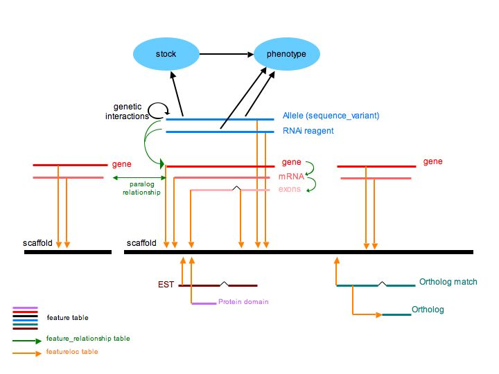
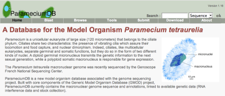

# ParameciumDB

From GMOD

Jump to: [navigation](#mw-navigation), [search](#p-search)

  
ParameciumDB
(<a href="http://paramecium.cgm.cnrs-gif.fr" class="external free"
rel="nofollow">http://paramecium.cgm.cnrs-gif.fr</a>) is a model
organism database for the unicellular eukaryote *Paramecium
tetraurelia*. ParameciumDB contains genome sequence and annotations,
alleles and RNAi knockdowns, mutant phenotypes, and stocks all in a
tightly integrated package. ParameciumDB is a good example of an online
biological resource built mainly with [GMOD
Components](GMOD_Components "GMOD Components").

This article provides an overview of Paramecium followed by a
description of how ParameciumDB was implemented using GMOD components.

The intent of this page is to give you a feeling for how ParameciumDB
uses GMOD, and what challenges they faced.

**See also:**

- <a href="http://paramecium.cgm.cnrs-gif.fr/" class="external text"
  rel="nofollow">ParameciumDB website</a>:
- <a href="http://nar.oxfordjournals.org/cgi/content/full/35/suppl_1/D439"
  class="external text" rel="nofollow">ParameciumDB: a community resource
  that integrates the Paramecium tetraurelia genome sequence with genetic
  data</a>, in the January 2007 Database Issue of
  <a href="http://nar.oxfordjournals.org/" class="external text"
  rel="nofollow"><em>Nucleic Acids Research</em></a>.

  

## Contents

- [1 Paramecium
  Biology](#Paramecium_Biology)
  - [1.1
    *Paramecium tetraurelia*
    Genome](#Paramecium_tetraurelia_Genome)
- [2
  ParameciumDB](#ParameciumDB)
- [3
  Implementation](#Implementation)
  - [3.1
    Database](#Database)
    - [3.1.1 Design
      Overview](#Design_Overview)
    - [3.1.2 Chado
      Modules](#Chado_Modules)
      - [3.1.2.1
        General Module](#General_Module)
      - [3.1.2.2
        Pub Module](#Pub_Module)
      - [3.1.2.3
        Sequence Module](#Sequence_Module)
      - [3.1.2.4
        Controlled Vocabulary
        Module](#Controlled_Vocabulary_Module)
      - [3.1.2.5
        Genetic Module](#Genetic_Module)
      - [3.1.2.6
        Stock Module](#Stock_Module)
  - [3.2 Web
    Site](#Web_Site)
    - [3.2.1
      Turnkey /
      GMODWeb](#Turnkey_.2F_GMODWeb)
    - [3.2.2
      GBrowse](#GBrowse)
  - [3.3
    Annotation](#Annotation)
  - [3.4
    Middleware](#Middleware)
    - [3.4.1
      Bio::Chado API](#Bio::Chado_API)
  - [3.5
    Comments](#Comments)
    - [3.5.1
      Issues](#Issues)
    - [3.5.2
      Feedback](#Feedback)
- [4 Related
  Reading](#Related_Reading)

  

# Paramecium Biology

Paramecium is a unicellular eukaryote that belongs to the ciliate
phylum. Ciliates are the only unicellular organisms that separate
germinal and somatic functions. Diploid but silent micronuclei undergo
meiosis and transmit the genetic information to the next sexual
generation. Highly polyploid macronuclei express the genetic information
but develop anew at each sexual generation, through extensive programmed
rearrangements of the genome.

Paramecium is a model for studying

- complex functions characteristic of multi-cellular organisms
  - somatic differentiation involving programmed rearrangements of the
    genome at each sexual generation
  - biogenesis of cilia and ciliary basal bodies (equivalent to
    centrioles)
  - regulated secretion
  - receptor- and ion channel-mediated cell signaling in response to
    environmental stimuli
- cytoplasmic non-Mendelian heredity and underlying homology-dependent
  mechanisms that involve non-coding RNA
  - mating type and other characters are inherited maternally
  - cortical pattern: related to prion heredity

<!-- -->

- evolutionary consequences of whole genome duplication
  - at least 3 whole genome duplications and an unprecedented number of
    paralogs related by whole genome duplication
  - explosive speciation followed the most recent whole genome
    duplication (15 sibling species of the P aurelia complex)
  - dosage constraints seem to shape the gene repertoire

## *Paramecium tetraurelia* Genome

The somatic genome has been sequenced by
<a href="http://www.genoscope.cns.fr/" class="external text"
rel="nofollow">Genoscope</a> using a whole genome shotgun approach. That
assembly and subsequent analysis have resulted in:

- 72 Mb assembly
- 39,642 gene models, with an average of 2.3 introns per gene
- 12,026 paralog pairs from most recent whole genome duplication

# ParameciumDB

ParameciumDB is maintained by two people, [Linda
Sperling](User:Sperling "User:Sperling") and Olivier Arnaiz at the
<a href="http://www.cgm.cnrs-gif.fr/version_gb/index_gb.html"
class="external text" rel="nofollow">Centre de Genetique Moleculaire</a>,
a part of the
<a href="http://www.cnrs.fr/index.html" class="external text"
rel="nofollow">Centre National de la Recherche Scientifique</a>.
ParameciumDB is mainly implemented with [GMOD
Components](GMOD_Components "GMOD Components").

ParameciumDB is first came online in August 2005.

# Implementation

This section covers some details of how ParameciumDB was implemented and
how it is maintained. This focuses on how GMOD Components are
implemented, but also touches on toher technologies as well.

**See also:**

- <a href="../mediawiki/images/1/1b/Cain-050516.ppt" class="internal"
  title="Cain-050516.ppt">Setting up ParameciumDB</a> in Scott Cain's
  presentation at the [May 2005 GMOD
  Meeting](May_2005_GMOD_Meeting "May 2005 GMOD Meeting").
- <a href="http://paramecium.cgm.cnrs-gif.fr/parawiki/ParameciumDB"
  class="external text" rel="nofollow">About ParameciumDB</a> on the
  ParameciumDB web site.

## Database

ParameciumDB is built on the
<a href="Chado" class="mw-redirect" title="Chado">Chado</a>
[schema](Glossary#Schema "Glossary") and implemented in
[PostgreSQL](PostgreSQL "PostgreSQL") [database management
system](Glossary#Database_Management_System "Glossary").

### Design Overview

### Chado Modules

ParameciumDB uses core Chado modules, plus the Genetic and Stock
modules.

#### General Module

ParameciumDB uses the [Chado General
Module](Chado_General_Module "Chado General Module") to handle database
IDs and cross-references.

#### Pub Module

The [Chado Publication
Module](Chado_Publication_Module "Chado Publication Module") is another
core Chado module. ParameciumDB does not manually curate publications,
but they do mine PubMed entries for Paramecium allele references.

#### Sequence Module

The [Chado Sequence
Module](Chado_Sequence_Module "Chado Sequence Module"), another core
module, is used to represent sequence features and
<a href="Synteny" class="mw-redirect" title="Synteny">synteny</a>.
Because of the recent whole genome duplication, a great deal of thought
has been given to how to represent paralogy and synteny. These are
represented in the sequence module using the `feature, featureloc`, and
`feature_relationship` tables.

**See also:**

- <a href="../mediawiki/images/2/20/ParameciumDB_synteny.pdf"
  class="internal" title="ParameciumDB synteny.pdf">Synteny data in
  ParameciumDB</a> working document

#### Controlled Vocabulary Module

The core [Chado CV Module](Chado_CV_Module "Chado CV Module") is used to
store these ontologies:

- <a href="http://www.sequenceontology.org/" class="external text"
  rel="nofollow">Sequence Ontology (SO)</a>
- <a href="http://www.geneontology.org/" class="external text"
  rel="nofollow">Gene Ontology (GO)</a>
- <a href="http://www.obofoundry.org/ro/" class="external text"
  rel="nofollow">Relation Ontology (RO)</a>
- <a href="http://obofoundry.org/cgi-bin/detail.cgi?quality"
  class="external text" rel="nofollow">Phenotype and Trait Ontology
  (PATO)</a>
- Paramecium Anatomy Ontology
- Paramecium Assay Ontology

  
The last two were developed at ParameciumDB to enable phenotypes to be
modeled using the Entity-Quality model. The quality terms are provided
by PATO. The anatomy ontology was developed for the Entity terms, since
more granular ‘cellular component’ terms than are available in GO were
needed to describe some species- or phylum-specific traits and
cytological features, such as nuclear dimorphism and the ciliate cortex.

Ultimately, the ciliate- and Paramecium-specific terms in the Paramecium
Anatomy Ontology, will be proposed for integration into the GO Cell
Component Ontology. This still requires more work on the definitions and
on identification of the appropriate place for the new terms in the GO
Cell Component hierarchy.

The assay ontology will hopefully also be incorporated into a broader
assay ontology in the future.

To create new phenotypes, we use the [Phenote](Phenote "Phenote") tool.

#### Genetic Module

This [Chado Genetic Module](Chado_Genetic_Module "Chado Genetic Module")
is used to model information about Paramecium alleles, genetic
interactions and phenotypes.

The genetic module is tightly linked to the Stock Module.

#### Stock Module

The [Chado Stock Module](Chado_Stock_Module "Chado Stock Module"), which
is now a standard Chado extension module, originated at ParameciumDB.

This module was necessary to allow integration of Paramecium Stock
Collections into ParameciumDB.

## Web Site

### Turnkey / GMODWeb

ParameciumDB uses [Turnkey](Turnkey "Turnkey"), a generic Web framework
built on Apache, mod_perl, and SQLFairy, that takes a relational schema
of a given database as input and transforms it into a fully-functional
and customizable web site within minutes. We use templates and cascading
style sheets to customize the ParameciumDB web interface.

### GBrowse

[GBrowse](GBrowse.1 "GBrowse"), the Generic Genome Browser, is used to
display and query sequence annotation with a Bio::DB::SeqFeature::Store
database.

## Annotation

ParameciumDB does not have paid curators. It currently relies on the
community for annotation of the gene models. They use
[Apollo](Apollo.1 "Apollo") as their genome annotation editor.

  
**See also:**

- <a
  href="http://paramecium.cgm.cnrs-gif.fr/parawiki/Community_Annotation_Project"
  class="external text" rel="nofollow">Community Annotation Project</a>
  from ParameciumDB web site
- <a href="../mediawiki/images/a/ac/CommunityAnnotationNov2007.pdf"
  class="internal" title="CommunityAnnotationNov2007.pdf">Community
  Annotation at ParameciumDB</a> - [Linda
  Sperling's](User:Sperling "User:Sperling") presentation at the
  [November 2007 GMOD
  Meeting](November_2007_GMOD_Meeting "November 2007 GMOD Meeting").

## Middleware

### Bio::Chado API

The <a href="http://paramecium.cgm.cnrs-gif.fr/chadoapi/"
class="external text" rel="nofollow">Bio::Chado API</a> is Perl
[Category:middleware](Category:Middleware "Category:Middleware") module
for working with
<a href="Chado" class="mw-redirect" title="Chado">Chado</a> databases.
It was developed specifically for the
[BioPipe](Bioperl_Pipeline "Bioperl Pipeline") project (so that BioPipe
users can choose to store pipeline results in a Chado database as
opposed to an EnsEMBL database) and for ParameciumDB.

## Comments

### Issues

- Content control - moved to [CVS](Glossary#CVS "Glossary")
- Incorporation of the custom [Chado Stock
  Module](Chado_Stock_Module "Chado Stock Module")
- Getting [Turnkey](Turnkey "Turnkey")/[GMODWeb](GMODWeb "GMODWeb") to
  work
- Logical Chado issues
  - Making all features part-of chromosome
  - Making results children of genes
- <a href="GBrowse_adaptors" class="mw-redirect"
  title="GBrowse adaptors">GBrowse Chado adapter</a> bugs
- Getting parsers and loaders bug free.
- Making [Apollo and Chado](Apollo-Chado "Apollo-Chado") data models
  compatible
- Maintenance of data, schema and new software versions

### Feedback

- [GBrowse](GBrowse.1 "GBrowse") documentation is very good for
  Bio::DB::GFF but a little less so for Bio::DB::Das::Chado.
- Chado's install documentation is not bad but requires investment.
- [Turnkey](Turnkey "Turnkey") is a wonderful tool and it should
  continue to be developed.
- [Apollo](Apollo.1 "Apollo") is a beautiful genome editor, though it is
  complicated for a naive user.
- [BioMart](BioMart "BioMart") seems to be a very powerful tool and is
  an invaluable addition to any MOD.
- [Chado Mage Module](Chado_Mage_Module "Chado Mage Module") is being
  successfully used for transcriptome data, but it is not yet visible to
  the public.

# Related Reading

- <a href="http://paramecium.cgm.cnrs-gif.fr/" class="external text"
  rel="nofollow">ParameciumDB website</a>:
  - <a href="http://paramecium.cgm.cnrs-gif.fr/parawiki/ParameciumDB"
    class="external text" rel="nofollow">About ParameciumDB</a>
  - <a
    href="http://paramecium.cgm.cnrs-gif.fr/parawiki/Community_Annotation_Project"
    class="external text" rel="nofollow">Community Annotation</a>
- <a href="http://nar.oxfordjournals.org/cgi/content/full/35/suppl_1/D439"
  class="external text" rel="nofollow">ParameciumDB: a community resource
  that integrates the Paramecium tetraurelia genome sequence with genetic
  data</a>, in the January 2007 Database Issue of
  <a href="http://nar.oxfordjournals.org/" class="external text"
  rel="nofollow"><em>Nucleic Acids Research</em></a>.
- <a href="../mediawiki/images/1/1b/Cain-050516.ppt" class="internal"
  title="Cain-050516.ppt">Scott Cain's presentation</a> (the "Setting up
  ParameciumDB" section) from the [May 2005 GMOD
  Meeting](May_2005_GMOD_Meeting "May 2005 GMOD Meeting").
- <a href="../mediawiki/images/a/ac/CommunityAnnotationNov2007.pdf"
  class="internal" title="CommunityAnnotationNov2007.pdf">Community
  Annotation at ParameciumDB</a> - [Linda
  Sperling's](User:Sperling "User:Sperling") presentation at the
  [November 2007 GMOD
  Meeting](November_2007_GMOD_Meeting "November 2007 GMOD Meeting").
- <a href="../mediawiki/images/2/20/ParameciumDB_synteny.pdf"
  class="internal" title="ParameciumDB synteny.pdf">Synteny data in
  ParameciumDB</a> working document.

Retrieved from
"<http://gmod.org/mediawiki/index.php?title=ParameciumDB&oldid=23400>"

[Categories](Special:Categories "Special:Categories"):

- [ParameciumDB](Category:ParameciumDB "Category:ParameciumDB")
- [User
  Experiences](Category:User_Experiences "Category:User Experiences")

## Navigation menu

### Namespaces

- <a
  href="http://gmod.org/mediawiki/index.php?title=Talk:ParameciumDB&amp;action=edit&amp;redlink=1"
  accesskey="t"
  title="Discussion about the content page [t]">Discussion</a>

### 

### Variants

### Navigation

- [GMOD Home](Main_Page)
- [Software](GMOD_Components)
- [Categories /
  Tags](Categories)

### Documentation

- [Overview](Overview)
- [FAQs](Category:FAQ)
- [HOWTOs](Category:HOWTO)
- [Glossary](Glossary)

### Community

- [GMOD News](GMOD_News)
- [Training /
  Outreach](Training_and_Outreach)
- [Support](Support)
- [GMOD Promotion](GMOD_Promotion)
- [Meetings](Meetings)
- [Calendar](Calendar)

### Tools

- <a href="Special:Browse/ParameciumDB" rel="smw-browse">Browse
  properties</a>

- Last updated at 08:29 on 6 April
  2013.
<!-- - 100,184 page views. -->
- Content is available under
  <a href="http://www.gnu.org/licenses/fdl-1.3.html" class="external"
  rel="nofollow">a GNU Free Documentation License</a> unless otherwise
  noted.

<!-- -->

- [About
  GMOD](GMOD:About "GMOD:About")

<!-- -->

