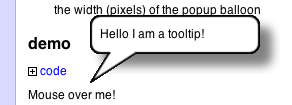
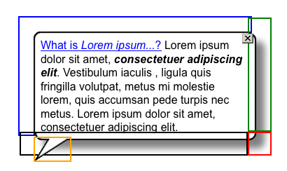
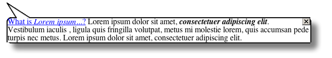
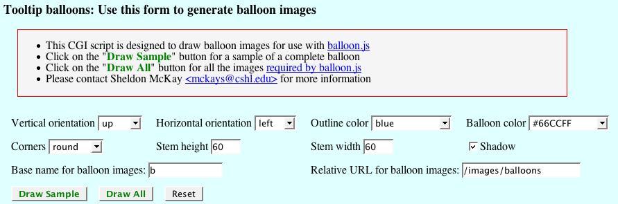
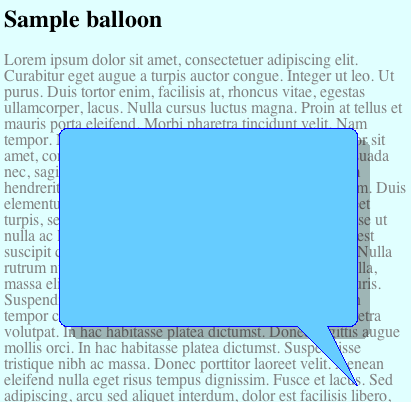
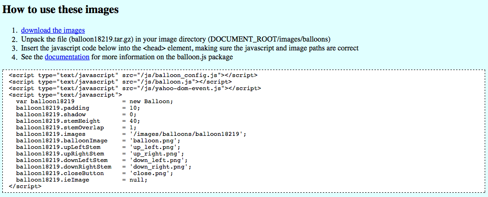
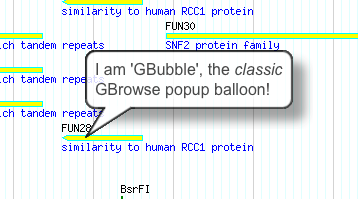
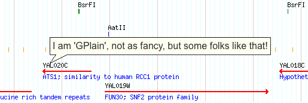
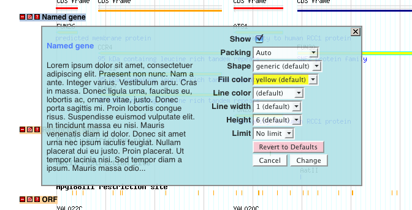

<div id="mw-page-base" class="noprint">

</div>

<div id="mw-head-base" class="noprint">

</div>

<div id="content" class="mw-body" role="main">

<span id="top"></span>

<div id="mw-js-message" style="display:none;">

</div>


# <span dir="auto">Popup Balloons</span>

<div id="bodyContent">

<div id="siteSub">

From GMOD

</div>

<div id="contentSub">

</div>

<div id="jump-to-nav" class="mw-jump">

Jump to: [navigation](#mw-navigation), [search](#p-search)

</div>

<div id="mw-content-text" class="mw-content-ltr" lang="en" dir="ltr">

<div class="floatright">

<a href="File:Sample_ballon.png" class="image"></a>

</div>

**balloon.js** is a javascript class for balloon tooltips, otherwise
known as popup balloons, bubble tooltips, rollover tooltips, etc. It is
maintained by <span class="pops">[Sheldon
McKay](User:Mckays "User:Mckays")</span>, a scientist at the
<span class="pops"><a href="http://dnalc.org" class="external text" rel="nofollow">DNA
Learning center</a></span>,
<span class="pops"><a href="http://www.cshl.edu" class="external text" rel="nofollow">Cold
Spring Harbor Laboratory</a>.</span>

  
balloon.js is generic and should work in most web sites.

- This software is open-source and free to all, so please feel free to
  incorporate it into your own web site but it would be ***very
  naughty*** of you to remove the copyright notice from the top of the
  balloon.js file.

<!-- -->

- If you find this software useful, please drop me a line
  (<a href="mailto:Sheldon.McKay@gmail.com" class="external text"
  rel="nofollow">Sheldon.McKay@gmail.com</a>). I am curious to see how
  it works for you and how you are using it.  
- **Note:** If you have installed this package on your web server as
  described below and it does not work, you have likely made an error.
  Please see the [troubleshooting
  guidelines](#Troubleshooting_for_the_impatient) and send me the URL
  (web site address for your implementation) and I will do my best to
  help you.

  

<div id="toc" class="toc">

<div id="toctitle">

## Contents

</div>

- [<span class="tocnumber">1</span> <span class="toctext">Example
  Implementations</span>](#Example_Implementations)
- [<span class="tocnumber">2</span>
  <span class="toctext">Availability</span>](#Availability)
- [<span class="tocnumber">3</span>
  <span class="toctext">Installation</span>](#Installation)
  - [<span class="tocnumber">3.1</span> <span class="toctext">Required
    components</span>](#Required_components)
  - [<span class="tocnumber">3.2</span> <span class="toctext">Put the
    required files on your web
    server</span>](#Put_the_required_files_on_your_web_server)
  - [<span class="tocnumber">3.3</span> <span class="toctext">Specify
    the location of the javascript
    libraries</span>](#Specify_the_location_of_the_javascript_libraries)
  - [<span class="tocnumber">3.4</span> <span class="toctext">Initialize
    balloon object(s)</span>](#Initialize_balloon_object.28s.29)
  - [<span class="tocnumber">3.5</span> <span class="toctext">Notes on
    balloon images</span>](#Notes_on_balloon_images)
    - [<span class="tocnumber">3.5.1</span> <span class="toctext">How it
      works</span>](#How_it_works)
    - [<span class="tocnumber">3.5.2</span> <span class="toctext">Note
      on simpler popups</span>](#Note_on_simpler_popups)
    - [<span class="tocnumber">3.5.3</span> <span class="toctext">Where
      to get the balloon
      images</span>](#Where_to_get_the_balloon_images)
      - [<span class="tocnumber">3.5.3.1</span>
        <span class="toctext">Default images</span>](#Default_images)
      - [<span class="tocnumber">3.5.3.2</span>
        <span class="toctext">Design your own
        images</span>](#Design_your_own_images)
    - [<span class="tocnumber">3.5.4</span> <span class="toctext">How
      they are used</span>](#How_they_are_used)
    - [<span class="tocnumber">3.5.5</span> <span class="toctext">Note:
      Internet Explorer</span>](#Note:_Internet_Explorer)
    - [<span class="tocnumber">3.5.6</span>
      <span class="toctext">Balloon image
      locations</span>](#Balloon_image_locations)
    - [<span class="tocnumber">3.5.7</span>
      <span class="toctext">Balloon image
      properties</span>](#Balloon_image_properties)
    - [<span class="tocnumber">3.5.8</span> <span class="toctext">Online
      balloon image generator</span>](#Online_balloon_image_generator)
- [<span class="tocnumber">4</span>
  <span class="toctext">Configuration</span>](#Configuration)
  - [<span class="tocnumber">4.1</span> <span class="toctext">Using a
    formatted box with no balloon
    images</span>](#Using_a_formatted_box_with_no_balloon_images)
  - [<span class="tocnumber">4.2</span>
    <span class="toctext">Configuration
    Sets</span>](#Configuration_Sets)
    - [<span class="tocnumber">4.2.1</span>
      <span class="toctext">Configuration Sets included in the
      balloon.js
      package</span>](#Configuration_Sets_included_in_the_balloon.js_package)
      - [<span class="tocnumber">4.2.1.1</span>
        <span class="toctext">GBubble and
        GFade</span>](#GBubble_and_GFade)
      - [<span class="tocnumber">4.2.1.2</span>
        <span class="toctext">GPlain</span>](#GPlain)
      - [<span class="tocnumber">4.2.1.3</span>
        <span class="toctext">GBox</span>](#GBox)
    - [<span class="tocnumber">4.2.2</span>
      <span class="toctext">Configuring Default Tooltip
      Styles</span>](#Configuring_Default_Tooltip_Styles)
- [<span class="tocnumber">5</span> <span class="toctext">The JavaScript
  User Interface</span>](#The_JavaScript_User_Interface)
  - [<span class="tocnumber">5.1</span> <span class="toctext">Basic
    Usage</span>](#Basic_Usage)
    - [<span class="tocnumber">5.1.1</span> <span class="toctext">How do
      I put an image in the
      balloon?</span>](#How_do_I_put_an_image_in_the_balloon.3F)
      - [<span class="tocnumber">5.1.1.1</span>
        <span class="toctext">Examples</span>](#Examples)
  - [<span class="tocnumber">5.2</span> <span class="toctext">Sticky
    balloon behavior</span>](#Sticky_balloon_behavior)
  - [<span class="tocnumber">5.3</span> <span class="toctext">Formatting
    balloon contents</span>](#Formatting_balloon_contents)
    - [<span class="tocnumber">5.3.1</span> <span class="toctext">Escape
      characters and multi-line
      strings</span>](#Escape_characters_and_multi-line_strings)
    - [<span class="tocnumber">5.3.2</span>
      <span class="toctext">Storing balloon contents in invisible page
      elements</span>](#Storing_balloon_contents_in_invisible_page_elements)
  - [<span class="tocnumber">5.4</span> <span class="toctext">Using AJAX
    to get balloon contents</span>](#Using_AJAX_to_get_balloon_contents)
    - [<span class="tocnumber">5.4.1</span> <span class="toctext">The
      AJAX handling script and its behavior are the responsibility of
      the
      implementer.</span>](#The_AJAX_handling_script_and_its_behavior_are_the_responsibility_of_the_implementer.)
  - [<span class="tocnumber">5.5</span> <span class="toctext">An
    alternative AJAX
    implementation</span>](#An_alternative_AJAX_implementation)
  - [<span class="tocnumber">5.6</span> <span class="toctext">Inserting
    images and other remote content without
    AJAX</span>](#Inserting_images_and_other_remote_content_without_AJAX)
- [<span class="tocnumber">6</span>
  <span class="toctext">CHANGES</span>](#CHANGES)
  - [<span class="tocnumber">6.1</span> <span class="toctext">version
    1.11</span>](#version_1.11)
  - [<span class="tocnumber">6.2</span> <span class="toctext">version
    1.19</span>](#version_1.19)
  - [<span class="tocnumber">6.3</span> <span class="toctext">version
    1.20</span>](#version_1.20)
  - [<span class="tocnumber">6.4</span> <span class="toctext">version
    1.22</span>](#version_1.22)
  - [<span class="tocnumber">6.5</span> <span class="toctext">version
    1.27</span>](#version_1.27)
  - [<span class="tocnumber">6.6</span> <span class="toctext">version
    1.33</span>](#version_1.33)
  - [<span class="tocnumber">6.7</span> <span class="toctext">version
    1.37</span>](#version_1.37)
  - [<span class="tocnumber">6.8</span> <span class="toctext">version
    1.41</span>](#version_1.41)
  - [<span class="tocnumber">6.9</span> <span class="toctext">version
    1.43</span>](#version_1.43)
  - [<span class="tocnumber">6.10</span> <span class="toctext">version
    1.46</span>](#version_1.46)
  - [<span class="tocnumber">6.11</span> <span class="toctext">version
    2.0</span>](#version_2.0)
  - [<span class="tocnumber">6.12</span> <span class="toctext">version
    2.1</span>](#version_2.1)
  - [<span class="tocnumber">6.13</span> <span class="toctext">version
    2.2</span>](#version_2.2)
- [<span class="tocnumber">7</span> <span class="toctext">New
  Features</span>](#New_Features)
  - [<span class="tocnumber">7.1</span> <span class="toctext">Cursor
    Tracking</span>](#Cursor_Tracking)
  - [<span class="tocnumber">7.2</span> <span class="toctext">Overflow
    and Scrollbars</span>](#Overflow_and_Scrollbars)
  - [<span class="tocnumber">7.3</span> <span class="toctext">Both
    height and width can be
    constrained</span>](#Both_height_and_width_can_be_constrained)
  - [<span class="tocnumber">7.4</span> <span class="toctext">Tooltips
    will not go off-screen</span>](#Tooltips_will_not_go_off-screen)
- [<span class="tocnumber">8</span>
  <span class="toctext">Troubleshooting for the
  impatient</span>](#Troubleshooting_for_the_impatient)
  - [<span class="tocnumber">8.1</span> <span class="toctext">What is a
    Document Root?</span>](#What_is_a_Document_Root.3F)
  - [<span class="tocnumber">8.2</span> <span class="toctext">This
    package is NOT a desktop
    application</span>](#This_package_is_NOT_a_desktop_application)
  - [<span class="tocnumber">8.3</span> <span class="toctext">Reporting
    errors</span>](#Reporting_errors)
- [<span class="tocnumber">9</span> <span class="toctext">Software
  License</span>](#Software_License)

</div>

# <span id="Example_Implementations" class="mw-headline">Example Implementations</span>

**Example 1:** See the balloons in action:
<a href="http://mckay.cshl.edu/balloons.html" class="external text"
rel="nofollow">balloons2.html</a>

# <span id="Availability" class="mw-headline">Availability</span>

- You can download the package
  <a href="http://mckay.cshl.edu/downloads/balloons.tar.gz"
  class="external text" rel="nofollow">here</a>

<!-- -->

- You can also browse the complete package, at the <a
  href="https://gmod.svn.sourceforge.net/svnroot/gmod/balloon-tooltips/trunk/"
  class="external text" rel="nofollow">GMOD SVN site</a>.

# <span id="Installation" class="mw-headline">Installation</span>

## <span id="Required_components" class="mw-headline">Required components</span>

- <a
  href="https://gmod.svn.sourceforge.net/svnroot/gmod/balloon-tooltips/trunk/htdocs/js/balloon.js"
  class="external text" rel="nofollow">balloon.js</a> - balloon tooltip
  library by Sheldon McKay
- <a href="https://mckays.cshl.edu/js/box.js" class="external text"
  rel="nofollow">box.js</a> - optional subclass to draw lighter-weight
  boxes rather than bubbles
- <a href="https://mckays.cshl.edu/js/balloon.config.js"
  class="external text" rel="nofollow">balloon.config.js</a> -
  configuration file for the above

<!-- -->

- <a href="http://prototypejs.org" class="external text"
  rel="nofollow">prototype.js</a> - Prototype is a JavaScript Framework
  that aims to ease development of dynamic web applications.
- <a href="http://mckay.cshl.edu/images/balloons/balloons.tar.gz"
  class="external text" rel="nofollow">Balloon images</a> - Some balloon
  images. You can use these or make your own (see below for details).

Download all of the above:
<a href="http://mckay.cshl.edu/downloads/balloons.tar.gz"
class="external text" rel="nofollow">tarball</a> or
<a href="http:///mckay.cshl.edu/downloads/balloons.zip"
class="external text" rel="nofollow">zip archive</a>

## <span id="Put_the_required_files_on_your_web_server" class="mw-headline">Put the required files on your web server</span>

- Copy the above javascript libraries to your web server, for example in

<!-- -->

    document_root/js

<div class="emphasisbox">

NOTE: <a
href="http://www.solucorp.qc.ca/linuxconf/help.files/apache/apache-5.html"
class="external text" rel="nofollow">document root</a> is the root
folder for your web server. It will vary by system architecture.
Depending on your web server, this may be:

    Linux:
    /var/www/html
    /var/www/htdocs
    /etc/apache2

    Windows (why would you use windows?):
    C:/Program Files/Apache Software Foundation/Apache2.2/htdocs

    Max OS X:
    /Library/WebServer/Documents

    etc...

</div>

  

- Copy the above image files (or your own) to your web server, for
  example in

<!-- -->

    document_root/images/balloons

## <span id="Specify_the_location_of_the_javascript_libraries" class="mw-headline">Specify the location of the javascript libraries</span>

- Add the following directives to your page header.
- Note that the examples below assume that the javascript files are
  located in a folder 'js' off of your document root.

via HTML:

     <head>
     <script type="text/javascript" src="js/balloon.config.js"></script>
     <script type="text/javascript" src="js/balloon.js"></script>
     <script type="text/javascript" src="js/box.js"></script>
     <script type="text/javascript" src="js/prototype.js"></script>
     </head>
     

NOTE: you can also add this code to the \<body\> section instead of the
page header.

## <span id="Initialize_balloon_object.28s.29" class="mw-headline">Initialize balloon object(s)</span>

- Insert a script like the example below either in the \<head\> section
  of the document or near the top of the \<body\> section, ensuring that
  it is **after** the external libraries above.
- Only one object is required but multiple objects are allowed.
- See the configuration section (below) for more details on
  configuration options.
- More examples can be seen in the example implementations above.
- NOTE: If you get an error message complaining that 'balloon' is null
  or not an object, or that funtion/method 'Balloon' is not found, check
  your path to the javascript files.

<!-- -->

     <script type="text/javascript">
       // white balloon, with default configuration
       var whiteBalloon    = new Balloon;

       // Stemless blue balloon, with custom image
       var blueBalloon  = new Balloon;
       blueBalloon.balloonTextSize  = '90%';
       blueBalloon.images           = '/images/balloons';
       blueBalloon.balloonImage     = 'blue_balloon.png';
       blueBalloon.vOffset          = 15;
       blueBalloon.shadow           = 0;
       blueBalloon.stem             = false; // no stems, just the body

       // Plain box with no fancy balloon images
       var plainBox         = new Box();
       plainBox.bgColor     = 'ivory';
       plainBox.borderStyle = '2px solid blue';

     </script>

## <span id="Notes_on_balloon_images" class="mw-headline">Notes on balloon images</span>

### <span id="How_it_works" class="mw-headline">How it works</span>

- The popup balloons object creates the illusion of a perfectly sized
  balloon using four copies of a background image for the balloon body
  and one background image for each stem orientation (see image below).
- Not counting the stem, the balloon has four parts, one for each
  corner. The size of the balloon is stretched to fit the content.
- Each of these four parts is a \<div\> element that uses the same
  image, the <a
  href="http://gmod.cvs.sourceforge.net/*checkout*/gmod/balloon-tooltips/htdocs/images/balloon.png"
  class="external text" rel="nofollow">balloon body</a> , as it's
  background image. The actual balloon body image is much larger that
  the visible portion, to allow the balloon to be resized to a maximum
  width of 1000px (but don't do that).

<a href="File:Howitworks.png" class="image"></a>

- The top left (blue border) image is fixed, while the right side
  (green), bottom right corner (red) and bottom side (black) slide
  outward as required.
- The appropriate stem image (orange) is added after the balloon layout
  and orientation are calculated.
- Except for the main part of the balloon (blue), only a tiny sliver of
  the balloon image is visible for each of the corners.

### <span id="Note_on_simpler_popups" class="mw-headline">Note on simpler popups</span>

- If you want something less fancy, you can use a plain box with
  configurable border and background color (see below)

### <span id="Where_to_get_the_balloon_images" class="mw-headline">Where to get the balloon images</span>

#### <span id="Default_images" class="mw-headline">Default images</span>

- Default balloon images are provided with the
  <a href="http://mckay.cshl.edu/downloads/balloons.tar.gz"
  class="external text" rel="nofollow">downloaded package</a>.
- These images were created and/or edited with
  <a href="http://http://www.gimp.org" class="external text"
  rel="nofollow">The GIMP</a>

#### <span id="Design_your_own_images" class="mw-headline">Design your own images</span>

- See
  [below](Popup_Balloons#Online_balloon_image_generator "Popup Balloons")
  for a script that will draw balloon images according to your
  specifications.

### <span id="How_they_are_used" class="mw-headline">How they are used</span>

- A total of five images are required to draw balloons in all possible
  orientations: The balloon body and four stems (up, down, left and
  right).
- In addition, a close button for sticky balloons and an optional
  no-shadow version of the balloon (for internet explorer versions \< 7)
  are also included.

  

    The images below are provided with the package (not to scale):

  
**The stem:** This part of the image is the top or bottom (depending on
whether the balloon is facing up or down) that has the triangle. It is
overlaid on top of the balloon background image. The connector is a
fixed-size image.

    For example, a bottom-left stem:

  
**The body:** This image is used as the background for the balloon. The
image is much larger and the actual balloon size (1020px \*1020px). Each
of the four corners of the balloon has its own identical background
image. The top corner contains the contents of the balloon and the
amount of the background image that is visible is adjusted with the
balloon size. The other corners and right and bottom edges of the
balloon are created by making only a small portion of their respective
background images visible. Te size of the balloon is dynamic in both the
vertical and horizontal dimensions. However, maximum and minimum widths
for the balloon can be specified as follows:

    balloon.minWidth = 150;
    balloon.maxWidth = 600;

and the balloon width can be constrained at run-time by adding a fourth
argument to the showToolip method call:

    onmouseover=balloon.showTooltip(event,'message...',null,300)

### <span id="Note:_Internet_Explorer" class="mw-headline">Note: Internet Explorer</span>

The balloon body image is in PNG format with alpha channels. This file
format is required for the semi-transparent shadow. Older versions of
internet explorer do not support this feature (support was added to
version 7). In the default configuration, an alternative image without a
shadow if substituted is IE version \< 7 is detected.

- If you design custom balloon images that use alpha channels, consider
  creating an alternative body image for older IE browsers.
- The use of the alternate image is configured as follows:

<!-- -->

    balloon.ieImage = 'balloon_ie.png;

### <span id="Balloon_image_locations" class="mw-headline">Balloon image locations</span>

If you have saved the balloon images in a location other than the
default relative URL '/images/balloons', you need to tell the balloon
object about it or your popups will not have the balloon image.  
**There are two ways to do this:**

1\) Set the variable balloon.images to the relative url for balloon
images. If you use this method, specify the relative URL only once with
the instance variable ***balloon.images***. Individual image name should
not have the path. For example:

    <script type="text/javascript">
      my balloon = new Balloon;
      balloon.images = '/myImages/myBalloons';
      balloon.balloonImage  = 'balloon.png';
      balloon.upLeftStem    = 'up_left.png';
      balloon.downLeftStem  = 'down_left.png';
      balloon.upRightStem   = 'up_right.png';
      balloon.downRightStem = 'down_right.png';
      balloon.closeButton   = 'close.png';
    </script>

  
2) Use an explicit URL for each balloon image. Note ***balloon.images***
must be reset to 'null' in this case.

    <script type="text/javascript">
      my balloon = new Balloon;
      balloon.images = null;
      balloon.balloonImage  = '/myImages/myBalloons/balloon.png';
      balloon.upLeftStem    = '/myImages/myBalloons/up_left.png';
      balloon.downLeftStem  = '/myImages/myBalloons/down_left.png';
      balloon.upRightStem   = '/myImages/myBalloons/up_right.png';
      balloon.downRightStem = '/myImages/myBalloons/down_right.png';
      balloon.closeButton   = '/myImages/myBalloons/close.png';
    </script>

**NOTE: the two methods above are mutually exclusive.**

### <span id="Balloon_image_properties" class="mw-headline">Balloon image properties</span>

- If you wish to create your own balloon images, the image below
  demonstrates some key balloon image properties. The stem height, the
  stem overlap and the padding and shadow widths must be accurate to a
  precision of 1px or the balloon will not render properly.

<div class="center">

<div class="floatnone">

<a href="File:Options.png" class="image"></a>

</div>

</div>

**Note:** The padding is not only the distance of the text from the
balloon outline, it also defines the width of the right and bottom
corners of the dynamically rendered balloon image. Setting the padding
to a value less than the radius of the corners (10px is the default)
will obscure the balloon corners.

For example, setting the padding to 2px with the default balloon images
will cause the effect below because the image corner radius is 10px:

<div class="center">

<div class="floatnone">

<a href="File:Padding_defect.png" class="image"></a>

</div>

</div>

### <span id="Online_balloon_image_generator" class="mw-headline">Online balloon image generator</span>

- A CGI script is available for interactive drawing of balloon images
  and accompanying javascript code.
- The script is hosted at
  <span class="pops"><a href="http://mckay.cshl.edu/balloon" class="external free"
  rel="nofollow">http://mckay.cshl.edu/balloon</a></span> and can also
  be obtained as part of the
  <a href="http://gmod.cvs.sourceforge.net/gmod/balloon-tooltips/"
  class="external text" rel="nofollow">balloon.js package</a>

  
Below is an example of the input form that can be used to experiment
with different balloon options.

<div style="border:1px solid blue;background:lightcyan">

<div class="center">

<div class="floatnone">

<a href="File:Balloon_generator.png" class="image"
title="The actual script is at http://mckay.cshl.edu/balloon"></a>

</div>

</div>

</div>

  

Sample output. The program will draw either a sample of what the final
product will look like or all of the necessary image components.

<div style="border:1px solid blue">

|                                                                    |
|:------------------------------------------------------------------:|
|           <a href="File:Balloon_sample.png" class="image"          
  title="The actual script is at http://mckay.cshl.edu/balloon"></a>  |

</div>

  

The CGI script will also generate the necessary javascript code to use
the custom balloon images on a web page:

<div style="border:1px solid blue;background:lightcyan">

<div class="center">

<div class="floatnone">

<a href="File:Balloon_script.png" class="image"
title="The actual script is at http://mckay.cshl.edu/balloon"></a>

</div>

</div>

</div>

  
  
  

# <span id="Configuration" class="mw-headline">Configuration</span>

This section describes javascript configuration. To configure balloon
tooltips in GBrowse, see [Configuring Balloon
Tooltips](GBrowse_Configuration/Balloons "GBrowse Configuration/Balloons").

- The balloon.js library offers default configuration settings that
  should work "out of the box", as long as the components are installed
  in the specified locations relative to your document root.
- Configuration is contained in the file <a
  href="http://gmod.cvs.sourceforge.net/*checkout*/gmod/balloon-tooltips/htdocs/js/balloon.config.js"
  class="external text" rel="nofollow">balloon.config.js</a>. This is
  the file to edit if you wish to change the default balloon behavior
  and appearance.
  - Note: if you do not install your balloon images in the default
    location 'images/balloons', the you will need to [make some
    adjustments](Popup_Balloons#Balloon_image_locations "Popup Balloons").
- Any of the default settings shown below can be overridden via a script
  in the body section of your HTML.

For example:

    <body>
     <script "type=text/javascript">
       // This creates the balloon object
       var balloon = new Balloon;
       balloon.fontSize  = '11pt';
       balloon.fontColor = 'blue';
       balloon.delayTime = 500;
     </script>

The following options can be reset/configured in the page header or body
(after the balloon object has been initialized) using the syntax below,
where 'balloon' is the object created by the 'new Balloon' command.  
  
NOTE: The default values are shown. Edit the file balloon.config.js to
change the values below.

- parentID -- Needed for some skins in the mediawiki implementation

<!-- -->

     // ID of element to which balloon should be added
     // default = none (document.body is used)
     // This option may be required for mediawiki or other
     // implementations with complex stylesheets
     balloon.parentID = null;

- maxWidth and minWidth -- allowed range of balloon widths (px)

<!-- -->

     balloon.minWidth = 150;
     balloon.maxWidth = 600;

- delayTime -- how long before mouseover trigger a balloon (Don't set
  this too low, trust me on this one)

<!-- -->

     // Delay before balloon is displayed (msec)
     balloon.delayTime = 500;

- Fading parameters

<!-- -->

     // If fade-in/out is allowed
     balloon.allowFade = false;
     // time interval for fade-in (msec)
     balloon.fadeIn    = 300;
     // time interval for fade-out (msec)
     balloon.fadeOut   = 300;

- vOffset (how far below/above the cursor the balloom stem starts)

<!-- -->

     // Vertical Distance from cursor location (px)
     balloon.vOffset  = 10;

- padding -- distance from balloon edge to contents. Don't set to \< 10
  if your balloon has corners

<!-- -->

     // text-padding within the balloon (px)
     balloon.padding  = 10;

- displayTime -- non-sticky balloons will go away after this length of
  time (in milliseconds). 'false' means never.

<!-- -->

     // How long to display mousover balloons (msec)
     // false = 'always on'
     balloon.displayTime = 10000;

- shadow -- amount of external padding needed for the shadow, if your
  balloon has one. NOTE: this does not add or remove a shadow from the
  image -- that's up to you!

<!-- -->

     // width of shadow (space aroung whole balloon; px)
     // This can be zero if there is no shadow and the
     // edges of the balloon are also the edges of the image
     balloon.shadow   = 20;

- images -- the relative or absolute URL of your image directory.

<!-- -->

     // images of balloon body.  If the browser is IE < 7, png alpha
     // channels will not work.  An optional alternative image can be
     // provided.  It should have the same dimensions as the default png image
     balloon.images        = '/images/balloons';

- name of the balloon background image

<!-- -->

     balloon.balloonImage  = 'balloon.png';    // with alpha channels

- an optional, alternate image for IE 6 and below, which is too stupid
  to cope with PNG transparency

<!-- -->

     balloon.ieImage       = 'balloon_ie.png'; a// indexed color, transparent background

- stem (throat, pointy bit, whatever) parameters

<!-- -->

     // whether the balloon should have a stem
     balloon.stem          = true;

     // The height (px) of the stem and the extent to which the
     // stem image should overlaps the balloon image.
     balloon.stemHeight  = 32;
     balloon.stemOverlap = 3;

     // A stem for each of the four orientations
     balloon.upLeftStem    = 'up_left.png';
     balloon.downLeftStem  = 'down_left.png';
     balloon.upRightStem   = 'up_right.png';
     balloon.downRightStem = 'down_right.png';

- where to find a close button

<!-- -->

     // A close button for sticky balloons
     balloon.closeButton   = 'close.png';

- balloon font properties -- you can control the appearnace of balloon
  contents with embedded HTML/CSS but the following font attributes can
  be set globally for the balloon object

<!-- -->

     balloon.fontSize      = '12pt';
     balloon.fontColor     = 'black';
     balloon.fontFamily    = 'Arial, sans-serif';

- AJAX and security settings

This section allows support for AJAX, iframes and JavaScript in
balloons. If you have concerns about XSS vulnerabilities, set some or
all of these values to false;

     // URL for default AJAX request handler
     balloon.helpUrl            = false;

     // Should AJAX be allowed at all?
     balloon.allowAJAX          = true;

     // Allow iframe elements in balloons?
     balloon.allowIframes       = true;

     // Allow javascript event handlers in balloons?
     balloon.allowEventHandlers = false;

     // Allow <script> elements in balloons?
     balloon.allowScripts       = false;

     // Escape all HTML characters -- this will be very
     // unnattractive unless your AJAX request returns plain
     // text.  short of disallowing AJAX entirely, This is the safe
     // way to go if you must have AJAX in an environment where
     // outside users can send text to the browser/balloon
     balloon.escapeHTML         = false;

## <span id="Using_a_formatted_box_with_no_balloon_images" class="mw-headline">Using a formatted box with no balloon images</span>

- an alternative to the balloons is to use the ***Box*** class instead
  of the ***Balloon*** class.
- the tooltip box offer the same dynamic size, orientation, positioning
  and capabilities as the balloons, but uses no background images and is
  always rectangular in shape.
- make sure you have loaded "box.js" in your page header, as shown
  above.
- It is configured as above but does not use image variables
- The default box configuration is also in the balloon.config.js file.
- There are two box-specific variable:

<!-- -->

      var box = new Box();
      BalloonConfig(box,'GBox');

      // background color of the box (web colors of hex)
      box.bgcolor = "red";

      // border style (standard CSS syntax)
      box.borderStyle = "2px solid purple";

## <span id="Configuration_Sets" class="mw-headline">Configuration Sets</span>

- As of release x.xx, balloon.js uses configuration sets, which are sets
  of options bundled together for convenience.
- There are four config sets available (GBubble, GPlain, GFade and
  GBox). GBubble is the default set that will be used unless otherwise
  specified. These are described in more detail below.
- You can also edit balloon.config.js to add you own configuration sets.

<!-- -->

- Loading a configuration set is easy:

<!-- -->


    var plainBalloon = new Balloon;
    BalloonConfig(plainBalloon,'GPlain');

    var fancyBalloon = new Balloon;
    BalloonConfig(fancyBalloon,'GFade');

### <span id="Configuration_Sets_included_in_the_balloon.js_package" class="mw-headline">Configuration Sets included in the balloon.js package</span>

#### <span id="GBubble_and_GFade" class="mw-headline">GBubble and GFade</span>

This is the original cartoon bubble popup balloon style. It has a couple
of new behaviors, including an opacity setting (the example shown has
opacity set to 0.9).

- GBubble is the the default balloon style.

<a href="File:GBubble.png" class="image"></a>

- GFade is identical to GBubble except that it fades into view rather
  than just popping up. This is accomplished by starting out transparent
  and gradually increasing the opacity over a span of 1200 msec.

#### <span id="GPlain" class="mw-headline">GPlain</span>

The GPlain style is a plainer style of balloon tooltip but still offers
fully HTML formatted contents, opacity, etc. The default configuration
has opacity set to 85% and cursor tracking enabled, so the tooltip will
follow the mouse until you mouseout from the text or image the tooltip
is attached to.

<a href="File:GPlain.png" class="image"></a>

#### <span id="GBox" class="mw-headline">GBox</span>

GBox is a formatted box. It can have fixed dimensions or resize
dynamically (actually, this is true of all balloon tooltips).

- For sticky boxes, if the contents are too big, scrollbars will appear.

<a href="File:GBox.png" class="image" title="The GBox style"></a>

### <span id="Configuring_Default_Tooltip_Styles" class="mw-headline">Configuring Default Tooltip Styles</span>

- Default balloon style options are configured in the file
  balloon.config.js, which comes with the distribution.
- Follow <span class="pops"><a
  href="http://gmod.cvs.sourceforge.net/viewvc/*checkout*/gmod/balloon-tooltips/htdocs/js/balloon.config.js"
  class="external text" rel="nofollow">this link</a></span> to see the
  complete balloon.config.js file

Below is the syntax for default configuration for the three styles above
in balloon.config.js

```

  ////////////////////////////////////////////////////////////////
  // Custom configuration options -- Add a case below for your  //
  // config set (GBrowse defaults: GBox, GPlain and GBubble)    //
  ////////////////////////////////////////////////////////////////
  switch(set) {

    // A formatted box (no background image)
    case('GBox') :
      balloon.bgColor     = 'lightgoldenrodyellow';
      balloon.borderStyle = '2px solid gray';
      balloon.padding     = 5;
      balloon.shadow      = 0;
      balloon.stem        = false;
      balloon.opacity     = 90;
      break;

    // A simple balloon
    case('GPlain') :
      balloon.padding     = 5;
      balloon.shadow      = 0;
      balloon.stemHeight  = 15;
      balloon.stemOverlap = 1;
      balloon.opacity     = 85;
      break;

    // The original cartoon bubble
    case('GBubble') :
      balloon.ieImage     = 'balloon_ie.png';
      balloon.shadow      = 20;
      balloon.padding     = 10;
      balloon.stemHeight  = 32;
      balloon.stemOverlap = 3;
      balloon.vOffset     = 1;
      balloon.hOffset     = 1;
      balloon.opacity     = 85;
      break;

    // The cartoon bubble with a fade-in effect
    case('GFade') :
      balloon.ieImage     = 'balloon_ie.png';
      balloon.shadow      = 20;
      balloon.padding     = 10;
      balloon.stemHeight  = 32;
      balloon.stemOverlap = 3;
      balloon.vOffset     = 1;
      balloon.hOffset     = 1;
      balloon.opacity     = 85;
      balloon.allowFade   = true;
      balloon.trackCursor = false;
      break;
  }
```

# <span id="The_JavaScript_User_Interface" class="mw-headline">The JavaScript User Interface</span>

## <span id="Basic_Usage" class="mw-headline">Basic Usage</span>

The API is fairly simple. Simply add a mouseover event handler to any
HTML element you want to fire a tooltip.

    onmouseover="balloon.showTooltip(event,caption[,sticky][,width][,height])"

- The 'event' argument passes the event object to the showTooltip
  function. The event object is used to get the page coordinates of the
  mouseover identify the target element.
- The 'caption' argument can be plain text,HTML, a URL or the ID of a
  div element on the page that contains the balloon contents.
- The optional 'sticky' argument can be any true value
- The optional 'width' argument will force the balloon to be a specified
  width.
- The optional 'height' argument will force the balloon to be a
  specified height.

**NOTE:** Even if width and height are specified, the balloon will
shrink to fit when the actual contents are smaller than the specified
dimensions.

**Examples:**

A simple message

     <a href="someURL" onmouseover="balloon.showTooltip(event,'Some text...')">Link</a>

A sticky balloon

     <a href="someURL" onmouseover="balloon.showTooltip(event,'Some text...',1)">Link</a>

A sticky balloon that is 250px wide

     <a href="someURL" onmouseover="balloon.showTooltip(event,'Some text...',1,250)">Link</a>

A non-sticky balloon that is 150px wide

     <a href="someURL" onmouseover="balloon.showTooltip(event,'Some text...',0,150)">Link</a>

  
A balloon that has its content stored in a \<div\>

     <div id="contents1" style="display:none">
      Your message goes here.  It may be long and have lots of HTML markup,
      forms, images, etc...
     </div>
     <a href="someURL" onmouseover="balloon.showTooltip(event,'load:contents1',1,250)">Link</a>

A balloon that contains another website loaded via an iframe

    <span onmouseover="balloon.showTooltip(event,'\
     <iframe style=\'width:270;height:300;border:0\' \
     src=\'http://www.nypost.com/avantgo/avantnews/avantnews.htm\'></iframe>',1,300)"
    </span>

### <span id="How_do_I_put_an_image_in_the_balloon.3F" class="mw-headline">How do I put an image in the balloon?</span>

**Note:** see notes below about nested quoted and the 'load:myContent'
syntax.

#### <span id="Examples" class="mw-headline">Examples</span>

- A simple popup with an image inside the balloon

<!-- -->

     <span onmouseover="balloon.showTooltip(event,'')">Mouseover text</span>

- A link and popup with an image inside the balloon

<!-- -->

     <a href="http:/some.site.org" onmouseover="balloon.showTooltip(event,'')">Link</a>

- A sticky balloon that has an image (that is a link) in the balloon

<!-- -->

     <span onclick="balloon.showTooltip(event,'<a href=\'http:/some.site.org\'></a>',1)">
       Mouseover text
     </span>

- The above example with the balloon contents stored somewhere else

<!-- -->

     <span onclick="balloon.showTooltip(event,'load:myImageLink',1)">
       Mouseover text
     </span>

     <span id="myImageLink" style="display:none">
      <a href="http:/some.site.org">
        
      </a>
     </span>

## <span id="Sticky_balloon_behavior" class="mw-headline">Sticky balloon behavior</span>

- Sticky balloons will persist until the close button is clicked
- Note this behavior was changed due to repeated complaints about sticky
  balloons being closed when nearby sticky balloons were fired.
- The author does not force you to refrain from sing mouseover sticky
  balloons but finds them obnoxious and wishes you would consider
  reserving the sticky ones for deliberate click events.

## <span id="Formatting_balloon_contents" class="mw-headline">Formatting balloon contents</span>

### <span id="Escape_characters_and_multi-line_strings" class="mw-headline">Escape characters and multi-line strings</span>

For very long or multiple-line strings that are being passed to a
javascript function, use the '\\ escape character to break up the text,
with the string terminator occurring only once at the end.

For example:

    'This is some text.  It is quite long, perhaps too long to fit comfortably on \
    one line.  Yep, I thought so.  Well, here comes the end, anyway.'

- If you are editing HTML directly, the escape character '\\ should be
  used once for each occurrence.
- If you are adding string from within a perl/CGI script and are using
  double quotes or qq(), use a double escape '\\'.

  
**Nested quotes:**

- Single quotes nested without the string must be escaped. You can use
  this character '\\ or else the HTML escape character &#39;
- Double quotes within the string may cause problems with your browser's
  HTML-parsing.
  - For internal or nested double quotes, use the HTML escape &#34;.

For example;

    'This is some text.  It is \'very interesting\'.  Well, maybe not. \
    I guess it depends on your definition of &quote;interesting&quote;'

### <span id="Storing_balloon_contents_in_invisible_page_elements" class="mw-headline">Storing balloon contents in invisible page elements</span>

- An alternative to the quoting and multiline strings described above is
  to wrap the balloon contents in an invisible element on the page.

For example, the string above would be encoded as:

    <div id="contents1" style="display:none">
     This is some text.  It is 'very interesting'.  Well, maybe not.
     I guess it depends on your definition of "interesting".
    </div>

and the contents are retreived using the syntax below:

    onmouseover="balloon.showTooltip(event,"load:contents1");

NOTE: For special characters, do not use HTML escape characters (eg
&amp; for &) URI escape codes such as those described
<span class="pops"><a href="http://www.december.com/html/spec/esccodes.html"
class="external text" rel="nofollow">here</a></span>.

If you have URI encoding that you do not want to be unencoded inside the
balloon, for example:

    http://mysite.org?paramx=my%20param%20has%20spaces

edit balloon.config.js and set balloon.protectEncoding to 'true'.

## <span id="Using_AJAX_to_get_balloon_contents" class="mw-headline">Using AJAX to get balloon contents</span>

**NOTE: Currently only AJAX requests to the same host are supported.**

The 'helpURL' variable on the configuration section can be used to
specify the URL of a perl script that will act as an ajax handler and
return text in response to an ajax query.

For example:

    balloon.helpUrl = '/cgi-bin/help.pl';

If 'helpUrl' is defined, balloon.js will send an http request to the
address specified with the following parameters:

- **section** - the text label specified as an argument to the
  showTooltip function.

Assuming a function call 'showTooltip(event,'section2')', the following
query would be generated and the result of the query would be used to
populate the balloon.

    /cgi-bin/help.pl?section=section2

  

### <span id="The_AJAX_handling_script_and_its_behavior_are_the_responsibility_of_the_implementer." class="mw-headline">The AJAX handling script and its behavior are the responsibility of the implementer.</span>

**An example:** <a
href="http://brebiou.cshl.edu/viewcvs/wormbase-site/cgi-perl/misc/help?rev=1.7&amp;content-type=text/vnd.viewcvs-markup"
class="external text" rel="nofollow">the AJAX handler used by
wormbase</a>

- If you do not intend to use this functionality, make sure the helpUrl
  variable is not defined.
- 'contents2' will then be interpreted as the literal balloon contents:

<!-- -->

    balloon.helpUrl = null;

## <span id="An_alternative_AJAX_implementation" class="mw-headline">An alternative AJAX implementation</span>

An alternative to using an AJAX handler script is to specify the balloon
contents with a self-contained URL in the balloon.showTooltip function
call. This requires a special syntax:

    balloon.showTooltip(event,'url:/examples/example1.html')

**NOTE:** The URL is subject to the same cross-domain limitation as
other AJAX requests.

- This approach has the advantage of having no preset CGI parameters and
  leaves the implementer free to structure queries in whatever way they
  prefer.

## <span id="Inserting_images_and_other_remote_content_without_AJAX" class="mw-headline">Inserting images and other remote content without AJAX</span>

**Images:**

Inserting images is a simple as encoding the image in a regular HTML
image tag.

- It up to the implementor to ensure that the image is the correct size
  to fit in the balloon.
- In some browsers, the calculation of the balloon's position will be
  wrong unless the size of the image is known prior to loading.
  Specifying an image height ensures consistent behavior across
  browsers.

<!-- -->

    showTooltip(event,'')

  
**Other remote content:**

Inserting content from URLs outside of the domain that hosts balloon.js
can be done with an \<iframe\> element.

- As with images, it up to the implementor to ensure that the contents
  returned by the remote URL are the correct size to fit in the balloon.
- Specify the dimensions of the iframe element for best results.
- Balloons with complex content should be made sticky.

<!-- -->

    showTooltip(event,'<iframe frameborder=0 width=250 src=http://somehost.com></iframe>',1)

# <span id="CHANGES" class="mw-headline">CHANGES</span>

## <span id="version_1.11" class="mw-headline">version 1.11</span>

- Substantial changes to balloon rendering
  - dynamic balloon size
  - new background images
- Made sticky balloons stickier
- Improved cross-browser behavior
- Added the ability to load balloon contents from another element on the
  page

## <span id="version_1.19" class="mw-headline">version 1.19</span>

- several IE bugs fixed
- online balloon image and javascript generator restored

## <span id="version_1.20" class="mw-headline">version 1.20</span>

- many bug fixes
- improved cursor tracking
- added optional fade in/out and balloon expiry time
- removed prototype.js dependency

## <span id="version_1.22" class="mw-headline">version 1.22</span>

- added support for mediawiki
- added user patch (Dan Wilson \<killroyboy@users.sourceforge.net\>) for
  custom close button width

## <span id="version_1.27" class="mw-headline">version 1.27</span>

- Various small improvements and bug fixes (Thanks to Richard DeMers and
  Ir. H. Hahn for bug reports and suggestions)
- Added controls for default font color, face and size.
- Nasty IE6 missing balloon bug squashed.

## <span id="version_1.33" class="mw-headline">version 1.33</span>

- Added some security options
- Some changes to support MediaWiki
- Fixed image preloading issue

## <span id="version_1.37" class="mw-headline">version 1.37</span>

- Added plain box option
- Hopefully dealt with IE event position bug (Thanks to Peter McBride
  for reports on this)

## <span id="version_1.41" class="mw-headline">version 1.41</span>

- Fixed ajax bugs (Thanks to Craig Eminger and Stephan Schrade for
  feedback)
- Discovered that the IE text-selection bug was unknowingly fixed in a
  previous edit

## <span id="version_1.43" class="mw-headline">version 1.43</span>

- Numerous bug fixes and other changes; see [below](#New_Features)
- Thanks to Lee Fox for helpful feedback and debugging information

## <span id="version_1.46" class="mw-headline">version 1.46</span>

- Still more bug fixes
- IE scroll issue hopefully resolved but somehow I expect to hear more
  about it
- Thanks to Nick Masters, Preston Mark Stone and Vishakha K for help or
  feedback.

## <span id="version_2.0" class="mw-headline">version 2.0</span>

- major rewrite to use prototype.js and remove YAHOO dependencies. Some
  code contributed by Lincoln Stein (Ontario Institute for Cancer
  Research.

## <span id="version_2.1" class="mw-headline">version 2.1</span>

- fixes to documentation links. Updates to MediaWiki support.

NOTE: to the helpful, if somewhat pugilistic, user who spent so such
time bug-hunting and pointing out errors: I'm sorry I deleted your email
before recording your name and can not acknowledge you properly. Please
contact me if you want to be acknowledged.

## <span id="version_2.2" class="mw-headline">version 2.2</span>

- Fixes to FireFox event handler behavior and for IE9-specific
  behaviors.

# <span id="New_Features" class="mw-headline">New Features</span>

## <span id="Cursor_Tracking" class="mw-headline">Cursor Tracking</span>

- By default, the position of non-sticky balloons (or boxes) will follow
  the mouse cursor until it leaves the text or image that triggered the
  balloon tooltip.

<!-- -->

- This option can be disabled via balloon.config.js

<!-- -->

     balloon.trackCursor = false;

## <span id="Overflow_and_Scrollbars" class="mw-headline">Overflow and Scrollbars</span>

- When the size of the balloon contents exceeds the balloon (or box)
  size, two new behaviors have been introduced:

1.  for sticky tooltips, scrollbars will appear.
2.  for non-sticky tooltips, excess contents will be clipped (hidden).
    Note this will not usually happen unless the size of the balloons
    has been explicitly constrained. Reasonable care must be taken here,
    as popup balloons are not mean to contain contents exceeding
    500-600px width and height in any case.

## <span id="Both_height_and_width_can_be_constrained" class="mw-headline">Both height and width can be constrained</span>

Height and width arguments are supported. In cases where the balloon
contents are smaller than the specified dimensions, the balloon or box
will shrink to fit. However, oversize contents will trigger clipping for
non-sticky balloons and scrollbars for sticky balloons

## <span id="Tooltips_will_not_go_off-screen" class="mw-headline">Tooltips will not go off-screen</span>

Tooltips will automatically resize to stay inside the visible window.
Again, reasonable limits apply.

# <span id="Troubleshooting_for_the_impatient" class="mw-headline">Troubleshooting for the impatient</span>

Almost all problems reported are not bugs in balloon.js but
implementation errors, such as those described below:

<div class="emphasisbox" title="Document Root">

### <span id="What_is_a_Document_Root.3F" class="mw-headline">What is a Document Root?</span>

The directory (in the real filesystem) from which your Web server will
be serving most of its Web pages.

For example: If you set the document root to /home/httpd/html, then
accesses to
<a href="http://your.webserver.com/index.html" class="external free"
rel="nofollow">http://your.webserver.com/index.html</a> would return the
file /home/httpd/html/index.html. An access to
 would return
/home/httpd/html/foo/gazonk.gif.

For URLs used by your web browser, the document root is '/'. If you
create subdirectories, 'test' for example, the URL for path for the
contents of 'test' would be /test/\*, e.g. '/test/images', '/test/js',
etc.

</div>

library locations  
Your web browser needs to know where the javascript files are. Make sure
the \<script src=... lines in your page header point to the actual
location of the javascript files on your web server. If you do not put
them in /js (relative to the document root), you must change the header
lines in your HTML accordingly. For example, lets say you put the whole
works under /test relative to your web servers document root. The the
correct URL for your js files is '/test/js'.

image locations  
Your web browser needs to know where the image files are. By default,
image files are located in /images/balloons (relative to the document
root) under GBubble, GPlain, etc. This is specified in the
balloon.config.js file. If you move the image files somewhere else on
your web server's files system, edit balloon.config.js accordingly. For
example, lets say you put the whole works under /test relative to your
web servers document root. The the correct URL for your js files is
'/test/images/balloons'

typos  
These take many forms but almost all are fatal. JavaScript is
case-sensitive and bear in mind that you are editing Javascript code,
which will only work if it is **exactly** right. For example:

<!-- -->

     var balloon = new Balloon();

**is NOT the same as:**

    var balloon = new balloon();

<div class="emphasisbox">

### <span id="This_package_is_NOT_a_desktop_application" class="mw-headline">This package is NOT a desktop application</span>

- There is a working demonstration at
  <a href="http://mckay.cshl.edu/balloons.html" class="external free"
  rel="nofollow">http://mckay.cshl.edu/balloons.html</a> for your test
  drive.
- balloon.js is for web servers, not your personal desktop computer
  (unless you use it as a web server).
- Downloading the package, then double-clicking balloons.html will
  probably not work on your local desktop computer. You will likely see
  the text but not the balloon images.
- If you remove the leading '/' from the image path in
  balloon.config.js, it might work on your desktop, but likely not.

With apologies, the author does not provide user support for this
package installed on local desktop computers

</div>

## <span id="Reporting_errors" class="mw-headline">Reporting errors</span>

- If you send an
  <a href="mailto:Sheldon.McKay@gmail.com" class="external text"
  rel="nofollow">email asking for help</a>, you can save a lot of time
  by providing detailed information. The author can not diagnose the
  problem based on "It does not work..."
- Report the URL of your implementation or HTML code samples, which
  browser and operating system, any error messages from the JavaScript
  console of your browser, firebug, microsoft script debugger, etc.
- By far, the easiest thing to do is send your URL (the address of your
  web site) or at the very minimum your HTML code.
- Also check to see if the error occurs in just one browser (aka
  internet explorer) or all browsers.

# <span id="Software_License" class="mw-headline">Software License</span>

    This balloon tooltip package and associated files not otherwise copyrighted are
    distributed under the MIT-style license:

     http://opensource.org/licenses/mit-license.php


     Copyright (c) 2007-2012 Sheldon McKay, Cold Spring Harbor Laboratory

     Permission is hereby granted, free of charge, to any person obtaining a copy
     of this software and associated documentation files (the "Software"), to deal
     in the Software without restriction, including without limitation the rights
     to use, copy, modify, merge, publish, distribute, sublicense, and/or sell
     copies of the Software, and to permit persons to whom the Software is
     furnished to do so, subject to the following conditions:

     The above copyright notice and this permission notice shall be included in
     all copies or substantial portions of the Software.

     THE SOFTWARE IS PROVIDED "AS IS", WITHOUT WARRANTY OF ANY KIND, EXPRESS OR
     IMPLIED, INCLUDING BUT NOT LIMITED TO THE WARRANTIES OF MERCHANTABILITY,
     FITNESS FOR A PARTICULAR PURPOSE AND NONINFRINGEMENT. IN NO EVENT SHALL THE
     AUTHORS OR COPYRIGHT HOLDERS BE LIABLE FOR ANY CLAIM, DAMAGES OR OTHER
     LIABILITY, WHETHER IN AN ACTION OF CONTRACT, TORT OR OTHERWISE, ARISING FROM,
     OUT OF OR IN CONNECTION WITH THE SOFTWARE OR THE USE OR OTHER DEALINGS IN
     THE SOFTWARE.

     If publications result from research using this SOFTWARE, we ask that
     CSHL and the author be acknowledged as scientifically appropriate.

</div>

<div class="printfooter">

Retrieved from
"<http://gmod.org/mediawiki/index.php?title=Popup_Balloons&oldid=23632>"

</div>

<div id="catlinks" class="catlinks">

<div id="mw-normal-catlinks" class="mw-normal-catlinks">

[Categories](Special:Categories "Special:Categories"):

- [Javascript](Category:Javascript "Category:Javascript")
- [GMOD Components](Category:GMOD_Components "Category:GMOD Components")
- [GMOD Developers](Category:GMOD_Developers "Category:GMOD Developers")
- [HOWTO](Category:HOWTO "Category:HOWTO")

</div>

</div>

<div class="visualClear">

</div>

</div>

</div>

<div id="mw-navigation">

## Navigation menu

<div id="mw-head">


<div id="left-navigation">

<div id="p-namespaces" class="vectorTabs" role="navigation"
aria-labelledby="p-namespaces-label">

### Namespaces

- <span id="ca-nstab-main"><a href="Popup_Balloons" accesskey="c"
  title="View the content page [c]">Page</a></span>
- <span id="ca-talk"><a
  href="http://gmod.org/mediawiki/index.php?title=Talk:Popup_Balloons&amp;action=edit&amp;redlink=1"
  accesskey="t"
  title="Discussion about the content page [t]">Discussion</a></span>

</div>

<div id="p-variants" class="vectorMenu emptyPortlet" role="navigation"
aria-labelledby="p-variants-label">

### 

### Variants[](#)

<div class="menu">

</div>

</div>

</div>

<div id="right-navigation">


</div>


</div>

</div>

</div>

<div id="mw-panel">

<div id="p-logo" role="banner">

<a href="Main_Page"
style="background-image: url(../images/GMOD-cogs.png);"
title="Visit the main page"></a>

</div>

<div id="p-Navigation" class="portal" role="navigation"
aria-labelledby="p-Navigation-label">

### Navigation

<div class="body">

- <span id="n-GMOD-Home">[GMOD Home](Main_Page)</span>
- <span id="n-Software">[Software](GMOD_Components)</span>
- <span id="n-Categories-.2F-Tags">[Categories /
  Tags](Categories)</span>
- <span id="n-View-all-pages">[View all pages](Special:AllPages)</span>

</div>

</div>

<div id="p-Documentation" class="portal" role="navigation"
aria-labelledby="p-Documentation-label">

### Documentation

<div class="body">

- <span id="n-Overview">[Overview](Overview)</span>
- <span id="n-FAQs">[FAQs](Category:FAQ)</span>
- <span id="n-HOWTOs">[HOWTOs](Category:HOWTO)</span>
- <span id="n-Glossary">[Glossary](Glossary)</span>

</div>

</div>

<div id="p-Community" class="portal" role="navigation"
aria-labelledby="p-Community-label">

### Community

<div class="body">

- <span id="n-GMOD-News">[GMOD News](GMOD_News)</span>
- <span id="n-Training-.2F-Outreach">[Training /
  Outreach](Training_and_Outreach)</span>
- <span id="n-Support">[Support](Support)</span>
- <span id="n-GMOD-Promotion">[GMOD Promotion](GMOD_Promotion)</span>
- <span id="n-Meetings">[Meetings](Meetings)</span>
- <span id="n-Calendar">[Calendar](Calendar)</span>

</div>

</div>

<div id="p-tb" class="portal" role="navigation"
aria-labelledby="p-tb-label">

### Tools

<div class="body">


- <span id="t-smwbrowselink"><a href="Special:Browse/Popup_Balloons" rel="smw-browse">Browse
  properties</a></span>
- <span id="t-pdf">[Print as
  PDF](http://gmod.org/mediawiki/index.php?title=Special:PdfPrint&page=Popup_Balloons)</span>

</div>

</div>

</div>

</div>

<div id="footer" role="contentinfo">

- <span id="footer-info-lastmod">Last updated at 14:22 on 29 May
  2013.</span>
- <span id="footer-info-viewcount">604,339 page views.</span>
- <span id="footer-info-copyright">Content is available under
  <a href="http://www.gnu.org/licenses/fdl-1.3.html" class="external"
  rel="nofollow">a GNU Free Documentation License</a> unless otherwise
  noted.</span>

<!-- -->

- <span id="footer-places-about">[About
  GMOD](GMOD:About "GMOD:About")</span>

<!-- -->

- <span id="footer-copyrightico">[](http://www.gnu.org/licenses/fdl-1.3.html)</span>
- <span id="footer-poweredbyico">[](http://www.mediawiki.org/)
  [](https://www.semantic-mediawiki.org/wiki/Semantic_MediaWiki)</span>

<div style="clear:both">

</div>

</div>
