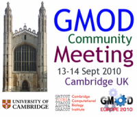

# Post Reference Genome Tools

From GMOD

Jump to: [navigation](#mw-navigation), [search](#p-search)

<table style="vertical-align: middle; border: 2px solid #A6A6BC;"
data-cellpadding="10">
<colgroup>
<col style="width: 33%" />
<col style="width: 33%" />
<col style="width: 33%" />
</colgroup>
<tbody>
<tr class="odd">
<td>

</td>
<td>

<strong>Post Reference Genome Tools 
<a href="Satellite_Meetings_-_GMOD_Europe_2010"
title="Satellite Meetings - GMOD Europe 2010">Satellite Meeting</a></strong> 
 
&#10;

<a href="September_2010_GMOD_Meeting"
title="September 2010 GMOD Meeting">September 2010 GMOD
Meeting</a> 
15 September 2010 
Cambridge, UK

</td>
<td style="text-align: center;">

<a href="GMOD_Europe_2010" title="GMOD Europe 2010">Part of GMOD Europe
2010</a>

</td>
</tr>
</tbody>
</table>

  

How are we going to visualize and exploit (or even cope with) the world
three years from now, when small labs may be able to fully sequence 500
individuals or species (or more) in a month? How can we visualize and
link together 500, 1000, or 10,000 genomes? Many existing tools assume a
reference genome. Will a reference make sense in the future, or will it
hold us back?

This was a [Satellite
Meeting](Satellite_Meetings_-_GMOD_Europe_2010 "Satellite Meetings - GMOD Europe 2010")
to the [September 2010 GMOD
Meeting](September_2010_GMOD_Meeting "September 2010 GMOD Meeting") and
was a part of [GMOD Europe 2010](GMOD_Europe_2010 "GMOD Europe 2010").
See [GMOD Europe 2010](GMOD_Europe_2010 "GMOD Europe 2010") for
information on other events.

## Contents

- [1
  Participants](#Participants)
- [2
  Summary](#Summary)
- [3
  Discussion](#Discussion)
  - [3.1
    Conceptual](#Conceptual)
    - [3.1.1 Non
      Linear Thinking](#Non_Linear_Thinking)
    - [3.1.2
      Dynamic
      Reference](#Dynamic_Reference)
  - [3.2 Towards
    Solutions](#Towards_Solutions)
    - [3.2.1
      Inspiration](#Inspiration)
- [4 See
  Also](#See_Also)

## Participants

| Participant | Affilliation(s) | URL |
|----|----|----|
| [Dave Clements](User:Clements "User:Clements") | NESCent, GMOD | <a href="http://nescent.org" class="external free"
rel="nofollow">http://nescent.org</a> <a href="http://gmod.org" class="external free"
rel="nofollow">http://gmod.org</a> |
| Fengyuan Hu | Department of Genetics, University of Cambridge |  |
| Ellen Adlem | Cambridge University Cambridge Institue of Medical Research | <a href="http://www.t1dbase.org" class="external free"
rel="nofollow">http://www.t1dbase.org</a> |
| seth redmond | Imperial College / Vectorbase |  |
| [Chris Hemmerich](User:Chemmeri "User:Chemmeri") |  | <a href="http://cgb.indiana.edu" class="external free"
rel="nofollow">http://cgb.indiana.edu</a> |
| Jerven Bolleman | UniProt Swiss-Prot |  |
| Oksana Riba Grognuz | Swiss Institute of Bioinformatics (SIB) Department of Ecology and Evolution, University of Lausanne |  |
| Kim Rutherford | Cambridge Systems Biology Centre | <a href="http://www.pombase.org/" class="external free"
rel="nofollow">http://www.pombase.org/</a> |
| Stephen Taylor | CBRG, Oxford University | <a href="http://www.cbrg.ox.ac.uk/" class="external free"
rel="nofollow">http://www.cbrg.ox.ac.uk/</a> |
| [Scott Cain](User:Scott "User:Scott") | OICR | <a href="http://gmod.org/" class="external free"
rel="nofollow">http://gmod.org/</a> |
| joan pontius | SAIC-NCI-FREDERICK Laboratory of Genomic Diversity | <a href="http://lgd.abcc.ncifcrf.gov/cgi-bin/gbrowse/cat/"
class="external free"
rel="nofollow">http://lgd.abcc.ncifcrf.gov/cgi-bin/gbrowse/cat/</a> |
| [Don Gilbert](User:Dongilbert "User:Dongilbert") | Indiana University (Don participated in a key pre-meeting discussion) | <a href="http://arthropods.eugenes.org/" class="external free"
rel="nofollow">http://arthropods.eugenes.org/</a> |

## Summary

The world is shifting away from the concept of a single reference genome
in a number of ways:

1.  For many applications we are moving to a network model ("islands of
    stability in a sea of variation") where navigation and thinking are
    likely to shift from today's linear, top-down paradigm, to a
    bottom-up, networked view. This will require tools that are
    significantly different from what we have today.
2.  Some applications will shift from the concept of a single static
    reference to a dynamically selected reference: "This is my genome of
    interest, show me how it relates to other information." This will
    not be as radical of a cognative change as the shift to a networked
    model. Tools that operate on this model may also have visualizations
    that are recognizable from today's tools, but the underlying
    algorithms and data structures will be quite different.
3.  Cutting across all areas will be the need to support data analysis
    and multi-dimensional querying embedded in tools of all kinds. The
    datasets are simply getting too big and too varied to not have
    sophisticated tools for narrowing and analyzing them.

## Discussion

The discussion went on for over three hours. It is divided into two
sections here:

[Conceptual](#Conceptual)  
How does our conceptual model of the information change in this new
world.

[Towards Solutions](#Towards_Solutions)  
Some ideas on how we might tackle this new world with software.

### Conceptual

How does our conceptual model change in this new world?

#### Non Linear Thinking

In the current model, the reference chromosome is the dominant frame of
reference. Many projects may have ESTs or contigs, but the hope is
usually to eventually map them to a reference or use them to build a
reference. This *top-down*, global frame of reference has many
advantages, not the least of which it is easy to understand.

However, in a post-reference world, it may be more useful to shift to a
*bottom-up* view of genomic data, where regions of interest are
identified and then we investigate surrounding regions. As we zoom out,
the view around the edges starts to reflect that consensus becomes more
tenuous as the region under consideration expands. One participant
described this as "a graph with islands of stability." This "islands of
stability in a sea of variation" model is closer to actual biology, and
having tools that reflect it may lead to better biology.

This model is not a radical departure from what biologists often do now.
Genomes are often navigated via BLAST or by typing in a gene or EST
name, going to the matching region, and then zooming out. What is
different is that there may not be a canonical version of the matching
region, but rather a weighted statistical view of that region across the
population, and that as you zoom out, you will start to see a non-linear
view of the matching regions.

There is already some work being done in microbial research on
*pangenomes*. Pangenomes describe the genetic complement of a set of
organisms, often a species, rather than an individual. They describe
both the core set of genetic material that exists in every studied
individual as well as the genetic material that exists in various
subsets of those individuals. Subsets can be formed by external factors
(geography), or internal factors (has this haplotype). There are many
issues with pangenomes that also exist in a post-reference paradigm: How
do you store and visualize commonality? How about differences?

How much does order matter? In this new world view, chromosomes, with
their complete ordering of everything on them, are deemphasized, and
regions where commonalities (or uniqueness) occur are emphasized in
their place. Information isn't lost: It should still be possible to
reconstruct a linear ordering for any individual for which you have
enough data. However, there is a danger in this type of amalgamation of
making conclusions about abstract genomes that would never actually
exist in nature.

#### Dynamic Reference

Another option is not to abandon the concept of a reference, but rather
make it dynamic: Users can specify "this is my genome of interest; show
me how it relates to other information." In this paradigm the frame of
reference changes to align to whatever individual the user wants to.
With this approach, reference-based tools that exist now could be used
Subject to computational tractability), but with quite different
preprocessing.

### Towards Solutions

How do these new concepts affect how we will visualize information?

We have lots genomes - can we just stack them up? One can imagine a
[Sybil](Sybil "Sybil") like display where the "reference" genome is
selected by the user and then clusters of other genomes are dynamically
ordered in the display, based on similarity to the selected reference.
This could work for a whole genome view, although summarization would be
required once the number of genomes exceeds screen resolution. The
interface could also support "please sort genomes by similarity to this
region." It would probably not be a straight sort of individual genomes,
but rather clusters of similarity.

User-driven reference selection with sorting of other genomes relative
to that, could be scaled all the way down to the sequence level. The
specific visualization and the metric of similarity might change as you
drill down, but the basic concept could stay the same.

This is an inherently linear approach. The data taken as a whole,
however, is not linear - it is a graph from which any individual's
linear genome can be reconstructed by following connections through
islands of common sequence (edges to nodes in graph parlance) that are
shared with other individuals, and through islands that are unique to
that individual.

Future visualizations may take advantage of this graph to show
relationships between different sequence regions. It may be that linear
approaches will remain popular for questions that start with "Tell me
what is similar to this," and graph based approaches for group or
population based queries.

We also need tools for specifying what subsets of individuals and
regions we want to see/use. Current tools use sequence similarity (e.g.,
BLAST) and nomenclature/orthology to select subregions. Future tools
should also support selection on a wide variety of facets in the data.
For example, "show me regions that have these *n* characteristics from
the *m* detected characteristics of the current region." Selection can
be made arbitrarily complex by seamless integration with analysis tools
such as [Galaxy](Galaxy.1 "Galaxy"), [BioMart](BioMart "BioMart"), and
[InterMine](InterMine "InterMine").

#### Inspiration

Future visualizations are not constrained by current ones, but we can
learn from them. The group also discussed the UCSC Cancer Genome
Browser, and walked through the video tutorial. There was much
discussion on gene sets, and viewing regions that have many
characteristics in common. (Might be able to use
[GBrowse_syn](GBrowse_syn.1 "GBrowse syn") code to show related
regions.) The UCSC cancer genome browser has a very useful option to
sort their "wiggleplots" according to some aspect of the sample that
each row represents, so that any trends in the heatplot for example, of
expression or chromosome rearrangements, can be more easily seen.
Imagine a TopoView glyph with the ability to reorder data.
[GBrowse](GBrowse.1 "GBrowse") might be able to do something like that
with subtracks.

One participant suggested using a
<a href="http://prezi.com" class="external text"
rel="nofollow">Prezi</a> style of navigation to move between related
regions. Another suggested gaining inspiration from current network
tools such as Cytoscape or [Pathway
Tools](Pathway_Tools.1 "Pathway Tools"). Muave, a comparative genomics
browser was also mentioned; Flickr for genomes was also suggested.
Ortholog databases such as OMA, Eggnog, ergononome, hovergen,
inparanoid, orthodb, and phylomeDB can also provide guidance. An Amazon
"people interested in this region were also interested in these regions"
model could also be adopted.

Key ideas here are network representation and navigation.

Clade databases can also provide some insights here. An excerpt from and
email from [Don Gilbert](User:Dongilbert "User:Dongilbert"):

Part of the answer likely involves clade genomics, i.e. don't peg your
new genome to one reference, but to a consensus of several related. We
do that to some effect w/ the insects / arthropods.

*Drosophila melanogaster* turns out to be a poor reference genome for
non-dipteran insects, as it has diverged quite a bit. Its extensive
functional, expt. literature is critical to understanding any genomes
that are related. Biologists need to be careful about the exceptions and
differences, and be able to identify where a single species reference
helps and where it may not, which a clade database can help with.

This is shows my approach w/
<a href="http://arthropods.eugenes.org/" class="external text"
rel="nofollow">euGenes/ Arthropod genomes</a>.

The basics are similar to Ensembl's and others in collecting related
species genes, doing orthology analysis and grouping genes with some
consensus annotation, to serve as a reference for new genomes. The
expanding collection of plant genomes are showing I think where one can
go with many related genomes, drawing on them all instead of just
*Arabidopsis* as a reference. USDA seems to be shepherding the plant
databases to work in sync. Gramene and other plant databases may be good
examples for post-reference genome informatics.

## See Also

There is a nice
<a href="http://blog.openhelix.eu/?p=5551" class="external text"
rel="nofollow">writeup of this summary</a> by Mary Mangan on the
<a href="http://blog.openhelix.eu/" class="external text"
rel="nofollow">OpenHelix blog</a>.

Retrieved from
"<http://gmod.org/mediawiki/index.php?title=Post_Reference_Genome_Tools&oldid=21990>"

[Categories](Special:Categories "Special:Categories"):

- [Meetings](Category:Meetings "Category:Meetings")
- [Comparative
  Genomics](Category:Comparative_Genomics "Category:Comparative Genomics")
- [GMOD Developers](Category:GMOD_Developers "Category:GMOD Developers")

## Navigation menu

### Namespaces

- <a
  href="http://gmod.org/mediawiki/index.php?title=Talk:Post_Reference_Genome_Tools&amp;action=edit&amp;redlink=1"
  accesskey="t"
  title="Discussion about the content page [t]">Discussion</a>

### 

### Variants

### Navigation

- [GMOD Home](Main_Page)
- [Software](GMOD_Components)
- [Categories /
  Tags](Categories)

### Documentation

- [Overview](Overview)
- [FAQs](Category:FAQ)
- [HOWTOs](Category:HOWTO)
- [Glossary](Glossary)

### Community

- [GMOD News](GMOD_News)
- [Training /
  Outreach](Training_and_Outreach)
- [Support](Support)
- [GMOD Promotion](GMOD_Promotion)
- [Meetings](Meetings)
- [Calendar](Calendar)

### Tools

- <a href="Special%3ABrowse/Post_Reference_Genome_Tools"
  rel="smw-browse">Browse properties</a>

- Last updated at 18:54 on 8 October
  2012.
<!-- - 46,919 page views. -->
- Content is available under
  <a href="http://www.gnu.org/licenses/fdl-1.3.html" class="external"
  rel="nofollow">a GNU Free Documentation License</a> unless otherwise
  noted.

<!-- -->

- [About
  GMOD](GMOD:About "GMOD:About")

<!-- -->

