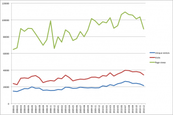

# Project Statistics

From GMOD

Jump to: [navigation](#mw-navigation), [search](#p-search)

Statistics and places to get statistics on the GMOD Project.

## Contents

- [1 Web
  Site](#Web_Site)
  - [1.1 2012
    onwards](#2012_onwards)
  - [1.2
    2007-2010](#2007-2010)
    - [1.2.1 By
      Month](#By_Month)
    - [1.2.2 By
      Year](#By_Year)
    - [1.2.3 See
      Also](#See_Also)
- [2 Sourceforge
  Statistics Pages](#Sourceforge_Statistics_Pages)
- [3
  Events](#Events)
  - [3.1
    Meetings](#Meetings)
  - [3.2 GMOD
    Schools](#GMOD_Schools)
- [4 Mailing
  Lists](#Mailing_Lists)
  - [4.1 Mailing
    List Subscriber Counts](#Mailing_List_Subscriber_Counts)
  - [4.2 Mailing
    List Volume](#Mailing_List_Volume)
- [5
  Components](#Components)
  - [5.1
    SourceForge Download
    Statistics](#SourceForge_Download_Statistics)
  - [5.2
    GBrowse](#GBrowse)
    - [5.2.1
      GBrowse 2
      Registrations](#GBrowse_2_Registrations)
  - [5.3
    Galaxy](#Galaxy)
  - [5.4 Community
    Surveys](#Community_Surveys)

## Web Site

Traffic to the GMOD website, gmod.org, has been tracked since November
2007, first through AWStats and then using Google Analytics. No data is
available for the period between January 2011 and July 2012.

  

### 2012 onwards

Website hits are now being measured using Google Analytics. Please note
that Google Analytics uses a different method of collecting results,
which is why there is such a difference between the figures from AWStats
and those from Analytics.

| Month of Year | Unique Visitors | Visits | Pageviews | New Visits |
|---------------|-----------------|--------|-----------|------------|
| 2012-07       | 23,002          | 29,339 | 51,538    | 22,968     |
| 2012-08       | 22,458          | 29,223 | 52,942    | 21,500     |
| 2012-09       | 19,466          | 25,666 | 47,188    | 18,379     |
| 2012-10       | 20,488          | 26,619 | 49,654    | 19,246     |
| 2012-11       | 20,780          | 26,903 | 49,806    | 19,560     |
| 2012-12       | 21,038          | 26,260 | 45,719    | 19,864     |
| 2013-01       | 23,935          | 30,951 | 57,497    | 22,733     |
| 2013-02       | 19,651          | 25,633 | 48,077    | 18,301     |
| 2013-03       | 23,774          | 30,854 | 54,946    | 22,293     |
| 2013-04       | 24,576          | 32,642 | 59,807    | 22,988     |
| 2013-05       | 36,437          | 44,591 | 73,733    | 34,734     |
| 2013-06       | 43,869          | 52,947 | 84,861    | 41,795     |
| 2013-07       | 37,438          | 46,963 | 81,031    | 35,194     |
| 2013-08       | 28,185          | 35,085 | 59,603    | 26,374     |
| 2013-09       | 21,790          | 27606  | 46,142    | 20,207     |
| 2013-10       | 13,173          | 15,119 | 21,501    | 12,271     |
| 2013-11       | 12,692          | 14,387 | 19,523    | 11,904     |
| 2013-12       | 14,340          | 15,922 | 20,551    | 13,663     |
| 2014-01       | 23,727          | 26,260 | 34,179    | 22,914     |
| 2014-02       | 10,186          | 12,013 | 17,172    | 9,548      |
| 2014-03       | 8,270           | 9,739  | 13,159    | 7,766      |
| 2014-04       | 15,724          | 18,408 | 26,331    | 15,049     |

### 2007-2010

Website hits were measured using AWStats during this period.

#### By Month

GMOD.org monthly visitors

AWStats does not measure new visits, but the column has been left in for
consistency.

| Month of Year | Unique Visitors | Visits | Pageviews | New Visits |
|---------------|-----------------|--------|-----------|------------|
| 2007-11\*     | 5698            | 8359   | 57353     |            |
| 2007-12       | 12998           | 19768  | 48527     |            |
| 2008-01       | 14940           | 23944  | 64760     |            |
| 2008-02       | 14393           | 22641  | 66698     |            |
| 2008-03       | 16199           | 30275  | 89799     |            |
| 2008-04       | 17942           | 30708  | 86401     |            |
| 2008-05       | 17848           | 30109  | 90081     |            |
| 2008-06       | 20012           | 32697  | 89789     |            |
| 2008-07       | 18350           | 33436  | 83218     |            |
| 2008-08       | 18491           | 30679  | 76514     |            |
| 2008-09       | 15877           | 25054  | 69782     |            |
| 2008-10       | 16109           | 26661  | 76248     |            |
| 2008-11       | 15657           | 27524  | 98984     |            |
| 2008-12       | 15716           | 27041  | 65991     |            |
| 2009-01       | 16820           | 30454  | 79953     |            |
| 2009-02       | 16616           | 29740  | 73542     |            |
| 2009-03       | 19560           | 34022  | 88291     |            |
| 2009-04       | 19343           | 31309  | 84973     |            |
| 2009-05       | 18254           | 27179  | 75503     |            |
| 2009-06       | 18364           | 28361  | 77664     |            |
| 2009-07       | 19529           | 29195  | 86180     |            |
| 2009-08       | 19017           | 28921  | 80007     |            |
| 2009-09       | 18737           | 29800  | 87966     |            |
| 2009-10       | 19068           | 31569  | 101654    |            |
| 2009-11       | 18805           | 31742  | 98863     |            |
| 2009-12       | 18952           | 30681  | 93991     |            |
| 2010-01       | 21265           | 33483  | 97861     |            |
| 2010-02       | 20518           | 32921  | 96617     |            |
| 2010-03       | 22631           | 36819  | 102694    |            |
| 2010-04       | 21494           | 32912  | 90138     |            |
| 2010-05       | 23740           | 35454  | 93229     |            |
| 2010-06       | 24654           | 37228  | 106468    |            |
| 2010-07       | 26551           | 39740  | 109516    |            |
| 2010-08       | 26016           | 39598  | 106543    |            |
| 2010-09       | 24127           | 38040  | 105814    |            |
| 2010-10       | 24318           | 38256  | 101367    |            |
| 2010-11       | 23466           | 37522  | 103603    |            |
| 2010-12       | 21490           | 34235  | 89198     |            |

\* Partial results

  

#### By Year

| Year   | Unique Visitors | Visits  | Pageviews | New Visits |
|--------|-----------------|---------|-----------|------------|
| \*2007 | \*\*            | 28127   | 105880    |            |
| 2008   | \*\*            | 340769  | 958265    |            |
| 2009   | \*\*            | 362973  | 1028587   |            |
| 2010   | \*\*            | 436208  | 1203048   |            |
| Total  | \*\*            | 1168077 | 3295780   |            |

\* Partial results

\*\* Summing unique visitors from multiple months is not meaningful.

  

#### See Also

- [Special%3APopularPages](Special%3APopularPages "Special%3APopularPages") -
  List of wiki pages, showing and ranked by number of visits.

  

## Sourceforge Statistics Pages

These show web traffic, downloads, and version control activity for the
projects.

| SourceForge Project                                                 |
|---------------------------------------------------------------------|
| <a href="https://sourceforge.net/projects/gmod/stats/timeline"      
 class="external text" rel="nofollow">GMOD</a>                        |
| <a href="https://sourceforge.net/projects/ergatis/stats/timeline"   
 class="external text" rel="nofollow">Ergatis</a>                     |
| <a href="https://sourceforge.net/projects/isga/stats/timeline"      
 class="external text" rel="nofollow">ISGA</a>                        |
| <a href="https://sourceforge.net/projects/gmod-ware/stats/timeline" 
 class="external text" rel="nofollow">Modware</a>                     |
| <a href="https://sourceforge.net/projects/sybil/stats/timeline"     
 class="external text" rel="nofollow">Sybil</a>                       |
| <a href="https://sourceforge.net/projects/turnkey/stats/timeline"   
 class="external text" rel="nofollow">Turnkey</a>                     |

## Events

### [Meetings](Meetings "Meetings")

| Date | Meeting | Registrations | Comments | Evaluation |
|----|----|----|----|----|
| 2007-11 | [November 2007 GMOD Meeting](November_2007_GMOD_Meeting "November 2007 GMOD Meeting") | 39 |  |  |
| 2008-07 | [July 2008 GMOD Meeting](July_2008_GMOD_Meeting "July 2008 GMOD Meeting") | 31 | First meeting held outside the United States, in Toronto, Canada. |  |
| 2009-01 | [January 2009 GMOD Meeting](January_2009_GMOD_Meeting "January 2009 GMOD Meeting") | 57 | At meeting room capacity. | [Feedback](January_2009_GMOD_Meeting#Feedback "January 2009 GMOD Meeting") |
| 2009-08 | [August 2009 GMOD Meeting](August_2009_GMOD_Meeting "August 2009 GMOD Meeting") | 45 | First meeting held outside North America, in Oxford, UK. | [Feedback](August_2009_GMOD_Meeting#Feedback "August 2009 GMOD Meeting") |
| 2010-01 | [January 2010 GMOD Meeting](January_2010_GMOD_Meeting "January 2010 GMOD Meeting") | 46 | Held after [PAG 2010](PAG_2010 "PAG 2010") | [Feedback](January_2010_GMOD_Meeting#Feedback "January 2010 GMOD Meeting") |
| 2010-09 | [September 2010 GMOD Meeting](September_2010_GMOD_Meeting "September 2010 GMOD Meeting") | 42 | Second meeting held outside North America, in Cambridge, UK, as part of [GMOD Europe 2010](GMOD_Europe_2010 "GMOD Europe 2010"), which included 3 other events. *Total attendance at GMOD Europe 2010 was approximately 60 people.* | [Feedback](September_2010_GMOD_Meeting#Feedback "September 2010 GMOD Meeting") |
| 2011-03 | [March 2011 GMOD Meeting](March_2011_GMOD_Meeting "March 2011 GMOD Meeting") | 31 | At <a href="http://nescent.org/" class="external text"
rel="nofollow">NESCent</a>, as part of [GMOD Americas 2011](GMOD_Americas_2011 "GMOD Americas 2011"), which included 3 other events. *Total attendance at GMOD Americas 2011 was 55 people.* | [Feedback](March_2011_GMOD_Meeting#Feedback "March 2011 GMOD Meeting") |
| 2011-10 | [October 2011 GMOD Meeting](October_2011_GMOD_Meeting "October 2011 GMOD Meeting") | 40 (at capacity) | At the <a href="http://oicr.on.ca/" class="external text"
rel="nofollow">Ontario Institute for Cancer Research (OICR)</a>. |  |
| 2012-04 | [April 2012 GMOD Meeting](April_2012_GMOD_Meeting "April 2012 GMOD Meeting") | 81 | Washington DC |  |
| 2013-04 | [April 2013 GMOD Meeting](April_2013_GMOD_Meeting "April 2013 GMOD Meeting") | tba | Cambridge, UK |  |
| 2014-01 | [Jan 2014 GMOD Meeting](Jan_2014_GMOD_Meeting "Jan 2014 GMOD Meeting") | 35 | San Diego, USA |  |

### [GMOD Schools](GMOD_Schools "GMOD Schools")

<table class="wikitable R" style="width:100%;">
<colgroup>
<col style="width: 10%" />
<col style="width: 10%" />
<col style="width: 10%" />
<col style="width: 10%" />
<col style="width: 10%" />
<col style="width: 10%" />
<col style="width: 10%" />
<col style="width: 10%" />
<col style="width: 10%" />
<col style="width: 10%" />
</colgroup>
<thead>
<tr class="header">
<th>School</th>
<th>Days</th>
<th>Location</th>
<th>Components</th>
<th>Instructors</th>
<th>Applications</th>
<th>Participants</th>
<th>Men</th>
<th>Women</th>
<th>Geography</th>
</tr>
</thead>
<tbody>
<tr class="odd">
<td><a href="2008_GMOD_Summer_School"
title="2008 GMOD Summer School">2008 GMOD Summer School</a>
first school ever offered</td>
<td>2.5</td>
<td><a href="http://nescent.org" class="external text"
rel="nofollow">NESCent</a></td>
<td>5</td>
<td>4</td>
<td>29</td>
<td>25</td>
<td>20</td>
<td>5</td>
<td>from 15 states and 4 countries</td>
</tr>
<tr class="even">
<td><a href="2009_GMOD_Summer_School_-_Americas"
title="2009 GMOD Summer School - Americas">2009 GMOD Summer School -
Americas</a></td>
<td>4.0</td>
<td><a href="http://nescent.org" class="external text"
rel="nofollow">NESCent</a></td>
<td>8</td>
<td>9</td>
<td>52</td>
<td>25</td>
<td>21</td>
<td>4</td>
<td>from 15 states and 4 countries, including India and Brazil.</td>
</tr>
<tr class="odd">
<td><a href="2009_GMOD_Summer_School_-_Europe"
title="2009 GMOD Summer School - Europe">2009 GMOD Summer School -
Europe</a>
First school outside of NESCent.</td>
<td>3.5</td>
<td>University of Oxford</td>
<td>7</td>
<td>10</td>
<td>58</td>
<td>25</td>
<td>20</td>
<td>5</td>
<td>from 9 countries, including Kenya and Macau; instructors from 3
countries</td>
</tr>
<tr class="even">
<td><a href="2010_GMOD_Summer_School_-_Americas"
title="2010 GMOD Summer School - Americas">2010 GMOD Summer School -
Americas</a></td>
<td>4.0</td>
<td><a href="http://nescent.org" class="external text"
rel="nofollow">NESCent</a></td>
<td>8</td>
<td>8</td>
<td>62</td>
<td>25</td>
<td>17</td>
<td>8</td>
<td>from 16 states and 4 countries, including Ireland and Spain.</td>
</tr>
<tr class="odd">
<td><a href="2011_GMOD_Spring_Training"
title="2011 GMOD Spring Training">2011 GMOD Spring Training</a></td>
<td>5.0</td>
<td><a href="http://nescent.org" class="external text"
rel="nofollow">NEScent</a></td>
<td>10</td>
<td>8</td>
<td>55</td>
<td>25</td>
<td>20</td>
<td>5</td>
<td>from 13 states and 4 countries, including South Africa and
Portugal.</td>
</tr>
<tr class="even">
<td><a href="2012_GMOD_Summer_School"
title="2012 GMOD Summer School">2012 GMOD Summer School</a></td>
<td>5.0</td>
<td><a href="http://nescent.org" class="external text"
rel="nofollow">NEScent</a></td>
<td>10</td>
<td>8</td>
<td>28</td>
<td>18</td>
<td>14</td>
<td>4</td>
<td>from 7 states and 5 countries, including the UK, India, and the
Phillipines</td>
</tr>
<tr class="odd">
<td><a href="2013_GMOD_Summer_School"
title="2013 GMOD Summer School">2013 GMOD Summer School</a></td>
<td>5.0</td>
<td><a href="http://nescent.org" class="external text"
rel="nofollow">NEScent</a></td>
<td>10</td>
<td>8</td>
<td>42</td>
<td>24</td>
<td>14</td>
<td>10</td>
<td>from 14 states and 5 countries, including Brazil, India, Spain, and
Switzerland</td>
</tr>
<tr class="even">
<td><a href="GMOD_Malaysia_2014.1" title="GMOD Malaysia 2014">GMOD
Malaysia 2014</a></td>
<td>3.0</td>
<td>Kuala Lumpur, Malaysia</td>
<td>11</td>
<td>4</td>
<td>41</td>
<td>21</td>
<td>14</td>
<td>7</td>
<td>all over Malaysia, Japan</td>
</tr>
</tbody>
</table>

## Mailing Lists

[GMOD Mailing Lists](GMOD_Mailing_Lists "GMOD Mailing Lists") are hosted
all over the place. Since June of 2010, there is a single Nabble Archive
for all GMOD lists, but before that the archives, like the lists, are
spread out all over. Therefore, getting a comprehensive picture of email
traffic and subscribers is very difficult. For any lists hosted at
Sourceforge, email traffic numbers are available on a monthly or even
daily basis. For other lists, this can be harder to come by.

Subscriber counts are even more problematic. The number of subscribers
over time is not archived by mailing list software, and the number of
subscribers currently on a list is often only available to the list
admin. Therefore we only have subscriber counts for a limited number of
lists, and only for the time points that we actually bothered to record
the numbers.

See also [Components](#Components) below.

### [Mailing List](GMOD_Mailing_Lists "GMOD Mailing Lists") Subscriber Counts

Numbers are only shown for lists where we have access to this
information.

| List | 2008/02 | 2009/08 | 2010/12 | Description |
|----|----|----|----|----|
| gmod-ajax | 49 | 89 | 143 | javascript interfaces for GMOD centered around [JBrowse](JBrowse.1 "JBrowse") |
| gmod-announce | 126 | 152 | 174 | A moderated, low traffic list for announcements of meetings and software release |
| gmod-architecture | 55 | 69 | 78 | mailing list for the architecture working group |
| gmod-cmap | 57 | 72 | 80 | Discussion of the CMAP comparative map viewer |
| gmod-devel | 127 | 153 | 166 | GMOD developer's mailing list |
| gmod-gbrowse | 210 | 333 | 442 | Discussion of GBrowse |
| gmod-schema | 148 | 194 | 213 | For discussion of Chado |
| ergatis-announce |  | 16 | 18 | general Ergatis announcements |
| ergatis-devel |  | 22 | 23 | <a href="Ergatis" class="mw-redirect" title="Ergatis">Ergatis</a> developer communication |
| ergatis-users |  | 24 | 36 | Ergatis user communication and general help |
| isga-users |  |  | 9 | [ISGA](ISGA "ISGA") user communication and general help |
| gmod-ware-users |  |  | 15 | [Modware](Modware "Modware") user communication and general help |
| sybil-info |  |  | 8 | [Sybil](Sybil "Sybil") user communication and general help |
| turnkey-devel |  |  | 15 | [Turnkey](Turnkey "Turnkey") development |
| turnkey-users |  |  | 10 | [Turnkey](Turnkey "Turnkey") user list |
| gmod-cogephy |  |  | 0 | Comparative genomics, phylogeny and related topics. Created in 2010/12 |
| gmod-phendiver |  |  | 0 | Phenotype, natural diversity and related topics. Created in 2010/12 |
| galaxy-user |  |  | 1681 | Support list for users of the Galaxy public server. *Note: The 2010/12 numbers are from 2011/01.* |
| galaxy-dev |  |  | 280 | Support list for Galaxy developers and those deploying Galaxy locally. *Note: The 2010/12 numbers are from 2011/01.* |

### Mailing List Volume

Postings per month is readily available for any mailing list hosted by
Sourceforge. And, at some point, we should summarize that information
here. Raw data is available as [GMOD Mailing List
Statistics](GMOD_Mailing_List_Statistics "GMOD Mailing List Statistics").

## Components

- [Components Section
  summary](2008_GMOD_Community_Survey#GMOD_Components "2008 GMOD Community Survey")
  and <a href="../extras/2008GMODCommunitySurvey.html#GMOD_Components"
  class="external text" rel="nofollow">details</a> of the [2008 GMOD
  Community
  Survey](2008_GMOD_Community_Survey "2008 GMOD Community Survey"). This
  covers all components.

<!-- -->

- The [2009 GMOD Community
  Survey](2009_GMOD_Community_Survey "2009 GMOD Community Survey") has
  some numbers on components for genome and comparative genomics
  visualization.

### SourceForge Download Statistics

Download statistics are available for projects hosted on the GMOD
SourceForge page. See [SourceForge Download
Statistics](SourceForge_Download_Statistics "SourceForge Download Statistics")
for the raw data.

  

### [GBrowse](GBrowse.1 "GBrowse")

#### GBrowse 2 Registrations

When users install GBrowse2, they are given the option of reporting
their registration, resulting in an email to GMOD project staff. Since
the registration was turned on January 27, 2010, through November 4 (9
months), we've received 1832 registrations, 656 of which are from unique
hosts. This comes to 203 registrations per month total, 72
registrations/mo on unique hosts. The true number of installations is
higher, because people can choose not to send in registrations.

### [Galaxy](Galaxy.1 "Galaxy")

See the
<a href="http://galaxyproject.org/wiki/Galaxy%20Project/Statistics"
class="external text" rel="nofollow">Galaxy Project Statistics</a> page.

  

### Community Surveys

- <a href="../answers-1.html" class="external text" rel="nofollow">2013
  GMOD Survey</a> - Survey of the GMOD community, covering a wide range
  of topics.
- [2009 GMOD Community
  Survey](2009_GMOD_Community_Survey "2009 GMOD Community Survey")
- [2008 GMOD Community
  Survey](2008_GMOD_Community_Survey "2008 GMOD Community Survey") - A
  treasure trove of information about the GMOD community in late 2008.

Retrieved from
"<http://gmod.org/mediawiki/index.php?title=Project_Statistics&oldid=25709>"

[Categories](Special%3ACategories "Special%3ACategories"):

- [GMOD Project](Category%3AGMOD_Project "Category%3AGMOD Project")
- [GMOD Web Site](Category%3AGMOD_Web_Site "Category%3AGMOD Web Site")

## Navigation menu

### Namespaces

- <a
  href="http://gmod.org/mediawiki/index.php?title=Talk:Project_Statistics&amp;action=edit&amp;redlink=1"
  accesskey="t"
  title="Discussion about the content page [t]">Discussion</a>

### 

### Variants

### Navigation

- [GMOD Home](Main_Page)
- [Software](GMOD_Components)
- [Categories /
  Tags](Categories)

### Documentation

- [Overview](Overview)
- [FAQs](Category%3AFAQ)
- [HOWTOs](Category%3AHOWTO)
- [Glossary](Glossary)

### Community

- [GMOD News](GMOD_News)
- [Training /
  Outreach](Training_and_Outreach)
- [Support](Support)
- [GMOD Promotion](GMOD_Promotion)
- [Meetings](Meetings)
- [Calendar](Calendar)

### Tools

- <a href="Special%3ABrowse/Project_Statistics" rel="smw-browse">Browse
  properties</a>

- Last updated at 18:39 on 2 May
  2014.
<!-- - 174,234 page views. -->
- Content is available under
  <a href="http://www.gnu.org/licenses/fdl-1.3.html" class="external"
  rel="nofollow">a GNU Free Documentation License</a> unless otherwise
  noted.

<!-- -->

- [About
  GMOD](GMOD%3AAbout "GMOD%3AAbout")

<!-- -->

