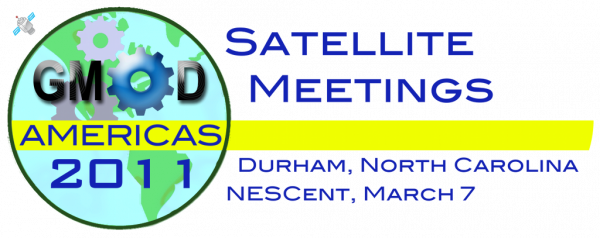

# Satellite Meetings - GMOD Americas 2011

From GMOD

Jump to: [navigation](#mw-navigation), [search](#p-search)

  

  
The [March 2011 GMOD
Meeting](March_2011_GMOD_Meeting "March 2011 GMOD Meeting") will be
followed with a day of *Satellite Meetings.* Satellite meetings are
birds-of-a-feather gatherings at [GMOD
events](Category:Events "Category:Events") where community members with
common interests gather for part or all of a day to discuss and work on
a topic of interest to them. This is the third event that will have
satellite meetings.

## Contents

- [1
  Topics](#Topics)
- [2 Previous
  Topics](#Previous_Topics)
- [3 About
  GMOD](#About_GMOD)
- [4 Help Get the
  Word Out](#Help_Get_the_Word_Out)

## Topics

Topics for satellites are put forward by community members and GMOD
staff. If you have a topic you would like to suggest please add it to
the list below. This list will become more solid the week before the
event, but topics will also likely be added during the [March 2011 GMOD
Meeting](March_2011_GMOD_Meeting "March 2011 GMOD Meeting").

| Topic | Proposers and/or Organizers | Time | Comments |
|----|----|----|----|
| [GMOD Evo Hackathon Followup](GMOD_Evo_Hackathon#March_2011_Satellite "GMOD Evo Hackathon") | [Duke Leto](User:Dukeleto "User:Dukeleto") | TBD | [Followup meeting](GMOD_Evo_Hackathon#March_2011_Satellite "GMOD Evo Hackathon") to the [GMOD Evo Hackathon](GMOD_Evo_Hackathon "GMOD Evo Hackathon") held at NESCent in November 2011. |
| [Extending Embedding and Customizing JBrowse](Extending_Embedding_and_Customizing_JBrowse "Extending Embedding and Customizing JBrowse") | [Mitch Skinner](User:MitchSkinner "User:MitchSkinner") | TBD | [JBrowse](JBrowse.1 "JBrowse") has a few different extension points, but they're not (yet) well-documented or widely used. The GMOD meeting would be a good time to review those [APIs](Glossary#API "Glossary"), relate them to the things that people want to do with them, discuss any potential changes or new APIs to support specific use cases, and potentially start to implement an extension. |
| [GMOD Web services toolkit](GMOD_RPC_API "GMOD RPC API") | [Josh Goodman](User:Jogoodma "User:Jogoodma") | Cancelled | ~~Come to work on or discuss the [GMOD Web services API and the toolkit](GMOD_RPC_API "GMOD RPC API").~~ |
| [GMOD in the Sequencing Center](GMOD_in_the_Sequencing_Center "GMOD in the Sequencing Center") | [Chris Hemmerich](User:Chemmeri "User:Chemmeri"), [Dave Clements](User:Clements "User:Clements") | TBD | Sequencing centers have tremendous bioinformatics needs that GMOD can help address. Attend this satellite to find out what other sequencing centers are doing with GMOD, and how GMOD can help you help your researchers. |

## Previous Topics

Previous satellite topics include:

- *[Post Reference Genome
  Tools](Post_Reference_Genome_Tools "Post Reference Genome Tools")* at
  [GMOD Europe 2010](GMOD_Europe_2010 "GMOD Europe 2010")
- *[Community
  Annotation](Community_Annotation_-_September_2010_Satellite "Community Annotation - September 2010 Satellite")*
  at [GMOD Europe 2010](GMOD_Europe_2010 "GMOD Europe 2010")
- *[GMOD REST Hackathon](GMOD_REST_Hackathon "GMOD REST Hackathon")* at
  the [January 2010 GMOD
  Meeting](January_2010_GMOD_Meeting "January 2010 GMOD Meeting")
- *<a href="http://www.bioperl.org/wiki/GMOD_2010_Meeting" class="extiw"
  title="bp:GMOD 2010 Meeting">BioPerl</a>* at the [January 2010 GMOD
  Meeting](January_2010_GMOD_Meeting "January 2010 GMOD Meeting")
- *[Tripal Working Group](Tripal_Working_Group "Tripal Working Group")*
  at the [January 2010 GMOD
  Meeting](January_2010_GMOD_Meeting "January 2010 GMOD Meeting")
- *[Chado Natural Diversity Module Working
  Group](Chado_Natural_Diversity_Module_Working_Group "Chado Natural Diversity Module Working Group")* -
  at the [January 2010 GMOD
  Meeting](January_2010_GMOD_Meeting "January 2010 GMOD Meeting")

## About GMOD

**GMOD** is the Generic Model Organism Database project, a collection of
interoperable open-source [software
components](GMOD_Components "GMOD Components") for annotating,
visualizing, managing and analyzing biological data. GMOD is also an
active community of software developers and biologists addressing common
challenges with their data.

The GMOD suite includes widely used tools such as
[GBrowse](GBrowse.1 "GBrowse") and [JBrowse](JBrowse.1 "JBrowse") (and
[WebGBrowse](WebGBrowse.1 "WebGBrowse")) for genome browsing,
[Apollo](Apollo.1 "Apollo") and [MAKER](MAKER.1 "MAKER") for genome
annotation, [GBrowse_syn](GBrowse_syn.1 "GBrowse syn") and
[CMap](CMap.1 "CMap") for comparative genomics visualization,
<a href="Chado" class="mw-redirect" title="Chado">Chado</a>,
[BioMart](BioMart "BioMart") and [InterMine](InterMine "InterMine") for
data integration, management, and querying, and
[Galaxy](Galaxy.1 "Galaxy") and
<a href="Ergatis" class="mw-redirect" title="Ergatis">Ergatis</a> (and
[ISGA](ISGA "ISGA")) for data analysis.

## Help Get the Word Out

<table>
<colgroup>
<col style="width: 50%" />
<col style="width: 50%" />
</colgroup>
<tbody>
<tr class="odd">
<td data-valign="top">Help spread the word about <a
href="GMOD_Americas_2011" title="GMOD Americas 2011">GMOD Americas
2011</a> events by posting and distributing <a
href="File:GMODAmericas2011Flier.pdf"
title="File:GMODAmericas2011Flier.pdf">this flier</a>, or the <a
href="News/March_2011_GMOD_Meeting"
title="News/March 2011 GMOD Meeting">event announcements</a> to your
communities, mailing lists, and organizations.

There are many organizations out there that are struggling to cope
with the volume of data that have and will continue to get in the
future. GMOD is an excellent option for helping these groups get a grip
on and exploit their data.
</td>
<td></td>
</tr>
</tbody>
</table>

Retrieved from
"<http://gmod.org/mediawiki/index.php?title=Satellite_Meetings_-_GMOD_Americas_2011&oldid=21993>"

## Navigation menu

### Namespaces

- <a href="Satellite_Meetings_-_GMOD_Americas_2011" accesskey="c"
  title="View the content page [c]">Page</a>
- <a
  href="http://gmod.org/mediawiki/index.php?title=Talk:Satellite_Meetings_-_GMOD_Americas_2011&amp;action=edit&amp;redlink=1"
  accesskey="t"
  title="Discussion about the content page [t]">Discussion</a>

### 

### Variants

### Search

### Navigation

- [GMOD Home](Main_Page)
- [Software](GMOD_Components)
- [Categories /
  Tags](Categories)
- [View all pages](Special:AllPages)

### Documentation

- [Overview](Overview)
- [FAQs](Category:FAQ)
- [HOWTOs](Category:HOWTO)
- [Glossary](Glossary)

### Community

- [GMOD News](GMOD_News)
- [Training /
  Outreach](Training_and_Outreach)
- [Support](Support)
- [GMOD Promotion](GMOD_Promotion)
- [Meetings](Meetings)
- [Calendar](Calendar)

### Tools

- <a href="Special:WhatLinksHere/Satellite_Meetings_-_GMOD_Americas_2011"
  accesskey="j" title="A list of all wiki pages that link here [j]">What
  links here</a>
- <a
  href="Special:RecentChangesLinked/Satellite_Meetings_-_GMOD_Americas_2011"
  accesskey="k"
  title="Recent changes in pages linked from this page [k]">Related
  changes</a>
- <a href="Special:SpecialPages" accesskey="q"
  title="A list of all special pages [q]">Special pages</a>
- <a
  href="http://gmod.org/mediawiki/index.php?title=Satellite_Meetings_-_GMOD_Americas_2011&amp;printable=yes"
  rel="alternate" accesskey="p"
  title="Printable version of this page [p]">Printable version</a>
- [Permanent
  link](http://gmod.org/mediawiki/index.php?title=Satellite_Meetings_-_GMOD_Americas_2011&oldid=21993 "Permanent link to this revision of the page")
- [Page
  information](http://gmod.org/mediawiki/index.php?title=Satellite_Meetings_-_GMOD_Americas_2011&action=info)
- <a href="Special:Browse/Satellite_Meetings_-2D_GMOD_Americas_2011"
  rel="smw-browse">Browse properties</a>
- [Print as
  PDF](http://gmod.org/mediawiki/index.php?title=Special:PdfPrint&page=Satellite_Meetings_-_GMOD_Americas_2011)

- Last updated at 18:55 on 8 October
  2012.
- 74,047 page views.
- Content is available under
  <a href="http://www.gnu.org/licenses/fdl-1.3.html" class="external"
  rel="nofollow">a GNU Free Documentation License</a> unless otherwise
  noted.

<!-- -->

- [About
  GMOD](GMOD:About "GMOD:About")

<!-- -->

- 
- 
  

