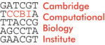

# Satellite Meetings - GMOD Europe 2010

From GMOD

Jump to: [navigation](#mw-navigation), [search](#p-search)

<table style="vertical-align: middle; border: 2px solid #A6A6BC;"
data-cellpadding="10">
<colgroup>
<col style="width: 33%" />
<col style="width: 33%" />
<col style="width: 33%" />
</colgroup>
<tbody>
<tr class="odd">
<td></td>
<td>

<strong>Satellite Meetings</strong> 
&#10;

<ul>
<li><a href="Post_Reference_Genome_Tools"
title="Post Reference Genome Tools">Post Reference Genome Tools</a></li>
<li><a href="Community_Annotation_-_September_2010_Satellite"
title="Community Annotation - September 2010 Satellite">Community
Annotation</a></li>
</ul>
 
<a href="September_2010_GMOD_Meeting"
title="September 2010 GMOD Meeting">September 2010 GMOD
Meeting</a> 
15 September 2010 
Cambridge, UK

</td>
<td style="text-align: center;">

<a href="GMOD_Europe_2010" title="GMOD Europe 2010">Part of GMOD Europe
2010</a>

</td>
</tr>
</tbody>
</table>

  

  
The [Satellite
Meetings](January_2010_GMOD_Meeting#Satellite_Meetings "January 2010 GMOD Meeting")
at the [January 2010 GMOD
Meeting](January_2010_GMOD_Meeting "January 2010 GMOD Meeting") proved
so popular that we decided to hold them again.

  

## Contents

- [1 Satellite
  Topics](#Satellite_Topics)
- [2
  Participants](#Participants)
- [3
  Sponsors](#Sponsors)
- [4 Lodging and
  Other Logistics](#Lodging_and_Other_Logistics)
- [5
  Registration](#Registration)

## Satellite Topics

We discussed

- *[Post Reference Genome
  Tools](Post_Reference_Genome_Tools "Post Reference Genome Tools")* in
  the morning session, and
- *[Community
  Annotation](Community_Annotation_-_September_2010_Satellite "Community Annotation - September 2010 Satellite")*
  in the afternoon.

There is a nice
<a href="http://blog.openhelix.eu/?p=5551" class="external text"
rel="nofollow">writeup of these summaries</a> by Mary Mangan on the
<a href="http://blog.openhelix.eu/" class="external text"
rel="nofollow">OpenHelix blog</a>.

## Participants

| Participant | Affilliation(s) | URL |
|----|----|----|
| [Dave Clements](User:Clements "User:Clements") | NESCent, GMOD | <a href="http://nescent.org" class="external free"
rel="nofollow">http://nescent.org</a> <a href="http://gmod.org" class="external free"
rel="nofollow">http://gmod.org</a> |
| Fengyuan Hu | Department of Genetics, University of Cambridge |  |
| Ellen Adlem | Cambridge University Cambridge Institue of Medical Research | <a href="http://www.t1dbase.org" class="external free"
rel="nofollow">http://www.t1dbase.org</a> |
| seth redmond | Imperial College / Vectorbase |  |
| [Chris Hemmerich](User:Chemmeri "User:Chemmeri") |  | <a href="http://cgb.indiana.edu" class="external free"
rel="nofollow">http://cgb.indiana.edu</a> |
| Jerven Bolleman | UniProt Swiss-Prot |  |
| Oksana Riba Grognuz | Swiss Institute of Bioinformatics (SIB) Department of Ecology and Evolution, University of Lausanne |  |
| Kim Rutherford | Cambridge Systems Biology Centre | <a href="http://www.pombase.org/" class="external free"
rel="nofollow">http://www.pombase.org/</a> |
| Stephen Taylor | CBRG, Oxford University | <a href="http://www.cbrg.ox.ac.uk/" class="external free"
rel="nofollow">http://www.cbrg.ox.ac.uk/</a> |
| [Scott Cain](User:Scott "User:Scott") | OICR | <a href="http://gmod.org/" class="external free"
rel="nofollow">http://gmod.org/</a> |
| Gerd Anders | Public research institute: Max-Delbrueck-Centrum Berlin (MDC), Researcher and database developer | <a
href="http://www.mdc-berlin.de/en/research/core_facilities/cf_massspectromety_bimsb/teammember/index.html"
class="external free"
rel="nofollow">http://www.mdc-berlin.de/en/research/core_facilities/cf_massspectromety_bimsb/teammember/index.html</a> <a
href="http://www.mdc-berlin.de/en/research/core_facilities/cf_bioinformatic/teammember/index.html"
class="external free"
rel="nofollow">http://www.mdc-berlin.de/en/research/core_facilities/cf_bioinformatic/teammember/index.html</a> |

## Sponsors

This event was sponsored by the
<a href="http://www.ccbi.cam.ac.uk/" class="external text"
rel="nofollow">Cambridge Computational Biology Institute</a> and the <a
href="http://www.biomed.cam.ac.uk/gradschool/skills/bioinformatics.html"
class="external text" rel="nofollow">School of Biological Sciences
Bioinformatics Training Facility</a>. The
<a href="http://www.ccbi.cam.ac.uk/" class="external text"
rel="nofollow">CCBI</a> is set up to bring together the unique strengths
of Cambridge in medicine, biology, mathematics and the physical
sciences. Its aim is to create a centre of excellence in research and
teaching and to promote collaborations both within the Cambridge area
and beyond. The <a
href="http://www.biomed.cam.ac.uk/gradschool/skills/bioinformatics.html"
class="external text" rel="nofollow">Bioinformatics Training
Facility</a> organises practical training for both undergraduates and
postgraduates. The vast majority of their <a
href="http://www.biomed.cam.ac.uk/gradschool/skills/bioinformatics.html"
class="external text" rel="nofollow">postgraduate events</a> are open
and free to all who might benefit.

CCBI provided copious organizational and logistical support for this
event. The Bioinformatics Training Facility is generously providing all
coffee, tea, and break snacks at no charge. Please thank Gos Micklem,
[Richard Smith](User:Rsmith "User:Rsmith"), Shelley Lawson, and Dave
Judge profusely every time you see them.

## Lodging and Other Logistics

See the [Logistics
section](GMOD_Europe_2010#Logistics "GMOD Europe 2010") on the GMOD
Europe 2010 page for information.

## Registration

Registration was free, but required, as space was limited.

Retrieved from
"<http://gmod.org/mediawiki/index.php?title=Satellite_Meetings_-_GMOD_Europe_2010&oldid=21994>"

[Category](Special:Categories "Special:Categories"):

- [Meetings](Category:Meetings "Category:Meetings")

## Navigation menu

### Namespaces

- <a href="Satellite_Meetings_-_GMOD_Europe_2010" accesskey="c"
  title="View the content page [c]">Page</a>
- <a
  href="http://gmod.org/mediawiki/index.php?title=Talk:Satellite_Meetings_-_GMOD_Europe_2010&amp;action=edit&amp;redlink=1"
  accesskey="t"
  title="Discussion about the content page [t]">Discussion</a>

### 

### Variants

### Navigation

- [GMOD Home](Main_Page)
- [Software](GMOD_Components)
- [Categories /
  Tags](Categories)
- [View all pages](Special:AllPages)

### Documentation

- [Overview](Overview)
- [FAQs](Category:FAQ)
- [HOWTOs](Category:HOWTO)
- [Glossary](Glossary)

### Community

- [GMOD News](GMOD_News)
- [Training /
  Outreach](Training_and_Outreach)
- [Support](Support)
- [GMOD Promotion](GMOD_Promotion)
- [Meetings](Meetings)
- [Calendar](Calendar)

### Tools

- <a href="Special:Browse/Satellite_Meetings_-2D_GMOD_Europe_2010"
  rel="smw-browse">Browse properties</a>
- [Print as
  PDF](http://gmod.org/mediawiki/index.php?title=Special:PdfPrint&page=Satellite_Meetings_-_GMOD_Europe_2010)

- Last updated at 18:55 on 8 October
  2012.
- 82,572 page views.
- Content is available under
  <a href="http://www.gnu.org/licenses/fdl-1.3.html" class="external"
  rel="nofollow">a GNU Free Documentation License</a> unless otherwise
  noted.

<!-- -->

- [About
  GMOD](GMOD:About "GMOD:About")

<!-- -->

- 
- 
  

