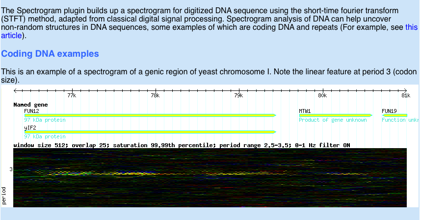
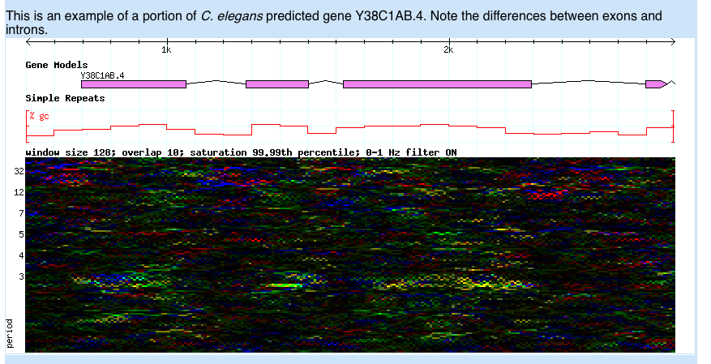
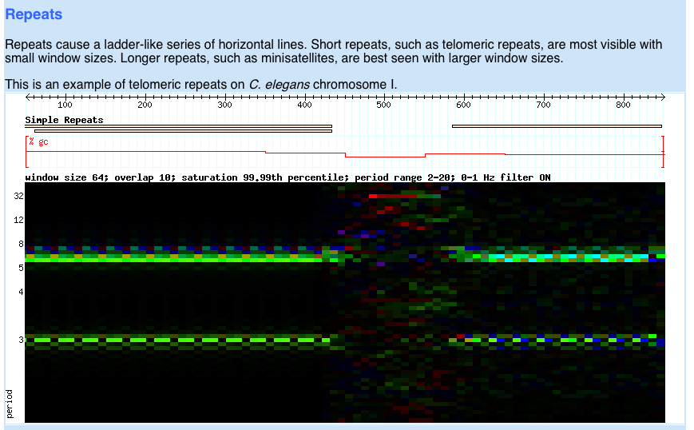

# Spectrogram.pm

From GMOD

Jump to: [navigation](#mw-navigation), [search](#p-search)

Spectrogram.pm is a [GBrowse](GBrowse.1 "GBrowse") plugin written by
[Sheldon McKay](User:Mckays "User:Mckays"). It draws DNA spectrograms of
DNA of digitized DNA sequences using techniques borrowed from the
digital signal processing world. Graphical rendering is accomplished
using the HSV color space. The color of the spot on the spectrogram
corresponds to the dominant nucleotide at that "frequency" and position
and the intensity corresponds to the strength of the signal. DNA
spectrograms reveal non-random sequence composition, the two most common
examples of which are coding DNA and repeat sequences.

- Coding DNA has a signal due the the non-random occurence of
  nulceotides in codons and appear as a line in the spectrogram with a
  period of 3.
- Repeats have a characteristic ladder like appearance in the
  spectrogram.
- Follow this link for
  <a href="http://www.hindawi.com/journals/asp/2004/790248.abs.html"
  class="external text" rel="nofollow">background reading of digital
  signal processing of DNA</a>

  

## How is the DNA spectrogram calculated?

A sliding window of variable size and overlap is used to calculate the
spectrogram, which is displayed graphically as a track in the genome
browser. Each window is a subsegment of DNA and corresponds to a
'column' in the graphical display of the spectrogram. The window slides
along the sequence, from left to right, at a set increment, which
corresponds to the column width.

The spectrogram refers collectively to all of the rows and columns seen
in the graphical display.

The spectrogram has n rows, where n is the number of bases in the
window. Each row corresponds to a discrete 'frequency' from 0 -\> n-1.

An arguably more intuitive way to relate this to DNA sequence to
calculate the 'period' (n/frequency\*2). If we see a feature in the
spectrogram at period x, there is a non-random structure with a
periodicity of x nucleotides. The chief example of this would be coding
DNA at period 3.

The DNA sequence is converted from analog to digital by creating four
binary indicator sequences:

              G A T C C T C T G A T T C C A A
            G 1 0 0 0 0 0 0 0 1 0 0 0 0 0 0 0
            A 0 1 0 0 0 0 0 0 0 1 0 0 0 0 1 1
            T 0 0 1 0 0 1 0 1 0 0 1 1 0 0 0 0
            C 0 0 0 1 1 0 1 0 0 0 0 0 1 1 0 0

  
The magnitude of the discrete fourier transform (DFT) is calculated
seperately for each of the four indicator sequences. The algorithm used
is the fast fourier transfrom (FFT; via Math::FFT), which is much faster
than the original DFT algorithm but is limited in that only base2
numbers (128, 256, 512, etc) can be used for window sizes. This is
necessary to make the spectrogram calculation fast enough for real-time
use.

For graphical rendering, each transformed sequence is assigned a color
(A=blue; T=red; C=green; G=yellow). The colors for each base are
superimposed on the image. In a given spot on the spectrogram, the
brightness corresponds to the magnitide (signal intensity) and the color
corresponds to the dominant base at that frequency/period. If no single
base predominates, an intermediate color is calculated based on the
relative magnitudes.

The spectrogram is visible as a track in the generic genome browser.
Please note that the calculations and graphical rendering are
computationally intensive, so the image will take a while to load,
especially with larger sequence regions and/or small increments for the
sliding window.

After you have launched this plugin, the spectrogram will continue to be
calculated in the main gbrowse display until you turn off the
'Spectrogram' track.

The plugin was written by Sheldon McKay (mckays@cshl.edu)

Retrieved from
"<http://gmod.org/mediawiki/index.php?title=Spectrogram.pm&oldid=17658>"

[Categories](Special:Categories "Special:Categories"):

- [GBrowse](Category:GBrowse "Category:GBrowse")
- [GBrowse Plugins](Category:GBrowse_Plugins "Category:GBrowse Plugins")
- [Pages with problems or
  questions](Category:Pages_with_problems_or_questions "Category:Pages with problems or questions")

## Navigation menu

### Namespaces

- <a href="Spectrogram.pm" accesskey="c"
  title="View the content page [c]">Page</a>
- <a
  href="http://gmod.org/mediawiki/index.php?title=Talk:Spectrogram.pm&amp;action=edit&amp;redlink=1"
  accesskey="t"
  title="Discussion about the content page [t]">Discussion</a>

### 

### Variants

### Navigation

- [GMOD Home](Main_Page)
- [Software](GMOD_Components)
- [Categories /
  Tags](Categories)
- [View all pages](Special:AllPages)

### Documentation

- [Overview](Overview)
- [FAQs](Category:FAQ)
- [HOWTOs](Category:HOWTO)
- [Glossary](Glossary)

### Community

- [GMOD News](GMOD_News)
- [Training /
  Outreach](Training_and_Outreach)
- [Support](Support)
- [GMOD Promotion](GMOD_Promotion)
- [Meetings](Meetings)
- [Calendar](Calendar)

### Tools

- <a href="Special:WhatLinksHere/Spectrogram.pm" accesskey="j"
  title="A list of all wiki pages that link here [j]">What links here</a>
- <a href="Special:RecentChangesLinked/Spectrogram.pm" accesskey="k"
  title="Recent changes in pages linked from this page [k]">Related
  changes</a>
- <a href="Special:SpecialPages" accesskey="q"
  title="A list of all special pages [q]">Special pages</a>
- <a
  href="http://gmod.org/mediawiki/index.php?title=Spectrogram.pm&amp;printable=yes"
  rel="alternate" accesskey="p"
  title="Printable version of this page [p]">Printable version</a>
- [Permanent
  link](http://gmod.org/mediawiki/index.php?title=Spectrogram.pm&oldid=17658 "Permanent link to this revision of the page")
- [Page
  information](http://gmod.org/mediawiki/index.php?title=Spectrogram.pm&action=info)
- <a href="Special:Browse/Spectrogram.pm" rel="smw-browse">Browse
  properties</a>
- [Print as
  PDF](http://gmod.org/mediawiki/index.php?title=Special:PdfPrint&page=Spectrogram.pm)

- Last updated at 14:21 on 4 May
  2011.
- 25,343 page views.
- Content is available under
  <a href="http://www.gnu.org/licenses/fdl-1.3.html" class="external"
  rel="nofollow">a GNU Free Documentation License</a> unless otherwise
  noted.

<!-- -->

- [About
  GMOD](GMOD:About "GMOD:About")

<!-- -->

- 
- 
  

