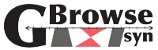
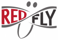
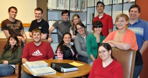
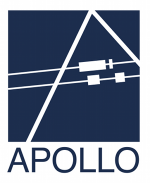
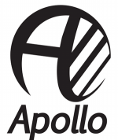
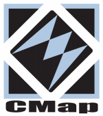
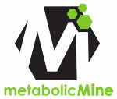
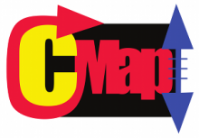
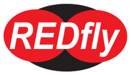

# Spring 2010 Logo Program

From GMOD

Jump to: [navigation](#mw-navigation), [search](#p-search)

|  |  |  |  |  |  |  |  |  |
|----|----|----|----|----|----|----|----|----|
|  |  |  |  |  |  |  |  |  |

  

The first iteration of the [GMOD Logo
Program](GMOD_Logo_Program "GMOD Logo Program") was held in Spring 2010.
It connected nine different projects with students in John Aikman's
advanced design course in the
<a href="http://www.linnbenton.edu/go/graphic-arts"
class="external text" rel="nofollow">Graphic Arts Department</a> of
<a href="http://www.linnbenton.edu/" class="external text"
rel="nofollow">Linn-Benton Community College (LBCC)</a> in Albany,
Oregon. The projects included software and websites. The designers
worked with the projects over several weeks, meeting on a regular basis
to discuss the project and design ideas.

## Projects

<table data-align="center">
<colgroup>
<col style="width: 25%" />
<col style="width: 25%" />
<col style="width: 25%" />
<col style="width: 25%" />
</colgroup>
<thead>
<tr class="header">
<th>Logo</th>
<th>Project</th>
<th>Designers1</th>
<th>Project Rep(s).</th>
</tr>
</thead>
<tbody>
<tr class="odd">
<td colspan="4">
</td>
</tr>
<tr class="even">
<td>

</td>
<td><a href="Apollo.1" title="Apollo">Apollo</a> genome annotation
editor.</td>
<td><strong><a href="mailto:audra.radke@gmail.com" class="external text"
rel="nofollow">Audra Radke</a></strong>, <a
href="mailto:jon.brim@gmail.com" class="external text"
rel="nofollow">Jon Brim</a>, <a href="mailto:jess.hodgson@gmail.com"
class="external text" rel="nofollow">Jessica Hodgson</a></td>
<td><a href="User:Elee" title="User:Elee">Ed Lee</a></td>
</tr>
<tr class="odd">
<td colspan="4">
</td>
</tr>
<tr class="even">
<td style="text-align: center;">

</td>
<td><a href="CMap.1" title="CMap">CMap</a> comparative map viewer.</td>
<td><strong>Kathy Bracken</strong>, Halie French, Ausa Wodtke,</td>
<td>Ken Youens-Clark</td>
</tr>
<tr class="odd">
<td colspan="4">
</td>
</tr>
<tr class="even">
<td>

</td>
<td><a href="GBrowse.1" title="GBrowse">GBrowse</a> genome browser</td>
<td><strong><a href="mailto:alexisnb1@yahoo.com" class="external text"
rel="nofollow">Alex Read</a></strong>, Sean O'Connell, <a
href="mailto:matticusp@gmail.com" class="external text"
rel="nofollow">Matt Payne</a></td>
<td><a href="User:Mckays" title="User:Mckays">Sheldon McKay</a></td>
</tr>
<tr class="odd">
<td colspan="4">
</td>
</tr>
<tr class="even">
<td>

</td>
<td><a href="GBrowse_syn.1" title="GBrowse syn">GBrowse_syn</a>
comparative genomics browser</td>
<td><strong><a href="mailto:NextLevelDesignStudios@gmail.com"
class="external text" rel="nofollow">Darek Lakey</a></strong>, <a
href="http://visual-mark.com" class="external text" rel="nofollow">Mark
Meadows</a>, <a href="mailto:thatonechick@gmail.com"
class="external text" rel="nofollow">Natalie Price</a></td>
<td><a href="User:Mckays" title="User:Mckays">Sheldon McKay</a></td>
</tr>
<tr class="odd">
<td colspan="4">
</td>
</tr>
<tr class="even">
<td>

</td>
<td><a href="InterMine" title="InterMine">InterMine</a> biological data
warehouse software</td>
<td><strong>Sean O'Connell</strong>, Halie French, <a
href="mailto:lilly_oaks@yahoo.com" class="external text"
rel="nofollow">Lilly Oaks</a></td>
<td>Gos Micklem, <a href="User:Rsmith" title="User:Rsmith">Richard
Smith</a></td>
</tr>
<tr class="odd">
<td colspan="4">
</td>
</tr>
<tr class="even">
<td>

</td>
<td>metabolicMine data warehouse for metabolic disease data</td>
<td><strong><a href="mailto:lilly_oaks@yahoo.com" class="external text"
rel="nofollow">Lilly Oaks</a></strong>, <a
href="mailto:NextLevelDesignStudios@gmail.com" class="external text"
rel="nofollow">Darek Lakey</a>, <a href="mailto:dipdoodle9@comcast.net"
class="external text" rel="nofollow">Audra Radke</a></td>
<td>Gos Micklem, <a href="User:Rsmith" title="User:Rsmith">Richard
Smith</a></td>
</tr>
<tr class="odd">
<td colspan="4">
</td>
</tr>
<tr class="even">
<td>

</td>
<td><a href="Phenote" title="Phenote">Phenote</a> ontology based
phenotype (and other) annotation tool</td>
<td><strong><a href="http://visual-mark.com" class="external text"
rel="nofollow">Mark Meadows</a></strong>, Kathy Bracken, <a
href="mailto:matticusp@gmail.com" class="external text"
rel="nofollow">Matt Payne</a></td>
<td>Nomi Harris</td>
</tr>
<tr class="odd">
<td colspan="4">
</td>
</tr>
<tr class="even">
<td>

</td>
<td><a href="http://www.pombase.org/" class="external text"
rel="nofollow">PomBase</a> - model organism database for <em>S.
pombe</em></td>
<td><strong><a href="mailto:jeffkristen4@msn.com" class="external text"
rel="nofollow">Jeff Rosser</a></strong>, <a
href="mailto:jon.brim@gmail.com" class="external text"
rel="nofollow">Jon Brim</a>, <a href="mailto:thatonechick@gmail.com"
class="external text" rel="nofollow">Natalie Price</a></td>
<td>Valerie Wood</td>
</tr>
<tr class="odd">
<td colspan="4">
</td>
</tr>
<tr class="even">
<td style="text-align: center;">

</td>
<td><a href="http://redfly.ccr.buffalo.edu" class="external text"
rel="nofollow">REDfly</a> - Regulatory Element Database for
<em>Drosophila</em></td>
<td><strong><a href="mailto:alexisnb1@yahoo.com" class="external text"
rel="nofollow">Alex Read</a></strong>, <a
href="mailto:jess.hodgson@gmail.com" class="external text"
rel="nofollow">Jessica Hodgson</a>, <a
href="mailto:jeffkristen4@msn.com" class="external text"
rel="nofollow">Jeff Rosser</a></td>
<td>Marc Halfon</td>
</tr>
<tr class="odd">
<td colspan="4">
</td>
</tr>
<tr class="even">
<td colspan="4">1 Logos were designed by individuals in
collaboration with their teams. The designer of the selected logo is
shown in <strong>bold</strong>. Also see <a href="#Other_Logos">Other
Logos</a> below.</td>
</tr>
</tbody>
</table>

## Linn-Benton Community College

<table data-align="center">
<colgroup>
<col style="width: 25%" />
<col style="width: 25%" />
<col style="width: 25%" />
<col style="width: 25%" />
</colgroup>
<tbody>
<tr class="odd">
<td>

Most of the participating LBCC design students

</td>
<td> </td>
<td>
The class included:

<ul>
<li>John Aikman, course professor</li>
<li>Kathy Bracken</li>
<li><a href="mailto:jon.brim@gmail.com" class="external text"
rel="nofollow">Jon Brim</a>,</li>
<li>Halie French</li>
<li><a href="mailto:jess.hodgson@gmail.com" class="external text"
rel="nofollow">Jessica Hodgson</a></li>
<li><a href="mailto:NextLevelDesignStudios@gmail.com"
class="external text" rel="nofollow">Darek Lakey</a></li>
<li><a href="http://visual-mark.com" class="external text"
rel="nofollow">Mark Meadows</a>,</li>
<li><a href="mailto:lilly_oaks@yahoo.com" class="external text"
rel="nofollow">Lilly Oaks</a></li>
</ul></td>
<td><ul>
<li>Sean O'Connell</li>
<li><a href="mailto:matticusp@gmail.com" class="external text"
rel="nofollow">Matt Payne</a></li>
<li><a href="mailto:thatonechick@gmail.com" class="external text"
rel="nofollow">Natalie Price</a></li>
<li><a href="mailto:audra.radke@gmail.com" class="external text"
rel="nofollow">Audra Radke</a></li>
<li><a href="mailto:alexisnb1@yahoo.com" class="external text"
rel="nofollow">Alex Read</a></li>
<li><a href="mailto:jeffkristen4@msn.com" class="external text"
rel="nofollow">Jeff Rosser</a></li>
<li>Ausa Wodtke</li>
</ul></td>
</tr>
</tbody>
</table>

## Other Logos

Each project had several different designs to pick from. This section
highlights some of the logos that were not chosen.

  

<table data-align="center">
<colgroup>
<col style="width: 25%" />
<col style="width: 25%" />
<col style="width: 25%" />
<col style="width: 25%" />
</colgroup>
<tbody>
<tr class="odd">
<td>

<a href="Apollo.1" title="Apollo">Apollo</a> 
Jessica Hodgson 
jess.hodgson@gmail.com

</td>
<td>

<a href="Apollo.1" title="Apollo">Apollo</a> 
Jonathan Brim 
jon.brim@gmail.com

</td>
<td>

<a href="CMap.1" title="CMap">CMap</a> 
Kathy Bracken

</td>
<td>

MetabolicMine 
Audra Radke 
audra.radke@gmail.com

</td>
</tr>
</tbody>
</table>

<table data-align="center">
<colgroup>
<col style="width: 33%" />
<col style="width: 33%" />
<col style="width: 33%" />
</colgroup>
<tbody>
<tr class="odd">
<td>

<a href="GBrowse.1" title="GBrowse">GBrowse</a> 
Matt Payne 
matticusp@gmail.com

</td>
<td>

<a href="GBrowse.1" title="GBrowse">GBrowse</a> 
Sean O'Connell

</td>
<td>

<a href="GBrowse_syn.1" title="GBrowse syn">GBrowse_syn</a> 
Natalie Price 
thatonechick@gmail.com

</td>
</tr>
<tr class="even">
<td>

<a href="GBrowse_syn.1" title="GBrowse syn">GBrowse_syn</a> 
Mark Meadows 
<a href="http://visual-mark.com/" class="external free"
rel="nofollow">http://visual-mark.com/</a>

</td>
<td>

MetabolicMine 
Darek Lakey 
NextLevelDesignStudios@gmail.com

</td>
<td>

<a href="Phenote" title="Phenote">Phenote</a> 
Kathy Bracken

</td>
</tr>
<tr class="odd">
<td>

<a href="Phenote" title="Phenote">Phenote</a> 
Matt Payne 
matticusp@gmail.com

</td>
<td>

<a href="http://www.pombase.org/" class="external text"
rel="nofollow">PomBase</a> 
Natalie Price 
thatonechick@gmail.com

</td>
<td>

<a href="http://www.pombase.org/" class="external text"
rel="nofollow">PomBase</a> 
Jonathan Brim 
jon.brim@gmail.com

</td>
</tr>
<tr class="even">
<td>

<a href="CMap.1" title="CMap">CMap</a> 
Halie French

</td>
<td>

<a href="http://redfly.ccr.buffalo.edu/" class="external text"
rel="nofollow">REDfly</a> 
Jeff Rosser 
jeffkristen4@msn.com

</td>
<td>

<a href="http://redfly.ccr.buffalo.edu/" class="external text"
rel="nofollow">REDfly</a> 
Jessica Hodgson 
jess.hodgson@gmail.com

</td>
</tr>
</tbody>
</table>

## Logistics

The clients and designers agreed to the following requirements.

### GMOD User Participation Requirements

1.  You must be a non-profit organization.
2.  You are willing to meet virtually (phone, Skype, AIM, IChat, etc.)
    with the students on a regular basis to first explain what your
    database/web site/organism is about and what makes it unique, and
    then to provide feedback and guidance on the student designs as they
    progress.
3.  You have time to work with students during the time window when the
    course is working on this.
4.  You provide the teaching institution with feedback / student
    evaluation that is requested.
5.  If you use the new design, you give credit somewhere on your web
    site (that is reachable by search engines), to the student(s) who
    created it and to the institution they were attending.
6.  Before meeting with the student you should give some thought to what
    your requirements are. Does the logo need to look good in black and
    white? Does it need to appear in a favicon?

*If you already have a design in mind and you just want it polished,
then this program is **not** for you.* The goals of the program are two
fold. First to provide you with a logo, and second to provide students
with design experience. If you already have a design the students won't
get that experience.

### Graphic Design Student Requirements

1.  You are willing to meet virtually (phone, Skype, IChat, AIM, *etc.*)
    with your client on a regular basis so that you can understand their
    requirements, and what makes their web site/database/organism
    unique, interesting and useful. This may mean understanding some of
    the biology behind the site.
2.  You make any appointments that you set up.

### Fees

LBCC required a payment of US\$75 per participating organization. Past
experience has shown that charging clients a nominal fee leads to a
stronger commitment to the projects and to working with the students.

Retrieved from
"<http://gmod.org/mediawiki/index.php?title=Spring_2010_Logo_Program&oldid=21167>"

[Categories](Special:Categories "Special:Categories"):

- [Logos and Icons](Category:Logos_and_Icons "Category:Logos and Icons")
- [GMOD Community](Category:GMOD_Community "Category:GMOD Community")

## Navigation menu

### Namespaces

- <a href="Spring_2010_Logo_Program" accesskey="c"
  title="View the content page [c]">Page</a>
- <a href="Talk:Spring_2010_Logo_Program" accesskey="t"
  title="Discussion about the content page [t]">Discussion</a>

### 

### Variants

### Actions

### Search

### Navigation

- [GMOD Home](Main_Page)
- [Software](GMOD_Components)
- [Categories /
  Tags](Categories)
- [View all pages](Special:AllPages)

### Documentation

- [Overview](Overview)
- [FAQs](Category:FAQ)
- [HOWTOs](Category:HOWTO)
- [Glossary](Glossary)

### Community

- [GMOD News](GMOD_News)
- [Training /
  Outreach](Training_and_Outreach)
- [Support](Support)
- [GMOD Promotion](GMOD_Promotion)
- [Meetings](Meetings)
- [Calendar](Calendar)

### Tools

- <a href="Special:WhatLinksHere/Spring_2010_Logo_Program" accesskey="j"
  title="A list of all wiki pages that link here [j]">What links here</a>
- <a href="Special:RecentChangesLinked/Spring_2010_Logo_Program"
  accesskey="k"
  title="Recent changes in pages linked from this page [k]">Related
  changes</a>
- <a href="Special:SpecialPages" accesskey="q"
  title="A list of all special pages [q]">Special pages</a>
- <a
  href="http://gmod.org/mediawiki/index.php?title=Spring_2010_Logo_Program&amp;printable=yes"
  rel="alternate" accesskey="p"
  title="Printable version of this page [p]">Printable version</a>
- [Permanent
  link](http://gmod.org/mediawiki/index.php?title=Spring_2010_Logo_Program&oldid=21167 "Permanent link to this revision of the page")
- [Page
  information](http://gmod.org/mediawiki/index.php?title=Spring_2010_Logo_Program&action=info)
- <a href="Special:Browse/Spring_2010_Logo_Program"
  rel="smw-browse">Browse properties</a>
- [Print as
  PDF](http://gmod.org/mediawiki/index.php?title=Special:PdfPrint&page=Spring_2010_Logo_Program)

- Last updated at 20:56 on 24 August
  2012.
- 132,913 page views.
- Content is available under
  <a href="http://www.gnu.org/licenses/fdl-1.3.html" class="external"
  rel="nofollow">a GNU Free Documentation License</a> unless otherwise
  noted.

<!-- -->

- [About
  GMOD](GMOD:About "GMOD:About")

<!-- -->

- 
- 
  

