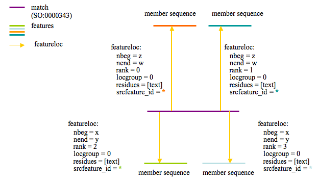
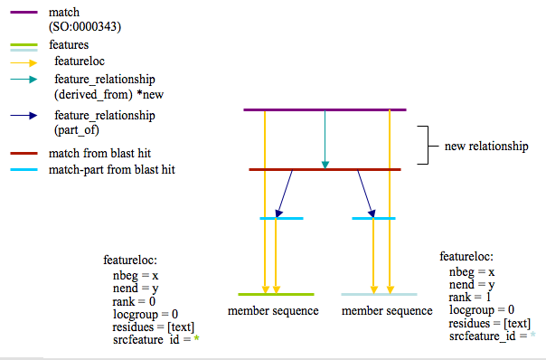

# Sybil Chado Comparative Genomics Data

From GMOD

Jump to: [navigation](#mw-navigation), [search](#p-search)

## Sybil Chado Comparative Genomics Data storage

This page will detail the TIGR/JCVI/IGS Sybil way of storing comparative
genomics data.

The following diagram describes how protein clusters are stored for
Sybil:

The purple line represents the protein cluster and is stored in feature.

The proteins that are members of the cluster are shown with the labels
'member sequence' and are linked to the cluster feature via featurloc
(where feature_id = protein feature and srcfeature_id = cluster
feature). The featureloc rank column is incremented for each cluster
member.

------------------------------------------------------------------------

Cluster assignments are based on bi-directional best BLASTP hit. Top
BLASTP hits are stored in the database via 'match' and 'match_part'
features independent of the clustering analysis. In this way multiple
clustering analyses may be loaded which use the same set of BLASTP hits.
Loading multiple clustering analyses can be useful when one wants to try
out/compare some new clustering parameters or would like to cluster on
only a subset of the loaded genomes.

The use of featureloc to join matching regions allows for the method to
include storage of locatable syntenic regions based on whole genome
alignment or other genomic DNA based comparison methods. Doing this
would simply require replacing the 'polypeptide' feature with an
'assembly' feature in the featureloc table.

------------------------------------------------------------------------

I propose adding another link to this scheme as I feel it could help
with performance and simplify some queries. The new relationship would
be as follows:

A feature_relationship of type derived_from (Seems the most
appropriate?) that links the cluster Match feature with each of the
blastp match features that were used to generate this cluster. The new
picture would look like this:

  

  

  

------------------------------------------------------------------------

[Proposed schema extensions related to Sybil/IGS
needs](Proposed_schema_extensions_related_to_Sybil/IGS_needs "Proposed schema extensions related to Sybil/IGS needs")

Retrieved from
"<http://gmod.org/mediawiki/index.php?title=Sybil_Chado_Comparative_Genomics_Data&oldid=5214>"

[Categories](Special:Categories "Special:Categories"):

- [Chado](Category:Chado "Category:Chado")
- [Comparative
  Genomics](Category:Comparative_Genomics "Category:Comparative Genomics")
- [Sybil](Category:Sybil "Category:Sybil")

## Navigation menu

### Namespaces

- <a href="Sybil_Chado_Comparative_Genomics_Data" accesskey="c"
  title="View the content page [c]">Page</a>
- <a
  href="http://gmod.org/mediawiki/index.php?title=Talk:Sybil_Chado_Comparative_Genomics_Data&amp;action=edit&amp;redlink=1"
  accesskey="t"
  title="Discussion about the content page [t]">Discussion</a>

### 

### Variants

### Search

### Navigation

- [GMOD Home](Main_Page)
- [Software](GMOD_Components)
- [Categories /
  Tags](Categories)
- [View all pages](Special:AllPages)

### Documentation

- [Overview](Overview)
- [FAQs](Category:FAQ)
- [HOWTOs](Category:HOWTO)
- [Glossary](Glossary)

### Community

- [GMOD News](GMOD_News)
- [Training /
  Outreach](Training_and_Outreach)
- [Support](Support)
- [GMOD Promotion](GMOD_Promotion)
- [Meetings](Meetings)
- [Calendar](Calendar)

### Tools

- <a href="Special:WhatLinksHere/Sybil_Chado_Comparative_Genomics_Data"
  accesskey="j" title="A list of all wiki pages that link here [j]">What
  links here</a>
- <a
  href="Special:RecentChangesLinked/Sybil_Chado_Comparative_Genomics_Data"
  accesskey="k"
  title="Recent changes in pages linked from this page [k]">Related
  changes</a>
- <a href="Special:SpecialPages" accesskey="q"
  title="A list of all special pages [q]">Special pages</a>
- <a
  href="http://gmod.org/mediawiki/index.php?title=Sybil_Chado_Comparative_Genomics_Data&amp;printable=yes"
  rel="alternate" accesskey="p"
  title="Printable version of this page [p]">Printable version</a>
- [Permanent
  link](http://gmod.org/mediawiki/index.php?title=Sybil_Chado_Comparative_Genomics_Data&oldid=5214 "Permanent link to this revision of the page")
- [Page
  information](http://gmod.org/mediawiki/index.php?title=Sybil_Chado_Comparative_Genomics_Data&action=info)
- <a href="Special:Browse/Sybil_Chado_Comparative_Genomics_Data"
  rel="smw-browse">Browse properties</a>
- [Print as
  PDF](http://gmod.org/mediawiki/index.php?title=Special:PdfPrint&page=Sybil_Chado_Comparative_Genomics_Data)

- Last updated at 20:04 on 12 April
  2008.
- 21,929 page views.
- Content is available under
  <a href="http://www.gnu.org/licenses/fdl-1.3.html" class="external"
  rel="nofollow">a GNU Free Documentation License</a> unless otherwise
  noted.

<!-- -->

- [About
  GMOD](GMOD:About "GMOD:About")

<!-- -->

- 
- 
  

