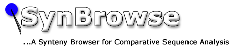

# SynBrowse

From GMOD

Jump to: [navigation](#mw-navigation), [search](#p-search)

  

> The item described in this page is not (or is no longer) supported by
> the GMOD project.  
> This page is included only for reference purposes.

  

## Contents

- [1
  Status](#Status)
- [2
  Demo](#Demo)
- [3
  Requirements](#Requirements)
- [4
  Downloads](#Downloads)
- [5
  Citation](#Citation)
- [6
  Contact](#Contact)

SynBrowse (Synteny Browser) is a generic sequence comparison tool for
visualizing genome alignments both within and between species. It is
intended to help scientists study and analyze
<a href="Synteny" class="mw-redirect" title="Synteny">synteny</a>,
homologous genes and other conserved elements between sequences. This
software is useful in studying genome duplication and evolution. It can
also aid in identifying uncharacterized genes, putative regulatory
elements and novel structural features of study species by comparing to
a well annotated reference sequence, thus enabling genome curators to
refine and edit annotations of species that have incomplete genome
annotations.

## Status

SynBrowse is no longer under active development and has not been funded
since 2006. However, the most recent version of it is still available
and still supported by it's lead developer. Xioakang Pan. See
[Comparative Genomics](Comparative_Genomics "Comparative Genomics") for
other options that are still actively developed and supported.

## Demo

Please see <a href="http://www.synbrowse.org" class="external free"
rel="nofollow">http://www.synbrowse.org</a>.

## Requirements

[GBrowse](GBrowse.1 "GBrowse"), between 1.62 and 1.68. A new release of
SynBrowse that works with GBrowse 1.70 is under development and is
expected to be released in early 2010.

## Downloads

The source code and installation documentation of SynBrowse as well as
the associated tools can be found at
<a href="http://www.synbrowse.org" class="external free"
rel="nofollow">http://www.synbrowse.org</a>.

## Citation

Pan, X., Stein, L. and Brendel, V. 2005. SynBrowse: a Synteny Browser
for Comparative Sequence Analysis. <a
href="http://bioinformatics.oxfordjournals.org/cgi/content/abstract/21/17/3461"
class="external text" rel="nofollow">Bioinformatics 21: 3461-3468</a>.

## Contact

If you have questions, comments and suggestions about SynBrowse, please
contact <a href="mailto:xiaokangpan@gmail.com" class="external text"
rel="nofollow">Xiaokang Pan</a>.

Retrieved from
"<http://gmod.org/mediawiki/index.php?title=SynBrowse&oldid=21996>"

[Categories](Special:Categories "Special:Categories"):

- [Unsupported](Category:Unsupported "Category:Unsupported")
- [Comparative
  Genomics](Category:Comparative_Genomics "Category:Comparative Genomics")

## Navigation menu

### Namespaces

- <a
  href="http://gmod.org/mediawiki/index.php?title=Talk:SynBrowse&amp;action=edit&amp;redlink=1"
  accesskey="t"
  title="Discussion about the content page [t]">Discussion</a>

### 

### Variants

### Navigation

- [GMOD Home](Main_Page)
- [Software](GMOD_Components)
- [Categories /
  Tags](Categories)

### Documentation

- [Overview](Overview)
- [FAQs](Category:FAQ)
- [HOWTOs](Category:HOWTO)
- [Glossary](Glossary)

### Community

- [GMOD News](GMOD_News)
- [Training /
  Outreach](Training_and_Outreach)
- [Support](Support)
- [GMOD Promotion](GMOD_Promotion)
- [Meetings](Meetings)
- [Calendar](Calendar)

### Tools

- <a href="Special:Browse/SynBrowse" rel="smw-browse">Browse
  properties</a>

- Last updated at 18:55 on 8 October
  2012.
<!-- - 55,211 page views. -->
- Content is available under
  <a href="http://www.gnu.org/licenses/fdl-1.3.html" class="external"
  rel="nofollow">a GNU Free Documentation License</a> unless otherwise
  noted.

<!-- -->

- [About
  GMOD](GMOD:About "GMOD:About")

<!-- -->

