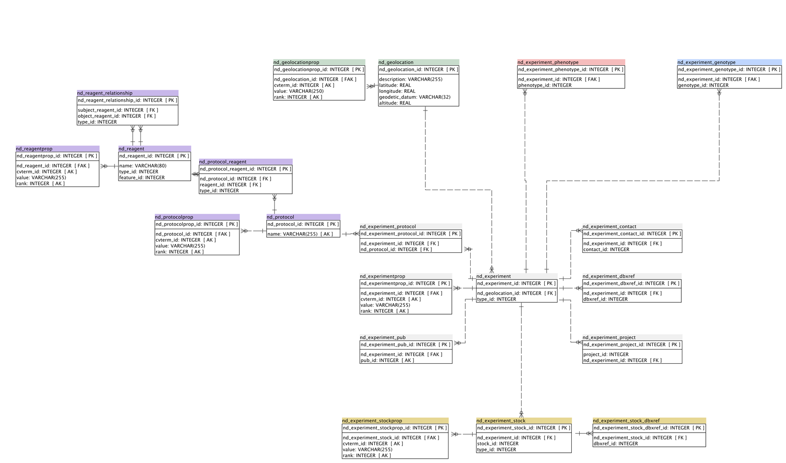

# Talk:Chado Natural Diversity Module Working Group

From GMOD

Jump to: [navigation](#mw-navigation), [search](#p-search)

## Contents

- [1
  Responsibilities](#Responsibilities)
- [2 January
  2010](#January_2010)
  - [2.1 Schema
    Change Logistics](#Schema_Change_Logistics)
  - [2.2 Schema
    Design Tools /
    Visualization](#Schema_Design_Tools_.2F_Visualization)
  - [2.3
    Observational
    Taxonomy](#Observational_Taxonomy)
    - [2.3.1
      Stock](#Stock)
    - [2.3.2
      Observational Taxonomy
      Proposal](#Observational_Taxonomy_Proposal)
      - [2.3.2.1
        Observational
        Unit](#Observational_Unit)
    - [2.3.3
      Observational Unit
      Relationships](#Observational_Unit_Relationships)
    - [2.3.4
      Current Status](#Current_Status)
  - [2.4
    Project/Experiment/Study
    Hierarchy](#Project.2FExperiment.2FStudy_Hierarchy)
  - [2.5 Phenotypes
    and Genotypes](#Phenotypes_and_Genotypes)
    - [2.5.1
      Phenotypes](#Phenotypes)
      - [2.5.1.1
        HDB Design](#HDB_Design)
    - [2.5.2
      Genotypes](#Genotypes)
    - [2.5.3
      Functional and Sequence
      Alleles](#Functional_and_Sequence_Alleles)
  - [2.6 Assays,
    Images](#Assays.2C_Images)
  - [2.7 Action
    Items](#Action_Items)
- [3 February
  2010](#February_2010)
  - [3.1 8 Feb 2010
    Teleconference](#8_Feb_2010_Teleconference)
- [4 March
  2010](#March_2010)
- [5 April
  2010](#April_2010)
- [6 simplified
  schema (ND tables
  only)](#simplified_schema_.28ND_tables_only.29)

This is the *discussion* page for the [Chado Natural Diversity Module
Working
Group](Chado_Natural_Diversity_Module_Working_Group "Chado Natural Diversity Module Working Group").
Notes on what we talk about and what decisions are made will be posted
here. Eventually, as we settle on specific outcomes, those outcomes will
be posted to the main page, and eventually reflected in the Chado
schema.

  
At this time (January 2010), most of this discussion is about making
changes relative to the version that was created in 2007 with
*Heliconius* in mind. This is referred to below as ***HDB***.

We will also use what came up at the PAG meeting as starting point for
the discussion. This will change over time, as things settle down.

# Responsibilities

***Note:** These responsibilities are flexible. They are just what we
decided at the PAG meetings. They are wide open to discussion (or just
add your name below.*

**Sook Jung** will take the lead on schema changes/development. Sook is
interested and is motivated to produce a working schema as soon as
possible.

**Dave Clements** will lead documentation efforts. Dave will produce
wiki documentation for the new tables. I hope to also create schema
diagrams (probably using Power Architect). Dave is also keenly
interested in how [phenotypes](#Phenotypes) are represented both in this
module, and in the rest of the Chado.

**Add your name here** ...

# January 2010

## Schema Change Logistics

We have conflicting goals here:

1.  Some people need this module yesterday.
2.  Some people want this module to strike the *perfect* balance between
    usability and flexibility.

Neither group is opposed to the other group's goal *per se* - they just
happened to be incompatible goals.

To address both these needs, [Rob
Buells](User:RobertBuels "User:RobertBuels") proposed

- multiple incremental releases,
- with perhaps some backwards incompatability,
- but always with a plan and code support for migrating from one release
  to the next.

Rob points out that this might also be a good test case for establishing
a formal process making backwards-incompatible updates to production
Chado.

  

## Schema Design Tools / Visualization

Sook, who is leading this particular effort, has access to Quest Toad
for doing database design. She will likely send out proposals and
revisions at Toad diagrams.

Dave, whose (who's?) job is to document all this, can't afford Toad. He
will likely use Power\*Architect to generate final as well as some
intermediate documentation. Power\*Architect is free, which is within my
budget. (This also makes it possible for anyone else to update the doc
in the long term.)

## Observational Taxonomy

HDB has several different levels of biological unit, all represented
with a different set of tables

- Organism - This already exists and comes from the [Chado Organism
  Module](Chado_Organism_Module "Chado Organism Module"). It defines a
  species.
- <a
  href="http://heliconiusdb.svn.sourceforge.net/viewvc/heliconiusdb/trunk/schema/doc/diversity.html#biotype#biotype"
  class="external text" rel="nofollow">Biotype</a>
- <a
  href="http://heliconiusdb.svn.sourceforge.net/viewvc/heliconiusdb/trunk/schema/doc/diversity.html#stock#stock"
  class="external text" rel="nofollow">Stock</a> (which is different
  from the stock table already in Chado)
- <a
  href="http://heliconiusdb.svn.sourceforge.net/viewvc/heliconiusdb/trunk/schema/doc/diversity.html#individual#individual"
  class="external text" rel="nofollow">Individual</a>
- <a
  href="http://heliconiusdb.svn.sourceforge.net/viewvc/heliconiusdb/trunk/schema/doc/diversity.html#crossexperiment#crossexperiment"
  class="external text" rel="nofollow">Crossexperiment</a>
- <a
  href="http://heliconiusdb.svn.sourceforge.net/viewvc/heliconiusdb/trunk/schema/doc/diversity.html#specimen#specimen"
  class="external text" rel="nofollow">Specimen</a>

And there are a bevy of relationships between these tables.

|                 |     |                 |                                |
|-----------------|-----|-----------------|--------------------------------|
| Organism        | M:M | Biotype         |                                |
| Biotype         | 1:M | Stock           | there are 3 different 1:M rels |
| Stock           | 1:M | Individual      |                                |
| Crossexperiment | 1:M | Individual      |                                |
| Individual      | 1:M | Crossexperiemnt |                                |
| Individual      | 1:M | Specimen        |                                |
| Biotype         | M:M | Individual      |                                |

All of this tables describe some unit/group of biology/life, ranging
from species (organism) down to tissue in hand (specimen). The HDB
design has several *structurally identical* tables in HDB for the
various levels for different types of data (phenotype, images, ...).
This particular hierarchy is also particular to butterflies.

### Stock

Both the HDB version and the production Chado have a stock table. The
[Chado Stock Module](Chado_Stock_Module "Chado Stock Module") was added
to production Chado while or after the HDB version was being developed.

The Chado Stock module is about keeping track of lines in your
lab/community. Someone needs to take a look at it and determine how the
natural diversity module should interact with it.

  

### Observational Taxonomy Proposal

When Sook Jung mapped the HDB version to plant biology a number of
issues came up:

- HDB associates genotypes with specimen_id, but in many cases genotypes
  are recorded at the level of individual trees, not part of the trees.
- The hierarchy of Biotype/Stock/Individual/Specimen requires storing of
  the same data multiple times (eg. all the organism entries need to be
  stored in biotype table since stock table has only stock.biotype_id).
- Multiple crosses can be done in one project (F1, BC1, and BC2 etc) and
  the individual cross experiment need to be linked to the larger
  project.

1.  'crossexperiment' table may need to be linked to the project table
    by a linker table called 'crossexperiment_project', or
2.  We can have 'project_relationship' and 'projectprop' tables instead
    of 'crossexperiment' table to store data of various hierarchical
    projects (breeding experiments with multiple crosses and sub-trials,
    QTL projects with multiple crosses, etc).

This highlights that HDB is not a very Chadoesque design. We need to
genericize the design to support arbitrary hierarchies, lineages, and
mating types. This will support many more users and allow them to store
images, phenotypes, genotypes, properties, etc. for whatever level of
the hierarchy they have data for.

We can't touch Organism, as it's a key table in every Chado instance out
there. However, everything else is open to change.

#### Observational Unit

The GDPDM has *observational units,* which represents whatever level of
sample you have data for. I find that name descriptive, but awkward.
Unfortunately, I can't think of a better name. Suggestions are welcome.

Specifics:

1.  Try to combine biotype, stock, individual, and crossexperiemt into a
    single table, tentatively called obs_unit (with a nod to GDPDM).
2.  Investigate also folding specimen into obs_unit.
3.  An observational unit's place in the observational taxonomy will be
    indicated by a new column in obs_unit that points to the CV table.
    For butterflies, the possible values might be "species", "biotype",
    "stock", "individual", and possibly "specimen"

### Observational Unit Relationships

We need to support arbitrary M:M relationships between different levels
of the observational taxonomy, and within the same level as well. For
example, we may want a complete chain from species to individual (or
plot or brood or ...), and that individual may have resulted from
crossing 2 other individuals (or from cloning one, or ...).

The common solution is to create a bridge/mapping/intersection table to
implement M:M relationships between obs_unit and itself. This table
would define the standard "subject relationship object" triple where the
subject and object are obs_unit's and the relationship is a CV term.

This also deals with complications in lineage and mating types. You can
represent *T. Thermophila* which has 7 mating types (any 2 will do), *C.
elegans* which has hermaphrodites and outcrossing, *E. coli* which is
asexual, ...

It was pointed out that this table may contain *cycles*. In some
experiments an individual will be crossed with it's descendents.
Therefore software that walks these relationships will need to detect
cycles.

### Current Status

We're planning on moving ahead with merging the existing tables into a
single table. And, no we can't yet agree on that table name.

## Project/Experiment/Study Hierarchy

The current [Project
table](Chado_General_Module#Table:_project "Chado General Module") is
defined in the [General
Module](Chado_General_Module "Chado General Module"). The HDB design
links to it extensively. However, other modules hardly use it at all.

  
The GDR group needs to the ability to more robustly define
projects/studies, and to introduce substudies/project hierarchy, as
well.

## Phenotypes and Genotypes

### Phenotypes

Phenotypes are not particularly well defined in Chado.
[Scott](User:Scott "User:Scott") says that there are two sets of
phenotype tables in Chado. One is a first rough draft that snuck in (and
is used by some), and the other is a more robust set, which is used by
others (including FlyBase). Too make things worse, which tables are in
which set is not presently clearly defined.

Dave C. will do some research into

1.  What is currently going on in Chado?
    - Which tables are in the old and new implementations?
    - How are those tables currently used, and by whom?
2.  What are best practices for representing phenotypes in a generic
    database like Chado?

If items \#2 and \#1 don't line up, and there are not a lot of current
users, then I would like to look into

1.  reimplementing phenotypes in Chado, and
2.  providing migration paths for what users we do have.

  

#### HDB Design

The HDB version of the module ties into the preexisting [phenotype
table](Chado_Phenotype_Module#Table:_phenotype "Chado Phenotype Module").
The phenotype table has 4 foreign keys pointing to the [cvterm
table](Chado_CV_Module#Table:_cvterm "Chado CV Module"):

|  |  |
|----|----|
| observable_id | The entity: e.g. anatomy_part, biological_process. |
| attr_id | Phenotypic attribute (quality, property, attribute, character) - drawn from PATO. |
| cvalue_id | Phenotype attribute value (state). *There is also a* value *text column which can hold unconstrained text. In any given record, exactly one of cvalue and value should have a non-null value.* |
| assay_id | Evidence type |

Any of these 4 columns can be null.

  
There is also a [phenotype_cvterm
table](Chado_Phenotype_Module#Table:_phenotype_cvterm "Chado Phenotype Module")
to hold CV terms that don't fit cleanly into the 4 CV term columns in
phenotype.

It is not obvious to us (who aren't that familiar with PATO), why the
observable_id and attr_id columns are special enough to get their own
permanent columns in the phenotype table. Shouldn't they be thrown in
phenotype_cvterm as well?

The current setup would work for:

Rohan-beard nerve cells show elevated response.

But would it work for

Rohan-beard nerve cells in the top of the dorsal fin show a faster and
stronger response  (Yes, I know this
example may not make biological sense.)

Is this annotation fundamentally about Rohan-beard cells, the dorsal
fin, the top of the dorsal fin, or all them put together? With the
current design one of them has to come first.

As mentioned above, this area needs more research, or maybe just more
documentation.

### Genotypes

Genotypes appear to be more clearly defined in the production Chado
schema: A genotype is a collection of features.

We discussed a particular use case: How would you store the results of
an SSR assay? For example, in some individuals a given SSR is *n* bases
long, while in another it is *m* bases long.

This would go in the genotype and feature tables. However, we may not be
clear yet on where the length would go.

### Functional and Sequence Alleles

Sook pointed out the need to represent both *functional* and *sequence*
alleles. She explained: An apple geneticist who is working on a locus
called F-M locus found three functional alleles and 12 sequence alleles.

- **Functional:** morphologically defined alleles (F, f and f1)
- **Sequence:** four SSR variants for F, six SSR variants for f, and two
  for f1 alleles.

We worked this out as functional alleles are stored in the phenotype
tables, and sequence alleles in the feature and genotype tables.

## Assays, Images

HDB includes support for images and assays. We should probably have a
general purpose solution that is usable for all images and assays, not
just those in the natural diversity module.

  

## Action Items

Sook will

- write up some use cases
- generate a revised schema (perhaps just a draft), including a diagram

Dave will

- create a Doodle poll to determine the best time to meet.
  <a href="http://www.doodle.com/f2gd36wu5s4krfrt" class="external text"
  rel="nofollow">Poll is here</a>.
- announce this group, this page, our next meeting, and the doodle poll
  to the GMOD Schema list.

Anything else?

# February 2010

The first meeting in February will be held Monday February 8, at 11am
Eastern US. Contact [Dave C](User:Clements "User:Clements") if you are
interested in participating in this meeting.

Meetings after that will be scheduled at a regular time according to
when people are usually available. Please fill out this
<a href="http://www.doodle.com/f2gd36wu5s4krfrt" class="external text"
rel="nofollow">Doodle poll</a> to let us know when you can make it.

Scheduling this will be tough as we have key interested parties in
Europe and across the contiguous US.

## 8 Feb 2010 Teleconference

- <a href="../mediawiki/images/0/0c/NaturalDiversityChado20100208.pdf"
  class="internal" title="NaturalDiversityChado20100208.pdf">Proposal from
  Sook (PDF)</a>
  (<a href="../mediawiki/images/9/95/NaturalDiversityChado20100208.pptx"
  class="internal" title="NaturalDiversityChado20100208.pptx">PPT</a>)

# March 2010

- <a href="../mediawiki/images/8/88/ChadoDiversityMar032010.pdf"
  class="internal" title="ChadoDiversityMar032010.pdf">New Proposal from
  Sook (PDF)</a>: Contains Use Cases and new/deleted/modified tables
  from HDB
- <a
  href="../mediawiki/images/3/3b/Natural_diversity_module_Mar03_2010.txt"
  class="internal" title="Natural diversity module Mar03 2010.txt">SQL</a>

# April 2010

Topic for Apr Teleconference Meeting

- The structure of diversityexperiment table and four different
  sub-tables

<!-- -->

- Renaming tables
  - ptexperiment/gtexperiment to ptassay/gtassay?
  - ptassay/gtassay to ptprotocol/gtprotocol or ptassaytype/gtassaytype
    or ptmethod/gtmethod?
  - diversityexperiment?

<!-- -->

- Do we need crossexperiment table linked to stocksample table via
  diversityexperiment?

We (GDR) definitely need some sort of crossexperiment table linked to
stock instead of stocksample

- - crossexperiment (crossexperiment_id, name, expdate, experimenter_id,
    geolocation_id, type_id)
  - crossexperiment_stock (crossexperiment_stock_id, crossexperiment_id,
    stock_id, type_id)
  - crossexperimentprop (crossexperimentprop_id, crossexperiment_id,
    cvterm_id, value, rank)
  - crossexperiment_project

If we need currrent crossexperiment table, we could name this new set of
tables using cross- instead of crossexperiment-

  

- Adding diversityexperiment.collection_date

  

# simplified schema (ND tables only)

[Notes on simplified nd schema and Use
Cases](Notes_on_simplified_nd_schema_and_Use_Cases "Notes on simplified nd schema and Use Cases")

Retrieved from
"<http://gmod.org/mediawiki/index.php?title=Talk:Chado_Natural_Diversity_Module_Working_Group&oldid=14318>"

## Navigation menu

### Namespaces

- <a href="Chado_Natural_Diversity_Module_Working_Group" accesskey="c"
  title="View the content page [c]">Page</a>
- <a href="Talk:Chado_Natural_Diversity_Module_Working_Group"
  accesskey="t"
  title="Discussion about the content page [t]">Discussion</a>

### 

### Variants

### Navigation

- [GMOD Home](Main_Page)
- [Software](GMOD_Components)
- [Categories /
  Tags](Categories)
- [View all pages](Special:AllPages)

### Documentation

- [Overview](Overview)
- [FAQs](Category:FAQ)
- [HOWTOs](Category:HOWTO)
- [Glossary](Glossary)

### Community

- [GMOD News](GMOD_News)
- [Training /
  Outreach](Training_and_Outreach)
- [Support](Support)
- [GMOD Promotion](GMOD_Promotion)
- [Meetings](Meetings)
- [Calendar](Calendar)

### Tools

- [Print as
  PDF](http://gmod.org/mediawiki/index.php?title=Special:PdfPrint&page=Talk:Chado_Natural_Diversity_Module_Working_Group)

- Last updated at 17:18 on 27 August
  2010.
- 49,809 page views.
- Content is available under
  <a href="http://www.gnu.org/licenses/fdl-1.3.html" class="external"
  rel="nofollow">a GNU Free Documentation License</a> unless otherwise
  noted.

<!-- -->

- [About
  GMOD](GMOD:About "GMOD:About")

<!-- -->

- 
- 
  

