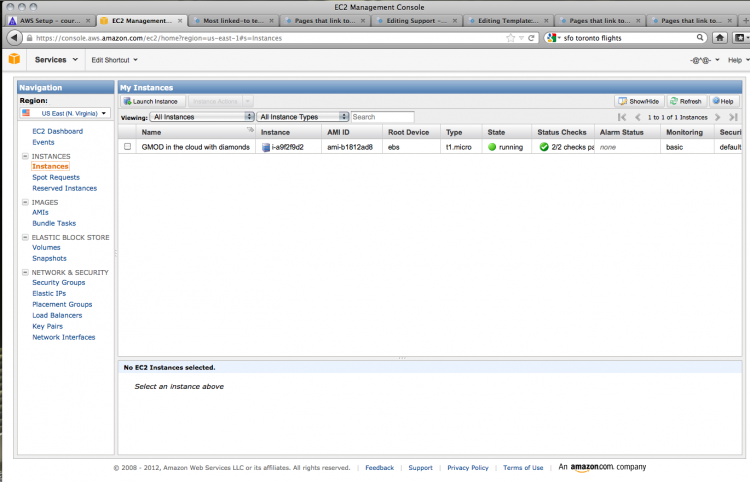
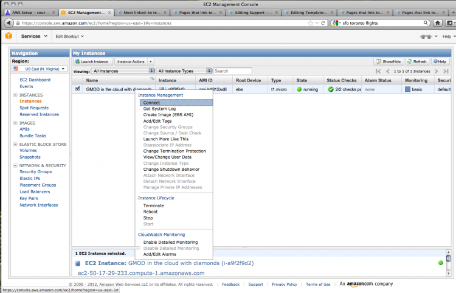
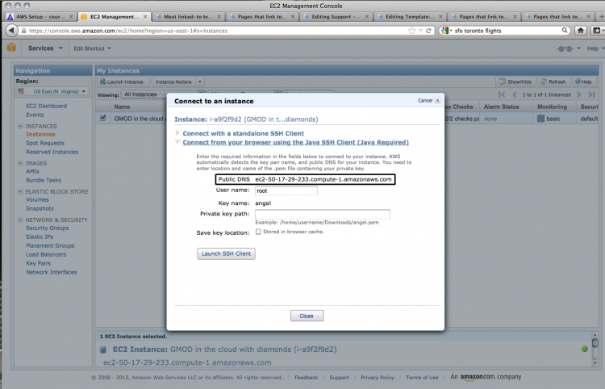
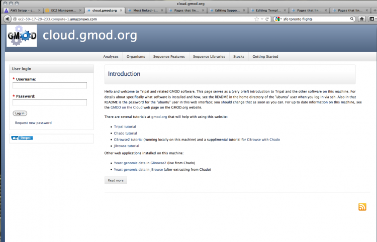
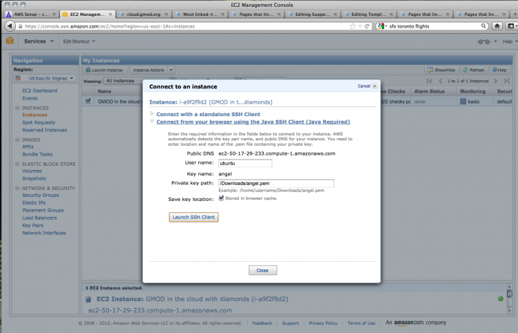
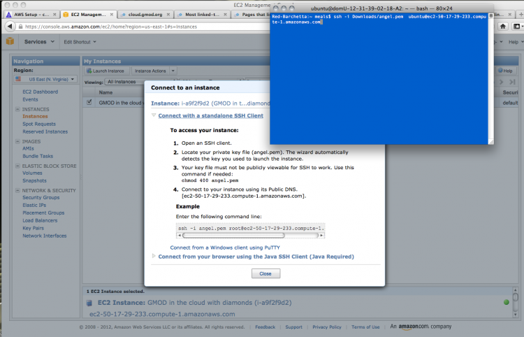
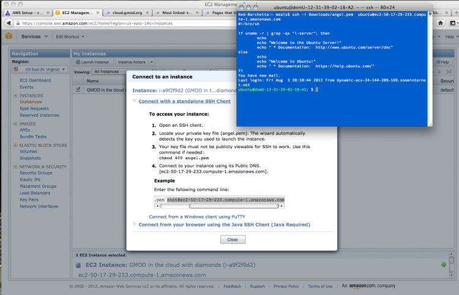

# Template:AWS Instance Access

From GMOD

Jump to: [navigation](#mw-navigation), [search](#p-search)

### Instance Access

We can now test out our instance. Clicking on **Instances** shows us the
list of all the instances we have running.

  
Go to the instance and right-click to bring up a contextual menu. Choose
**Connect**.

  
We can test the HTTP connection using the information from the dialogue
box that comes up. Copy the public DNS address, found under the open
heading **Connect from your browser using the Java SSH Client (Java
Required)**.

  
Open that address in a new browser window. If everything has gone
correctly, you should see the following screen:

  
Now let's check the SSH connection. You can do this through your browser
using the built-in Java client. You will need to change the user name to
**ubuntu** and set the private key path to the location where you saved
the private key that was generated earlier. Click **Launch SSH Client**
to get connected.

  
Most bioinformaticists worth their salt prefer a nice command line
option, so click on **Connect with a standalone SSH client** to view the
connection information. The first task is to change the file access
permissions on the downloaded private key file.

  
As with the Java browser-based SSH client, you'll need to change the
user name from **root** to **ubuntu**. Copy the command given,
substituting in the correct path to your private key file and the user
name **ubuntu**.

  
If all goes well, you should log in to the server and get a welcome
message:

Retrieved from
"<http://gmod.org/mediawiki/index.php?title=Template:AWS_Instance_Access&oldid=21697>"

## Navigation menu

### Namespaces

- <a href="Template:AWS_Instance_Access" accesskey="c"
  title="View the template [c]">Template</a>
- <a
  href="http://gmod.org/mediawiki/index.php?title=Template_talk:AWS_Instance_Access&amp;action=edit&amp;redlink=1"
  accesskey="t"
  title="Discussion about the content page [t]">Discussion</a>

### 

### Variants

### Navigation

- [GMOD Home](Main_Page)
- [Software](GMOD_Components)
- [Categories /
  Tags](Categories)
- [View all pages](Special:AllPages)

### Documentation

- [Overview](Overview)
- [FAQs](Category:FAQ)
- [HOWTOs](Category:HOWTO)
- [Glossary](Glossary)

### Community

- [GMOD News](GMOD_News)
- [Training /
  Outreach](Training_and_Outreach)
- [Support](Support)
- [GMOD Promotion](GMOD_Promotion)
- [Meetings](Meetings)
- [Calendar](Calendar)

### Tools

- [Print as
  PDF](http://gmod.org/mediawiki/index.php?title=Special:PdfPrint&page=Template:AWS_Instance_Access)

- Last updated at 22:52 on 12 September
  2012.
<!-- - 3,064 page views. -->
- Content is available under
  <a href="http://www.gnu.org/licenses/fdl-1.3.html" class="external"
  rel="nofollow">a GNU Free Documentation License</a> unless otherwise
  noted.

<!-- -->

- [About
  GMOD](GMOD:About "GMOD:About")

<!-- -->

- 

