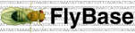
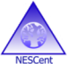

# Template:Organisations

From GMOD

Jump to: [navigation](#mw-navigation), [search](#p-search)

#### Contributing Organizations

 

 

Retrieved from
"<http://gmod.org/mediawiki/index.php?title=Template:Organisations&oldid=25104>"

## Navigation menu

### Namespaces

- <a href="Template:Organisations" accesskey="c"
  title="View the template [c]">Template</a>
- <a
  href="http://gmod.org/mediawiki/index.php?title=Template_talk:Organisations&amp;action=edit&amp;redlink=1"
  accesskey="t"
  title="Discussion about the content page [t]">Discussion</a>

### 

### Variants

### Navigation

- [GMOD Home](Main_Page)
- [Software](GMOD_Components)
- [Categories /
  Tags](Categories)
- [View all pages](Special:AllPages)

### Documentation

- [Overview](Overview)
- [FAQs](Category:FAQ)
- [HOWTOs](Category:HOWTO)
- [Glossary](Glossary)

### Community

- [GMOD News](GMOD_News)
- [Training /
  Outreach](Training_and_Outreach)
- [Support](Support)
- [GMOD Promotion](GMOD_Promotion)
- [Meetings](Meetings)
- [Calendar](Calendar)

### Tools

- Last updated at 18:19 on 15 January
  2014.
<!-- - 5,120 page views. -->
- Content is available under
  <a href="http://www.gnu.org/licenses/fdl-1.3.html" class="external"
  rel="nofollow">a GNU Free Documentation License</a> unless otherwise
  noted.

<!-- -->

- [About
  GMOD](GMOD:About "GMOD:About")

<!-- -->

