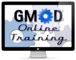
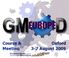
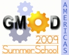

# Training and Outreach

From GMOD

Jump to: [navigation](#mw-navigation), [search](#p-search)

Training and outreach is about several things. GMOD training teaches new
and existing GMOD users *how* to use [GMOD
Components](GMOD_Components "GMOD Components") to help meet the goals of
their organizations. GMOD outreach activities aim to inform biologists
and bioinformaticists about *what* GMOD can do. This page describes GMOD
training and outreach activities. See [Support](Support "Support") for
other support options in GMOD.

Training and outreach are done by the [GMOD Project
Coordinator](User:Scott "User:Scott"), the [GMOD Help
Desk](GMOD_Help_Desk "GMOD Help Desk"), [GMOD
component](GMOD_Components "GMOD Components") developers, and by GMOD
users.

See also **[GMOD Meetings](Meetings "Meetings")**.

  
Please contact the
<a href="mailto:help@gmod.org" class="external text" rel="nofollow">GMOD
Help Desk</a> if you have a training and outreach question or request.

## Contents

- [1 Online
  Tutorials](#Online_Tutorials)
- [2 GMOD
  Schools](#GMOD_Schools)
- [3 Events:
  Courses, Meetings, Workshops, Presentations and
  Posters](#Events:_Courses.2C_Meetings.2C_Workshops.2C_Presentations_and_Posters)
  - [3.1 2013
    Events](#2013_Events)
  - [3.2 2012
    Events](#2012_Events)
  - [3.3 2011
    Events](#2011_Events)
  - [3.4 2002
    through 2010 Events](#2002_through_2010_Events)

## Online Tutorials

In addition to in person training, there are in depth online tutorials
on several [GMOD Components](GMOD_Components "GMOD Components"):

<table class="wikitable">
<colgroup>
<col style="width: 50%" />
<col style="width: 50%" />
</colgroup>
<thead>
<tr class="header">
<th>Component</th>
<th>Title, Description</th>
</tr>
</thead>
<tbody>
<tr class="odd">
<th><a href="Apollo.1" title="Apollo">Apollo</a></th>
<td><dl>
<dt><a href="Apollo_Tutorial_2011" title="Apollo Tutorial 2011">Apollo
Tutorial 2011</a></dt>
<dd>
The Apollo session from the <a href="2011_GMOD_Spring_Training"
title="2011 GMOD Spring Training">2011 GMOD Spring Training</a>
</dd>
<dt><a href="Apollo_Tutorial_2010" title="Apollo Tutorial 2010">Apollo
Tutorial 2010</a></dt>
<dd>
The Apollo session from the <a href="2010_GMOD_Summer_School_-_Americas"
title="2010 GMOD Summer School - Americas">2010 GMOD Summer School -
Americas</a>.
</dd>
<dt>Apollo tutorials at the <a href="http://dynamicgene.dnalc.org"
class="external text" rel="nofollow">Dynamic Gene</a> web site.</dt>
<dd>
Flash based tutorials on how to use Apollo, using rice as an example.
Sections of particular interest are
<ul>
<li><a href="http://dynamicgene.dnalc.org/annotation/annotation.html"
class="external text" rel="nofollow">Annotation</a> - how to use
Apollo</li>
<li><a href="http://dynamicgene.dnalc.org/resources/resources.html"
class="external text" rel="nofollow">Resources</a> - how to download
sample data and install Apollo on an MS Windows system.</li>
</ul>
</dd>
</dl>
<dl>
<dt><a href="http://apollo.berkeleybop.org/current/userguide.html"
class="external text" rel="nofollow">Apollo user guide</a></dt>
<dd>
The current user guide, which has comprehensive instructions for
installation and usage of Apollo.
</dd>
</dl></td>
</tr>
<tr class="even">
<th><a href="BioMart" title="BioMart">BioMart</a></th>
<td><dl>
<dt><a href="BioMart_Tutorial" title="BioMart Tutorial">BioMart
Tutorial</a></dt>
<dd>
Based on the BioMart workshop at the <a href="October_2011_GMOD_Meeting"
title="October 2011 GMOD Meeting">October 2011 GMOD Meeting</a>.
</dd>
</dl></td>
</tr>
<tr class="odd">
<th><a href="Chado" class="mw-redirect" title="Chado">Chado</a></th>
<td><dl>
<dt><a href="Chado_Tutorial" class="mw-redirect"
title="Chado Tutorial">Chado Tutorial</a></dt>
<dd>
Based on the Chado session from the <a href="2013_GMOD_Summer_School"
title="2013 GMOD Summer School">2013 GMOD Summer School</a>.
</dd>
<dt><a href="Artemis-Chado_Integration_Tutorial"
title="Artemis-Chado Integration Tutorial">Artemis-Chado Integration
Tutorial</a></dt>
<dd>
Based on the session of the same title from the <a
href="2009_GMOD_Summer_School_-_Europe"
title="2009 GMOD Summer School - Europe">2009 GMOD Summer School -
Europe</a>.
</dd>
</dl></td>
</tr>
<tr class="even">
<th><a href="Cloud.1" title="Cloud">GMOD in the Cloud</a></th>
<td><dl>
<dt><a href="AWS_walkthrough" title="AWS walkthrough">AWS
walkthrough</a></dt>
<dd>
A gentle introduction to getting a machine up and running on the Amazon
Cloud
</dd>
</dl></td>
</tr>
<tr class="odd">
<th><a href="CMap.1" title="CMap">CMap</a></th>
<td><a href="http://www.gramene.org/tutorials/cmap.html"
class="external text" rel="nofollow">Tutorial @ Gramene</a></td>
</tr>
<tr class="even">
<th><a href="Galaxy.1" title="Galaxy">Galaxy</a></th>
<td><dl>
<dt><a href="Galaxy_Tutorial" class="mw-redirect"
title="Galaxy Tutorial">Galaxy Tutorial</a></dt>
<dd>
As taught at the <a href="2013_GMOD_Summer_School"
title="2013 GMOD Summer School">2013 GMOD Summer School</a>
</dd>
<dt><a href="http://wiki.galaxyproject.org/Learn" class="external text"
rel="nofollow">Galaxy Learning Hub</a></dt>
<dd>
&#10;</dd>
<dd>
A wealth of training materials, including:
<ul>
<li><a href="http://wiki.galaxyproject.org/Learn#Galaxy_101#Galaxy_101"
class="external text" rel="nofollow">Galaxy 101</a></li>
<li><a href="http://wiki.galaxyproject.org/Learn/Screencasts"
class="external text" rel="nofollow">Screencasts</a></li>
<li><a
href="http://wiki.galaxyproject.org/Learn#Shared_Pages.2C_Histories_.26_Workflows#Shared_Pages.2C_Histories_.26_Workflows"
class="external text" rel="nofollow">Shared Pages, Histories &amp;
Workflows</a></li>
<li><a
href="http://wiki.galaxyproject.org/Learn#Other_Tutorials#Other_Tutorials"
class="external text" rel="nofollow">Other Tutorials</a></li>
<li><a href="http://wiki.galaxyproject.org/Learn#Datasets#Datasets"
class="external text" rel="nofollow">Working With Datasets</a></li>
<li><a href="http://wiki.galaxyproject.org/Learn" class="external text"
rel="nofollow">and more!</a></li>
</ul>
</dd>
</dl>
<dl>
<dt><a href="http://bit.ly/gxyRNASEX" class="external text"
rel="nofollow">RNA-Seq Example</a></dt>
<dd>
An introduction to NGS processing (specifically RNA-Seq) with <a
href="Galaxy.1" title="Galaxy">Galaxy</a>.
</dd>
<dt><a href="http://www.openhelix.com/cgi/tutorialInfo.cgi?id=82"
class="external text" rel="nofollow">OpenHelix Galaxy User
Tutorial</a></dt>
<dd>
A Flash based tutorial on using Galaxy. Provided by <a
href="http://www.openhelix.com" class="external text"
rel="nofollow">OpenHelix</a>. Tutorial includes slides, handouts and
exercises. Requires subscription.
</dd>
</dl></td>
</tr>
<tr class="odd">
<th><a href="GBrowse.1" title="GBrowse">GBrowse</a></th>
<td><dl>
<dt><a href="GBrowse_Tutorial" title="GBrowse Tutorial">GBrowse tutorial
from 2012 GMOD Summer School</a>. This relies heavily on the <a
href="http://cloud.gmod.org/gbrowse2/tutorial/tutorial.html"
class="external text" rel="nofollow">GBrowse2 Admin Tutorial</a>.</dt>
<dd>
Demonstrates setting up, configuring and using <a href="GBrowse.1"
title="GBrowse">GBrowse</a> with some sample data. GBrowse is provided
on an Amazon Machine Image; see <a href="Cloud.1" title="Cloud">GMOD in
the Cloud</a> for more information on getting a GMOD AMI.
</dd>
<dt><a href="GBrowse_Tutorial_2010"
title="GBrowse Tutorial 2010">GBrowse tutorial from 2010 GMOD Summer
School</a></dt>
<dd>
Set up and run <a href="GBrowse.1" title="GBrowse">GBrowse</a> with
sample data. It provides a VMware image to work on, and relies heavily
on the <a href="http://cloud.gmod.org/gbrowse2/tutorial/tutorial.html"
class="external text" rel="nofollow">GBrowse2 Admin Tutorial</a>.
</dd>
<dt><a href="http://cloud.gmod.org/gbrowse2/tutorial/tutorial.html"
class="external text" rel="nofollow">GBrowse2 Admin Tutorial</a></dt>
<dd>
Step by step guide on how to configure and load data into <a
href="GBrowse.1" title="GBrowse">GBrowse</a>. Administration tutorials
are available for both the <a
href="http://cloud.gmod.org/gbrowse2/tutorial/tutorial.html"
class="external text" rel="nofollow">GBrowse2 Admin Tutorial</a>, and
the earlier <a
href="http://gmod.svn.sourceforge.net/viewvc/gmod/Generic-Genome-Browser/branches/stable/docs/tutorial/tutorial.html"
class="external text" rel="nofollow">1.x versions</a>.
</dd>
<dt><a
href="http://search.cpan.org/dist/GBrowse/htdocs/general_help.html"
class="external text" rel="nofollow">Usage tutorial</a></dt>
<dd>
GBrowse usage tutorial
</dd>
<dt><a href="GBrowse_NGS_Tutorial" title="GBrowse NGS Tutorial">GBrowse
NGS Tutorial</a></dt>
<dd>
Instructions on how to visualize <a href="Next_generation_sequencing"
class="mw-redirect" title="Next generation sequencing">next generation
sequencing</a> data in GBrowse using <a
href="http://samtools.sourceforge.net" class="external text"
rel="nofollow">SAMtools</a>. The tutorial includes a starting VMware
image, and uses the example data that comes with SAMtools.
</dd>
<dt><a href="http://youtu.be/jxA6VMN97Y8" class="external text"
rel="nofollow">GBrowse video tutorial</a></dt>
<dd>
Produced by <a href="http://eupathdb.org" class="external text"
rel="nofollow">EuPathDB</a>; please direct praise and thanks to them!
</dd>
<dt><a href="http://www.openhelix.com/gbrowse" class="external text"
rel="nofollow">GBrowse User Tutorial</a> at <a
href="http://www.openhelix.com" class="external text"
rel="nofollow">OpenHelix</a></dt>
<dd>
A Flash based tutorial on using GBrowse. Provided by <a
href="http://www.openhelix.com" class="external text"
rel="nofollow">OpenHelix</a>. Tutorial includes slides, handouts and
exercises. NB: this tutorial is for <a href="GBrowse_1.x"
title="GBrowse 1.x">GBrowse 1.x</a>
</dd>
</dl></td>
</tr>
<tr class="even">
<th><a href="GBrowse_syn.1" title="GBrowse syn">GBrowse_syn</a></th>
<td><dl>
<dt><a href="GBrowse_syn_Tutorial" class="mw-redirect"
title="GBrowse syn Tutorial">GBrowse syn Tutorial</a></dt>
<dd>
Installing and configuring GBrowse_syn; from the <a
href="2013_GMOD_Summer_School" title="2013 GMOD Summer School">2013 GMOD
Summer School</a>
</dd>
</dl></td>
</tr>
<tr class="odd">
<th><a href="GFF3" title="GFF3">GFF3</a></th>
<td><dl>
<dt><a href="GFF3" title="GFF3">GFF3</a></dt>
<dd>
Introduction to and documentation of the GFF3 format
</dd>
</dl></td>
</tr>
<tr class="even">
<th><a href="JBrowse.1" title="JBrowse">JBrowse</a></th>
<td><dl>
<dt><a href="JBrowse_Tutorial" class="mw-redirect"
title="JBrowse Tutorial">JBrowse Tutorial</a> covering installation and
configuration</dt>
<dd>
part of the <a href="2013_GMOD_Summer_School"
title="2013 GMOD Summer School">2013 GMOD Summer School</a>
</dd>
<dt><a href="http://jbrowse.org/code/latest-release/docs/tutorial/"
class="external text" rel="nofollow">Getting Started with JBrowse
Tutorial</a></dt>
<dd>
part of the JBrowse documentation
</dd>
<dt><a
href="../mediawiki/images/4/44/Exploring_structural_variation_in_the_tomato_clade_using_JBrowse.pdf"
class="internal"
title="Exploring structural variation in the tomato clade using JBrowse.pdf">Exploration
of structural variation in the tomato clade using JBrowse</a></dt>
<dd>
Tutorial explaining how to browse structural variants from the 150+
tomato genome resequencing project (<a
href="http://www.tomatogenome.net" class="external free"
rel="nofollow">http://www.tomatogenome.net</a>) using JBrowse
</dd>
</dl></td>
</tr>
<tr class="odd">
<th><a href="MAKER.1" title="MAKER">MAKER</a></th>
<td><dl>
<dt><a href="MAKER_Tutorial" class="mw-redirect"
title="MAKER Tutorial">MAKER Tutorial</a></dt>
<dd>
taught as part of the <a href="2013_GMOD_Summer_School"
title="2013 GMOD Summer School">2013 GMOD Summer School</a>
</dd>
</dl></td>
</tr>
<tr class="even">
<th><a href="Pathway_Tools.1" title="Pathway Tools">Pathway
Tools</a></th>
<td>
 

<dl>
<dt><a href="http://bioinformatics.ai.sri.com/ptools/"
class="external text" rel="nofollow">Pathway Tools slides</a></dt>
<dd>
General information about Pathway Tools, including slides from tutorials
and user guides
</dd>
<dt><a href="http://bioinformatics.ai.sri.com/ptools/tutorial/"
class="external text" rel="nofollow">Upcoming Events</a></dt>
<dd>
Pathway Tools tutorials and workshops
</dd>
</dl></td>
</tr>
<tr class="odd">
<th><a href="SOBA.1" title="SOBA">SOBA</a></th>
<td><dl>
<dt><a href="SOBA_Tutorial" class="mw-redirect"
title="SOBA Tutorial">SOBA Tutorial</a></dt>
<dd>
taught as part of the <a href="2013_GMOD_Summer_School"
title="2013 GMOD Summer School">2013 GMOD Summer School</a>
</dd>
</dl></td>
</tr>
<tr class="even">
<th><a href="Tripal.1" title="Tripal">Tripal</a></th>
<td>
 

<dl>
<dt><a href="Tripal_Tutorial_v1.1" title="Tripal Tutorial v1.1">Tripal
Tutorial v1.1</a></dt>
<dd>
used during the <a href="2013_GMOD_Summer_School"
title="2013 GMOD Summer School">2013 GMOD Summer School</a>
</dd>
<dt><a href="Tripal_Tutorial_(v1.0)"
title="Tripal Tutorial (v1.0)">Tripal Tutorial (v1.0)</a></dt>
<dd>
used during the <a href="2012_GMOD_Summer_School"
title="2012 GMOD Summer School">2012 GMOD Summer School</a>
</dd>
<dt><a href="Tripal_Tutorial_(v0.3.1b)"
title="Tripal Tutorial (v0.3.1b)">Tripal Tutorial (v0.3.1b)</a></dt>
<dd>
The full v0.3.1b tutorial
</dd>
<dt><a href="Tripal_Tutorial_(v0.3.1b_VM)"
title="Tripal Tutorial (v0.3.1b VM)">Tripal Tutorial (v0.3.1b
VM)</a></dt>
<dd>
for use with the Tripal virtual machine
</dd>
<dt><a href="Tripal_Tutorial_(pre_version_0.3b)"
title="Tripal Tutorial (pre version 0.3b)">Tripal Tutorial (pre version
0.3b)</a></dt>
<dd>
from the 2010 GMOD Spring School
</dd>
</dl></td>
</tr>
<tr class="odd">
<th><a href="WebApollo.1" title="WebApollo">WebApollo</a></th>
<td><dl>
<dt><a href="WebApollo_Tutorial" class="mw-redirect"
title="WebApollo Tutorial">WebApollo Tutorial</a></dt>
<dd>
taught as part of the <a href="2013_GMOD_Summer_School"
title="2013 GMOD Summer School">2013 GMOD Summer School</a>
</dd>
</dl></td>
</tr>
</tbody>
</table>

This website also has a large collection of
[HOWTOs](Category:HOWTO "Category:HOWTO") on more specific tasks.

## GMOD Schools

GMOD Schools are hands-on multi-day courses aimed at teaching new GMOD
users how to get up and running with GMOD. Schools introduce
participants to GMOD and focus on installation, configuration and
integration of popular [GMOD
Components](GMOD_Components "GMOD Components").

| Date |  | School | Location |
|----|----|----|----|
| 2014 | February 26-28 | [GMOD Malaysia 2014](GMOD_Malaysia_2014.1 "GMOD Malaysia 2014") | Kuala Lumpur, Malaysia |
|  | May 19-23 | [GMOD Online Training 2014](GMOD_Online_Training_2014.1 "GMOD Online Training 2014") | Online! |
| 2013 | July 19-23 | [2013 GMOD Summer School](2013_GMOD_Summer_School "2013 GMOD Summer School") | <a href="http://www.nescent.org" class="external text"
rel="nofollow">NESCent</a>, Durham, NC, United States |
| 2012 | August 24-29 | [2012 GMOD Summer School](2012_GMOD_Summer_School "2012 GMOD Summer School") | <a href="http://www.nescent.org" class="external text"
rel="nofollow">NESCent</a>, Durham, NC, United States |
| 2011 | March 8-12 | [2011 GMOD Spring Training](2011_GMOD_Spring_Training "2011 GMOD Spring Training") | <a href="http://www.nescent.org" class="external text"
rel="nofollow">NESCent</a>, Durham, NC, United States |
| 2010 | May 6-9 | [2010 GMOD Summer School - Americas](2010_GMOD_Summer_School_-_Americas "2010 GMOD Summer School - Americas") | <a href="http://www.nescent.org" class="external text"
rel="nofollow">NESCent</a>, Durham, NC, United States |
| 2009 | 3-6 August | [2009 GMOD Summer School - Europe](2009_GMOD_Summer_School_-_Europe "2009 GMOD Summer School - Europe") | Oxford, United Kingdom |
|  | 16-19 July | [2009 GMOD Summer School - Americas](2009_GMOD_Summer_School_-_Americas "2009 GMOD Summer School - Americas") | <a href="http://www.nescent.org" class="external text"
rel="nofollow">NESCent</a>, Durham, NC, United States |
| 2008 | 11-13 July | [2008 GMOD Summer School](2008_GMOD_Summer_School "2008 GMOD Summer School") | <a href="http://www.nescent.org" class="external text"
rel="nofollow">NESCent</a>, Durham, NC, United States |

  

## Events: Courses, Meetings, Workshops, Presentations and Posters

The items listed here are either about GMOD and its components, or are
of specific interest to the GMOD community. **The GMOD
[Calendar](Calendar "Calendar") also includes all these events, plus
many more.** Please see [GMOD
Promotion](GMOD_Promotion#Presentation_and_Event_Promotion "GMOD Promotion")
if you have an event or presentation you would like to promote within
GMOD.

See the [Posters](Category:Posters "Category:Posters") and
[Presentations](Category:Presentations "Category:Presentations")
categories for many additional presentations by GMOD staff, developers
and users.

See the [GMOD meetings](Meetings "Meetings") page for more on GMOD
community meetings and other related rendezvous.

  

### 2013 Events

<table class="wikitable">
<colgroup>
<col style="width: 12%" />
<col style="width: 12%" />
<col style="width: 12%" />
<col style="width: 12%" />
<col style="width: 12%" />
<col style="width: 12%" />
<col style="width: 12%" />
<col style="width: 12%" />
</colgroup>
<thead>
<tr class="header">
<th colspan="2">Date</th>
<th>Conference / Topic(s)</th>
<th>Location</th>
<th>Contact</th>
<th></th>
<th></th>
<th></th>
</tr>
</thead>
<tbody>
<tr class="odd">
<td colspan="8" data-bgcolor="#cccccc"></td>
</tr>
<tr class="even">
<td rowspan="5"
style="font-size: 180%; line-height: 140%; vertical-align: top"> 
2 
0 
1 
3</td>
<td>July 19-23</td>
<td><strong><a href="2013_GMOD_Summer_School"
title="2013 GMOD Summer School">2013 GMOD Summer
School</a></strong> 
&#10;
Training course on all things GMOD
</td>
<td><a href="http://nescent.org" class="external text"
rel="nofollow">NESCent</a>, Durham, NC</td>
<td><a href="mailto:help@gmod.org" class="external text"
rel="nofollow">GMOD Help Desk</a></td>
<td></td>
<td></td>
<td></td>
</tr>
<tr class="odd">
<td>June 30 - July 2</td>
<td><strong><a href="http://wiki.galaxyproject.org/Events/GCC2013"
class="external text" rel="nofollow">2013 Galaxy Community Conference
(GCC2013)</a></strong> 
The <a href="Galaxy.1" title="Galaxy">Galaxy</a> project's annual
meeting.</td>
<td>Oslo, Norway</td>
<td><a href="User:Clements" title="User:Clements">Dave Clements</a></td>
<td></td>
<td></td>
<td></td>
</tr>
<tr class="even">
<td>April 7-10</td>
<td><strong><a href="http://www.ebi.ac.uk/biocuration2013/home"
class="external text" rel="nofollow">Biocuration 2013</a></strong></td>
<td rowspan="2">Cambridge, United Kingdom</td>
<td>n/a</td>
<td></td>
<td></td>
<td></td>
</tr>
<tr class="odd">
<td>April 5-6</td>
<td><strong>2013 GMOD Meeting</strong> 
Colocated with and immediately before <a
href="http://www.ebi.ac.uk/biocuration2013/home" class="external text"
rel="nofollow">Biocuration 2013</a></td>
<td><a href="User:Scott" title="User:Scott">Scott Cain</a></td>
<td></td>
<td></td>
<td></td>
</tr>
<tr class="even">
<td>January</td>
<td><strong>PAGXXI</strong> (Plant and Animal Genomes) 
See <a href="PAG_2013" title="PAG 2013">PAG 2013</a> for details of GMOD
at PAGXXI</td>
<td>San Diego, CA</td>
<td><a href="User:Scott" title="User:Scott">Scott Cain</a></td>
<td></td>
<td></td>
<td></td>
</tr>
</tbody>
</table>

### 2012 Events

<table class="wikitable">
<colgroup>
<col style="width: 12%" />
<col style="width: 12%" />
<col style="width: 12%" />
<col style="width: 12%" />
<col style="width: 12%" />
<col style="width: 12%" />
<col style="width: 12%" />
<col style="width: 12%" />
</colgroup>
<thead>
<tr class="header">
<th colspan="2">Date</th>
<th>Conference / Topic(s)</th>
<th>Location</th>
<th>Contact</th>
<th></th>
<th></th>
<th></th>
</tr>
</thead>
<tbody>
<tr class="odd">
<td colspan="8" data-bgcolor="#cccccc"></td>
</tr>
<tr class="even">
<td rowspan="7"
style="font-size: 180%; line-height: 140%; vertical-align: top"> 
2 
0 
1 
2</td>
<td>August 24-29</td>
<td><strong><a href="2012_GMOD_Summer_School"
title="2012 GMOD Summer School">2012 GMOD Summer
School</a></strong></td>
<td><a href="http://nescent.org" class="external text"
rel="nofollow">NESCent</a>, Durham, North Carolina, United States</td>
<td><a href="User:Scott" title="User:Scott">Scott Cain</a></td>
<td></td>
<td></td>
<td></td>
</tr>
<tr class="odd">
<td>July 25-27</td>
<td><strong><a href="http://wiki.g2.bx.psu.edu/Events/GCC2012"
class="external text" rel="nofollow">2012 Galaxy Community Conference
(GCC2012)</a></strong> 
The <a href="Galaxy.1" title="Galaxy">Galaxy</a> project's annual
meeting.</td>
<td>Chicago, Illinois, United States</td>
<td><a href="User:Clements" title="User:Clements">Dave Clements</a></td>
<td></td>
<td></td>
<td></td>
</tr>
<tr class="even">
<td>April 5-6</td>
<td><strong><a href="April_2012_GMOD_Meeting"
title="April 2012 GMOD Meeting">April 2012 GMOD
Meeting</a></strong> 
Colocated with and immediately following <a
href="http://pir.georgetown.edu/biocuration2012/" class="external text"
rel="nofollow">Biocuration 2012</a></td>
<td rowspan="2">Washington, DC, United States</td>
<td><a href="User:Scott" title="User:Scott">Scott Cain</a></td>
<td></td>
<td></td>
<td></td>
</tr>
<tr class="odd">
<td>April 2-4</td>
<td><strong><a href="http://pir.georgetown.edu/biocuration2012/"
class="external text" rel="nofollow">Biocuration 2012</a></strong></td>
<td></td>
<td></td>
<td></td>
<td></td>
</tr>
<tr class="even">
<td>January 23-25</td>
<td><strong><a href="http://evomics.org/workshops/advanced-topics/gmod/"
class="external text" rel="nofollow">GMOD Workshop</a></strong></td>
<td rowspan="2"><a href="http://www.ckrumlov.info/php/"
class="external text" rel="nofollow">Český Krumlov, Czech
Republic</a></td>
<td><a href="User:Scott" title="User:Scott">Scott Cain</a></td>
<td></td>
<td></td>
<td></td>
</tr>
<tr class="odd">
<td>January 8-21</td>
<td><strong><a
href="http://evomics.org/workshops/workshop-on-genomics/2012-genomics-cesky-krumlov/"
class="external text" rel="nofollow">Workshop on
Genomics</a></strong> 
Covers a plethora of topics, including <a href="Galaxy.1"
title="Galaxy">Galaxy</a></td>
<td><a href="User:JamesTaylor" title="User:JamesTaylor">James
Taylor</a></td>
<td></td>
<td></td>
<td></td>
</tr>
<tr class="even">
<td>January 14-18</td>
<td><strong><a href="PAG_2012" title="PAG 2012">Plant and Animal Genome
XX (PAG 2012)</a></strong> 
There will once again be a <a href="PAG_2012" title="PAG 2012">strong
GMOD presence</a> at <a href="http://www.intl-pag.org/"
class="external text" rel="nofollow">PAG</a>, including a <em>dedicated
all-day GMOD Workshop</em>.</td>
<td>San Diego, California, United States</td>
<td><a href="User:Scott" title="User:Scott">Scott Cain</a></td>
<td></td>
<td></td>
<td></td>
</tr>
</tbody>
</table>

### 2011 Events

<table class="wikitable">
<colgroup>
<col style="width: 20%" />
<col style="width: 20%" />
<col style="width: 20%" />
<col style="width: 20%" />
<col style="width: 20%" />
</colgroup>
<thead>
<tr class="header">
<th colspan="2">Date</th>
<th>Conference / Topic(s)</th>
<th>Location</th>
<th>Contact</th>
</tr>
</thead>
<tbody>
<tr class="odd">
<td colspan="5" data-bgcolor="#cccccc"></td>
</tr>
<tr class="even">
<td rowspan="18"
style="font-size: 180%; line-height: 140%; vertical-align: top"> 
2 
0 
1 
1</td>
<td></td>
<td></td>
<td></td>
<td></td>
</tr>
<tr class="odd">
<td>October 23-24</td>
<td><strong><a href="http://www.biovis.net/" class="external text"
rel="nofollow">IEEE Symposium on Biological Data Visualization (BioVis
2011)</a></strong>, part of <a href="http://visweek.org/"
class="external text" rel="nofollow">VisWeek</a>
The <a href="Galaxy.1" title="Galaxy">Galaxy</a> Track Browser:
Transforming the Genome Browser from Visualization Tool to Analysis
Tool 
</td>
<td>Providence, Rhode Island, United States</td>
<td>Jeremy Goecks</td>
</tr>
<tr class="even">
<td>October 12-13</td>
<td><strong><a href="October_2011_GMOD_Meeting"
title="October 2011 GMOD Meeting">October 2011 GMOD
Meeting</a></strong></td>
<td><a href="http://oicr.on.ca/" class="external text"
rel="nofollow">Ontario Institute for Cancer Research (OICR)</a>,
Toronto, Canada</td>
<td><a href="User:Scott" title="User:Scott">Scott Cain</a></td>
</tr>
<tr class="odd">
<td>September 28-30</td>
<td><strong><a href="News/UC_Davis_Courses_this_September"
title="News/UC Davis Courses this September">Genome
Annotation</a></strong> 
Genome annotation using <a href="MAKER.1" title="MAKER">MAKER</a> and <a
href="Apollo.1" title="Apollo">Apollo</a>.</td>
<td><a href="http://bioinformatics.ucdavis.edu/" class="external text"
rel="nofollow">UC Davis Bioinformatics Core</a></td>
<td><a href="User:Bmoore" title="User:Bmoore">Barry Moore</a></td>
</tr>
<tr class="even">
<td>September 19-22</td>
<td><strong><a href="http://www.beyond-the-genome.com/program.html"
class="external text" rel="nofollow">Genome Informatics Workshop @
Beyond the Genome 2011</a></strong></td>
<td>Washington, DC, United States</td>
<td><a href="User:Lstein" title="User:Lstein">Lincoln Stein</a>, <a
href="User:JamesTaylor" title="User:JamesTaylor">James Taylor</a></td>
</tr>
<tr class="odd">
<td>July 15-19</td>
<td><strong><a href="ISMB/ECCB_2011" title="ISMB/ECCB 2011">ISMB/ECCB
2011</a></strong> 
Included the Bioinformatics Open Source Conference (BOSC) and plenty of
GMOD-related content.</td>
<td>Vienna, Austria</td>
<td><a href="User:Scott" title="User:Scott">Scott Cain</a></td>
</tr>
<tr class="even">
<td>July 10-23</td>
<td><strong><a
href="http://www.molecularevolution.org/workshops/WCG#wcgna#wcgna"
class="external text" rel="nofollow">Workshop on Comparative Genomics,
North America</a></strong> 
Sessions on <a href="BioPerl" title="BioPerl">BioPerl</a>, <a
href="Galaxy.1" title="Galaxy">Galaxy</a> and <a href="GBrowse_syn.1"
title="GBrowse syn">GBrowse_syn</a></td>
<td>Fort Collins, Colorado, United States</td>
<td><a href="User:Stajich" title="User:Stajich">Jason Stajich</a>, <a
href="User:DanB" title="User:DanB">Dan Blankenberg</a>, <a
href="User:Mckays" title="User:Mckays">Sheldon McKay</a></td>
</tr>
<tr class="odd">
<td>June 21-22</td>
<td><strong><a href="http://ptools-fba.eventbrite.com/"
class="external text" rel="nofollow">Pathway Tools Flux Balance Analysis
Tutorial</a></strong></td>
<td>SRI, Menlo Park, California, United States</td>
<td><a href="mailto:ptools-info@ai.sri.com" class="external text"
rel="nofollow">Tomer Altman</a></td>
</tr>
<tr class="even">
<td>June 9-12</td>
<td><strong><a href="Arthropod_Genomics_2011"
title="Arthropod Genomics 2011">Arthropod Genomics
Symposium</a></strong> 
GMOD had a strong presence with a mixture of talks, poster, and these
workshops: 
&#10;<strong>Genome Project 101</strong>, June 9, 4:00-6:00 p.m.
<strong>Comparative genomics with the generic synteny browser (<a
href="GBrowse_syn.1" title="GBrowse syn">GBrowse_syn</a>): Configuration
and display of various co-linearity data types</strong>, June 11,
10:30-Noon</td>
<td>Kansas City, Missouri, United States</td>
<td><a href="User:Scott" title="User:Scott">Scott Cain</a>, <a
href="User:Clements" title="User:Clements">Dave Clements</a>, <a
href="User:Mckays" title="User:Mckays">Sheldon McKay</a></td>
</tr>
<tr class="odd">
<td>May 28-31</td>
<td><strong><a href="https://www.eshg.org/eshg2011.0.html"
class="external text" rel="nofollow">European Human Genetics Conference
2011</a></strong> 
<a href="Galaxy.1" title="Galaxy">Galaxy</a> Workshop</td>
<td>Amsterdam, The Netherlands</td>
<td><a href="User:Clements" title="User:Clements">Dave Clements</a></td>
</tr>
<tr class="even">
<td>May 25-26</td>
<td><strong><a href="http://galaxy.psu.edu/gcc2011/"
class="external text" rel="nofollow">2011 Galaxy Community
Conference</a></strong>
<a href="http://galaxy.psu.edu/gcc2011/" class="external text"
rel="nofollow">Two full days</a> of presentations and discussion on
extending <a href="Galaxy.1" title="Galaxy">Galaxy</a> to use new tools
and data sources, deploying Galaxy at your organization, and best
practices for using Galaxy to further your research.</td>
<td><a href="http://galaxy.psu.edu/gcc2011/Logistics.html"
class="external text" rel="nofollow">Conference Centre De Werelt,
Lunteren, The Netherlands</a></td>
<td><a href="User:Clements" title="User:Clements">Dave Clements</a></td>
</tr>
<tr class="odd">
<td>April 13-14</td>
<td><strong><a
href="https://wiki.nbic.nl/index.php/NBIC_Galaxy_Hackathon_project"
class="external text" rel="nofollow">NBIC Galaxy
Hackathon</a></strong></td>
<td>Belgium (near Maastricht, the Netherlands)</td>
<td><a
href="https://wiki.nbic.nl/index.php/NBIC_Galaxy_Hackathon_project"
class="external text" rel="nofollow">NBIC</a></td>
</tr>
<tr class="even">
<td>April 12-14</td>
<td><strong><a
href="http://www.bio-itworldexpo.com/Bio-It_Expo_Content.aspx?id=101298"
class="external text" rel="nofollow">Dynamically Scalable, Accessible
Analysis for High-Throughput Sequence Data</a></strong> (<a
href="Galaxy.1" title="Galaxy">Galaxy</a>)</td>
<td><a href="http://www.bio-itworldexpo.com/" class="external text"
rel="nofollow">Bio-IT World</a>, Boston, Massachusetts, United
States</td>
<td><a href="http://userwww.service.emory.edu/~eafgan/index.html"
class="external text" rel="nofollow">Enis Afgan</a></td>
</tr>
<tr class="odd">
<td>March 5-12</td>
<td><strong><a href="GMOD_Americas_2011" title="GMOD Americas 2011">GMOD
Americas 2011</a></strong> 
This event includes:
<a href="March_2011_GMOD_Meeting" title="March 2011 GMOD Meeting">March
2011 GMOD Meeting</a>
<a href="Satellite_Meetings_-_GMOD_Americas_2011"
title="Satellite Meetings - GMOD Americas 2011">Satellite Meetings -
GMOD Americas 2011</a>
<a href="2011_GMOD_Spring_Training"
title="2011 GMOD Spring Training">2011 GMOD Spring Training</a>
(application deadline January 7)</td>
<td><a href="http://www.nescent.org/" class="external text"
rel="nofollow">NESCent</a>, Durham, North Carolina, United States</td>
<td><a href="User:Scott" title="User:Scott">Scott Cain</a>, <a
href="User:Clements" title="User:Clements">Dave Clements</a></td>
</tr>
<tr class="even">
<td>February 19-22</td>
<td><strong><a href="http://conf.abrf.org/index.cfm/page/ConfProg.htm"
class="external text" rel="nofollow">Galaxy Next Generation Sequencing
Functionality from Sample Tracking to SNP Calling</a></strong></td>
<td><a href="https://conf.abrf.org/" class="external text"
rel="nofollow">ABRF 2011</a>, San Antonio, Texas, United States</td>
<td><a href="mailto:greg@bx.psu.edu" class="external text"
rel="nofollow">Greg Von Kuster</a></td>
</tr>
<tr class="odd">
<td>February 2-5</td>
<td><strong><a href="http://agbt.org/agenda.html" class="external text"
rel="nofollow">Management and Analysis of Second and Third Generation
Sequencing Data with Galaxy</a></strong></td>
<td><a href="http://agbt.org/" class="external text"
rel="nofollow">Advances in Genome Biology and Technology (AGBT
2011)</a>, <a href="http://agbt.org/marco.html" class="external text"
rel="nofollow">Marco Island</a>, Florida, United States</td>
<td><a href="http://www.bx.psu.edu/~anton/" class="external text"
rel="nofollow">Anton Nekrutenko</a>, <a href="User:JamesTaylor"
title="User:JamesTaylor">James Taylor</a></td>
</tr>
<tr class="even">
<td>January 15-19</td>
<td><strong><a href="PAG_2011" title="PAG 2011">Plant and Animal Genome
XIX</a></strong> 
There was a <a href="PAG_2011" title="PAG 2011">strong GMOD presence</a>
at <a href="http://www.intl-pag.org/" class="external text"
rel="nofollow">PAG</a>, including for the first time, a <a
href="http://www.intl-pag.org/19/19-gmod.html" class="external text"
rel="nofollow"><em>dedicated all-day GMOD Workshop</em></a>.</td>
<td>San Diego, California, United States</td>
<td><a href="User:Scott" title="User:Scott">Scott Cain</a>, <a
href="User:Clements" title="User:Clements">Dave Clements</a></td>
</tr>
<tr class="odd">
<td>January 9-21</td>
<td><strong><a href="http://www.molecularevolution.org/workshops/WCG"
class="external text" rel="nofollow">Workshop on Comparative Genomics,
Europe</a></strong> 
Sessions on <a href="Galaxy.1" title="Galaxy">Galaxy</a> and <a
href="GBrowse_syn.1" title="GBrowse syn">GBrowse_syn</a></td>
<td>Český Krumlov, Czech Republic</td>
<td><a href="http://www.bx.psu.edu/~anton/" class="external text"
rel="nofollow">Anton Nekrutenko</a>, <a href="User:Mckays"
title="User:Mckays">Sheldon McKay</a></td>
</tr>
</tbody>
</table>

### 2002 through 2010 Events

<table class="wikitable">
<colgroup>
<col style="width: 20%" />
<col style="width: 20%" />
<col style="width: 20%" />
<col style="width: 20%" />
<col style="width: 20%" />
</colgroup>
<thead>
<tr class="header">
<th colspan="2">Date</th>
<th>Topic</th>
<th>Conference / Location</th>
<th>Contact</th>
</tr>
</thead>
<tbody>
<tr class="odd">
<td colspan="5" data-bgcolor="#cccccc"></td>
</tr>
<tr class="even">
<td rowspan="24"
style="font-size: 180%; line-height: 140%; vertical-align: top"> 
2 
0 
1 
0</td>
<td>November 15-16</td>
<td><strong><a
href="http://www.biomed.cam.ac.uk/gradschool/skills/intermine-developers.html"
class="external text" rel="nofollow">InterMine
Workshop</a></strong></td>
<td><a href="http://genetics.cam.ac.uk/" class="external text"
rel="nofollow">Department of Genetics</a>, Cambridge, UK</td>
<td><a href="User:Rsmith" title="User:Rsmith">Richard Smith</a></td>
</tr>
<tr class="odd">
<td>November 8-12</td>
<td><strong><a href="GMOD_Evo_Hackathon" title="GMOD Evo Hackathon">GMOD
Tools For Evolutionary Biology Hackathon</a></strong></td>
<td><a href="http://nescent.org" class="external text"
rel="nofollow">NESCent</a>, Durham, North Carolina, United States</td>
<td><a href="User:Clements" title="User:Clements">Dave Clements</a></td>
</tr>
<tr class="even">
<td>November 3-9</td>
<td><strong>Computational &amp; Comparative Genomics</strong> 
Included material on <a href="Galaxy.1" title="Galaxy">Galaxy</a> and <a
href="BioMart" title="BioMart">BioMart</a>.</td>
<td>Cold Spring Harbor, NY, USA</td>
<td><a href="http://people.virginia.edu/~wrp/" class="external text"
rel="nofollow">William Pearson</a></td>
</tr>
<tr class="odd">
<td>November 3-4</td>
<td><strong><a
href="http://www.ashg.org/2010meeting/pages/workshops_Genomic_tools.shtml#5a#5a"
class="external text" rel="nofollow">UCSC Genome Browseer and Galaxy
Workshops</a></strong></td>
<td><a href="http://www.ashg.org/" class="external text"
rel="nofollow">American Society of Human Genetics (ASHG)</a>, Washington
DC, United States</td>
<td><a href="mailto:kuhn@soe.ucsc.edu" class="external text"
rel="nofollow">Robert Kuhn</a></td>
</tr>
<tr class="even">
<td>November 2</td>
<td><strong><a href="http://blog.openhelix.eu/?p=5576"
class="external text" rel="nofollow">World Tour of Genome Browser and
Galaxy of Analysis Tools</a></strong></td>
<td>Pre-<a href="http://www.ashg.org/2010meeting/" class="external text"
rel="nofollow">ASHG</a> workshop put on by <a
href="http://openhelix.com" class="external text"
rel="nofollow">OpenHelix</a> including content on <a href="BioMart"
title="BioMart">BioMart</a> and <a href="Galaxy.1"
title="Galaxy">Galaxy</a>. Washington DC, United States</td>
<td><a href="http://www.openhelix.com/cgi/contact.cgi"
class="external text" rel="nofollow">OpenHelix</a></td>
</tr>
<tr class="odd">
<td>October 25-29</td>
<td><strong><a href="http://bioinformatics.ai.sri.com/ptools10/"
class="external text" rel="nofollow">Pathway Tools
Workshop</a></strong></td>
<td><a href="http://bioinformatics.ai.sri.com/ptools10/directions.html"
class="external text" rel="nofollow">SRI International</a>, Menlo Park,
CA, USA</td>
<td><a href="mailto:taltman@ai.sri.com" class="external text"
rel="nofollow">Tomer Altman</a></td>
</tr>
<tr class="even">
<td>October 11-14</td>
<td><strong><a href="http://hinv.jp/biocuration2010/"
class="external text" rel="nofollow">Biocuration 2010</a></strong></td>
<td><a href="http://hinv.jp/biocuration2010/venue.html"
class="external text" rel="nofollow">Tokyo International Exchange
Center</a>, Odaiba, Tokyo, Japan</td>
<td><a href="mailto:Biocuration2010@ics-inc.co.jp" class="external text"
rel="nofollow">Biocuration2010@ics-inc.co.jp</a></td>
</tr>
<tr class="odd">
<td rowspan="5">September 13-16</td>
<td><strong><a href="GMOD_Europe_2010" title="GMOD Europe 2010">GMOD
Europe 2010</a></strong> 
This <a href="GMOD_Europe_2010" title="GMOD Europe 2010">4 day event</a>
included:</td>
<td rowspan="5">University of Cambridge, Cambridge, UK</td>
<td><a href="User:Scott" title="User:Scott">Scott Cain</a>, <a
href="User:Clements" title="User:Clements">Dave Clements</a></td>
</tr>
<tr class="even">
<td><strong><a href="September_2010_GMOD_Meeting"
title="September 2010 GMOD Meeting">September 2010 GMOD
Meeting</a></strong></td>
<td><a href="User:Scott" title="User:Scott">Scott Cain</a></td>
</tr>
<tr class="odd">
<td><strong><a href="Satellite_Meetings_-_GMOD_Europe_2010"
title="Satellite Meetings - GMOD Europe 2010">Satellite
Meetings</a></strong></td>
<td><a href="User:Clements" title="User:Clements">Dave Clements</a></td>
</tr>
<tr class="even">
<td><strong><a href="InterMine_Workshop_-_GMOD_Europe_2010"
title="InterMine Workshop - GMOD Europe 2010">InterMine
Workshop</a></strong></td>
<td><a href="User:Rsmith" title="User:Rsmith">Richard Smith</a></td>
</tr>
<tr class="odd">
<td><strong><a href="BioMart_Workshop_-_GMOD_Europe_2010"
title="BioMart Workshop - GMOD Europe 2010">BioMart
Workshop</a></strong></td>
<td><a href="mailto:xose@ebi.ac.uk" class="external text"
rel="nofollow">Xose Fernandez</a></td>
</tr>
<tr class="even">
<td>July 9-13</td>
<td><strong>There was a <em>lot</em> of GMOD related content at <a
href="ISMB_2010" title="ISMB 2010">ISMB 2010</a> this year.</strong> See
the <a href="ISMB_2010" title="ISMB 2010">ISMB 2010 page</a> and <a
href="ISMB_2010#Flier" title="ISMB 2010">flier</a> for a complete
list.</td>
<td><a href="ISMB_2010" title="ISMB 2010">ISMB 2010</a>, Boston, MA,
USA</td>
<td><a href="User:Scott" title="User:Scott">Scott Cain</a></td>
</tr>
<tr class="odd">
<td>June 29-30</td>
<td><strong><a href="../mediawiki/images/9/93/GMODForIEvoBio2010.pdf"
class="internal" title="GMODForIEvoBio2010.pdf">GMOD for Evolutionary
Biology</a></strong></td>
<td><a href="http://ievobio.org" class="external text"
rel="nofollow">iEvoBio 2010</a>, Portland, OR, USA</td>
<td><a href="User:Clements" title="User:Clements">Dave Clements</a></td>
</tr>
<tr class="even">
<td>June 10-13</td>
<td><strong><a href="http://www.k-state.edu/agc/symp2010/"
class="external text" rel="nofollow">MAKER: Genome annotation made
easy</a></strong></td>
<td><a href="http://www.k-state.edu/agc/symp2010/" class="external text"
rel="nofollow">Arthropod Genomics Symposium</a>, Kansas City, MO,
USA</td>
<td><a href="User:Carsonholt" title="User:Carsonholt">Carson
Holt</a></td>
</tr>
<tr class="odd">
<td>May 15-17</td>
<td><strong><a href="http://galaxy.psu.edu/dev2010/"
class="external text" rel="nofollow">First Galaxy Developers
Conference</a></strong></td>
<td>Cold Spring Harbor, NY, USA</td>
<td></td>
</tr>
<tr class="even">
<td>May 6-9</td>
<td><strong><a href="2010_GMOD_Summer_School_-_Americas"
title="2010 GMOD Summer School - Americas">2010 GMOD Summer School -
Americas</a></strong></td>
<td><a href="http://nescent.org" class="external text"
rel="nofollow">NESCent</a>, Durham, North Carolina, United States</td>
<td><a href="User:Clements" title="User:Clements">Dave Clements</a></td>
</tr>
<tr class="odd">
<td>March 20-23</td>
<td><strong><a href="ABRF2010_Workshop" title="ABRF2010 Workshop">GMOD
Browser Tools and Exercises Workshop</a></strong></td>
<td><a href="http://www.abrf2010.org/" class="external text"
rel="nofollow">ABRF 2010</a>, Sacramento, CA, USA</td>
<td><a href="User:MitchSkinner" title="User:MitchSkinner">Mitch
Skinner</a></td>
</tr>
<tr class="even">
<td>March 3-5</td>
<td><strong><a href="http://www.vizbi.org/" class="external text"
rel="nofollow">EMBO Workshop on Visualizing Biological Data
(VizBi)</a></strong></td>
<td><a href="http://www.embl.de/training/eicat/atc/index.html"
class="external text" rel="nofollow">EMBL Advanced Training Centre</a>,
Heidelberg, Germany.</td>
<td><a href="mailto:valceanu@embl.de" class="external text"
rel="nofollow">Adela Valceanu</a></td>
</tr>
<tr class="odd">
<td>February 22-26</td>
<td><strong><a
href="http://www.ebi.ac.uk/training/handson/course_100222_webservicesperl.html"
class="external text" rel="nofollow">Programmatic Access To Biological
Databases (Perl)</a></strong> 
&#10;
This includes sessions on <a href="BioMart"
title="BioMart">BioMart</a> and <a href="DAS" class="mw-redirect"
title="DAS">DAS</a>.
</td>
<td><a href="http://www.ebi.ac.uk/" class="external text"
rel="nofollow">EMBL-EBI, Hinxton, UK</a></td>
<td></td>
</tr>
<tr class="even">
<td>January 14-15</td>
<td><strong><a href="January_2010_GMOD_Meeting"
title="January 2010 GMOD Meeting">January 2010 GMOD
Meeting</a></strong></td>
<td>San Diego, California, United States</td>
<td><a href="User:Scott" title="User:Scott">Scott Cain</a></td>
</tr>
<tr class="odd">
<td rowspan="3">January 9-13</td>
<td><strong><a href="GBrowse_PAG_2010_Workshop"
title="GBrowse PAG 2010 Workshop">The Generic Genome Browser: A Hands on
Workshop for Installing, Configuring and Using Your Own
GBrowse</a></strong></td>
<td rowspan="3"><a href="PAG_2010" title="PAG 2010">Plant and Animal
Genome XVII Conference (PAG 2010)</a>, San Diego, CA, USA 
<strong>See <a href="PAG_2010" title="PAG 2010">PAG 2010</a> for links
to <em>many</em> talks and presentations.</strong></td>
<td><a href="User:Scott" title="User:Scott">Scott Cain</a></td>
</tr>
<tr class="even">
<td><strong><a href="GBrowse_syn_PAG_2010_Workshop"
title="GBrowse syn PAG 2010 Workshop">Comparative Genomics with
GBrowse_syn: A hands on workshop for visualizing your comparative
genomics data with GBrowse_syn</a></strong></td>
<td><a href="User:Mckays" title="User:Mckays">Sheldon McKay</a></td>
</tr>
<tr class="odd">
<td><strong><a href="MAKER_PAG_2010_Workshop"
title="MAKER PAG 2010 Workshop">MAKER: An easy to use genome annotation
pipeline</a></strong></td>
<td><a href="User:Carsonholt" title="User:Carsonholt">Carson
Holt</a></td>
</tr>
<tr class="even">
<td colspan="5" data-bgcolor="#cccccc"></td>
</tr>
<tr class="odd">
<td rowspan="26"
style="font-size: 180%; line-height: 140%; vertical-align: top"> 
2 
0 
0 
9</td>
<td>December 8</td>
<td><strong><a href="File:GMODTAMUWorkshop.pdf"
title="File:GMODTAMUWorkshop.pdf">Database Tools for
Biologists</a></strong></td>
<td>Texas A&amp;M University, College Station, Texas, US</td>
<td><a href="User:Clements" title="User:Clements">Dave Clements</a></td>
</tr>
<tr class="even">
<td rowspan="2">November 16-17</td>
<td><strong>InterMine Data Warehouse Workshop</strong></td>
<td>Cambridge, UK</td>
<td><a href="User:Rsmith" title="User:Rsmith">Richard Smith</a></td>
</tr>
<tr class="odd">
<td><strong><a href="File:ISyIPGMODforComparativeGenomics.pdf"
title="File:ISyIPGMODforComparativeGenomics.pdf">GMOD for Comparative
Genomics</a></strong></td>
<td><a href="http://colloque.inra.fr/isyip" class="external text"
rel="nofollow">Information Systems for Insect Pests</a>, Rennes,
France</td>
<td><a href="User:Clements" title="User:Clements">Dave Clements</a></td>
</tr>
<tr class="even">
<td rowspan="2">October 28-30</td>
<td><strong><a href="BA2009" title="BA2009">Database Tools for
Biologists: A Half-Day GMOD Workshop</a></strong></td>
<td rowspan="2"><a href="http://www.ausbiotech2009.com.au/bia/bia-home"
class="external text" rel="nofollow">Bioinformatics Australia 2009
(BA2009)</a>, Melbourne, Australia</td>
<td rowspan="2"><a href="User:Clements" title="User:Clements">Dave
Clements</a></td>
</tr>
<tr class="odd">
<td><strong>Visualizing Next Generation Sequence Data with GBrowse and
SAMtools</strong> (poster)</td>
</tr>
<tr class="even">
<td rowspan="2">October 27-30</td>
<td><strong><a href="File:GBrowse_nextgen_poster.pdf"
title="File:GBrowse nextgen poster.pdf">GBrowse and Next Generation
Sequencing Data</a></strong></td>
<td rowspan="2">Genome Informatics, Cold Spring Harbor, New York,
USA</td>
<td><a href="User:Scott" title="User:Scott">Scott Cain</a></td>
</tr>
<tr class="odd">
<td><strong><a href="File:CMapGenomeInformatics2009.pdf"
title="File:CMapGenomeInformatics2009.pdf">Genome Visualization and
Comparison using CMap and Circos</a></strong></td>
<td><a href="mailto:kyclar.cshl@gmail.com" class="external text"
rel="nofollow">Ken Youens-Clark</a></td>
</tr>
<tr class="even">
<td>October 21-22</td>
<td><strong>Interactive Workshops on the UCSC Genome Browser and Galaxy
Framework</strong></td>
<td><a href="http://www.ashg.org/" class="external text"
rel="nofollow">The American Society of Human Genetics (ASHG)</a>,
Honolulu, Hawaii</td>
<td></td>
</tr>
<tr class="odd">
<td>October 12-27</td>
<td><strong>Programming for Biology</strong> 
Session on <a href="GBrowse.1" title="GBrowse">GBrowse</a>.</td>
<td><a href="http://www.cshl.edu" class="external text"
rel="nofollow">Cold Spring Harbor Laboratory</a>, Cold Spring Harbor,
NY, USA</td>
<td><a href="User:Scott" title="User:Scott">Scott Cain</a></td>
</tr>
<tr class="even">
<td rowspan="3">August 3-7</td>
<td><strong><a href="GMOD_Europe_2009" title="GMOD Europe 2009">GMOD
Europe 2009</a></strong> 
This week-long event included:</td>
<td rowspan="3">University of Oxford, Oxford, United Kingdom</td>
<td><a href="User:Scott" title="User:Scott">Scott Cain</a>, <a
href="User:Clements" title="User:Clements">Dave Clements</a></td>
</tr>
<tr class="odd">
<td><strong><a href="2009_GMOD_Summer_School_-_Europe"
title="2009 GMOD Summer School - Europe">2009 GMOD Summer School -
Europe</a></strong></td>
<td><a href="User:Clements" title="User:Clements">Dave Clements</a></td>
</tr>
<tr class="even">
<td><strong><a href="August_2009_GMOD_Meeting"
title="August 2009 GMOD Meeting">August 2009 GMOD
Meeting</a></strong></td>
<td><a href="User:Scott" title="User:Scott">Scott Cain</a></td>
</tr>
<tr class="odd">
<td>July 20-23</td>
<td><strong><a
href="http://www.bioontology.org/wiki/index.php/Tutorials_and_Classes"
class="external text" rel="nofollow">Biomedical Ontologies
Tutorials</a></strong></td>
<td><a href="http://icbo.buffalo.edu" class="external text"
rel="nofollow">International Conference of Biomedical Ontologies
(ICBO)</a>, Buffalo, NY, USA</td>
<td><a href="http://philosophy.buffalo.edu/people/faculty/smith/"
class="external text" rel="nofollow">Barry Smith</a></td>
</tr>
<tr class="even">
<td>July 16-19</td>
<td><strong><a href="2009_GMOD_Summer_School_-_Americas"
title="2009 GMOD Summer School - Americas">2009 GMOD Summer School -
Americas</a></strong></td>
<td><a href="http://nescent.org" class="external text"
rel="nofollow">NESCent</a>, Durham, North Carolina, United States</td>
<td><a href="User:Clements" title="User:Clements">Dave Clements</a></td>
</tr>
<tr class="odd">
<td>June 11</td>
<td><strong><a href="Chado" class="mw-redirect" title="Chado">Chado</a>
Databases and Integration with GMOD Tools</strong></td>
<td><a href="http://www.k-state.edu/agc/symp2009/" class="external text"
rel="nofollow">2009 Arthropod Genomics Symposium</a>, Kansas City, MO,
USA</td>
<td><a href="User:Scott" title="User:Scott">Scott Cain</a></td>
</tr>
<tr class="even">
<td>June 11-13</td>
<td><a href="File:AGA_NGS_2009.pdf"
title="File:AGA NGS 2009.pdf"><strong>Seeing the forest <em>and</em> the
trees: visualizing next generation sequence data</strong></a></td>
<td>Next Generation Genome Analysis in Non-Model Organisms, Storrs, CT,
USA</td>
<td><a href="User:Clements" title="User:Clements">Dave Clements</a></td>
</tr>
<tr class="odd">
<td rowspan="5">June 6</td>
<td><strong><a
href="http://ccg.biology.uiowa.edu/smbe/symposia.php?action=view&amp;sym_ID=27"
class="external text" rel="nofollow">Database Tools for Evolutionary
Genomics: An introduction to GMOD software for managing, annotating and
visualizing genomic data</a></strong> 
See below for links to individual talks.</td>
<td rowspan="5"><a href="http://ccg.biology.uiowa.edu/smbe/"
class="external text" rel="nofollow">SMBE 2009</a>, Iowa City, IA,
USA</td>
<td><a href="User:Clements" title="User:Clements">Dave Clements</a></td>
</tr>
<tr class="even">
<td><strong><a href="File:GMODGBrowseSMBE2009.pdf"
title="File:GMODGBrowseSMBE2009.pdf">Using GMOD for evolutionary
genomics and next generation sequence data</a></strong></td>
<td><a href="User:Clements" title="User:Clements">Dave Clements</a></td>
</tr>
<tr class="odd">
<td><strong><a href="File:CMapGBrowseSMBE2009.pdf"
title="File:CMapGBrowseSMBE2009.pdf">The CMap Comparative Map Browser
and Displaying Population distributions with GBrowse and
PhyloGeoViz</a></strong></td>
<td><a href="User:Faga" title="User:Faga">Ben Faga</a></td>
</tr>
<tr class="even">
<td><strong><a href="File:GBrowse_synSMBE2009.pdf"
title="File:GBrowse synSMBE2009.pdf">Comparative genomics with
GBrowse_syn</a></strong></td>
<td><a href="User:Mckays" title="User:Mckays">Sheldon McKay</a></td>
</tr>
<tr class="odd">
<td><strong><a href="File:MAKERSMBE2009.pdf"
title="File:MAKERSMBE2009.pdf">Simplifying genome annotation and
functional genomics with MAKER—the easy-to-use genome annotation
pipeline</a></strong></td>
<td><a href="http://www.yandell-lab.org/" class="external text"
rel="nofollow">Mark Yandell</a></td>
</tr>
<tr class="even">
<td>April 2</td>
<td><strong><a href="File:NGSWithGMODWorkshop.pdf"
title="File:NGSWithGMODWorkshop.pdf">Visualizing and Integrating Next
Generation Sequence Data using GMOD</a></strong></td>
<td><a href="../mediawiki/images/7/79/EvolutionaryGeneticsNGSPoster.pdf"
class="internal" title="EvolutionaryGeneticsNGSPoster.pdf">Evolutionary
Genetics - the impact of next generation sequencing technologies</a>,
Lutherstadt-Wittenberg, Germany</td>
<td><a href="User:Clements" title="User:Clements">Dave Clements</a></td>
</tr>
<tr class="odd">
<td>January 15-16</td>
<td><strong><a href="January_2010_GMOD_Meeting"
title="January 2010 GMOD Meeting">January 2010 GMOD
Meeting</a></strong></td>
<td>San Diego, CA, USA</td>
<td><a href="User:Scott" title="User:Scott">Scott Cain</a></td>
</tr>
<tr class="even">
<td rowspan="3">January 10-14</td>
<td>See <strong><a href="PAG_2009" title="PAG 2009">PAG
2009</a></strong> for links to many talks and presentations.</td>
<td rowspan="3"><a href="PAG_2009" title="PAG 2009">Plant and Animal
Genome XVII Conference (PAG 2009)</a>, San Diego, CA, USA</td>
<td></td>
</tr>
<tr class="odd">
<td><strong><a href="GBrowse_syn_PAG_2009_Workshop"
title="GBrowse syn PAG 2009 Workshop">Comparative Genomics with
GBrowse_syn: A hands on workshop for visualizing your syntenic data with
GBrowse_syn</a></strong></td>
<td><a href="User:Mckays" title="User:Mckays">Sheldon McKay</a></td>
</tr>
<tr class="even">
<td><strong><a href="GBrowse_PAG_2009_Workshop"
title="GBrowse PAG 2009 Workshop">The Generic Genome Browser: A Hands on
Workshop for Installing, Configuring and Using Your Own
GBrowse</a></strong></td>
<td><a href="User:Scott" title="User:Scott">Scott Cain</a></td>
</tr>
<tr class="odd">
<td colspan="5" data-bgcolor="#cccccc"></td>
</tr>
<tr class="even">
<td rowspan="13"
style="font-size: 180%; line-height: 140%; vertical-align: top"> 
2 
0 
0 
8</td>
<td>October 30-31</td>
<td><strong>InterMine Data Warehouse Workshop</strong></td>
<td>Cambridge, UK</td>
<td><a href="mailto:richard@flymine.org" class="external text"
rel="nofollow">Richard Smith</a></td>
</tr>
<tr class="odd">
<td>September 22-23</td>
<td><strong><a
href="http://brg.ai.sri.com/ptools/tutorial/2008-09-London.html"
class="external text" rel="nofollow">BioCyc / Pathway Tools
Tutorial</a></strong></td>
<td>London, UK</td>
<td><a href="http://www.ai.sri.com/pkarp/" class="external text"
rel="nofollow">Peter Karp</a></td>
</tr>
<tr class="even">
<td>September 2-5</td>
<td><strong><a href="http://bioinformatics.ai.sri.com/ptools/tutorial/"
class="external text" rel="nofollow">Pathway Tools
Tutorial</a></strong></td>
<td>Menlo Park, CA, USA</td>
<td><a href="http://www.ai.sri.com/pkarp/" class="external text"
rel="nofollow">Peter Karp</a></td>
</tr>
<tr class="odd">
<td>July 20-24</td>
<td>See <strong><a href="ISMB_2008" title="ISMB 2008">ISMB
2008</a></strong> for a full list of GMOD related posters and
presentations.</td>
<td><a href="ISMB_2008" title="ISMB 2008">ISMB 2008</a>, Toronto, ON,
Canada</td>
<td></td>
</tr>
<tr class="even">
<td>July 16-17</td>
<td><strong><a href="July_2008_GMOD_Meeting"
title="July 2008 GMOD Meeting">July 2008 GMOD Meeting</a></strong></td>
<td>University of Toronto, Toronto, ON, Canada</td>
<td><a href="User:Scott" title="User:Scott">Scott Cain</a></td>
</tr>
<tr class="odd">
<td>July 11-13</td>
<td><strong><a href="2008_GMOD_Summer_School"
title="2008 GMOD Summer School">2008 GMOD Summer
School</a></strong></td>
<td><a href="http://nescent.org" class="external text"
rel="nofollow">NESCent</a>, Durham, North Carolina, United States</td>
<td><a href="User:Clements" title="User:Clements">Dave Clements</a></td>
</tr>
<tr class="even">
<td>June 4-7</td>
<td><strong><a
href="File:GenomicsResourcesForEmergingModelOrganismsPoster.pdf"
title="File:GenomicsResourcesForEmergingModelOrganismsPoster.pdf">GMOD:
Genomics Resources for Emerging Model Organisms</a></strong></td>
<td>American Genetic Association Annual Symposium, Raleigh, NC, USA</td>
<td><a href="User:Clements" title="User:Clements">Dave Clements</a></td>
</tr>
<tr class="odd">
<td rowspan="3">April 10-13</td>
<td><strong>Community Contributions to Genome Annotation (<a
href="Apollo.1" title="Apollo">Apollo</a>)</strong></td>
<td rowspan="3"><a href="http://www.k-state.edu/agc/symposium.shtml"
class="external text" rel="nofollow">Arthropod Genomics Symposium</a>,
Kansas City, MO, USA 
See <a href="../mediawiki/images/2/20/GMODatAGS2008.pdf"
class="internal" title="GMODatAGS2008.pdf">GMOD at Arthropod
Genomics</a> for a complete list.</td>
<td><a
href="http://explore.georgetown.edu/people/ce75/?PageTemplateID=195"
class="external text" rel="nofollow">Christine Elsik</a></td>
</tr>
<tr class="even">
<td><strong><a href="File:ChadoWorkshopArthopod2008.pdf"
title="File:ChadoWorkshopArthopod2008.pdf">Chado - A Database Schema for
Integrating Biological Data</a></strong></td>
<td><a href="User:Scott" title="User:Scott">Scott Cain</a></td>
</tr>
<tr class="odd">
<td><strong><a
href="File:DatabaseResourcesForEmergingModelOrganismsPoster.pdf"
title="File:DatabaseResourcesForEmergingModelOrganismsPoster.pdf">GMOD:
Database Resources for Emerging Model Organisms</a></strong></td>
<td><a href="User:Clements" title="User:Clements">Dave Clements</a></td>
</tr>
<tr class="even">
<td rowspan="2">April 4-6</td>
<td><strong><a
href="File:InformaticsResourcesForEvolutionaryResearchIGERTPoster.pdf"
title="File:InformaticsResourcesForEvolutionaryResearchIGERTPoster.pdf">GMOD:
Informatics Resources for Evolutionary Research</a></strong></td>
<td rowspan="2"><a href="http://evodevo.uoregon.edu/symposium.html"
class="external text" rel="nofollow">IGERT Symposium on Evolution,
Development, and Genomics</a>, Eugene, OR, USA</td>
<td rowspan="2"><a href="User:Clements" title="User:Clements">Dave
Clements</a></td>
</tr>
<tr class="odd">
<td><strong><a
href="File:GMODToolsForComparativeGenomicsIGERTPoster.pdf"
title="File:GMODToolsForComparativeGenomicsIGERTPoster.pdf">GMOD Tools
for Comparative Genomics</a></strong></td>
</tr>
<tr class="even">
<td>January 15</td>
<td><strong><a href="http://www.intl-pag.org/16/16-gbrowse.html"
class="external text" rel="nofollow">The Generic Genome Browser: A Hands
on Workshop for Installing, Configuring and Using Your Own
GBrowse</a></strong></td>
<td><a href="http://www.intl-pag.org/16/16-pag.html"
class="external text" rel="nofollow">Plant and Animal Genome XVII
Conference (PAG 2008)</a></td>
<td><a href="User:Scott" title="User:Scott">Scott Cain</a></td>
</tr>
<tr class="odd">
<td colspan="5" data-bgcolor="#cccccc"></td>
</tr>
<tr class="even">
<td rowspan="5"
style="font-size: 180%; line-height: 140%; vertical-align: top"> 
2 
0 
0 
7</td>
<td>November 5-7</td>
<td><strong><a href="November_2007_GMOD_Meeting"
title="November 2007 GMOD Meeting">November 2007 GMOD
Meeting</a></strong></td>
<td>Cold Spring Harbor, NY, USA</td>
<td><a href="User:Scott" title="User:Scott">Scott Cain</a></td>
</tr>
<tr class="odd">
<td>November 1-5</td>
<td><strong><a href="File:2007GenomeInformaticsGMODPoster.pdf"
title="File:2007GenomeInformaticsGMODPoster.pdf">Digesting the Genome
Glut: Promoting the Use and Extension of GMOD To Emerging Model
Organisms</a></strong></td>
<td>Genome Informatics 2007, Cold Spring Harbor, NY, USA</td>
<td><a href="User:Clements" title="User:Clements">Dave Clements</a></td>
</tr>
<tr class="even">
<td>August 23-24</td>
<td><strong><a href="Hackathon_2007_info"
title="Hackathon 2007 info">Hackathon 2007</a></strong></td>
<td>Northwestern University, Chicago, Illinois, USA</td>
<td><a href="User:Scott" title="User:Scott">Scott Cain</a></td>
</tr>
<tr class="odd">
<td>July 9</td>
<td><strong><a href="File:Gmod_OCCBio_2007.ppt"
title="File:Gmod OCCBio 2007.ppt">The GMOD Project: Creating Reusable
Software Components for Genome Data</a></strong></td>
<td>Ohio Collaborative Conference on Bioinformatics at Miami University,
Oxford, OH, USA</td>
<td><a href="User:Scott" title="User:Scott">Scott Cain</a></td>
</tr>
<tr class="even">
<td>January 18-19</td>
<td><strong><a href="January_2007_GMOD_Meeting"
title="January 2007 GMOD Meeting">January 2007 GMOD
Meeting</a></strong></td>
<td>San Diego, CA, USA</td>
<td><a href="User:Scott" title="User:Scott">Scott Cain</a></td>
</tr>
<tr class="odd">
<td colspan="5" data-bgcolor="#cccccc"></td>
</tr>
<tr class="even">
<td rowspan="2">2006</td>
<td>June 29-30</td>
<td><strong><a href="June_2006_GMOD_Meeting"
title="June 2006 GMOD Meeting">June 2006 GMOD Meeting</a></strong></td>
<td><a href="http://nescent.org" class="external text"
rel="nofollow">NESCent</a>, Durham, North Carolina, United States</td>
<td><a href="User:Scott" title="User:Scott">Scott Cain</a></td>
</tr>
<tr class="odd">
<td>May 10-14</td>
<td><strong><a href="File:BoG2006.pdf" title="File:BoG2006.pdf">An
Example Comparative Genome Database for Yeasts Using GMOD
Tools</a></strong></td>
<td>The Biology of Genomes, Cold Spring Harbor, NY, USA</td>
<td><a href="User:Scott" title="User:Scott">Scott Cain</a></td>
</tr>
<tr class="even">
<td colspan="5" data-bgcolor="#cccccc"></td>
</tr>
<tr class="odd">
<td rowspan="2">2005</td>
<td>October 27-28</td>
<td><strong><a href="October_2005_GMOD_Meeting"
title="October 2005 GMOD Meeting">October 2005 GMOD
Meeting</a></strong></td>
<td>Cold Spring Harbor, New York, before Genome Informatics</td>
<td><a href="User:Scott" title="User:Scott">Scott Cain</a></td>
</tr>
<tr class="even">
<td>May 16-17</td>
<td><strong><a href="May_2005_GMOD_Meeting"
title="May 2005 GMOD Meeting">May 2005 GMOD Meeting</a></strong></td>
<td>Menlo Park, California, at SRI</td>
<td><a href="User:Scott" title="User:Scott">Scott Cain</a></td>
</tr>
<tr class="odd">
<td colspan="5" data-bgcolor="#cccccc"></td>
</tr>
<tr class="even">
<td rowspan="2">2004</td>
<td>October 4-5</td>
<td><strong><a href="October_2004_GMOD_Meeting"
title="October 2004 GMOD Meeting">October 2004 GMOD
Meeting</a></strong></td>
<td>Cold Spring Harbor, New York</td>
<td><a href="User:Scott" title="User:Scott">Scott Cain</a></td>
</tr>
<tr class="odd">
<td>April 26-28</td>
<td><strong><a href="April_2004_GMOD_Meeting"
title="April 2004 GMOD Meeting">April 2004 GMOD
Meeting</a></strong></td>
<td>Cambridge, Massachusetts</td>
<td><a href="User:Scott" title="User:Scott">Scott Cain</a></td>
</tr>
<tr class="even">
<td colspan="5" data-bgcolor="#cccccc"></td>
</tr>
<tr class="odd">
<td rowspan="2">2003</td>
<td>May 6-7</td>
<td><strong><a href="May_2003_GMOD_Meeting"
title="May 2003 GMOD Meeting">May 2003 GMOD Meeting</a></strong></td>
<td>Cold Spring Harbor, New York, before Genome Informatics</td>
<td><a href="User:Scott" title="User:Scott">Scott Cain</a></td>
</tr>
<tr class="even">
<td>February 5</td>
<td><strong><a href="February_2003_GMOD_Meeting"
title="February 2003 GMOD Meeting">February 2003 GMOD
Meeting</a></strong></td>
<td>San Diego, California, coinciding with the O'Reilly Bioinformatics
Technology Conference</td>
<td><a href="User:Scott" title="User:Scott">Scott Cain</a></td>
</tr>
<tr class="odd">
<td colspan="5" data-bgcolor="#cccccc"></td>
</tr>
<tr class="even">
<td>2002</td>
<td>April 29-30</td>
<td><strong><a href="NIH_2002_Workshop_on_Model_Organism_Databases"
title="NIH 2002 Workshop on Model Organism Databases">NIH 2002 Workshop
on Model Organism Databases</a></strong> 
The meeting where GMOD was born.</td>
<td>NIH, Bethesda, Maryland</td>
<td></td>
</tr>
</tbody>
</table>

Retrieved from
"<http://gmod.org/mediawiki/index.php?title=Training_and_Outreach&oldid=24288>"

[Categories](Special:Categories "Special:Categories"):

- <a
  href="http://gmod.org/mediawiki/index.php?title=Category:Template&amp;action=edit&amp;redlink=1"
  class="new" title="Category:Template (page does not exist)">Template</a>
- [Tutorials](Category:Tutorials "Category:Tutorials")
- [Tool data](Category:Tool_data "Category:Tool data")
- [GMOD Components](Category:GMOD_Components "Category:GMOD Components")
- [Apollo](Category:Apollo "Category:Apollo")
- [CMap](Category:CMap "Category:CMap")
- [Galaxy](Category:Galaxy "Category:Galaxy")
- [GBrowse 2](Category:GBrowse_2 "Category:GBrowse 2")
- [GBrowse syn](Category:GBrowse_syn "Category:GBrowse syn")
- [JBrowse](Category:JBrowse "Category:JBrowse")
- [MAKER](Category:MAKER "Category:MAKER")
- [Pathway Tools](Category:Pathway_Tools "Category:Pathway Tools")
- [SOBA](Category:SOBA "Category:SOBA")
- [Tripal](Category:Tripal "Category:Tripal")
- [Webapollo](Category:Webapollo "Category:Webapollo")
- [Annotation](Category:Annotation "Category:Annotation")
- [Education and
  Outreach](Category:Education_and_Outreach "Category:Education and Outreach")
- [Events](Category:Events "Category:Events")
- [GMOD Schools](Category:GMOD_Schools "Category:GMOD Schools")

## Navigation menu

### Namespaces

- <a href="Training_and_Outreach" accesskey="c"
  title="View the content page [c]">Page</a>
- <a
  href="http://gmod.org/mediawiki/index.php?title=Talk:Training_and_Outreach&amp;action=edit&amp;redlink=1"
  accesskey="t"
  title="Discussion about the content page [t]">Discussion</a>

### 

### Variants

### Navigation

- [GMOD Home](Main_Page)
- [Software](GMOD_Components)
- [Categories /
  Tags](Categories)
- [View all pages](Special:AllPages)

### Documentation

- [Overview](Overview)
- [FAQs](Category:FAQ)
- [HOWTOs](Category:HOWTO)
- [Glossary](Glossary)

### Community

- [GMOD News](GMOD_News)
- [Training /
  Outreach](Training_and_Outreach)
- [Support](Support)
- [GMOD Promotion](GMOD_Promotion)
- [Meetings](Meetings)
- [Calendar](Calendar)

### Tools

- <a href="Special:Browse/Training_and_Outreach" rel="smw-browse">Browse
  properties</a>

- Last updated at 21:09 on 6 August
  2013.
<!-- - 583,599 page views. -->
- Content is available under
  <a href="http://www.gnu.org/licenses/fdl-1.3.html" class="external"
  rel="nofollow">a GNU Free Documentation License</a> unless otherwise
  noted.

<!-- -->

- [About
  GMOD](GMOD:About "GMOD:About")

<!-- -->

