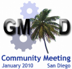

# Tripal Working Group

From GMOD

Jump to: [navigation](#mw-navigation), [search](#p-search)

<table
style="font-size: 160%; vertical-align: middle; border: 2px solid #A6A6BC; line-height: 120%"
data-cellpadding="10">
<colgroup>
<col style="width: 33%" />
<col style="width: 33%" />
<col style="width: 33%" />
</colgroup>
<tbody>
<tr class="odd">
<td style="text-align: center;"></td>
<td data-valign="middle"><strong><a href="January_2010_GMOD_Meeting"
title="January 2010 GMOD Meeting">January 2010 Satellite
Meeting</a></strong> 
January 13, 2010 
 
Following <a href="PAG_2010" title="PAG 2010">PAG 2010</a> 
San Diego, California, USA</td>
<td data-valign="middle"></td>
</tr>
</tbody>
</table>

  

There will be a [Satellite
Meeting](January_2010_GMOD_Meeting#Satellite_Meetings "January 2010 GMOD Meeting")
on [Tripal](Tripal.1 "Tripal") at the [January 2010 GMOD
Meeting](January_2010_GMOD_Meeting "January 2010 GMOD Meeting"). This
working group will be a discussion of [Tripal](Tripal.1 "Tripal") with
an emphasis on future development plans. Anyone using Tripal, planning
on or interested in it, or with an interest in using Drupal as a web
front end to <a href="Chado" class="mw-redirect" title="Chado">Chado</a>
is encouraged to attend.

## Time: 4-6pm, Wednedsay, January 13

The working group will meet:

|        |                                                     |
|--------|-----------------------------------------------------|
| Time:  | **4-6pm, Wednesday, January 13.**                   |
| Venue: | **Lobby of the Town and Country Convention Center** |

This is between the end of content at [PAG 2010](PAG_2010 "PAG 2010")
and the PAG conference dinner. We may lose wireless halfway through the
meeting.

## Participants

If you are interested, please add your name below. You may also want to
subscribe to the Tripal mailing list.

| Name | Email | Affiliation | Comments |
|----|----|----|----|
| [Stephen Ficklin](User:Sficklin "User:Sficklin") | ficklin\<\*\>clemson.edu | <a href="http://www.genome.clemson.edu/" class="external text"
rel="nofollow">CUGI</a> |  |
| Meg Staton | mestato\<\*\>yahoo.com | <a href="http://www.genome.clemson.edu/" class="external text"
rel="nofollow">CUGI</a> |  |
| Sook Jung | sook\<\*\>bioinfo.wsu.edu | Washington State University, <a href="http://www.bioinfo.wsu.edu/gdr/" class="external text"
rel="nofollow">GDR</a> |  |
| [Michael Caudy](User:Mcaudy "User:Mcaudy") | mcaudy\<\*\>gmail.com | <a href="http://www.reactome.org" class="external text"
rel="nofollow">Reactome</a> |  |
| [Dave Clements](User:Clements "User:Clements") | clements\<\*\>nescent.org | GMOD, <a href="http://nescent.org/" class="external text"
rel="nofollow">NESCent</a> |  |

Retrieved from
"<http://gmod.org/mediawiki/index.php?title=Tripal_Working_Group&oldid=21847>"

[Categories](Special:Categories "Special:Categories"):

- [Tripal](Category:Tripal "Category:Tripal")
- [Meetings](Category:Meetings "Category:Meetings")

## Navigation menu

### Namespaces

- <a
  href="http://gmod.org/mediawiki/index.php?title=Talk:Tripal_Working_Group&amp;action=edit&amp;redlink=1"
  accesskey="t"
  title="Discussion about the content page [t]">Discussion</a>

### 

### Variants

### Navigation

- [GMOD Home](Main_Page)
- [Software](GMOD_Components)
- [Categories /
  Tags](Categories)

### Documentation

- [Overview](Overview)
- [FAQs](Category:FAQ)
- [HOWTOs](Category:HOWTO)
- [Glossary](Glossary)

### Community

- [GMOD News](GMOD_News)
- [Training /
  Outreach](Training_and_Outreach)
- [Support](Support)
- [GMOD Promotion](GMOD_Promotion)
- [Meetings](Meetings)
- [Calendar](Calendar)

### Tools

- <a href="Special:Browse/Tripal_Working_Group" rel="smw-browse">Browse
  properties</a>

- Last updated at 00:43 on 3 October
  2012.
<!-- - 24,253 page views. -->
- Content is available under
  <a href="http://www.gnu.org/licenses/fdl-1.3.html" class="external"
  rel="nofollow">a GNU Free Documentation License</a> unless otherwise
  noted.

<!-- -->

- [About
  GMOD](GMOD:About "GMOD:About")

<!-- -->

