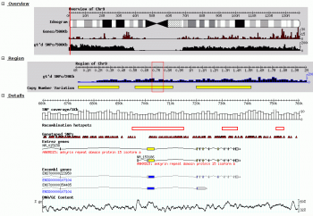

# User:Girlwithglasses/Template:ToolData/gbrowse

From GMOD

\<
[User:Girlwithglasses](../../User:Girlwithglasses "User:Girlwithglasses")

Jump to: [navigation](#mw-navigation), [search](#p-search)

- **GBrowse tool data**
- [tool
  template](../Template:StandardToolDisplay "User:Girlwithglasses/Template:StandardToolDisplay")
- <a
  href="http://gmod.org/mediawiki/index.php?title=User:Girlwithglasses/GBrowse&amp;action=edit&amp;redlink=1"
  class="new"
  title="User:Girlwithglasses/GBrowse (page does not exist)">GBrowse
  page</a>

  
{{ {{{template}}} \| name = GBrowse \| status = mature \| dev =
maintenance \| support = active \| os_web = yes \| os_mac = yes \|
os_linux = yes \| os_win = yes \| os_unix = yes \| logo =
GBrowseLogo.png \| home =
<a href="http://gbrowse.org" class="external free"
rel="nofollow">http://gbrowse.org</a> \| note = The information on this
page refers to GBrowse 2; <a
href="http://gmod.org/mediawiki/index.php?title=GBrowse_1_x&amp;action=edit&amp;redlink=1"
class="new" title="GBrowse 1 x (page does not exist)">GBrowse 1.x</a> is
recommended only for applications where legacy browser support is
required and a single database is used. \| about = GBrowse is a
combination of database and interactive web pages for manipulating and
displaying annotations on genomes. Features include:

- Simultaneous bird's eye and detailed views of the genome.
- Scroll, zoom, center.
- Use a variety of
  <a href="../../GBrowse_Configuration_HOWTO#Glyphs_and_Glyph_Options"
  class="mw-redirect" title="GBrowse Configuration HOWTO">premade
  glyphs</a> or create your own.
- Attach arbitrary URLs to any annotation.
- Order and appearance of tracks are customizable by administrator and
  end-user.
- Search by annotation ID, name, or comment.
- Supports third party annotation using [GFF](../../GFF "GFF") formats.
- Settings persist across sessions.
- DNA and [GFF](../../GFF "GFF") dumps.
- Connectivity to different databases, including
  [BioSQL](../../BioSQL "BioSQL") and
  <a href="../../Chado" class="mw-redirect" title="Chado">Chado</a>.
- Multi-language support.
- Third-party feature loading.
- Customizable [plug-in](../../GBrowse_Plugins "GBrowse Plugins")
  architecture (e.g. run
  <a href="http://en.wikipedia.org/wiki/BLAST" class="extiw"
  title="wp:BLAST">BLAST</a>, dump & import many formats, find
  oligonucleotides, [design
  primers](../../PrimerDesigner.pm "PrimerDesigner.pm"), create
  restriction maps, edit features)

\| scrnsht =

GBrowse running on
<a href="http://hapmap.ncbi.nlm.nih.gov/downloads/index.html"
class="external text" rel="nofollow">HapMap.org</a>
<a href="../../../mediawiki/images/1/10/GBrowse_screenshot1.png"
class="internal" title="GBrowse screenshot1.png">Click to view at full
resolution</a>

\| dl = <a
href="http://sourceforge.net/projects/gmod/files/Generic%20Genome%20Browser/"
class="external free"
rel="nofollow">http://sourceforge.net/projects/gmod/files/Generic%20Genome%20Browser/</a>
\| dl_src = <a
href="http://sourceforge.net/projects/gmod/files/Generic%20Genome%20Browser/"
class="external free"
rel="nofollow">http://sourceforge.net/projects/gmod/files/Generic%20Genome%20Browser/</a>
\| dl_dev =
<a href="https://github.com/GMOD/GBrowse" class="external text"
rel="nofollow">GBrowse repository on GitHub</a> \|
getting_started_preamble = \| req = GBrowse is
[Perl](../../Glossary#Perl "Glossary")-based and the GBrowse 2.x modules
are <a href="http://search.cpan.org/dist/GBrowse/" class="external text"
rel="nofollow">hosted on CPAN</a>. GBrowse can be installed using the
standard Perl module build procedure, or automated using a network-based
install script. In order to use the net installer, you will need to have
Perl 5.8.6 or higher and the Apache web server installed. \| install =
[GBrowse 2.x installation
guide](../../GBrowse_2.0_Install_HOWTO.1 "GBrowse 2.0 Install HOWTO") \|
config =
<a href="../../GBrowse_2.0_Configuration_HOWTO" class="mw-redirect"
title="GBrowse 2.0 Configuration HOWTO">Configuration guide</a> \| doc =

- <a
  href="http://search.cpan.org/dist/GBrowse/htdocs/tutorial/tutorial.html"
  class="external text" rel="nofollow">Administration tutorial</a>
- <a href="http://search.cpan.org/dist/GBrowse/htdocs/general_help.html"
  class="external text" rel="nofollow">Usage tutorial</a>
- <a
  href="http://search.cpan.org/dist/GBrowse/htdocs/annotation_help.html"
  class="external text" rel="nofollow">Annotation Help</a>
- [GBrowse Popup
  Balloons](../../GBrowse_Popup_Balloons "GBrowse Popup Balloons")
- [GBrowse FAQ](../../GBrowse_FAQ "GBrowse FAQ")

### POD documentation

There are many useful POD documents included with the distribution.
These are converted to HTML files when you install the package, and can
be found in /gbrowse/docs/pod.

GBrowse 2.x pod documents can also be viewed online at CPAN:

- <a href="http://search.cpan.org/dist/GBrowse/docs/pod/FAQ.pod"
  class="external text" rel="nofollow">FAQ</a>
- <a href="http://search.cpan.org/dist/GBrowse/docs/pod/INSTALL.pod"
  class="external text" rel="nofollow">INSTALL</a>
- <a
  href="http://search.cpan.org/dist/GBrowse/docs/pod/INSTALL.MacOSX.pod"
  class="external text" rel="nofollow">INSTALL.MacOSX</a>
- <a href="http://search.cpan.org/dist/GBrowse/docs/pod/README-chado.pod"
  class="external text" rel="nofollow">README-chado</a>
- <a
  href="http://search.cpan.org/dist/GBrowse/docs/pod/README-gff-files.pod"
  class="external text" rel="nofollow">README-gff-files</a> (see also
  [GFF](../../GFF "GFF"))
- <a
  href="http://search.cpan.org/dist/GBrowse/docs/pod/README-lucegene.pod"
  class="external text" rel="nofollow">README-lucegene</a>
- <a
  href="http://search.cpan.org/dist/GBrowse/docs/pod/BIOSQL_ADAPTER_HOWTO.pod"
  class="external text" rel="nofollow">BIOSQL_ADAPTER_HOWTO</a>
- <a href="http://search.cpan.org/dist/GBrowse/docs/pod/GENBANK_HOWTO.pod"
  class="external text" rel="nofollow">GENBANK_HOWTO</a>
- <a href="http://search.cpan.org/dist/GBrowse/docs/pod/PLUGINS_HOWTO.pod"
  class="external text" rel="nofollow">PLUGINS_HOWTO</a>
- <a href="http://search.cpan.org/dist/GBrowse/docs/pod/DAS_HOWTO.pod"
  class="external text" rel="nofollow">DAS_HOWTO</a>
- <a
  href="http://search.cpan.org/dist/GBrowse/docs/pod/MAKE_IMAGES_HOWTO.pod"
  class="external text" rel="nofollow">MAKE_IMAGES_HOWTO</a>
- <a href="http://search.cpan.org/dist/GBrowse/docs/pod/GBROWSE_IMG.pod"
  class="external text" rel="nofollow">GBROWSE_IMG</a>
- <a
  href="http://search.cpan.org/dist/GBrowse/docs/pod/ORACLE_AND_POSTGRESQL.pod"
  class="external text" rel="nofollow">ORACLE_AND_POSTGRESQL</a>

\| papers = publications

- Using the Generic Genome Browser
  ([GBrowse](../../GBrowse.1 "GBrowse")).
  [\[1\]](#cite_note-PMID:19957275-1)
- SNP@Evolution: a hierarchical database of positive selection on the
  human genome. [\[2\]](#cite_note-PMID:19732458-2)
  ([GBrowse](../../GBrowse.1 "GBrowse")-related)
- TBrowse: an integrative genomics map of Mycobacterium tuberculosis.
  [\[3\]](#cite_note-PMID:19683474-3)
  ([GBrowse](../../GBrowse.1 "GBrowse")-related)
- FishMap: a community resource for zebrafish genomics.
  [\[4\]](#cite_note-PMID:18554176-4)
  ([GBrowse](../../GBrowse.1 "GBrowse")-related)
- Using the Generic Genome Browser
  ([GBrowse](../../GBrowse.1 "GBrowse")).
  [\[5\]](#cite_note-PMID:18428797-5)
- Genome-Wide Analysis of Nucleotide-Level Variation in Commonly Used
  Saccharomyces cerevisiae Strains.
  [\[6\]](#cite_note-PMID:17389913-6) (See <a
  href="http://gbrowse.princeton.edu/cgi-bin/gbrowse/yeast_strains_snps/"
  class="external text" rel="nofollow">YSB</a>.)
- Gbrowse Moby: a Web-based browser for
  <a href="http://biomoby.open-bio.org/" class="external text"
  rel="nofollow">BioMoby</a> Services.
  [\[7\]](#cite_note-PMID:17147784-7)
- The [generic genome browser (GBrowse)](../../GBrowse.1 "GBrowse"): a
  building block for a model organism system database.
  [\[8\]](#cite_note-PMID:12368253-8)
  <a href="../../../mediawiki/images/e/e7/1599-1.pdf" class="internal"
  title="1599-1.pdf">PDF</a>

\| tutorials = interactive tutorials or workshops \| presentations =
non-interactive tutorials or workshops \| mail =

|  |  |  |  |
|----|----|----|----|
|  | Mailing List Link | Description | Archive(s) |
| [GBrowse](../../GBrowse.1 "GBrowse") & [GBrowse_syn](../../GBrowse_syn.1 "GBrowse syn") | <a href="https://lists.sourceforge.net/lists/listinfo/gmod-gbrowse"
class="external text" rel="nofollow">gmod-gbrowse</a> | [GBrowse](../../GBrowse.1 "GBrowse") and [GBrowse_syn](../../GBrowse_syn.1 "GBrowse syn") users and developers. | <a href="http://dir.gmane.org/gmane.science.biology.gmod.gbrowse"
class="external text" rel="nofollow">Gmane</a>, <a href="http://gmod.827538.n3.nabble.com/GBrowse-f815907.html"
class="external text" rel="nofollow">Nabble (2010/05+)</a>, <a href="https://lists.sourceforge.net/lists/listinfo/gmod-gbrowse"
class="external text" rel="nofollow">Sourceforge</a> |
|  | <a href="https://lists.sourceforge.net/lists/listinfo/gmod-gbrowse-cmts"
class="external text" rel="nofollow">gmod-gbrowse-cmts</a> | Code updates. | <a
href="http://sourceforge.net/mailarchive/forum.php?forum_name=gmod-gbrowse-cmts"
class="external text" rel="nofollow">Sourceforge</a> |

\| logo_info = The [GBrowse
logo](../../File:GBrowseLogo.png "File:GBrowseLogo.png") was created by
<a href="mailto:alexisnb1@yahoo.com" class="external text"
rel="nofollow">Alex Read</a>, a participant in the [Spring 2010 Logo
Program](../../Spring_2010_Logo_Program "Spring 2010 Logo Program"),
while a design student at
<a href="http://www.linnbenton.edu" class="external text"
rel="nofollow">Linn-Benton Community College</a>. \| wild_urls =

- <a href="http://www.wormbase.org/tools/genome/gbrowse/c_elegans/"
  class="external text" rel="nofollow">WormBase</a>
- <a href="http://flybase.org/cgi-bin/gbrowse/dmel" class="external text"
  rel="nofollow">FlyBase</a>
- <a href="http://hapmap.ncbi.nlm.nih.gov/cgi-perl/gbrowse/gbrowse"
  class="external text" rel="nofollow">HapMap</a>

\| dev_ppl = who is developing the tool? \| dev_status = what's going on
at the moment \| tool_type = tool type / features

- Community Annotation
- Comparative Genome Visualization
- Database schema
- Database (Chado) web front ends
- Database tools
- Gene Expression Visualization
- Genome Annotation
- Genome Visualization & Editing
- Literature Tools
- Middleware
- Molecular Pathway Visualization
- Ontology Visualization
- Sequence Alignment
- Tool Integration
- Workflow Management

\| formats = }}  
**Cite error: `<ref>` tags exist, but no `<references/>` tag was found**

Retrieved from
"<http://gmod.org/mediawiki/index.php?title=User:Girlwithglasses/Template:ToolData/gbrowse&oldid=21054>"

[Category](../../Special:Categories "Special:Categories"):

- [GBrowse](../../Category:GBrowse "Category:GBrowse")

## Navigation menu

### Namespaces

- <a href="gbrowse" accesskey="c" title="View the user page [c]">User
  page</a>
- <a
  href="http://gmod.org/mediawiki/index.php?title=User_talk:Girlwithglasses/Template:ToolData/gbrowse&amp;action=edit&amp;redlink=1"
  accesskey="t"
  title="Discussion about the content page [t]">Discussion</a>

### 

### Variants

### Navigation

- [GMOD Home](../../Main_Page)
- [Software](../../GMOD_Components)
- [Categories /
  Tags](../../Categories)
- [View all
  pages](../../Special:AllPages)

### Documentation

- [Overview](../../Overview)
- [FAQs](../../Category:FAQ)
- [HOWTOs](../../Category:HOWTO)
- [Glossary](../../Glossary)

### Community

- [GMOD News](../../GMOD_News)
- [Training /
  Outreach](../../Training_and_Outreach)
- [Support](../../Support)
- [GMOD
  Promotion](../../GMOD_Promotion)
- [Meetings](../../Meetings)
- [Calendar](../../Calendar)

### Tools

- <a
  href="../../Special:Browse/User:Girlwithglasses-2FTemplate:ToolData-2Fgbrowse"
  rel="smw-browse">Browse properties</a>
- [Print as
  PDF](http://gmod.org/mediawiki/index.php?title=Special:PdfPrint&page=User:Girlwithglasses/Template:ToolData/gbrowse)

- Last updated at 23:43 on 10 August
  2012.
- 9,362 page views.
- Content is available under
  <a href="http://www.gnu.org/licenses/fdl-1.3.html" class="external"
  rel="nofollow">a GNU Free Documentation License</a> unless otherwise
  noted.

<!-- -->

- [About
  GMOD](../../GMOD:About "GMOD:About")

<!-- -->

- 
- 
  

