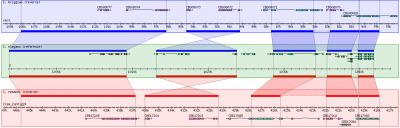

# User:Girlwithglasses/Template:ToolData/gbrowse syn

From GMOD

\<
[User:Girlwithglasses](../../User:Girlwithglasses "User:Girlwithglasses")

Jump to: [navigation](#mw-navigation), [search](#p-search)

- [Generic tool
  data](generic "User:Girlwithglasses/Template:ToolData/generic")
- [tool
  template](../Template:StandardToolDisplay "User:Girlwithglasses/Template:StandardToolDisplay")

  
{{ {{{template}}} \| name = GBrowse_syn \| status = mature \| dev =
active? \| support = active \| os_web = yes \| os_mac = yes \| os_linux
= yes \| os_win = yes \| os_unix = yes \| logo = GBrowse_syn_logo.png \|
home = \| about = GBrowse_syn, or the Generic Synteny Browser, is a
[GBrowse](../../GBrowse.1 "GBrowse")-based
<a href="../../Synteny" class="mw-redirect" title="Synteny">synteny</a>
browser designed to display multiple genomes, with a central reference
species compared to two or more additional species. It can be used to
view multiple sequence alignment data, synteny or co-linearity data from
other sources against genome annotations provided by GBrowse.
GBrowse_syn is included with the standard GBrowse package (version 1.69
and later).

\| scrnsht =

GBrowse_syn, as implemented at WormBase

\| public_server = \| dl = \| dl_src = \| dl_dev = \|
getting_started_preamble = GBrowse_syn has been part of the
[GBrowse](../../GBrowse.1 "GBrowse") distribution since version 1.69; we
recommend using the most up-to-date version of GBrowse 2. Please follow
the [installation instructions for
GBrowse](../../GBrowse_2.0_Install_HOWTO.1 "GBrowse 2.0 Install HOWTO").
\| req = \| install = \| config = Configuration of GBrowse_syn is much
the same as for [GBrowse](../../GBrowse.1 "GBrowse"), with database and
display options controlled by a configuration file. GBrowse_syn uses a
main configuration file for general options plus an individual
configuration for each species represented in the mutliple sequence
alignments.

More information on [GBrowse_syn
configuration](../../GBrowse_syn_Configuration "GBrowse syn Configuration")

\| usage = See the [help for
GBrowse_syn](../../GBrowse_syn_Help "GBrowse syn Help")

## Alignment data

- GBrowse_syn uses a central 'joining' database that contains
  information about the multiple sequence alignments
- There is an additional GBrowse database for each species represented
  in the alignments
- The databases for each species are configured in the same way as a
  regular GBrowse installations
- [Details on the GBrowse_syn
  database](../../GBrowse_syn_Database "GBrowse syn Database")

## User interface

The overall look of Gbrowse_syn resembles GBrowse but has some key
differences to accomodate the more complex comparative genome data (see
the <a
href="http://gmod.org/mediawiki/index.php?title=Screenshot&amp;action=edit&amp;redlink=1"
class="new" title="Screenshot (page does not exist)">screenshot</a>
above).

GBrowse_syn uses a central "reference species" panel, with inset panels
above and below for two or more aligned species. There is no upper limit
to the number of species that can be displayed.

\| doc = \| papers = Please refer to the following paper when citing
GBrowse_syn:

- Using the Generic Synteny Browser
  ([GBrowse_syn](../../GBrowse_syn.1 "GBrowse syn"))
  [\[1\]](#cite_note-PMID:20836076-1)

\| tutorials =

- <a href="../../GBrowse_syn_Tutorial" class="mw-redirect"
  title="GBrowse syn Tutorial">Installing and configuring GBrowse_syn</a>

\| presentations =

- <a href="../../../mediawiki/images/d/d4/GBrowse_syn_EBI2009.pdf"
  class="internal" title="GBrowse syn EBI2009.pdf">Challenges in
  Comparative Genome Browsing</a> - Presented by [Sheldon
  McKay](../../User:Mckays "User:Mckays") at the
  <a href="http://www.ebi.ac.uk" class="external text"
  rel="nofollow">European Bioinformatics Institute</a>, Hinxton, UK.
- <a href="../../../mediawiki/images/d/d8/GBrowse_synSMBE2009.pdf"
  class="internal" title="GBrowse synSMBE2009.pdf">Comparative Genomics
  with GBrowse_syn</a> - Presentation by [Sheldon
  McKay](../../User:Mckays "User:Mckays") at the <a
  href="http://ccg.biology.uiowa.edu/smbe/symposia.php?action=view&amp;sym_ID=27"
  class="external text" rel="nofollow">SMBE 2009 GMOD Workshop</a> on
  using [GBrowse_syn](../../GBrowse_syn.1 "GBrowse syn") for
  [comparative
  genomics](../../Category:Comparative_Genomics "Category:Comparative Genomics").
- [GBrowse_syn at
  PAG](../../GBrowse_syn_PAG_2009_Workshop "GBrowse syn PAG 2009 Workshop") -
  Presentation by [Sheldon McKay](../../User:Mckays "User:Mckays") at
  the Plant and Animal Genomes meeting, San Diego, CA, USA.
- <a href="../../../mediawiki/images/5/58/Gbrowse_syn.pdf"
  class="internal" title="Gbrowse syn.pdf">November 2007</a> - [Sheldon
  McKay](../../User:Mckays "User:Mckays")'s presentation on GBrowse_syn
  at the [November 2007 GMOD
  Meeting](../../November_2007_GMOD_Meeting#GBrowse_Syn "November 2007 GMOD Meeting").

\| mail = Support is via the GBrowse mailing list:

|  |  |  |  |
|----|----|----|----|
|  | Mailing List Link | Description | Archive(s) |
| [GBrowse](../../GBrowse.1 "GBrowse") & [GBrowse_syn](../../GBrowse_syn.1 "GBrowse syn") | <a href="https://lists.sourceforge.net/lists/listinfo/gmod-gbrowse"
class="external text" rel="nofollow">gmod-gbrowse</a> | [GBrowse](../../GBrowse.1 "GBrowse") and [GBrowse_syn](../../GBrowse_syn.1 "GBrowse syn") users and developers. | <a href="http://dir.gmane.org/gmane.science.biology.gmod.gbrowse"
class="external text" rel="nofollow">Gmane</a>, <a href="http://gmod.827538.n3.nabble.com/GBrowse-f815907.html"
class="external text" rel="nofollow">Nabble (2010/05+)</a>, <a href="https://lists.sourceforge.net/lists/listinfo/gmod-gbrowse"
class="external text" rel="nofollow">Sourceforge</a> |
|  | <a href="https://lists.sourceforge.net/lists/listinfo/gmod-gbrowse-cmts"
class="external text" rel="nofollow">gmod-gbrowse-cmts</a> | Code updates. | <a
href="http://sourceforge.net/mailarchive/forum.php?forum_name=gmod-gbrowse-cmts"
class="external text" rel="nofollow">Sourceforge</a> |

\| logo_info = The [GBrowse_syn
logo](../../File:GBrowse_syn_logo.png "File:GBrowse syn logo.png") was
created by
<a href="mailto:NextLevelDesignStudios@gmail.com" class="external text"
rel="nofollow">Darek Lakey</a>, a participant in the [Spring 2010 Logo
Program](../../Spring_2010_Logo_Program "Spring 2010 Logo Program"),
while a design student at
<a href="http://www.linnbenton.edu" class="external text"
rel="nofollow">Linn-Benton Community College</a>. \| wild_urls =

- <a
  href="http://www.arabidopsis.org/cgi-bin/gbrowse_syn/arabidopsis/?name=Chr1%3A8367000..8370501"
  class="external text" rel="nofollow">The Arabidopsis Information
  Resource</a>
- <a
  href="http://dev.wormbase.org/db/seq/gbrowse_syn/compara?search_src=Cele;name=X:1050001..1150000"
  class="external text" rel="nofollow">WormBase</a>
- <a href="http://solgenomics.net/gbrowse2/bin/gbrowse_syn/sol3/"
  class="external text" rel="nofollow">Sol Genomics</a>

\| dev_ppl = \| dev_status = See the <a
href="http://gmod.org/mediawiki/index.php?title=User_talk:Girlwithglasses/Template:ToolData/gbrowse_syn&amp;action=edit&amp;redlink=1"
class="new"
title="User talk:Girlwithglasses/Template:ToolData/gbrowse syn (page does not exist)">discussion
page</a> for notes on further GBrowse_syn development. \| tool_type =

- Comparative Genome Visualization

\| formats = \| see_also = The focus of this documentation is the
GBrowse_syn application. However, the generation of whole genome
alignments and identification of orthologous regions are the subject of
considerable interest, so some background reading is listed below:

- <a
  href="http://www.eecs.berkeley.edu/Pubs/TechRpts/2006/EECS-2006-104.html"
  class="external text" rel="nofollow">Primer on Hierarchical Genome
  Alignment Strategies</a>
- <a href="http://www.ncbi.nlm.nih.gov/pmc/articles/PMC2577869/"
  class="external text" rel="nofollow">article on PECAN and ENREDO</a>
- <a href="http://www.ebi.ac.uk/~bjp/pecan/" class="external text"
  rel="nofollow">all about PECAN</a>
- <a href="http://www.ensembl.org/info/website/archives/index.html"
  class="external text" rel="nofollow">Information about EnsEMBL's compara
  pipeline</a>

}}  
**Cite error: `<ref>` tags exist, but no `<references/>` tag was found**

Retrieved from
"<http://gmod.org/mediawiki/index.php?title=User:Girlwithglasses/Template:ToolData/gbrowse_syn&oldid=21065>"

## Navigation menu

### Namespaces

- <a href="gbrowse_syn" accesskey="c" title="View the user page [c]">User
  page</a>
- <a
  href="http://gmod.org/mediawiki/index.php?title=User_talk:Girlwithglasses/Template:ToolData/gbrowse_syn&amp;action=edit&amp;redlink=1"
  accesskey="t"
  title="Discussion about the content page [t]">Discussion</a>

### 

### Variants

### Search

### Navigation

- [GMOD Home](../../Main_Page)
- [Software](../../GMOD_Components)
- [Categories /
  Tags](../../Categories)
- [View all
  pages](../../Special:AllPages)

### Documentation

- [Overview](../../Overview)
- [FAQs](../../Category:FAQ)
- [HOWTOs](../../Category:HOWTO)
- [Glossary](../../Glossary)

### Community

- [GMOD News](../../GMOD_News)
- [Training /
  Outreach](../../Training_and_Outreach)
- [Support](../../Support)
- [GMOD
  Promotion](../../GMOD_Promotion)
- [Meetings](../../Meetings)
- [Calendar](../../Calendar)

### Tools

- <a
  href="../../Special:WhatLinksHere/User:Girlwithglasses/Template:ToolData/gbrowse_syn"
  accesskey="j" title="A list of all wiki pages that link here [j]">What
  links here</a>
- <a
  href="../../Special:RecentChangesLinked/User:Girlwithglasses/Template:ToolData/gbrowse_syn"
  accesskey="k"
  title="Recent changes in pages linked from this page [k]">Related
  changes</a>
- [User
  contributions](../../Special:Contributions/Girlwithglasses "A list of contributions of this user")
- [Logs](../../Special:Log/Girlwithglasses)
- <a href="../../Special:SpecialPages" accesskey="q"
  title="A list of all special pages [q]">Special pages</a>
- <a
  href="http://gmod.org/mediawiki/index.php?title=User:Girlwithglasses/Template:ToolData/gbrowse_syn&amp;printable=yes"
  rel="alternate" accesskey="p"
  title="Printable version of this page [p]">Printable version</a>
- [Permanent
  link](http://gmod.org/mediawiki/index.php?title=User:Girlwithglasses/Template:ToolData/gbrowse_syn&oldid=21065 "Permanent link to this revision of the page")
- [Page
  information](http://gmod.org/mediawiki/index.php?title=User:Girlwithglasses/Template:ToolData/gbrowse_syn&action=info)
- <a
  href="../../Special:Browse/User:Girlwithglasses-2FTemplate:ToolData-2Fgbrowse_syn"
  rel="smw-browse">Browse properties</a>
- [Print as
  PDF](http://gmod.org/mediawiki/index.php?title=Special:PdfPrint&page=User:Girlwithglasses/Template:ToolData/gbrowse_syn)

- Last updated at 23:24 on 14 August
  2012.
- 3,330 page views.
- Content is available under
  <a href="http://www.gnu.org/licenses/fdl-1.3.html" class="external"
  rel="nofollow">a GNU Free Documentation License</a> unless otherwise
  noted.

<!-- -->

- [About
  GMOD](../../GMOD:About "GMOD:About")

<!-- -->

- 
- 
  

