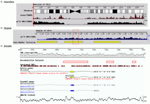

# User:JimHu/Gbrowse

From GMOD

\<
[User:JimHu](../User:JimHu.1 "User:JimHu")

Jump to: [navigation](#mw-navigation), [search](#p-search)

The [GBrowse logo](../File:GBrowseLogo.png "File:GBrowseLogo.png") was
created by <a href="mailto:alexisnb1@yahoo.com" class="external text"
rel="nofollow">Alex Read</a>, a participant in the [Spring 2010 Logo
Program](../Spring_2010_Logo_Program "Spring 2010 Logo Program"), while
a design student at
<a href="http://www.linn-benton.edu" class="external text"
rel="nofollow">Linn-Benton Community College</a>.

  

Status

- **Mature** release
- **Active** development
- **Active** support

Resources

- <a href="http://www.openhelix.com/gbrowse" class="external text"
  rel="nofollow">User Tutorial</a>
- <a href="http://cloud.gmod.org/gbrowse2/tutorial/tutorial.html"
  class="external text" rel="nofollow">GBrowse2 Admin Tutorial</a>
- [Admin T. + VMware](../GBrowse_Tutorial "GBrowse Tutorial")
- [NGS Tutorial](../GBrowse_NGS_Tutorial "GBrowse NGS Tutorial")
- <a href="../GBrowse_Configuration_HOWTO" class="mw-redirect"
  title="GBrowse Configuration HOWTO">Configuration</a>
- <a href="https://lists.sourceforge.net/lists/listinfo/gmod-gbrowse"
  class="external text" rel="nofollow">Mailing List</a>
- [WebGBrowse](../WebGBrowse.1 "WebGBrowse")
- <a href="http://gbrowse.org" class="external text"
  rel="nofollow">GBrowse.org</a>
- <a href="../../extras/2008GMODCommunitySurvey.html#GBrowse"
  class="external text" rel="nofollow">2008 Survey</a>

GBrowse[\[1\]](#cite_note-PMID:12368253-1) is a genome
[viewer](../Visualization "Visualization") and is GMOD's most popular
[component](../GMOD_Components "GMOD Components"). For a list of GBrowse
and GMOD installations see the [GMOD Users
page](../GMOD_Users "GMOD Users"). For a demo of its features, try the
<a href="http://wormbase.org/db/gb2/gbrowse/c_elegans/"
class="external text" rel="nofollow">WormBase</a>,
<a href="http://flybase.org/cgi-bin/gbrowse/dmel" class="external text"
rel="nofollow">FlyBase</a>, or <a
href="http://projects.tcag.ca/cgi-bin/duplication/dupbrowse/human_b35"
class="external text" rel="nofollow">Human Genome Segmental Duplication
Database</a> web sites.

## Contents

- [1
  Description](#Description)
- [2 Overview of
  setting up GBrowse for your
  website](#Overview_of_setting_up_GBrowse_for_your_website)
- [3 GBrowse
  Versions](#GBrowse_Versions)
- [4
  Installation](#Installation)
- [5 About
  Databases](#About_Databases)
- [6
  Contacts](#Contacts)
- [7
  References](#References)

## Description

GBrowse running on
<a href="http://hapmap.org/downloads/index.html" class="external text"
rel="nofollow">HapMap.org</a>
<a href="../../mediawiki/images/1/10/GBrowse_screenshot1.png"
class="internal" title="GBrowse screenshot1.png">View at full
resolution</a>

The Generic Genome Browser (GBrowse) is a combination of database and
interactive Web page for manipulating and displaying annotations on
genomes. Some of its features:

- Simultaneous bird's eye and detailed views of the genome.
- Scroll, zoom, center.
- Use a variety of
  <a href="../GBrowse_Configuration_HOWTO#Glyphs_and_Glyph_Options"
  class="mw-redirect" title="GBrowse Configuration HOWTO">premade
  glyphs</a> or create your own.
- Attach arbitrary URLs to any annotation.
- Order and appearance of tracks are customizable by administrator and
  end-user.
- Search by annotation ID, name, or comment.
- Supports third party annotation using [GFF](../GFF "GFF") formats.
- Settings persist across sessions.
- DNA and [GFF](../GFF "GFF") dumps.
- Connectivity to different databases, including
  [BioSQL](../BioSQL "BioSQL") and
  <a href="../Chado" class="mw-redirect" title="Chado">Chado</a>.
- Multi-language support.
- Third-party feature loading.
- Customizable [plug-in](../GBrowse_Plugins "GBrowse Plugins")
  architecture (e.g. run
  <a href="http://en.wikipedia.org/wiki/BLAST" class="extiw"
  title="wp:BLAST">BLAST</a>, dump & import many formats, find
  oligonucleotides, [design
  primers](../PrimerDesigner.pm "PrimerDesigner.pm"), create restriction
  maps, edit features)

## Overview of setting up GBrowse for your website

To set up gbrowse for your own website[\[2\]](#cite_note-2)

- Choose which version you want to use
- Obtain and install the appropriate software
  - Make sure it works with sample data
- Getting it to work with your favorite data
- Customizing configuration

The sections below are brief descriptions of each of these aspects and
link to more detailed descriptions.

## GBrowse Versions

<table data-border="2" data-cellpadding="4" data-cellspacing="0"
style="margin: 1em 1em 1em 0; border: 1px #aaa solid; border-collapse: collapse;">
<colgroup>
<col style="width: 33%" />
<col style="width: 33%" />
<col style="width: 33%" />
</colgroup>
<tbody>
<tr class="odd">
<td style="text-align: left;">Version</td>
<td>
1.x
</td>
<td>
2.x
</td>
</tr>
<tr class="even">
<td style="text-align: left;">Pros</td>
<td></td>
<td></td>
</tr>
<tr class="odd">
<td style="text-align: left;">Cons</td>
<td></td>
<td>
 

</td>
</tr>
<tr class="even sortbottom">
<td style="text-align: left;"><a
href="http://gmod.org/mediawiki?title=Special:TableEdit&amp;id=90f302545d6d2678756d3936319fd651.2000.L4c61e9f2dd479&amp;page=2000&amp;pagename=User:JimHu/Gbrowse&amp;type=1&amp;template=Version_table"
class="external text" rel="nofollow">edit table</a></td>
<td></td>
<td></td>
</tr>
</tbody>
</table>

**GBrowse 1.X** (currently 1.70) is the older series that has been in
use since 2002. It is recommended for applications which use a single
database only and which must support legacy browsers.

**GBrowse 2.0** is a rewrite of the original GBrowse to add dynamic
updating via AJAX and a smoother user experience. In addition, it
provides administrators with the ability to attach a different genome
database to each GBrowse track, making it much easier to manage and
update tracks. It also provides a distributed backend system of "slave"
renderers, allowing each track to be rendered in parallel on a different
machine and significantly increasing performance. GBrowse 2.0 is
considered stable,but does not have full internationalization support.
In addition, there may be issues with older browsers that do not support
newer JavaScript features. See the [GBrowse 2.0
HOWTO](../GBrowse_2.0_HOWTO "GBrowse 2.0 HOWTO").

## Installation

## About Databases

## Contacts

Please report bugs to the SourceForge <a
href="http://sourceforge.net/tracker/?func=add&amp;group_id=27707&amp;atid=391291"
class="external text" rel="nofollow">Bug Tracker</a> (select 'Category:
Gbrowse').

|  |  |  |  |
|----|----|----|----|
|  | Mailing List Link | Description | Archive(s) |
| [GBrowse](../GBrowse.1 "GBrowse") & [GBrowse_syn](../GBrowse_syn.1 "GBrowse syn") | <a href="https://lists.sourceforge.net/lists/listinfo/gmod-gbrowse"
class="external text" rel="nofollow">gmod-gbrowse</a> | [GBrowse](../GBrowse.1 "GBrowse") and [GBrowse_syn](../GBrowse_syn.1 "GBrowse syn") users and developers. | <a href="http://dir.gmane.org/gmane.science.biology.gmod.gbrowse"
class="external text" rel="nofollow">Gmane</a>, <a href="http://gmod.827538.n3.nabble.com/GBrowse-f815907.html"
class="external text" rel="nofollow">Nabble (2010/05+)</a>, <a href="https://lists.sourceforge.net/lists/listinfo/gmod-gbrowse"
class="external text" rel="nofollow">Sourceforge</a> |
|  | <a href="https://lists.sourceforge.net/lists/listinfo/gmod-gbrowse-cmts"
class="external text" rel="nofollow">gmod-gbrowse-cmts</a> | Code updates. | <a
href="http://sourceforge.net/mailarchive/forum.php?forum_name=gmod-gbrowse-cmts"
class="external text" rel="nofollow">Sourceforge</a> |

  

## References

1.  [↑](#cite_ref-PMID:12368253_0)
    **Cite error: Invalid `<ref>` tag; no text was provided for refs
    named `PMID:12368253`**
2.  [↑](#cite_ref-2)
    It doesn't have to actually be on the
    web; many users install Gbrowse on their laptops and view it locally
    via a browser

Retrieved from
"<http://gmod.org/mediawiki/index.php?title=User:JimHu/Gbrowse&oldid=22009>"

Facts about
"[JimHu/Gbrowse](../Special:Browse/User:JimHu-2FGbrowse "Special:Browse/User:JimHu-2FGbrowse")"[RDF
feed](http://gmod.org/wiki/Special:ExportRDF/User:JimHu/Gbrowse "Special:ExportRDF/User:JimHu/Gbrowse")

|  |  |
|----|----|
| <a
href="http://gmod.org/mediawiki/index.php?title=Property:Date_published&amp;action=edit&amp;redlink=1"
class="new"
title="Property:Date published (page does not exist)">Date published</a> | 2002 [+](../Special:SearchByProperty/Date-20published/2002 "Special:SearchByProperty/Date-20published/2002") |
| <a
href="http://gmod.org/mediawiki/index.php?title=Property:Has_DOI&amp;action=edit&amp;redlink=1"
class="new" title="Property:Has DOI (page does not exist)">Has DOI</a> | 10.1101/gr.403602 [+](../Special:SearchByProperty/Has-20DOI/10.1101-2Fgr.403602 "Special:SearchByProperty/Has-20DOI/10.1101-2Fgr.403602") |
| <a
href="http://gmod.org/mediawiki/index.php?title=Property:Has_PMCID&amp;action=edit&amp;redlink=1"
class="new"
title="Property:Has PMCID (page does not exist)">Has PMCID</a> | PMC187535 [+](../Special:SearchByProperty/Has-20PMCID/PMC187535 "Special:SearchByProperty/Has-20PMCID/PMC187535") |
| <a
href="http://gmod.org/mediawiki/index.php?title=Property:Has_PMID&amp;action=edit&amp;redlink=1"
class="new" title="Property:Has PMID (page does not exist)">Has PMID</a> | 12368253 [+](../Special:SearchByProperty/Has-20PMID/12368253 "Special:SearchByProperty/Has-20PMID/12368253") |
| <a
href="http://gmod.org/mediawiki/index.php?title=Property:Has_author&amp;action=edit&amp;redlink=1"
class="new"
title="Property:Has author (page does not exist)">Has author</a> | Stein LD [+](../Special:SearchByProperty/Has-20author/Stein-20LD "Special:SearchByProperty/Has-20author/Stein-20LD"), Mungall C [+](../Special:SearchByProperty/Has-20author/Mungall-20C "Special:SearchByProperty/Has-20author/Mungall-20C"), Shu S [+](../Special:SearchByProperty/Has-20author/Shu-20S "Special:SearchByProperty/Has-20author/Shu-20S"), Caudy M [+](../Special:SearchByProperty/Has-20author/Caudy-20M "Special:SearchByProperty/Has-20author/Caudy-20M"), Mangone M [+](../Special:SearchByProperty/Has-20author/Mangone-20M "Special:SearchByProperty/Has-20author/Mangone-20M"), Day A [+](../Special:SearchByProperty/Has-20author/Day-20A "Special:SearchByProperty/Has-20author/Day-20A"), Nickerson E [+](../Special:SearchByProperty/Has-20author/Nickerson-20E "Special:SearchByProperty/Has-20author/Nickerson-20E"), Stajich JE [+](../Special:SearchByProperty/Has-20author/Stajich-20JE "Special:SearchByProperty/Has-20author/Stajich-20JE"), Harris TW [+](../Special:SearchByProperty/Has-20author/Harris-20TW "Special:SearchByProperty/Has-20author/Harris-20TW"), Arva A [+](../Special:SearchByProperty/Has-20author/Arva-20A "Special:SearchByProperty/Has-20author/Arva-20A") and Lewis S [+](../Special:SearchByProperty/Has-20author/Lewis-20S "Special:SearchByProperty/Has-20author/Lewis-20S") |
| <a
href="http://gmod.org/mediawiki/index.php?title=Property:Has_publication_details&amp;action=edit&amp;redlink=1"
class="new"
title="Property:Has publication details (page does not exist)">Has publication details</a> | Genome research 12: 1599-610 [+](../Special:SearchByProperty/Has-20publication-20details/Genome-20research-2012:-201599-2D610 "Special:SearchByProperty/Has-20publication-20details/Genome-20research-2012:-201599-2D610") |
| [Has title](../Property:Has_title "Property:Has title") | The generic genome browser: a building block for a model organism system database. [+](../Special:SearchByProperty/Has-20title/The-20generic-20genome-20browser:-20a-20building-20block-20for-20a-20model-20organism-20system-20database. "Special:SearchByProperty/Has-20title/The-20generic-20genome-20browser:-20a-20building-20block-20for-20a-20model-20organism-20system-20database.") |
| <a
href="http://gmod.org/mediawiki/index.php?title=Property:Published_in&amp;action=edit&amp;redlink=1"
class="new"
title="Property:Published in (page does not exist)">Published in</a> | Genome research [+](../Special:SearchByProperty/Published-20in/Genome-20research "Special:SearchByProperty/Published-20in/Genome-20research") |

## Navigation menu

### Namespaces

- <a href="Gbrowse" accesskey="c" title="View the user page [c]">User
  page</a>
- <a
  href="http://gmod.org/mediawiki/index.php?title=User_talk:JimHu/Gbrowse&amp;action=edit&amp;redlink=1"
  accesskey="t"
  title="Discussion about the content page [t]">Discussion</a>

### 

### Variants

### Search

### Navigation

- [GMOD Home](../Main_Page)
- [Software](../GMOD_Components)
- [Categories /
  Tags](../Categories)
- [View all
  pages](../Special:AllPages)

### Documentation

- [Overview](../Overview)
- [FAQs](../Category:FAQ)
- [HOWTOs](../Category:HOWTO)
- [Glossary](../Glossary)

### Community

- [GMOD News](../GMOD_News)
- [Training /
  Outreach](../Training_and_Outreach)
- [Support](../Support)
- [GMOD Promotion](../GMOD_Promotion)
- [Meetings](../Meetings)
- [Calendar](../Calendar)

### Tools

- <a href="../Special:WhatLinksHere/User:JimHu/Gbrowse" accesskey="j"
  title="A list of all wiki pages that link here [j]">What links here</a>
- <a href="../Special:RecentChangesLinked/User:JimHu/Gbrowse"
  accesskey="k"
  title="Recent changes in pages linked from this page [k]">Related
  changes</a>
- [User
  contributions](../Special:Contributions/JimHu "A list of contributions of this user")
- [Logs](../Special:Log/JimHu)
- <a href="../Special:SpecialPages" accesskey="q"
  title="A list of all special pages [q]">Special pages</a>
- <a
  href="http://gmod.org/mediawiki/index.php?title=User:JimHu/Gbrowse&amp;printable=yes"
  rel="alternate" accesskey="p"
  title="Printable version of this page [p]">Printable version</a>
- [Permanent
  link](http://gmod.org/mediawiki/index.php?title=User:JimHu/Gbrowse&oldid=22009 "Permanent link to this revision of the page")
- [Page
  information](http://gmod.org/mediawiki/index.php?title=User:JimHu/Gbrowse&action=info)
- <a href="../Special:Browse/User:JimHu-2FGbrowse" rel="smw-browse">Browse
  properties</a>
- [Print as
  PDF](http://gmod.org/mediawiki/index.php?title=Special:PdfPrint&page=User:JimHu/Gbrowse)

- Last updated at 18:56 on 8 October
  2012.
- 34,068 page views.
- Content is available under
  <a href="http://www.gnu.org/licenses/fdl-1.3.html" class="external"
  rel="nofollow">a GNU Free Documentation License</a> unless otherwise
  noted.

<!-- -->

- [About
  GMOD](../GMOD:About "GMOD:About")

<!-- -->

- 
- 
  

