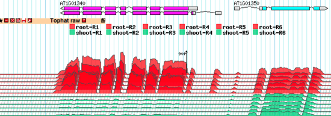
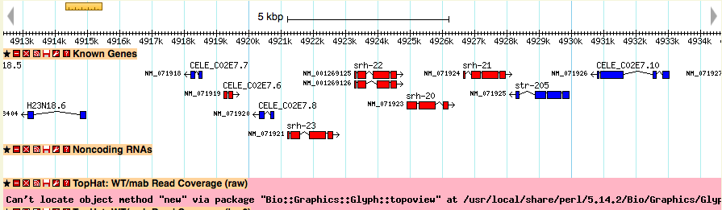
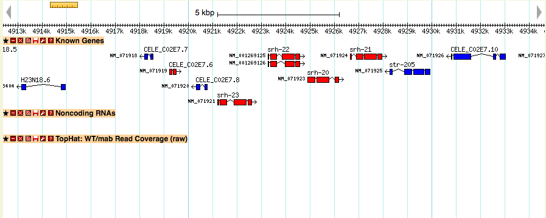

# Using the topoview Glyph

From GMOD

Jump to: [navigation](#mw-navigation), [search](#p-search)

This glyph is derived from the FlyBase
<a href="http://flybase.org/static_pages/docs/software/topoview.html"
class="external text" rel="nofollow">fb_shmiggle Glyph</a>, 2009-2010
Victor Strelets, FlyBase.org

It is maintained by
<a href="mailto:sheldon.mckay@gmail.com" class="external text"
rel="nofollow">Sheldon McKay &lt;sheldon.mckay@gmail.com&gt;</a>

The TopoView glyph was developed for fast 3D-like demonstration of
RNA-seq data consisting of multiple individual subsets. The main
purposes were to compact presentation as much as possible (in one
reasonably sized track) and to allow easy visual detection of
coordinated behavior of the expression profiles of different subsets.
See the note below about normalizing the expression profiles across the
whole experiment.

## Contents

- [1
  Demonstration](#Demonstration)
- [2 Data
  format](#Data_format)
- [3 Accessory
  scripts](#Accessory_scripts)
  - [3.1 Converting
    BAM alignment files to WIG coverage
    files](#Converting_BAM_alignment_files_to_WIG_coverage_files)
    - [3.1.1 NOTE:
      Normalization](#NOTE:_Normalization)
  - [3.2 Converting
    coverage WIG to indexed data for
    topoview](#Converting_coverage_WIG_to_indexed_data_for_topoview)
    - [3.2.1 Log
      transformations](#Log_transformations)
    - [3.2.2
      Subsets
      (subplots)](#Subsets_.28subplots.29)
    - [3.2.3 Output
      directories](#Output_directories)
- [4
  Configuration](#Configuration)
  - [4.1 Example
    config stanza](#Example_config_stanza)
  - [4.2
    Options](#Options)
    - [4.2.1
      Subsets](#Subsets)
- [5 Installation
  Troubleshooting](#Installation_Troubleshooting)
  - [5.1 Track has
    a red error message](#Track_has_a_red_error_message)
  - [5.2 Track is
    present but has no data](#Track_is_present_but_has_no_data)
  - [5.3 Some other
    kind of error](#Some_other_kind_of_error)
  - [5.4 Ask for
    help](#Ask_for_help)

## Demonstration

Setting up this Glyph can be complicated. If you have access to Amazon
Web Services, there is an AMI with a demonstration instance of Gbrowse
using the topoview track for RNASeq data at:

GBrowse 2.56 with topoview track - ami-c2d677bf

  

## Data format

Comparing performance (retrieval of several Kbp of data profiles for
several subsets of some RNA-seq experiment) of wiggle binary method and
of several possible alternatives, it was discovered that one of the
approaches remarkably outperforms wiggle bin method (although it
requires several times more space for formatted data storage). Optimal
storage/retrieval method stores all experiment data (all subsets of the
experiment) in one text file, where structure of the file in fact is one
of the most simple wiggle (coverage files) formats with the addition of
some positioning data (two-column format, without runlength
specification, without omission of zero values). This is the only format
which glyph is able to handle.

                                                                                                                                                                                                                                                                                                                                                                                                                                                                                            
    # subset =BS107_all_unique chromosome =2LHet                                                                                                                                                                                                                                                                                                                                                                                                                                                 
    -200000 0                                                                                                                                                                                                                                                                                                                                                                                                                                                                                    
    0       0                                                                                                                                                                                                                                                                                                                                                                                                                                                                                    
    19955   1                                                                                                                                                                                                                                                                                                                                                                                                                                                                                    
    19959   0                                                                                                                                                                                                                                                                                                                                                                                                                                                                                    
    19967   2                                                                                                                                                                                                                                                                                                                                                                                                                                                                                    
    19972   0                                                                                                                                                                                                                                                                                                                                                                                                                                                                                    
    19977   2                                                                                                                                                                                                                                                                                                                                                                                                                                                                                    
    20027   0                                                                                                                                                                                                                                                                                                                                                                                                                                                                                    
    20031   2                                                                                                                                                                                                                                                                                                                                                                                                                                                                                    
    20035   0                                                                                                                                                                                                                                                                                                                                                                                                                                                                                    
    20043   1                                                                                                                                                                                                                                                                                                                                                                                                                                                                                    

## Accessory scripts

The Bio::Graphics package has two scripts useful for processing BAM
alignment data from programs such as tophat for use with this glyph.

### Converting BAM alignment files to WIG coverage files

bam_coverage_windows.pl accepts a sorted bam file as input and will
calculate the average read coverage for a user-specified window size
(default 25). The windows are non-overlapping. The output format is
WIG/BED4, which is the format used by the coverage_to_topoview.pl
script.

                                                                                                                                                                                                                                                                                                                                                                                                                                                                                            
    Usage: bam_coverage_windows.pl -b bamfile -n 10_000_000 -w 25 | gzip -c > bamfile.wig.gz                                                                                                                                                                                                                                                                                                                                                                                                
        -b name of bam file to read REQUIRED                                                                                                                                                                                                                                                                                                                                                                                                                                                     
        -w window size (default 25)                                                                                                                                                                                                                                                                                                                                                                                                                                                              
        -n normalized read number -- if you will be comparing multiple bam files                                                                                                                                                                                                                                                                                                                                                                                                                 
                                     select the read number to normalize against.                                                                                                                                                                                                                                                                                                                                                                                                                
                                     All counts will be adjusted by a factor of:                                                                                                                                                                                                                                                                                                                                                                                                                 
                                     actual read count/normalized read count                                                                                                                                                                                                                                                                                                                                                                                                                          
                                                                                                                                                                                                                                                                                                                                                                                                                                                                                                 

The output of this script looks like (note the
<a href="http://genomewiki.ucsc.edu/index.php/Coordinate_Transforms"
class="external text" rel="nofollow">zero-based, half-open</a>
coordinates):

    track type=wiggle_0 name="root-R1" description="read coverage for bam/root-R1.bam (window size 25)"
    1   3625    3650    0.7617701464
    1   3650    3675    9.3417075848
    1   3675    3700    18.5230425072
    1   3700    3725    26.5817687928
    1   3725    3750    35.682917384
    1   3750    3775    40.494097256
    1   3775    3800    45.0246249688
    1   3800    3825    52.2413947768

#### NOTE: Normalization

If you are comparing BAM files with different total read counts, you
need to normalize the read counts across BAM file with the ***-n***
option. The number used is arbitrary. Try using a number near the
average read count for all BAM files being analyzed in the experiment.

### Converting coverage WIG to indexed data for topoview

coverage_to_topoview.pl converts a list of coverage files (WIG/BED4) to
the indexed format used by this glyph. It specifically expects the BED4
format produced by the bam_coverage_windows.pl script

                                                                                                                                                                                                                                                                                                                                                                                                                                                                                            
    Usage: coverage_to_topoview.pl [-o output_dir] [-h] [-l] file1.wig.gz file2.wig.gz                                                                                                                                                                                                                                                                                                                                                                                                      
        -o output directory (default 'topoview')                                                                                                                                                                                                                                                                                                                                                                                                                                                 
        -l use log2 for read counts (recommended)                                                                                                                                                                                                                                                                                                                                                                                                                                                
        -h this help message                                                                                                                                                                                                                                                                                                                                                                                                                                                                     

#### Log transformations

The dynamic range in read coverage can be very high and log2 conversion
dramatically changes perception of expression profiles and helps to
illuminate coordinated behavior of different subsets. Using
log2-transformed read counts in addition to raw read counts is
recommended.

#### Subsets (subplots)

Each WIG file corresponds to a single BAM file and will be a subset in
the experiment. The base name of the file will be used as the subset
name. For example, the file ***shoots-R1.wig.gz*** will generate a
subset named ***shoots-R1*** in the topoview track.

#### Output directories

If you do not specify an output directory name, the default name
'topoview' will be used. Any existing contents will be overwritten. For
example, if you are making two tracks, one using raw counts and the
other using log2 transformed counts:

    coverage_to_topoview.pl -o raw file1.wig.gz file2.wig.gz

    coverage_to_topoview.pl -o log2 -l  file1.wig.gz file2.wig.gz

..will yield:

    ├── log2
    │   ├── data.cat
    │   └── index.bdbhash
    └── raw
        ├── data.cat
        └── index.bdbhash

The absolute path of these directories will be used in the ***datadir***
option below.

## Configuration

### Example config stanza

                                                                                                                                                                                                                                                                                                                                                                                                                                                                                            
    [TOPOVIEWLOG2]                                                                                                                                                                                                                                                                                                                                                                                                                                                                                                                                                                                                                                                                                                                                                                                                                                                                                                                                               
    feature       = region                                                                                                                                                                                                                                                                                                                                                                                                                                                                       
    glyph         = topoview                                                                                                                                                                                                                                                                                                                                                                                                                                                                     
    autoscale     = local                                                                                                                                                                                                                                                                                                                                                                                                                                                                        
    height        = 200                                                                                                                                                                                                                                                                                                                                                                                                                                                                          
    datadir       = /home/ubuntu/data/bam/log2                                                                                                                                                                                                                                                                                                                                                                                                                                                   
    subset order  = SRR1810778.25  FF9966                                                                                                                                                                                                                                                                                                                                                                                                                                                        
                    SRR1810779.25  FF6633                                                                                                                                                                                                                                                                                                                                                                                                                                                        
                    SRR1810780.25  FF0000                                                                                                                                                                                                                                                                                                                                                                                                                                                        
                    SRR1810781.25  00CC66                                                                                                                                                                                                                                                                                                                                                                                                                                                        
                    SRR1810782.25  009933                                                                                                                                                                                                                                                                                                                                                                                                                                                        
                    SRR1810783.25  006600                                                                                                                                                                                                                                                                                                                                                                                                                                                        
    key           = TopHat: Normalized Read Coverage (log2)                                                                                                                                                                                                                                                                                                                                                                                                                                      
    show max      = 0                                                                                                                                                                                                                                                                                                                                                                                                                                                                            
    x_step        = 2                                                                                                                                                                                                                                                                                                                                                                                                                                                                            
    y_step        = 8                                                                                                                                                                                                                                                                                                                                                                                                                                                                            
    fill opacity  = 0.8
    edge color    = black                                                                                                                                                                                                                                                                                                                                                                                                                                                                           

### Options

Glyph-specific options

- **feature:** The full-length feature for the track. This would usually
  be the feature type you configured for your chromosomes or scaffolds.
  You don't need to add more GFF data for this track
- **database:** The same database as you used for the chromosomes
- **autoscale:** options are 'local' and 'global'. local scales to the
  on-screen max value, global scales to the global max
- **datadir:** location of the indexed coverage data (absolute path)
- **show max:** show an extra subset corresponding to the maximum
  coverage across all subsets
- **x_step:** the horizontal offset (pixels) of each plotted subset (can
  not be zero)
- **y_step:** the vertical offset (pixels) of each plotted subset (can
  not be zero)
- **fill opacity:** the degree of transparency of each plotted subset.
  Translucency aids in the comparison.
- **edge color:** the outline color for the plots (default: charcoal
  gray)
- **subset order** the order and color of each subset (subplot) in the
  graph (see below)

#### Subsets

Setting the 'subset order' is mandatory. It specifies the subplots and
the order in which they will be displayed.

There are three ways to represent the subsets:  

Ordered subsets with no color specified. Random colors will be assigned.
Hope you are feeling lucky.

                                                                                                                                                                                                                                             
    subset order  = SRR1810778.25                                                                                                                                                                                                                 
                    ...                                                                                                                                                                                                                           

Ordered subsets with color specified (use either web colors or hex
colors with the '#' omitted)

                                                                                                                                                                                                                                             
    subset order  = SRR1810778.25  red                                                                                                                                                                                                        
                    SRR1810779.25  FF6633                                                                                                                                                                                                        
                    ...                                                                                                                                                                                                                           

Ordered subsets with color and opacity set. Not that the global 'fill
opacity' option affects all subsets. Specifying individual opacity is
optional.

                                                                                                                                                                                                                                             
    subset order  = SRR1810778.25  FF9966 0.8                                                                                                                                                                                                     
                    SRR1810779.25  FF6633 0.7                                                                                                                                                                                                     
                    ...                                                                                                                                                                                                                           

## Installation Troubleshooting

### Track has a red error message

The glyph uses the Perl interface to BerkeleyDB. If you see a red error
message in where the track should be, this might be why. In an
Ubuntu/debian system, try:

    sudo apt-get install libdb5.3 libdb5.3-dev libberkeleydb-perl

You may need to use apt-cache search to find other version of the above
Debian packages.

- For redhat based systems, such as centOS, use yum to search for
  equivalent packages.

### Track is present but has no data

Make sure the "feature=" option is set to the same kind of kind of
feature as the chromosomes in your scaffolds database

For example: If you were using the chromosome GFF below, you would set
your topoview feature to 'region':

    ##gff-version 3

    V   ce10    region  1   20924149    .   .   .   ID=V;Name=V
    X   ce10    region  1   17718866    .   .   .   ID=X;Name=X
    IV  ce10    region  1   17493793    .   .   .   ID=IV;Name=IV
    II  ce10    region  1   15279345    .   .   .   ID=II;Name=II
    I   ce10    region  1   15072423    .   .   .   ID=I;Name=I
    III ce10    region  1   13783700    .   .   .   ID=III;Name=III
    M   ce10    region  1   13794   .   .   .   ID=M;Name=M

### Some other kind of error

Make sure your software is up-to-date

- Bio::Graphics version 2.4 or greater
- BioPerl 1.7.0 or greater
- GBrowse 2.54 or greater

### Ask for help

sheldon.mckay@gmail.com

Retrieved from
"<http://gmod.org/mediawiki/index.php?title=Using_the_topoview_Glyph&oldid=27656>"

[Categories](Special:Categories "Special:Categories"):

- [Documentation](Category:Documentation "Category:Documentation")
- [GBrowse](Category:GBrowse "Category:GBrowse")
- [GBrowse
  Developer](Category:GBrowse_Developer "Category:GBrowse Developer")
- [HOWTO](Category:HOWTO "Category:HOWTO")
- [GMOD Component](Category:GMOD_Component "Category:GMOD Component")

## Navigation menu

### Namespaces

- <a href="Using_the_topoview_Glyph" accesskey="c"
  title="View the content page [c]">Page</a>
- <a
  href="http://gmod.org/mediawiki/index.php?title=Talk:Using_the_topoview_Glyph&amp;action=edit&amp;redlink=1"
  accesskey="t"
  title="Discussion about the content page [t]">Discussion</a>

### 

### Variants

### Navigation

- [GMOD Home](Main_Page)
- [Software](GMOD_Components)
- [Categories /
  Tags](Categories)
- [View all pages](Special:AllPages)

### Documentation

- [Overview](Overview)
- [FAQs](Category:FAQ)
- [HOWTOs](Category:HOWTO)
- [Glossary](Glossary)

### Community

- [GMOD News](GMOD_News)
- [Training /
  Outreach](Training_and_Outreach)
- [Support](Support)
- [GMOD Promotion](GMOD_Promotion)
- [Meetings](Meetings)
- [Calendar](Calendar)

### Tools

- <a href="Special:WhatLinksHere/Using_the_topoview_Glyph" accesskey="j"
  title="A list of all wiki pages that link here [j]">What links here</a>
- <a href="Special:RecentChangesLinked/Using_the_topoview_Glyph"
  accesskey="k"
  title="Recent changes in pages linked from this page [k]">Related
  changes</a>
- <a href="Special:SpecialPages" accesskey="q"
  title="A list of all special pages [q]">Special pages</a>
- <a
  href="http://gmod.org/mediawiki/index.php?title=Using_the_topoview_Glyph&amp;printable=yes"
  rel="alternate" accesskey="p"
  title="Printable version of this page [p]">Printable version</a>
- [Permanent
  link](http://gmod.org/mediawiki/index.php?title=Using_the_topoview_Glyph&oldid=27656 "Permanent link to this revision of the page")
- [Page
  information](http://gmod.org/mediawiki/index.php?title=Using_the_topoview_Glyph&action=info)
- <a href="Special:Browse/Using_the_topoview_Glyph"
  rel="smw-browse">Browse properties</a>
- [Print as
  PDF](http://gmod.org/mediawiki/index.php?title=Special:PdfPrint&page=Using_the_topoview_Glyph)

- Last updated at 22:29 on 6 April
  2018.
- 192,747 page views.
- Content is available under
  <a href="http://www.gnu.org/licenses/fdl-1.3.html" class="external"
  rel="nofollow">a GNU Free Documentation License</a> unless otherwise
  noted.

<!-- -->

- [About
  GMOD](GMOD:About "GMOD:About")

<!-- -->

- 
- 
  

