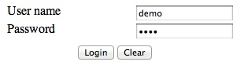
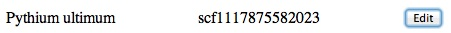
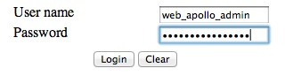

<div id="mw-page-base" class="noprint">

</div>

<div id="mw-head-base" class="noprint">

</div>

<div id="content" class="mw-body" role="main">

<span id="top"></span>

<div id="mw-js-message" style="display:none;">

</div>


# <span dir="auto">WebApollo Tutorial 2012</span>

<div id="bodyContent">

<div id="siteSub">

From GMOD

</div>

<div id="contentSub">

</div>

<div id="jump-to-nav" class="mw-jump">

Jump to: [navigation](#mw-navigation), [search](#p-search)

</div>

<div id="mw-content-text" class="mw-content-ltr" lang="en" dir="ltr">

This [WebApollo](WebApollo.1 "WebApollo") tutorial was presented by [Ed
Lee](User:Elee "User:Elee") at the [2012 GMOD Summer
School](2012_GMOD_Summer_School "2012 GMOD Summer School").

To follow along with the tutorial, you will need to use **AMI ID:
ami-a1de69c8, name: GMOD 2012 start day 3**, available in the US East
(N. Virginia) region. See the [GMOD Cloud
Tutorial](GMOD_Cloud_Tutorial "GMOD Cloud Tutorial") for information on
how to get this AMI.

**Please note that WebApollo was not officially released when this
session was taught, and this tutorial was run using a beta version of
the tool.**

<div id="toc" class="toc">

<div id="toctitle">

## Contents

</div>

- [<span class="tocnumber">1</span>
  <span class="toctext">Introduction</span>](#Introduction)
- [<span class="tocnumber">2</span> <span class="toctext">Using
  WebApollo</span>](#Using_WebApollo)
- [<span class="tocnumber">3</span> <span class="toctext">Installing
  WebApollo</span>](#Installing_WebApollo)
  - [<span class="tocnumber">3.1</span> <span class="toctext">Server
    operating system</span>](#Server_operating_system)
  - [<span class="tocnumber">3.2</span>
    <span class="toctext">Prerequisites</span>](#Prerequisites)
- [<span class="tocnumber">4</span>
  <span class="toctext">Installation</span>](#Installation)
  - [<span class="tocnumber">4.1</span> <span class="toctext">User
    database</span>](#User_database)
- [<span class="tocnumber">5</span> <span class="toctext">Deploy
  servlet</span>](#Deploy_servlet)
- [<span class="tocnumber">6</span>
  <span class="toctext">Configuration</span>](#Configuration)
  - [<span class="tocnumber">6.1</span> <span class="toctext">Main
    configuration</span>](#Main_configuration)
  - [<span class="tocnumber">6.2</span> <span class="toctext">Canned
    comments</span>](#Canned_comments)
  - [<span class="tocnumber">6.3</span> <span class="toctext">Search
    tools</span>](#Search_tools)
    - [<span class="tocnumber">6.3.1</span>
      <span class="toctext">Blat</span>](#Blat)
- [<span class="tocnumber">7</span> <span class="toctext">Data
  generation</span>](#Data_generation)
  - [<span class="tocnumber">7.1</span> <span class="toctext">Static
    data generation</span>](#Static_data_generation)

</div>

## <span id="Introduction" class="mw-headline">Introduction</span>

<a
href="https://docs.google.com/presentation/pub?id=17jkEV0jJ3gl_B-cRK5lrG8jbQPULPAnEcPo9Acu7CCU&amp;start=false&amp;loop=false&amp;delayms=3000"
class="external text" rel="nofollow">WebApollo Presentation</a>

  

## <span id="Using_WebApollo" class="mw-headline">Using WebApollo</span>

WebApollo is a web-based application, so the only requirement to use it
is a web browser. It has been tested with Chrome, Firefox, and Safari.
It currently does not support Internet Explorer.

A WebApollo demo with the Pythium data has been set up on the virtual
machine. We'll use the demo to view WebApollo's functionality.

**Important:** before you load the demo, you'll need to do a few things:

    $ cd /usr/local/tomcat/tomcat7/webapps/WebApolloDemo/jbrowse
    $ sudo wget http://icebox.lbl.gov/webapollo/data/genome.css
    $ sudo mv genome.css.1 genome.css

Next we need to modify `data/bam_trackList.json`. You'll want to modify
the `data_url` and `index_url` elements and add a `sourceUrl` element.

This is how it currently looks:

           "data_url" : "http://ec2-##-##-##-##.compute-1.amazonaws.com:8080/WebApolloDemo/jbrowse/data/bam/scf1117875582023.bam",
           "index_url" : "http://ec2-##-##-##-##.compute-1.amazonaws.com:8080/WebApolloDemo/jbrowse/data/bam/scf1117875582023.bam.bai",

We want to change it to:

           "data_url" : "bam/scf1117875582023.bam",
           "index_url" : "bam/scf1117875582023.bam.bai",
           "sourceUrl" : "data/",

Point your browser to
`http://ec2-##-##-##-##.compute-1.amazonaws.com:8080/WebApolloDemo`.  
(e.g.,
`http://ec2-184-73-92-243.compute-1.amazonaws.com:8080/WebApolloDemo`).

<div class="center">

<div class="floatnone">

<a href="File:Web_apollo_demo_login_page_with_credentials.jpg"
class="image" title="WebApollo login page"></a>

</div>

</div>

The user name and password are both `demo`.

<div class="center">

<div class="floatnone">

<a href="File:Web_apollo_main_options.jpg" class="image"
title="WebApollo main options"></a>

</div>

</div>

Click on the `Edit annotations` button.

<div class="center">

<div class="floatnone">

<a href="File:Web_apollo_select_refseq.jpg" class="image"
title="WebApollo reference sequence selection"></a>

</div>

</div>

We only have one contig to work with. Click on the `Edit` button.

- Annotation track
- Add evidence tracks (maker, snap_masked, blastn, blastx, est2genome,
  protein2genome, BAM alignments)
- Moving around the contig
- Go to region `scf1117875582023:629476..633770`
- Selection
  - Edge matching
- Create annotation
  - Drag-n-drop
- Delete exon (notice the change in CDS)
- Add exon
- Non-canonical splice sites (GT / AG)
- Zoom to base
- DNA track
  - Highlighting
  - 6-frame translation
- DNA sequence insertion, deletion, substitution
- Zoom back out
- Change exon boundaries
- Merge (exons, transcripts)
- Split (exons, transcripts)
- Make intron
- Duplicate
- Set translation start

<!-- -->

- Realtime client updating

<!-- -->

- Undo / Redo

<!-- -->

- Comments
- DBXrefs
- Get sequence

<!-- -->

- Sequence searching

## <span id="Installing_WebApollo" class="mw-headline">Installing WebApollo</span>

### <span id="Server_operating_system" class="mw-headline">Server operating system</span>

Any Unix like system (e.g., Unix, Linux, Mac OS X)

### <span id="Prerequisites" class="mw-headline">Prerequisites</span>

- Servlet container (must support servlet spec 3.0+) \[officially
  supported: Tomcat 7\]
- Relational Database Management System \[officially supported:
  PostgreSQL\]
- User database helper scripts
  - Perl modules
    - DBI
    - DBD module for your specific RDBMS \[officially supported: DBD::Pg
      for PostgresSQL\]
- Data generation pipeline (see [JBrowse
  prerequisites](JBrowse.1#Prerequisites "JBrowse") for more information
  on its prerequisites)
  - Perl modules
    - [BioPerl 1.6](BioPerl "BioPerl")
    - <a href="http://search.cpan.org/perldoc?JSON" class="external text"
      rel="nofollow">JSON</a>
    - <a href="http://search.cpan.org/perldoc?JSON::XS" class="external text"
      rel="nofollow">JSON::XS</a> (optional, for speed)
    - <a href="http://search.cpan.org/perldoc?PerlIO::gzip"
      class="external text" rel="nofollow">PerlIO::gzip</a>
    - <a href="http://search.cpan.org/perldoc?Heap::Simple"
      class="external text" rel="nofollow">Heap::Simple</a>
    - <a href="http://search.cpan.org/perldoc?Heap::Simple::XS"
      class="external text" rel="nofollow">Heap::Simple::XS</a>
    - <a href="http://search.cpan.org/perldoc?Devel::Size"
      class="external text" rel="nofollow">Devel::Size</a>
    - <a href="http://search.cpan.org/perldoc?Bio::GFF3::LowLevel::Parser"
      class="external text" rel="nofollow">Bio::GFF3::LowLevel::Parser</a>
  - System packages
    - libpng12-0
    - libpng12-dev
- Sequence search (optional)
  - Blat (along with a configured search database)

Note: All prerequisites have already been installed on the course's
machine

## <span id="Installation" class="mw-headline">Installation</span>

The installation steps will be done in the command line. SSH into your
AWS machine.

Uncompress the WebApollo.tgz tarball.

    $ cd
    $ tar -xvzf WebApollo.tgz

### <span id="User_database" class="mw-headline">User database</span>

First we’ll need to create a database that will contain user permission
information. WebApollo uses this database to determine who can access
and edit annotations for a given sequence. We'll create the user
`web_apollo_users_admin` to be the owner of the database with the
password `web_apollo_users_admin` (enter it when prompted). The user
will not be a superuser nor will it be able to create new roles. But it
will be able to create databases.

    $ createuser -P web_apollo_users_admin
    Enter password for new role:
    Enter it again:
    Shall the new role be a superuser? (y/n) n
    Shall the new role be allowed to create databases? (y/n) y
    Shall the new role be allowed to create more new roles? (y/n) n

Let's now create the database. We can call it whatever we want, so let's
call it `web_apollo_users`.

    $ createdb -U web_apollo_users_admin web_apollo_users

Now that the database is created, we need to load the schema to it.

    $ cd ~/WebApollo/tools/user
    $ psql -U web_apollo_users_admin web_apollo_users < user_database_postgresql.sql

Now the user database has been setup.

Let's populate the database.

First we’ll create an user with access to WebApollo. We’ll use the
`add_user.pl` script in `~/WebApollo/tools/user`. Let’s create an user
named `web_apollo_admin` with the password `web_apollo_admin`.

    $ ./add_user.pl -D web_apollo_users -U web_apollo_users_admin -P web_apollo_users_admin \
       -u web_apollo_admin -p web_apollo_admin

Next we’ll add the genomic sequence ids for our organism in the
database. We’ll use the `add_tracks.pl` script in the same directory. We
need to generate a file of genomic sequence ids for the script. For
convenience, there’s a script called `extract_seqids_from_fasta.pl` in
the same directory which will go through a FASTA file and extract all
the ids from the deflines. We’ll use the data from
[MAKER](MAKER.1 "MAKER"). Let’s first create the list of genomic
sequence ids. We'll store it in `~/scratch/seqids.txt`. We’ll want to
add the prefix “Annotations-” to each identifier.

    $ mkdir ~/scratch
    $ ./extract_seqids_from_fasta.pl -p Annotations- -i ~/maker_output/scf1117875582023.fa \
       -o ~/scratch/seqids.txt

Now we’ll add those ids to the user database.

    $ ./add_tracks.pl -D web_apollo_users -U web_apollo_users_admin -P web_apollo_users_admin \
       -t ~/scratch/seqids.txt

Now that we have an user created and the genomic sequence ids loaded,
we’ll need to give the user permissions to access the sequence. We’ll
have the user have read, write, and user manager permissions. We’ll use
the `set_track_permissions.pl` script in the same directory. We’ll need
to provide the script a list of genomic sequence ids, like in the
previous step.

    $ ./set_track_permissions.pl -D web_apollo_users -U web_apollo_users_admin \
       -P web_apollo_users_admin -u web_apollo_admin -t ~/scratch/seqids.txt -r -w -m

We’re all done setting up the user database.

Note that we’re only using a subset of the options for all the scripts
mentioned above. You can get more detailed information on any given
script (and other available options) using the “-h” or “--help” flag
when running the script.

## <span id="Deploy_servlet" class="mw-headline">Deploy servlet</span>

We need to deploy the WAR file in the war directory from the unpacked
tarball. We need to go into the `webapps` directory in our Tomcat
installation. Tomcat's installed in `/usr/local/tomcat/tomcat7/`.

    $ cd /usr/local/tomcat/tomcat7/webapps 

Next we need to create the directory that will contain the application.
Note that you'll need to use `sudo` for this, since only root has access
to the directory.

    $ sudo mkdir WebApollo

Now we'll go into the newly created directory and unpack the WAR file
into it.

    $ cd WebApollo
    $ sudo jar -xvf ~/WebApollo/war/WebApollo.war

  
That’s it! We’re done installing WebApollo. Now we need to move on to
configuring the application.

## <span id="Configuration" class="mw-headline">Configuration</span>

Most configuration files will reside in
`/usr/local/tomcat/tomcat7/webapps/WebApollo/config`. We’ll need to
configure a number of things before we can get WebApollo up and running.

### <span id="Main_configuration" class="mw-headline">Main configuration</span>

The main configuration is stored in
`/usr/local/tomcat/tomcat7/webapps/WebApollo/config/config.xml`. Let’s
take a look at the file.

<div class="mw-geshi mw-code mw-content-ltr" dir="ltr">

<div class="xml source-xml">

``` de1
<?xml version="1.0" encoding="UTF-8"?>
<server_configuration>
 
    <!-- mapping configuration for GBOL data structures -->
    <gbol_mapping>/config/mapping.xml</gbol_mapping>
 
    <!-- directory where JE database will be created -->
    <datastore_directory>ENTER_DATASTORE_DIRECTORY_HERE</datastore_directory>
 
    <!-- minimum size for introns created -->
    <default_minimum_intron_size>1</default_minimum_intron_size>
 
    <!-- size of history for each feature - setting to 0 means unlimited history -->
    <history_size>0</history_size>
 
    <!-- overlapping strategy for adding transcripts to genes -->
    <overlapper_class>org.bbop.apollo.web.overlap.OrfOverlapper</overlapper_class>
 
    <!-- class for comparing track names (used for sorting in lists) -->
    <track_name_comparator_class>org.bbop.apollo.web.track.DefaultTrackNameComparator</track_name_comparator_class>
 
    <!-- user authentication/permission configuration -->
    <user>
 
        <!-- database configuration -->
        <database>
 
            <!-- driver for user database -->
            <driver>org.postgresql.Driver</driver>
 
            <!-- JDBC URL for user database -->
            <url>ENTER_USER_DATABASE_JDBC_URL</url>
 
            <!-- username for user database -->
            <username>ENTER_USER_DATABASE_USERNAME</username>
 
            <!-- password for user database -->
            <password>ENTER_USER_DATABASE_PASSWORD</password>
 
        </database>
 
        <!-- class for generating user authentication page (login page) -->
        <authentication_class>org.bbop.apollo.web.user.localdb.LocalDbUserAuthentication</authentication_class>
 
    </user>
 
    <tracks>
 
        <!-- path to JBrowse refSeqs.json file -->
        <refseqs>ENTER_PATH_TO_REFSEQS_JSON_FILE</refseqs>
 
        <!-- annotation track name the current convention is to append
     the genomic region id to the the name of the annotation track
     e.g., if the annotation track is called "Annotations" and the
     genomic region is chr2L, the track name will be
     "Annotations-chr2L".-->
        <annotation_track_name>Annotations</annotation_track_name>
 
        <!-- organism being annotated -->
        <organism>ENTER_ORGANISM</organism>
 
        <!-- CV term for the genomic sequences - should be in the form
     of "CV:TERM".  This applies to all sequences -->
        <sequence_type>ENTER_CVTERM_FOR_SEQUENCE</sequence_type>
 
    </tracks>
 
    <!-- path to file containing canned comments XML -->
    <canned_comments>/config/canned_comments.xml</canned_comments>
 
    <!-- tool to be used for sequence searching.  This is optional.
 If this is not setup, WebApollo will not have sequence search support -->
    <sequence_search_tool>
 
        <!-- class for handling search -->
        <class>org.bbop.apollo.tools.seq.search.blat.BlatCommandLine</class>
 
        <!-- configuration for search tool -->
        <config>/config/blat_config.xml</config>
 
    </sequence_search_tool>
 
</server_configuration>
```

</div>

</div>

Let’s look through each element in more detail with values filled in.

<div class="mw-geshi mw-code mw-content-ltr" dir="ltr">

<div class="xml source-xml">

``` de1
    <!-- mapping configuration for GBOL data structures -->
    <gbol_mapping>/config/mapping.xml</gbol_mapping>
```

</div>

</div>

File that contains type mappings used by the underlying data model. It’s
best not to change the default option.

<div class="mw-geshi mw-code mw-content-ltr" dir="ltr">

<div class="xml source-xml">

``` de1
    <!-- directory where JE database will be created -->
    <datastore_directory>/data/dataHome/web_apollo/annotations</datastore_directory>
```

</div>

</div>

Directory where user generated annotations will be stored. The data is
stored using Berkeley DB. We’ll use
`/data/dataHome/web_apollo/annotations`.

<div class="mw-geshi mw-code mw-content-ltr" dir="ltr">

<div class="xml source-xml">

``` de1
    <!-- minimum size for introns created -->
    <default_minimum_intron_size>1</default_minimum_intron_size>
```

</div>

</div>

Minimum length of intron to be created when using the “Make intron”
operation. The operation will try to make the shortest intron that’s at
least as long as this parameter. So if you set it to a value of “40”,
then all calculated introns will be at least of length 40.

<div class="mw-geshi mw-code mw-content-ltr" dir="ltr">

<div class="xml source-xml">

``` de1
    <!-- size of history for each feature - setting to 0 means unlimited history -->
    <history_size>0</history_size>
```

</div>

</div>

The size of your history stack, meaning how many “Undo/Redo” steps you
can do. The larger the number, the larger the storage space needed.
Setting it to “0” makes it to that there’s no limit.

<div class="mw-geshi mw-code mw-content-ltr" dir="ltr">

<div class="xml source-xml">

``` de1
    <!-- overlapping strategy for adding transcripts to genes -->
    <overlapper_class>org.bbop.apollo.web.overlap.OrfOverlapper</overlapper_class>
```

</div>

</div>

Defines the strategy to be used for deciding whether overlapping
transcripts should be considered splice variants to the same gene. This
points to a Java class implementing the
`org.bbop.apollo.overlap.Overlapper` interface. This allows you to
create your own custom overlapping strategy should the need arise.
Currently available options are:

- org.bbop.apollo.web.overlap.NoOverlapper
  - No transcripts should be considered splice variants, regardless of
    overlap.
- org.bbop.apollo.web.overlap.SimpleOverlapper
  - Any overlapping of transcripts will cause them to be part of the
    same gene
- org.bbop.apollo.web.overlap.OrfOverlapper
  - Only transcripts that overlap within the coding region and within
    frame are considered part of the same gene

<div class="mw-geshi mw-code mw-content-ltr" dir="ltr">

<div class="xml source-xml">

``` de1
    <!-- class for comparing track names (used for sorting in lists) -->
    <track_name_comparator_class>org.bbop.apollo.web.track.DefaultTrackNameComparator</track_name_comparator_class>
```

</div>

</div>

Defines how to compare genomic sequence names for sorting purposes in
the genomic region selection list. Points to a class implementing the
`org.bbop.apollo.web.track.TrackNameComparator` interface. You can
implement your own class to allow whatever sorting you’d like for your
own organism. This doesn't make much of a difference in our case since
we're only dealing with one genomic region. The only available
implementation is:

- org.bbop.apollo.web.track.DefaultTrackNameComparator
  - Sorts genomic sequence names lexicographically

Let’s take look at the “user” element, which handles configuration for
user authentication and permission handling.

<div class="mw-geshi mw-code mw-content-ltr" dir="ltr">

<div class="xml source-xml">

``` de1
    <!-- user authentication/permission configuration -->
    <user>
 
        <!-- database configuration -->
        <database>
 
            <!-- driver for user database -->
            <driver>org.postgresql.Driver</driver>
 
            <!-- JDBC URL for user database -->
            <url>ENTER_USER_DATABASE_JDBC_URL</url>
 
            <!-- username for user database -->
            <username>ENTER_USER_DATABASE_USERNAME</username>
 
            <!-- password for user database -->
            <password>ENTER_USER_DATABASE_PASSWORD</password>
 
        </database>
 
        <!-- class for generating user authentication page (login page) -->
        <authentication_class>org.bbop.apollo.web.user.localdb.LocalDbUserAuthentication</authentication_class>
 
    </user>
```

</div>

</div>

Let’s first look at the `database` element that defines the database
that will handle user permissions (which we created previously).

<div class="mw-geshi mw-code mw-content-ltr" dir="ltr">

<div class="xml source-xml">

``` de1
            <!-- driver for user database -->
            <driver>org.postgresql.Driver</driver>
```

</div>

</div>

This should point the JDBC driver for communicating with the database.
We’re using a PostgreSQL driver since that’s the database we’re using
for user permission management.

<div class="mw-geshi mw-code mw-content-ltr" dir="ltr">

<div class="xml source-xml">

``` de1
            <!-- JDBC URL for user database -->
            <url>jdbc:postgresql://localhost/web_apollo_users</url>
```

</div>

</div>

JDBC URL to the user permission database. We'll use
`jdbc:postgresql://localhost/web_apollo_users` since the database is
running in the same server as the annotation editing engine and we named
the database `web_apollo_users`.

<div class="mw-geshi mw-code mw-content-ltr" dir="ltr">

<div class="xml source-xml">

``` de1
            <!-- username for user database -->
            <username>web_apollo_users_admin</username>
```

</div>

</div>

User name that has read/write access to the user database. The user with
access to the user database has the user name `web_apollo_users_admin`.

<div class="mw-geshi mw-code mw-content-ltr" dir="ltr">

<div class="xml source-xml">

``` de1
            <!-- password for user database -->
            <password>web_apollo_users_admin</password>
```

</div>

</div>

Password to access user database. The user with access to the user
database has the password \</tt\>web_apollo_users_admin\</tt\>.

Now let’s look at the other elements in the `user` element.

<div class="mw-geshi mw-code mw-content-ltr" dir="ltr">

<div class="xml source-xml">

``` de1
            <!-- class for generating user authentication page (login page) -->
            <authentication_class>org.bbop.apollo.web.user.localdb.LocalDbUserAuthentication</authentication_class>
```

</div>

</div>

Defines how user authentication is handled. This points to a class
implementing the `org.bbop.apollo.web.user.UserAuthentication`
interface. This allows you to implement any type of authentication you’d
like (e.g., LDAP). Currently available options are:

- org.bbop.apollo.web.user.localdb.LocalDbUserAuthentication
  - Uses the user permission database to also store authentication
    information, meaning it stores user passwords in the database
- org.bbop.apollo.web.user.browserid.BrowserIdUserAuthentication
  - Uses Mozilla’s <a href="https://browserid.org" class="external text"
    rel="nofollow">BrowserID</a> service for authentication. This has
    the benefits of offloading all authentication security to Mozilla
    and allows one account to have access to multiple resources (as long
    as they have BrowserID support). Being that the service is provided
    through Mozilla, it will require users to create a BrowserID account

Now let’s look at the configuration for accessing the annotation tracks
for the genomic sequences.

<div class="mw-geshi mw-code mw-content-ltr" dir="ltr">

<div class="xml source-xml">

``` de1
    <tracks>
 
        <!-- path to JBrowse refSeqs.json file -->
        <refseqs>ENTER_PATH_TO_REFSEQS_JSON_FILE</refseqs>
 
        <!-- annotation track name the current convention is to append
     the genomic region id to the the name of the annotation track
     e.g., if the annotation track is called "Annotations" and the
     genomic region is chr2L, the track name will be
     "Annotations-chr2L".-->
        <annotation_track_name>Annotations</annotation_track_name>
 
        <!-- organism being annotated -->
        <organism>ENTER_ORGANISM</organism>
 
        <!-- CV term for the genomic sequences - should be in the form
     of "CV:TERM".  This applies to all sequences -->
        <sequence_type>ENTER_CVTERM_FOR_SEQUENCE</sequence_type>
 
    </tracks>
```

</div>

</div>

Let’s look at each element individually.

<div class="mw-geshi mw-code mw-content-ltr" dir="ltr">

<div class="xml source-xml">

``` de1
        <!-- path to JBrowse refSeqs.json file -->
        <refseqs>/usr/local/tomcat/tomcat7/webapps/WebApollo/jbrowse/data/refSeqs.json</refseqs>
```

</div>

</div>

Location where the `refSeqs.json` file resides, which is created from
the data generation pipeline (see the [data
generation](#Data_generation) section). By default, the JBrowse data
needs to reside in
`/usr/local/tomcat/tomcat7/webapps/WebApollo/jbrowse/data`. If you want
the data to reside elsewhere, you’ll need to do configure your servlet
container to handle the appropriate alias to `jbrowse/data`.

<div class="mw-geshi mw-code mw-content-ltr" dir="ltr">

<div class="xml source-xml">

``` de1
        <annotation_track_name>Annotations</annotation_track_name>
```

</div>

</div>

Name of the annotation track. Leave it as the default value of
`Annotations`.

<div class="mw-geshi mw-code mw-content-ltr" dir="ltr">

<div class="xml source-xml">

``` de1
        <!-- organism being annotated -->
        <organism>Pythium ultimum</organism>
```

</div>

</div>

Scientific name of the organism being annotated (genus and species).
We're annotating `Pythium ultimum`.

<div class="mw-geshi mw-code mw-content-ltr" dir="ltr">

<div class="xml source-xml">

``` de1
        <!-- CV term for the genomic sequences - should be in the form
     of "CV:TERM".  This applies to all sequences -->
        <sequence_type>sequence:contig</sequence_type>
```

</div>

</div>

The type for the genomic sequences. Should be in the form of `CV:term`.
Our genomic sequences are of the type `sequence:contig`.

<div class="mw-geshi mw-code mw-content-ltr" dir="ltr">

<div class="xml source-xml">

``` de1
    <!-- path to file containing canned comments XML -->
    <canned_comments>/config/canned_comments.xml</canned_comments>
```

</div>

</div>

File that contains canned comments (predefined comments that will be
available from a pull-down menu when creating comments). It’s best not
to change the default option. See the [canned
comments](#Canned_comments) section for details on configuring canned
comments.

<div class="mw-geshi mw-code mw-content-ltr" dir="ltr">

<div class="xml source-xml">

``` de1
    <!-- tool to be used for sequence searching.  This is optional.
 If this is not setup, WebApollo will not have sequence search support -->
    <sequence_search_tool>
 
        <!-- class for handling search -->
        <class>org.bbop.apollo.tools.seq.search.blat.BlatCommandLine</class>
 
        <!-- configuration for search tool -->
        <config>/config/blat_config.xml</config>
 
    </sequence_search_tool>
```

</div>

</div>

Here’s the configuration for sequence search tools (allows searching
your genomic sequences). WebApollo does not implement any search
algorithms, but instead relies on different tools and resources to
handle searching (this provides much more flexible search options). This
is optional. If it’s not configured, WebApollo will not have sequence
search support. There are two elements that need to be configured.

<div class="mw-geshi mw-code mw-content-ltr" dir="ltr">

<div class="xml source-xml">

``` de1
        <!-- class for handling search -->
        <class>org.bbop.apollo.tools.seq.search.blat.BlatCommandLine</class>
```

</div>

</div>

Should point to the class that will handle the search request. Searching
is handled by classes that implement the
`org.bbop.apollo.tools.seq.search.SequenceSearchTool` interface. This
allows you to add support for your own favorite search tools (or
resources). We currently only have support for command line Blat.

<div class="mw-geshi mw-code mw-content-ltr" dir="ltr">

<div class="xml source-xml">

``` de1
        <!-- configuration for search tool -->
        <config>/config/blat_config.xml</config>
```

</div>

</div>

File that contains the configuration for the searching plugin chosen. If
you’re using Blat, you should not change this. If you’re using your own
plugin, you’ll want to point this to the right configuration file (which
will be dependent on your plugin). See the [Blat](#Blat) section for
details on configuring WebApollo to use Blat.

### <span id="Canned_comments" class="mw-headline">Canned comments</span>

You can configure a set of predefined comments that will be available
for users when adding comments through a dropdown menu. The
configuration is stored in
`/usr/local/tomcat/tomcat7/webapps/WebApollo/config/canned_comments.xml`.
Let’s take a look at the configuration file.

<div class="mw-geshi mw-code mw-content-ltr" dir="ltr">

<div class="xml source-xml">

``` de1
<?xml version="1.0" encoding="UTF-8"?>
 
<canned_comments>
    <!-- one <comment> element per comment.
 it must contain the attribute "feature_type" that defines
 the type of feature this comment will apply to.
 must be be in the form of "cv:cvterm" (e.g., "sequence:gene")
 
 <comment feature_type="sequence:gene">This is a comment for sequence:gene</comment>
 -->
</canned_comments>
```

</div>

</div>

You’ll need one `<comment>` element for each predefined comment. The
element needs to have a `feature_type` attribute in the form of
`cv:cvterm` that this comment applies to. Let’s make a few comments for
feature of type `sequence:gene` and `sequence:transcript`:

<div class="mw-geshi mw-code mw-content-ltr" dir="ltr">

<div class="xml source-xml">

``` de1
    <comment feature_type="sequence:gene">This is a comment for a gene</comment>
    <comment feature_type="sequence:gene">This is another comment for a gene</comment>
    <comment feature_type="sequence:transcript">This is a comment for a transcript</comment>
```

</div>

</div>

### <span id="Search_tools" class="mw-headline">Search tools</span>

As mentioned previously, WebApollo makes use of tools for sequence
searching rather than employing its own search algorithm. The only
currently supported tool is command line Blat.

#### <span id="Blat" class="mw-headline">Blat</span>

You’ll need to have Blat installed and a search database with your
genomic sequences available to make use of this feature. The
configuration is stored in
`/usr/local/tomcat/tomcat7/webapps/WebApollo/config/blat_config.xml`.
Let’s take a look at the configuration file:

<div class="mw-geshi mw-code mw-content-ltr" dir="ltr">

<div class="xml source-xml">

``` de1
<?xml version="1.0" encoding="UTF-8"?>
 
<!-- configuration file for setting up command line Blat support -->
 
<blat_config>
 
    <!-- path to Blat binary →
 <blat_bin>ENTER_PATH_TO_BLAT_BINARY</blat_bin>
 
 <!-- path to where to put temporary data -->
    <tmp_dir>ENTER_PATH_FOR_TEMPORARY_DATA</tmp_dir>
 
    <!-- path to Blat database -->
    <database>ENTER_PATH_TO_BLAT_DATABASE</database>
 
    <!-- any Blat options (directly passed to Blat) e.g., -minMatch -->
    <blat_options>ENTER_ANY_BLAT_OPTIONS</blat_options>
 
</blat_config>
```

</div>

</div>

Let’s look at each element with values filled in.

<div class="mw-geshi mw-code mw-content-ltr" dir="ltr">

<div class="xml source-xml">

``` de1
    <!-- path to Blat binary -->
    <blat_bin>/home/ubuntu/Software/blat/blat</blat_bin>
```

</div>

</div>

We need to point to the location where the Blat binary resides. We it
installed in `/usr/local/bin/blat`.

<div class="mw-geshi mw-code mw-content-ltr" dir="ltr">

<div class="xml source-xml">

``` de1
    <!-- path to where to put temporary data -->
    <tmp_dir>/data/dataHome/web_apollo/blat/tmp</tmp_dir>
```

</div>

</div>

We need to point to the location where to store temporary files to be
used in the Blat search. It can be set to whatever location you’d like.
We’ll store the temporary data to `/data/dataHome/web_apollo/tmp`.

<div class="mw-geshi mw-code mw-content-ltr" dir="ltr">

<div class="xml source-xml">

``` de1
    <!-- path to Blat database -->
    <database>/data/dataHome/web_apollo/blat/db/pyu.2bit</database>
```

</div>

</div>

We need to point to the location of the search database to be used by
Blat. We need point it to `/data/dataHome/web_apollo/blat/db/pyu.2bit`.
We're using a `2bit` database in this case, but you have options on how
to generate your Blat database. See the Blat documentation for more
information.

<div class="mw-geshi mw-code mw-content-ltr" dir="ltr">

<div class="xml source-xml">

``` de1
    <!-- any Blat options (directly passed to Blat) e.g., -minMatch -->
    <blat_options>-minScore=100 -minIdentity=60</blat_options>
```

</div>

</div>

Here we can configure any extra options to used by Blat. These options
are passed verbatim to the program. In this example, we’re passing the
`-minScore` parameter with a minimum score of `100` and the
`-minIdentity` parameter with a value of `60` (60% identity). See the
Blat documentation for information of all available options.

## <span id="Data_generation" class="mw-headline">Data generation</span>

The steps for generating data (in particular static data) are mostly
similar to [JBrowse](JBrowse.1 "JBrowse") data generation steps, with
some extra steps required. Most of the scripts for data generation
reside in `/usr/local/tomcat/tomcat7/webapps/WebApollo/jbrowse/bin`.
Let's go into WebApollo's JBrowse directory.

    $ cd /usr/local/tomcat/tomcat7/webapps/WebApollo/jbrowse

It will make things easier if we make sure that the scripts in the `bin`
directory are executable. Note that you'll need to have root privilege
to do so.

    $ sudo chmod 755 bin/*

As mentioned previously, the data resides in the `data` directory by
default. Let's create a symlink to
`/data/dataHome/web_apollo/jbrowse/data` to be used as the data
directory. This gives a lot of flexibility in allowing your WebApollo
instance to easily point to a new data directory. Note that you'll need
to have root privilege to do so.

    $ sudo ln -sf /data/dataHome/web_apollo/jbrowse/data

Now that we have our `data` directory in JBrowse, we need to copy some
files into it that are specific to WebApollo's JBrowse. We need to copy
all of the contents from `~/WebApollo/json` in our data directory.

    $ cp ~/WebApollo/json/* data

The first thing we need to do before processing our evidence is to
generate the reference sequence data to be used by JBrowse. We'll use
the `prepare-refseqs.pl` script.

    $ bin/prepare-refseqs.pl --fasta ~/maker_output/scf1117875582023.fa

We now have the DNA track setup. WebApollo's DNA track is modified from
JBrowse's stock DNA track, so we need to modify the newly generated
`data/trackList.json` file. This step IS VERY IMPORTANT, otherwise
WebApollo will not work.

First, let's look at the stock generated `data/trackList.json` file.

    {
      "tracks" : [
         {
            "chunkSize" : 20000,
            "urlTemplate" : "seq/{refseq}/",
            "type" : "SequenceTrack",
            "label" : "DNA",
            "key" : "DNA"
         }
      ],
      "formatVersion" : 1
    }

We need to modify the track object. We need to modify the `type` from
`SequenceTrack` to `AnnotSequenceTrack`, remove the `urlTemplate` , move
the `chunkSize` element into the `config` member we'll be adding:

            "config" : {
               "chunkSize" : 20000,
               "residuesUrlTemplate" : "seq/{refseq}/",
               "urlTemplate" : "sequence_alterations_trackData.json",
               "style" : {
                  "uniqueIdField" : "id",
                  "className" : "{type}"
               },
               "compress" : 0,
               "type" : 1,
               "subfeatures" : 1
            }

After the modifications, the file should look as follow (you can just
copy and paste it):

    {
      "tracks" : [
         {
            "type" : "AnnotSequenceTrack",
            "label" : "DNA",
            "key" : "DNA",
            "config" : {
               "chunkSize" : 20000,
               "residuesUrlTemplate" : "seq/{refseq}/",
               "urlTemplate" : "sequence_alterations_trackData.json",
               "style" : {
                  "uniqueIdField" : "id",
                  "className" : "{type}"
               },
               "compress" : 0,
               "type" : 1,
               "subfeatures" : 1
            }
         }
      ],
      "formatVersion" : 1
    }

We need to symlink the `data/seq/refSeqs.json` file in `data/seq`.

    $ cd data
    $ ln -sf seq/refSeqs.json
    $ cd ..

  

### <span id="Static_data_generation" class="mw-headline">Static data generation</span>

Generating data from GFF3 works best by having a separate GFF3 per
source type. The output from Maker puts all sources in the same GFF3. We
need to split up the GFF3. We can use the `split_gff_by_source.pl`
script in `~/WebApollo/tools/data` to do so. We'll output the split GFF3
to some temporary directory (we'll use `~/scratch/split_gff`).

    $ mkdir -p ~/scratch/split_gff
    $ ~/WebApollo/tools/data/split_gff_by_source.pl -i ~/maker_output/scf1117875582023.gff -d ~/scratch/split_gff

If we look at the contents of `~/scratch/split_gff`, we can see we have
the following files:

    $ ls ~/scratch/split_gff
    blastn.gff  est2genome.gff  protein2genome.gff  repeatrunner.gff
    blastx.gff  maker.gff       repeatmasker.gff    snap_masked.gff

We need to process each file and create the appropriate tracks.

We'll start off with `maker.gff`. We need to handle that file a bit
differently than the rest of the files since the GFF represents the
features as gene, transcript, exons, and CDSs.

    $ bin/flatfile-to-json.pl --gff ~/scratch/split_gff/maker.gff \
    --arrowheadClass trellis-arrowhead --getSubfeatures \
    --subfeatureClasses '{"wholeCDS": "null", "CDS":"maker-CDS", "UTR": "maker-UTR", "exon":"maker-exon"}' \
    --cssClass maker-transcript --type mRNA --trackLabel maker

Now we need to convert the Maker track into WebApollo compatible JSON.
We can use `json_converter.sh` in `~/WebApollo/tools/data` to do so.

    $ ~/WebApollo/tools/data/json_converter.sh -d data/tracks/maker
    root track dir: data/tracks/maker
    editing files in place
    seq dir count: 1
    done processing features, total scanned: 353

Lastly we need to modify the `maker` entry in `data/trackList.json`.
Let's look at the stock entry.

         {
            "autocomplete" : "none",
            "style" : {
               "className" : "maker-transcript",
               "subfeatureClasses" : {
                  "wholeCDS" : "null",
                  "exon" : "maker-exon",
                  "CDS" : "maker-CDS",
                  "UTR" : "maker-UTR"
               },
               "arrowheadClass" : "trellis-arrowhead"
            },
            "key" : "maker",
            "phase" : null,
            "urlTemplate" : "tracks/maker/{refseq}/trackData.json",
            "compress" : 0,
            "label" : "maker",
            "type" : "FeatureTrack",
            "subfeatures" : 1
         }

We need to add `"renderClassName" : "maker-transcript-render"` to the
`style` member. We also need to change `type` from `FeatureTrack` to
`DraggableFeatureTrack`. This is how the updated entry should look like:

        {
            "autocomplete" : "none",
            "style" : {
               "renderClassName" : "maker-transcript-render",
               "className" : "maker-transcript",
               "subfeatureClasses" : {
                  "wholeCDS" : "null",
                  "exon" : "maker-exon",
                  "CDS" : "maker-CDS",
                  "UTR" : "maker-UTR"
               },
               "arrowheadClass" : "trellis-arrowhead"
            },
            "key" : "maker",
            "phase" : null,
            "urlTemplate" : "tracks/maker/{refseq}/trackData.json",
            "compress" : 0,
            "label" : "maker",
            "type" : "DraggableFeatureTrack",
            "subfeatures" : 1
         }

Now we need to process the other remaining GFF3 files. The entries in
those are stored as "match/match_part", so they can all be handled in a
similar fashion.

We'll start off with `blastn` as an example.

    $ bin/flatfile-to-json.pl --gff ~/scratch/split_gff/blastn.gff \
    --arrowheadClass trellis-arrowhead --getSubfeatures \
    --subfeatureClasses '{"match_part": "blastn-alignment-part"}' \
    --cssClass "blastn-alignment-match" --trackLabel blastn

Now we need to modify the `blastn` entry in `data/trackList.json`. Let's
look at the stock entry.

         {
            "autocomplete" : "none",
            "style" : {
               "className" : "blastn-match",
               "subfeatureClasses" : {
                  "match_part" : "blastn-part"
               },
               "arrowheadClass" : "trellis-arrowhead"
            },
            "key" : "blastn",
            "phase" : null,
            "urlTemplate" : "tracks/blastn/{refseq}/trackData.json",
            "compress" : 0,
            "label" : "blastn",
            "type" : "FeatureTrack",
            "subfeatures" : 1
         }

We need to add `"renderClassName" : "blastn-alignment-render"` to the
style member. We also need to change `type` from `FeatureTrack` to
`DraggableFeatureTrack`. This is how the updated entry should look like:

         {
            "autocomplete" : "none",
            "style" : {
               "renderClassName" : "blastn-alignment-render",
               "className" : "blastn-match",
               "subfeatureClasses" : {
                  "match_part" : "blastn-part"
               },
               "arrowheadClass" : "trellis-arrowhead"
            },
            "key" : "blastn",
            "phase" : null,
            "urlTemplate" : "tracks/blastn/{refseq}/trackData.json",
            "compress" : 0,
            "label" : "blastn",
            "type" : "DraggableFeatureTrack",
            "subfeatures" : 1
         }

We need to follow the same steps for the remaining GFF3 files. It can be
a bit tedious to do this for the remaining six files, so we can use a
simple inline shell script to help us out. However, we'll still have to
manually modify `data/trackList.json` for each new track. Don't worry if
the script doesn't make sense, you can still process each file by hand.
For now you can just copy and paste the script into your terminal.

    $ for i in $(ls ~/scratch/split_gff/*.gff | grep -v maker);
    do j=$(basename $i); j=${j/.gff/};
    echo "Processing $j" && bin/flatfile-to-json.pl --gff $i --arrowheadClass trellis-arrowhead \
    --getSubfeatures --subfeatureClasses "{\"match_part\": \"$j-alignment-part\"}" \
    --cssClass "$j-alignment-match" --trackLabel $j; done

**IMPORTANT!**

Remember that we still need to add
`"renderClassName" : "$type-alignment-render"` to the style member,
where `$type` is the track name. We also need to change `type` from
`FeatureTrack` to `DraggableFeatureTrack`.

Now let's look how to configure BAM support. WebApollo has native
support for BAM, so extra processing of the data is required.

First we'll copy the BAM data into the WebApollo data directory. We'll
put it in the `data/bam` directory. Keep in mind that this BAM data was
randomly generated, so there's really no biological meaning to it. We
only created it to show BAM support.

    $ mkdir data/bam
    $ cp ~/maker_output/*.bam* data/bam

Now we need to edit the `data/bam_trackList.json` file. Let's look at
the file.

    {
      "tracks" : [
         {
           "type" : "BamFeatureTrack",
           "label" : "ENTER_LABEL",
           "data_url" : "ENTER_URL_TO_BAM_FILE",
           "index_url" : "ENTER_URL_TO_BAI_FILE",
            "config" : {
               "autocomplete" : "none",
               "style" : {
                  "className" : "bam",
                  "subfeatureClasses" : {
                      "M": "cigarM",
                      "D": "cigarD",
                      "N": "cigarN",
                      "=": "cigarEQ",
                      "E": "cigarEQ",
                      "X": "cigarX",
                      "I": "cigarI"
                  },
                  "arrowheadClass" : null
               },
               "key" : "ENTER_KEY",
               "compress" : 0,
               "type" : 1,
               "subfeatures" : 1
            }
         }
       ],
      "formatVersion" : 1
    }

We need to modify the following elements: `label`, `data_url`,
`index_url`, and `key`.

Let's look at each value with their values filled in.

           "label" : "simulated_bam",

The internal name for this BAM track.

           "data_url" : "bam/scf1117875582023.bam",

URL to BAM file.

           "index_url" : "bam/scf1117875582023.bam.bai",

URL to BAM index file.

           "sourceUrl" : "data/",

Add `sourceUrl` under `index_url`.

You can point to the BAM/BAI file in any server by providing an absolute
URL. This is a nice feature since BAM files can get rather large, so you
don't need to create a local copy on your own server.

               "key" : "simulated BAM",

The external, human-readable label seen on the BAM track.

Here's how the updated JSON should look like.

    {
      "tracks" : [
         {
           "type" : "BamFeatureTrack",
           "label" : "simulated_bam", 
           "data_url" : "bam/scf1117875582023.bam", 
           "index_url" : "bam/scf1117875582023.bam.bai",
           "sourceUrl" : "data/",
            "config" : {
               "autocomplete" : "none",
               "style" : {
                  "className" : "bam",
                  "subfeatureClasses" : {
                      "M": "cigarM",
                      "D": "cigarD",
                      "N": "cigarN",
                      "=": "cigarEQ",
                      "E": "cigarEQ",
                      "X": "cigarX",
                      "I": "cigarI"
                  },
                  "arrowheadClass" : null
               },
               "key" : "simulated BAM",
               "compress" : 0,
               "type" : 1,
               "subfeatures" : 1
            }
         }
      ],
      "formatVersion" : 1
    }

You should now have a `simulated BAM` track now available.

You can download the updated `trackList.json` file here (you'll need to
put the file in your virtual machine and unzip it in
`/usr/local/tomcat/tomcat7/webapps/WebApollo/jbrowse/data`):  
<a
href="../mediawiki/images/8/83/Web_apollo_2012_tutorial_track_list_json.zip"
class="internal"
title="Web apollo 2012 tutorial track list json.zip">web_apollo_track_list_json.zip</a>

Alternatively, you can just copy the WebApolloDemo `trackList.json` into
WebApollo (since they're both using the same dataset).

    $ cd /usr/local/tomcat/tomcat7/webapps/WebApollo/jbrowse/data
    $ cp /usr/local/tomcat/tomcat7/webapps/WebApolloDemo/jbrowse/data/trackList.json .

Congratulations, you're done configuring WebApollo.

Let's test out our installation. Point your browser to
`http://ec2-##-##-##-##.compute-1.amazonaws.com:8080/WebApollo`  
(e.g.,
`http://ec2-184-73-92-243.compute-1.amazonaws.com:8080/WebApollo`).

<div class="center">

<div class="floatnone">

<a href="File:Web_apollo_login_page_with_credentials.jpg" class="image"
title="WebApollo login page"></a>

</div>

</div>

The user name and password are both `web_apollo_admin` as we configured
earlier.

<div class="center">

<div class="floatnone">

<a href="File:Web_apollo_main_options.jpg" class="image"
title="WebApollo main options"></a>

</div>

</div>

Click on the `Edit annotations` button.

<div class="center">

<div class="floatnone">

<a href="File:Web_apollo_select_refseq.jpg" class="image"
title="WebApollo reference sequence selection"></a>

</div>

</div>

We only see one reference sequence to annotate since we're only working
with one contig. Click on the `Edit` button.

Now have fun annotating!!!

</div>

<div class="printfooter">

Retrieved from
"<http://gmod.org/mediawiki/index.php?title=WebApollo_Tutorial_2012&oldid=24440>"

</div>

<div id="catlinks" class="catlinks">

<div id="mw-normal-catlinks" class="mw-normal-catlinks">

[Categories](Special:Categories "Special:Categories"):

- [2012 Summer
  School](Category:2012_Summer_School "Category:2012 Summer School")
- [Webapollo](Category:Webapollo "Category:Webapollo")
- [Tutorials](Category:Tutorials "Category:Tutorials")

</div>

</div>

<div id="mw-data-after-content">

<div class="smwfact">

<span class="smwfactboxhead">Facts about
"<span class="swmfactboxheadbrowse">[WebApollo Tutorial
2012](Special:Browse/WebApollo-20Tutorial-202012 "Special:Browse/WebApollo-20Tutorial-202012")</span>"</span><span class="smwrdflink"><span class="rdflink">[RDF
feed](http://gmod.org/wiki/Special:ExportRDF/WebApollo_Tutorial_2012 "Special:ExportRDF/WebApollo Tutorial 2012")</span></span>

|  |  |
|----|----|
| [Has topic](Property:Has_topic "Property:Has topic") | [WebApollo](WebApollo.1 "WebApollo") <span class="smwsearch">[+](Special:SearchByProperty/Has-20topic/WebApollo "Special:SearchByProperty/Has-20topic/WebApollo")</span> |

</div>

</div>

<div class="visualClear">

</div>

</div>

</div>

<div id="mw-navigation">

## Navigation menu

<div id="mw-head">


<div id="left-navigation">

<div id="p-namespaces" class="vectorTabs" role="navigation"
aria-labelledby="p-namespaces-label">

### Namespaces

- <span id="ca-nstab-main"><a href="WebApollo_Tutorial_2012" accesskey="c"
  title="View the content page [c]">Page</a></span>
- <span id="ca-talk"><a
  href="http://gmod.org/mediawiki/index.php?title=Talk:WebApollo_Tutorial_2012&amp;action=edit&amp;redlink=1"
  accesskey="t"
  title="Discussion about the content page [t]">Discussion</a></span>

</div>

<div id="p-variants" class="vectorMenu emptyPortlet" role="navigation"
aria-labelledby="p-variants-label">

### 

### Variants[](#)

<div class="menu">

</div>

</div>

</div>

<div id="right-navigation">


</div>

<div id="p-search" role="search">

### Search

<div id="simpleSearch">

</div>

</div>

</div>

</div>

<div id="mw-panel">

<div id="p-logo" role="banner">

<a href="Main_Page"
style="background-image: url(../images/GMOD-cogs.png);"
title="Visit the main page"></a>

</div>

<div id="p-Navigation" class="portal" role="navigation"
aria-labelledby="p-Navigation-label">

### Navigation

<div class="body">

- <span id="n-GMOD-Home">[GMOD Home](Main_Page)</span>
- <span id="n-Software">[Software](GMOD_Components)</span>
- <span id="n-Categories-.2F-Tags">[Categories /
  Tags](Categories)</span>
- <span id="n-View-all-pages">[View all pages](Special:AllPages)</span>

</div>

</div>

<div id="p-Documentation" class="portal" role="navigation"
aria-labelledby="p-Documentation-label">

### Documentation

<div class="body">

- <span id="n-Overview">[Overview](Overview)</span>
- <span id="n-FAQs">[FAQs](Category:FAQ)</span>
- <span id="n-HOWTOs">[HOWTOs](Category:HOWTO)</span>
- <span id="n-Glossary">[Glossary](Glossary)</span>

</div>

</div>

<div id="p-Community" class="portal" role="navigation"
aria-labelledby="p-Community-label">

### Community

<div class="body">

- <span id="n-GMOD-News">[GMOD News](GMOD_News)</span>
- <span id="n-Training-.2F-Outreach">[Training /
  Outreach](Training_and_Outreach)</span>
- <span id="n-Support">[Support](Support)</span>
- <span id="n-GMOD-Promotion">[GMOD Promotion](GMOD_Promotion)</span>
- <span id="n-Meetings">[Meetings](Meetings)</span>
- <span id="n-Calendar">[Calendar](Calendar)</span>

</div>

</div>

<div id="p-tb" class="portal" role="navigation"
aria-labelledby="p-tb-label">

### Tools

<div class="body">

- <span id="t-whatlinkshere"><a href="Special:WhatLinksHere/WebApollo_Tutorial_2012" accesskey="j"
  title="A list of all wiki pages that link here [j]">What links here</a></span>
- <span id="t-recentchangeslinked"><a href="Special:RecentChangesLinked/WebApollo_Tutorial_2012"
  accesskey="k"
  title="Recent changes in pages linked from this page [k]">Related
  changes</a></span>
- <span id="t-specialpages"><a href="Special:SpecialPages" accesskey="q"
  title="A list of all special pages [q]">Special pages</a></span>
- <span id="t-print"><a
  href="http://gmod.org/mediawiki/index.php?title=WebApollo_Tutorial_2012&amp;printable=yes"
  rel="alternate" accesskey="p"
  title="Printable version of this page [p]">Printable version</a></span>
- <span id="t-permalink">[Permanent
  link](http://gmod.org/mediawiki/index.php?title=WebApollo_Tutorial_2012&oldid=24440 "Permanent link to this revision of the page")</span>
- <span id="t-info">[Page
  information](http://gmod.org/mediawiki/index.php?title=WebApollo_Tutorial_2012&action=info)</span>
- <span id="t-smwbrowselink"><a href="Special:Browse/WebApollo_Tutorial_2012" rel="smw-browse">Browse
  properties</a></span>
- <span id="t-pdf">[Print as
  PDF](http://gmod.org/mediawiki/index.php?title=Special:PdfPrint&page=WebApollo_Tutorial_2012)</span>

</div>

</div>

</div>

</div>

<div id="footer" role="contentinfo">

- <span id="footer-info-lastmod">Last updated at 20:52 on 27 August
  2013.</span>
- <span id="footer-info-viewcount">30,902 page views.</span>
- <span id="footer-info-copyright">Content is available under
  <a href="http://www.gnu.org/licenses/fdl-1.3.html" class="external"
  rel="nofollow">a GNU Free Documentation License</a> unless otherwise
  noted.</span>

<!-- -->

- <span id="footer-places-about">[About
  GMOD](GMOD:About "GMOD:About")</span>

<!-- -->

- <span id="footer-copyrightico">[](http://www.gnu.org/licenses/fdl-1.3.html)</span>
- <span id="footer-poweredbyico">[](http://www.mediawiki.org/)
  [](https://www.semantic-mediawiki.org/wiki/Semantic_MediaWiki)</span>

<div style="clear:both">

</div>

</div>
