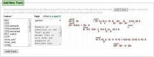

# WebGBrowse/tool data

From GMOD

Jump to: [navigation](#mw-navigation), [search](#p-search)

  
This page stores the data that populates the
[WebGBrowse](../WebGBrowse.1 "WebGBrowse") wiki page.

  
{{ {{{template}}} \| name = WebGBrowse \| full_name = \| status = mature
\| dev = inactive \| support = active \| type = Genome Visualization &
Editing, Tool Integration \| os = web \| logo = WebGBrowseLogo.png \|
home = <a href="http://webgbrowse.cgb.indiana.edu" class="external free"
rel="nofollow">http://webgbrowse.cgb.indiana.edu</a> \| about = The
[Generic Genome Browser (GBrowse)](../GBrowse.1 "GBrowse") is one of the
most widely used visualization tools for sequence display characterized
by a rich set of utilities helpful in presenting a variety of genome
features pertaining to a reference sequence. Despite the tool being
meant for easy use by the biologists, the administration of GBrowse can
become tedious, particularly for those without adequate computational
resources. Moreover, there is no exhaustive, accurate, "GBrowse user's
perspective" based reference available for the various glyphs useful in
building the feature tracks on GBrowse, thus adding to the complexities
involved in configuration.

WebGBrowse guides the users through the process of configuring the
[GFF3](../GFF3 "GFF3") datasets for GBrowse display. It presents the
user with a "Glyph Library" comprising of around 40 different glyphs to
choose from. It generates the configuration data by collecting the
user's input through an organized, step-by-step process guided by the
configurable parameter information available in the glyph library. A
summary information on all the available glyphs can be viewed at the
glyph library page. A pre-installed GBrowse instance allows the users to
preview/load their datasets with desired configuration in GBrowse
without requiring them to prepare any computer hardware, install any
software or learn sophisticated GBrowse configuration rules for feature
display.

In other words, WebGBrowse addresses most of the intricacies involved in
GBrowse administration, so that even a computer non-savvy biologist can
configure his GFF dataset without worrying about GBrowse software
installation or GBrowse configuration semantics.

WebGBrowse can be
<a href="http://webgbrowse.cgb.indiana.edu/software.html"
class="external text" rel="nofollow">downloaded</a> and installed
locally, or you can use the
<a href="http://webgbrowse.cgb.indiana.edu/" class="external text"
rel="nofollow">WebGBrowse at CGB</a>.

\| screenshot =

*Add new track* dialog in WebGBrowse

\| public_server =
<a href="http://webgbrowse.cgb.indiana.edu" class="external free"
rel="nofollow">http://webgbrowse.cgb.indiana.edu</a> \| dl = \| dl_url =
<a href="http://webgbrowse.cgb.indiana.edu/webgbrowse/software.html"
class="external free"
rel="nofollow">http://webgbrowse.cgb.indiana.edu/webgbrowse/software.html</a>
\| dl_src = Latest release from
<a href="http://webgbrowse.cgb.indiana.edu/software.html"
class="external text" rel="nofollow">CGB</a> or latest development
version from
<a href="http://gmod.svn.sourceforge.net/viewvc/gmod/WebGBrowse/"
class="external text" rel="nofollow">SourceForge</a>. \| dl_src_url = \|
dl_dev = \| dl_dev_url = \| getting_started_preamble = \| req = \|
install = \| config = \| doc = Information on
<a href="http://webgbrowse.cgb.indiana.edu/" class="external text"
rel="nofollow">WebGBrowse</a> is available in several places:

- <a href="http://webgbrowse.cgb.indiana.edu/tutorial.html"
  class="external text" rel="nofollow">User Tutorial</a> - this is an
  extensive user guide for WebGBrowse
- <a href="http://webgbrowse.cgb.indiana.edu/glyphdoc.html"
  class="external text" rel="nofollow">GBrowse Glyph Library</a> - shows
  what all those [GBrowse](../GBrowse.1 "GBrowse") glyphs look like.
- <a href="http://webgbrowse.cgb.indiana.edu/faq.html"
  class="external text" rel="nofollow">FAQ</a> - Frequently asked
  questions for WebGBrowse.

\| papers = PMID:19357095 \| presentations = \| tutorials =

<a href="http://webgbrowse.cgb.indiana.edu/webgbrowse/tutorial.html"
class="external text" rel="nofollow">WebGBrowse Tutorial</a>  
An extensive user guide and tutorial

\| wild_urls = \| mail =

|  |  |  |  |
|----|----|----|----|
|  | Mailing List Link | Description | Archive(s) |
| [WebGBrowse](../WebGBrowse.1 "WebGBrowse") | <a href="https://lists.sourceforge.net/lists/listinfo/gmod-webgbrowse"
class="external text" rel="nofollow">gmod-webgbrowse</a> | Questions, announcements, and development postings about the [WebGBrowse](../WebGBrowse.1 "WebGBrowse") front end to [GBrowse](../GBrowse.1 "GBrowse") configuration. | <a href="http://gmod.827538.n3.nabble.com/WebGBrowse-f947412.html"
class="external text" rel="nofollow">Nabble</a>, <a
href="http://sourceforge.net/mailarchive/forum.php?forum_name=gmod-webgbrowse"
class="external text" rel="nofollow">Sourceforge</a> |

\| logo_info =

\| dev_ppl =

WebGBrowse was developed at
<a href="http://www.iub.edu/" class="external text"
rel="nofollow">Indiana University's</a>
<a href="http://cgb.indiana.edu/" class="external text"
rel="nofollow">Center for Genomics and Bioinformatics</a>.

\| dev_status = \| contact_email = Ram Podicheti mnrusimh@indiana.edu \|
input = [GFF3](../GFF3 "GFF3") \| output = GBrowse Configuration File \|
see_also = \| demo_server = \|release date=2009 \| survey_link = }}

Retrieved from
"<http://gmod.org/mediawiki/index.php?title=WebGBrowse/tool_data&oldid=24516>"

[Categories](../Special:Categories "Special:Categories"):

- [Tool data](../Category:Tool_data "Category:Tool data")
- <a
  href="http://gmod.org/mediawiki/index.php?title=Category:WebGBrowse&amp;action=edit&amp;redlink=1"
  class="new"
  title="Category:WebGBrowse (page does not exist)">WebGBrowse</a>
- [GBrowse](../Category:GBrowse "Category:GBrowse")
- [GMOD
  Components](../Category:GMOD_Components "Category:GMOD Components")

## Navigation menu

### Namespaces

- <a href="tool_data" accesskey="c"
  title="View the content page [c]">Page</a>
- <a
  href="http://gmod.org/mediawiki/index.php?title=Talk:WebGBrowse/tool_data&amp;action=edit&amp;redlink=1"
  accesskey="t"
  title="Discussion about the content page [t]">Discussion</a>

### 

### Variants

### Navigation

- [GMOD Home](../Main_Page)
- [Software](../GMOD_Components)
- [Categories /
  Tags](../Categories)
- [View all
  pages](../Special:AllPages)

### Documentation

- [Overview](../Overview)
- [FAQs](../Category:FAQ)
- [HOWTOs](../Category:HOWTO)
- [Glossary](../Glossary)

### Community

- [GMOD News](../GMOD_News)
- [Training /
  Outreach](../Training_and_Outreach)
- [Support](../Support)
- [GMOD Promotion](../GMOD_Promotion)
- [Meetings](../Meetings)
- [Calendar](../Calendar)

### Tools

- <a href="../Special:Browse/WebGBrowse-2Ftool_data"
  rel="smw-browse">Browse properties</a>
- [Print as
  PDF](http://gmod.org/mediawiki/index.php?title=Special:PdfPrint&page=WebGBrowse/tool_data)

- Last updated at 18:31 on 10 September
  2013.
- 14,066 page views.
- Content is available under
  <a href="http://www.gnu.org/licenses/fdl-1.3.html" class="external"
  rel="nofollow">a GNU Free Documentation License</a> unless otherwise
  noted.

<!-- -->

- [About
  GMOD](../GMOD:About "GMOD:About")

<!-- -->

- 
- 
  

